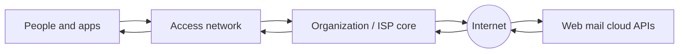
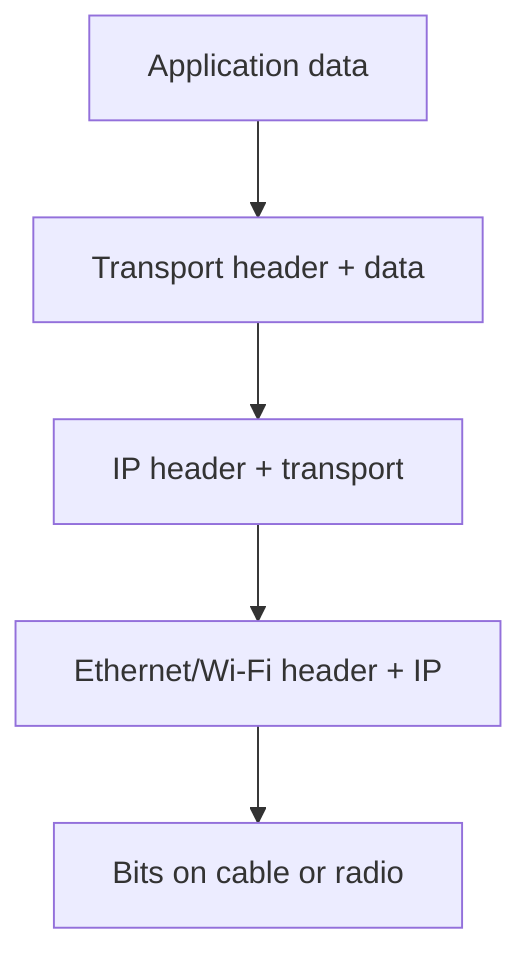
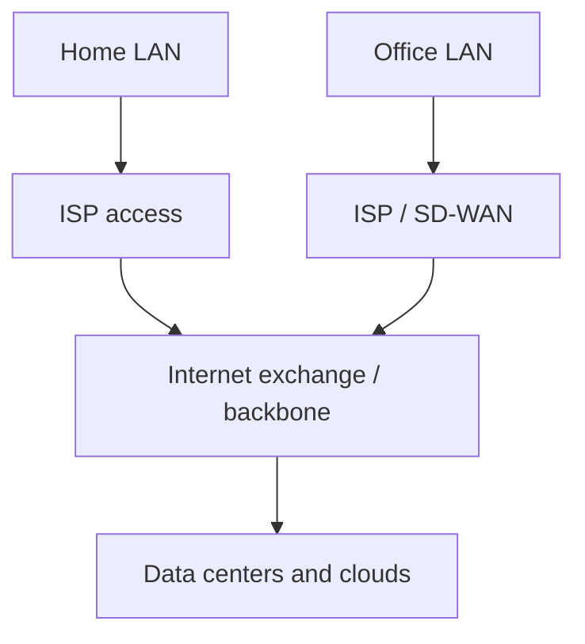
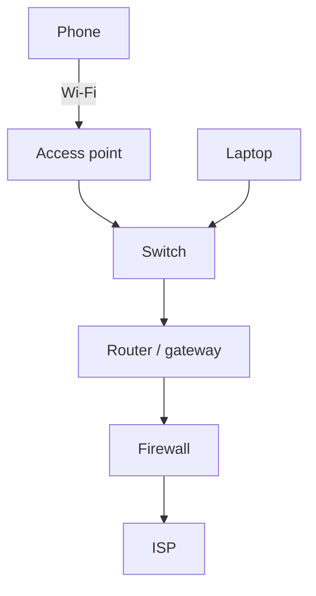
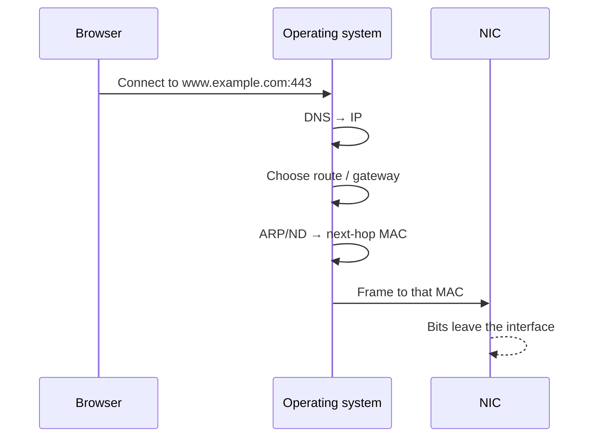
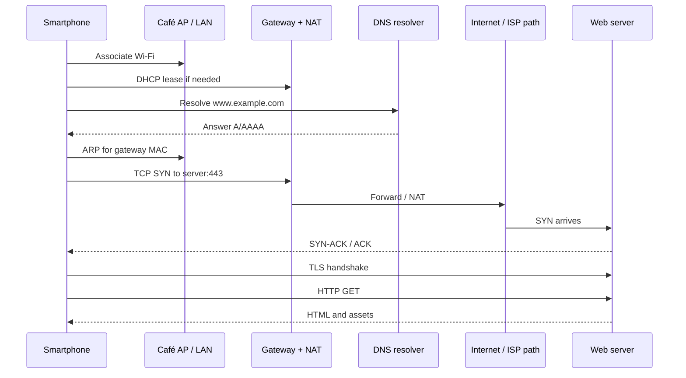

# What Is a Network?

A **computer network** is a collection of devices that can exchange information according to shared rules (protocols). Those devices can be phones, laptops, printers, cameras, industrial controllers, virtual machines in a cloud region, or entire data-center fabrics. The purpose is always the same: move useful data from a sender to a receiver — correctly, efficiently, and (when needed) privately.

This lesson is the doorway to the pktana **Networking Learning Hub**. Read it slowly. Every later chapter builds on the words introduced here. You do not need bit fields yet — you need vocabulary that lets you point at a problem and say *“addressing,”* *“ISP path,”* or *“protocol mismatch.”*

> **Remember:** Networking is not “cables and Wi‑Fi.” Networking is **agreed rules for moving meaning between machines**.

---

## Why Networks Exist

Without a network, a computer is an island. With a network, computers become a team:

- You can open a website hosted on another continent.
- A badge reader can ask a directory server if you are allowed into a building.
- A backup job can copy disks to remote storage every night.
- Engineers can troubleshoot a router in another city without flying there.

Networks exist because **distance and specialization** are normal. Data, processing, and users live in different places. Networking is the transportation system that connects them — driven by **scale**, **specialization**, and **mobility**.



---

## A Short History: Circuit Switching vs Packet Switching

Networking began with the telephone system — and with researchers who asked whether every conversation must reserve a private wire end to end.

**Circuit switching** reserved a path (a **circuit**) for the whole call. Capacity belonged to those two parties even during silence. Excellent for continuous voice; wasteful for bursty computer traffic (query, pause, handshake, pause, then a flood of objects).

**Packet switching** (1960s–1970s work that led to ARPANET) cuts data into **packets**, stamps each with addressing, and forwards them independently on shared links. Idle capacity serves other conversations. If a link fails, packets can often take another path.

| Idea | Circuit switching | Packet switching |
|------|-------------------|------------------|
| Resource use | Dedicated path for a call | Shared links, statistical multiplexing |
| Best for | Steady streams (classic voice) | Bursty computer data |
| Failure behavior | Whole call may drop if circuit breaks | Packets can reroute; some may be lost |
| Addressing | Path set up in advance | Each packet carries enough to be forwarded |

> **Remember:** The Internet is a **packet-switched** world. Your “call” to a website is many small packets sharing the roads with everyone else.

That model forced protocols that survive loss ([TCP](#protocols-reference/tcp)), hop-by-hop routing ([IP](#protocols-reference/ipv4), later [BGP](#protocols-reference/bgp)), and layered design so apps ignore copper vs fiber vs radio.

---

## The Letter Analogy (keep this forever)

Sending data on a network is similar to sending a letter through a postal system:

1. **Write the message** — application data (HTTP request, DNS query, file chunk).
2. **Address the envelope** — headers identify source and destination.
3. **Hand it to the postal system** — switches and routers forward hop by hop.
4. **Deliver to the right building and apartment** — correct host and application (port).
5. **Optionally seal the envelope** — [TLS](#protocols-reference/tls) hides contents from postal workers.

| Postal idea | Networking idea | Learn more |
|-------------|-----------------|------------|
| Street address on this block | [MAC address](#protocols-reference/ethernet) | [Data Link](#data-link-layer) |
| City + postal code | [IP address](#protocols-reference/ipv4) | [Network Layer](#network-layer) |
| Apartment / suite number | [TCP](#protocols-reference/tcp)/[UDP](#protocols-reference/udp) port | [Transport](#transport-layer) |
| Letter language (English) | App protocol ([HTTP](#protocols-reference/http), [DNS](#protocols-reference/dns)) | [Application](#application-layer) |
| Sealed envelope | [TLS](#protocols-reference/tls) / [VPN](#protocols-reference/vpn) | [Security](#network-security) |

> **Remember:** **IP finds the house. Port finds the room. MAC finds the door on this street.**

---

## What Actually Travels: Packets and Frames

Networks cut data into smaller pieces so many conversations can share the same links.

- A **packet** usually means an [IP](#protocols-reference/ipv4) datagram: IP header + payload.
- A **frame** usually means a [Layer 2](#data-link-layer) container such as an [Ethernet](#protocols-reference/ethernet) frame.
- A **segment** often means a [TCP](#protocols-reference/tcp) chunk.

Analysts casually say “packet” for almost everything. What matters: **headers are instructions**, **payload is cargo**.



Wrapping is **encapsulation**; unwrapping is **de-encapsulation**. See [OSI encapsulation](#osi-model/encapsulation).

---

## Protocols: The Rulebooks

A **protocol** agrees what messages look like, what order they may appear in, what an error looks like, and which port or Ethertype identifies the conversation. Without protocols, devices shout in different languages. With them, a laptop, a phone, and a cloud load balancer cooperate.

| Need | Protocol | Deep dive |
|------|----------|-----------|
| Local LAN framing | [Ethernet](#protocols-reference/ethernet) | [L2](#data-link-layer) |
| IP → MAC on LAN | [ARP](#protocols-reference/arp) | [ARP](#protocols-reference/arp) |
| Host addressing & routing | [IPv4](#protocols-reference/ipv4) / [IPv6](#protocols-reference/ipv6) | [L3](#network-layer) |
| Reliable app streams | [TCP](#protocols-reference/tcp) | [L4](#transport-layer) |
| Lightweight messages | [UDP](#protocols-reference/udp) | [L4](#transport-layer) |
| Names → addresses | [DNS](#protocols-reference/dns) | [L7](#application-layer) |
| Automatic host config | [DHCP](#protocols-reference/dhcp) | [DHCP](#protocols-reference/dhcp) |
| Web requests | [HTTP](#protocols-reference/http) / [HTTPS](#protocols-reference/https) | [TLS](#protocols-reference/tls) |

Full encyclopedia: [Protocols Reference](#protocols-reference).

---

## Types of Networks (by size and purpose)

- **PAN** — personal area: Bluetooth headset, smartwatch, tethering.
- **LAN** — home, office floor, lab; [Ethernet](#protocols-reference/ethernet) and/or [Wi‑Fi](#wireless-networking), often one or a few [IP](#protocols-reference/ipv4) subnets.
- **CAN / MAN** — campus or metro: buildings or districts on fiber and routed campuses.
- **WAN** — distant sites: MPLS, SD‑WAN, site-to-site [VPN](#protocols-reference/vpn), or Internet underlays.
- **The Internet** — independently owned networks interconnected mainly with [BGP](#protocols-reference/bgp) and shared standards.



---

## What ISPs Actually Do

An **Internet Service Provider (ISP)** is not “the Internet.” An ISP sells **connectivity** between you and the rest of the internetwork. When your home router “gets online,” it usually talks to ISP equipment first.

Typical jobs: **access** (fiber, cable, DSL, fixed wireless, cellular); **addressing** (public [IPv4](#protocols-reference/ipv4)/[IPv6](#protocols-reference/ipv6) via [DHCP](#protocols-reference/dhcp) or PPPoE); **default path** to everywhere you do not own; **aggregation** into regional routers; **peering and transit**; often recursive [DNS](#protocols-reference/dns); and **policy/abuse** handling.


> **Remember:** Your ISP gives you **a door onto the Internet**. Content companies, other ISPs, and clouds own most of the rooms on the other side.

When something “is down,” ask: *LAN? ISP path? Remote service?* Three failure domains — later chapters use [ICMP](#protocols-reference/icmp) and captures to separate them.

---

## Devices and Roles: NIC, Switch, Router, Firewall, AP

Beginners call everything a “router.” Precision saves hours.

**NIC** — host doorway to a medium (Ethernet, Wi‑Fi, virtual). Hardware [MAC](#protocols-reference/ethernet), [Physical](#physical-layer) signaling, frames to the OS. Soft “network” failures are sometimes a disabled NIC or bad driver.

**Switch** — forwards [Ethernet](#protocols-reference/ethernet) frames by **MAC**, learning which MAC lives on which port. Creates separate **collision domains** per port. Keeps traffic in a Layer 2 neighborhood unless you add routing.

**Router** — forwards **IP packets** between networks via a routing table. Home “Wi‑Fi routers” are usually combo devices: switch + AP + router + [NAT](#protocols-reference/nat) + simple [firewall](#protocols-reference/firewall).

**Firewall** — allows or denies by policy (addresses, ports, apps). Answers *permission*, not *shortest path*. See [Network Security](#network-security) and [firewall](#protocols-reference/firewall).

**AP** — bridges [Wi‑Fi](#wireless-networking) clients onto a wired LAN (association, WPA2/WPA3, airtime). From IP’s view usually Layer 2; the phone still uses a router as gateway.

| Role | Main question | Cares about |
|------|---------------|-------------|
| NIC | Bits on the medium? | Own MAC / link |
| Switch | Which port for this MAC? | MAC table |
| Router | Which next hop for this prefix? | IP routing table |
| Firewall | Is this flow permitted? | Policy |
| AP | Which client maps to which LAN? | Association / keys |



> **Remember:** **Switches move frames locally. Routers move packets between networks. Firewalls decide permission. APs are wireless doors onto a LAN.**

---

## Duplex, Collision Domains, and Broadcast Domains (Preview)

Preview for [Physical](#physical-layer) and [Data Link](#data-link-layer):

- **Duplex** — half = send *or* receive; full = both at once. Mismatch → CRC errors and slowness.
- **Collision domain** — who can interfere with simultaneous transmissions. Hubs enlarge; modern full-duplex switch ports shrink the problem away on healthy Ethernet.
- **Broadcast domain** — who hears L2 broadcasts ([ARP](#protocols-reference/arp)). Switches flood within a VLAN; **routers** normally stop them.

> **Remember:** **Switches shrink collision domains. Routers bound broadcast domains.**

---

## IPv4 Private Addressing Overview

RFC 1918 reserves **private** [IPv4](#protocols-reference/ipv4) ranges for inside use. They are not meant to route across the global Internet; edges usually apply **NAT**.

| Private block | Range | Common use |
|---------------|-------|------------|
| `10.0.0.0/8` | `10.0.0.0` – `10.255.255.255` | Enterprises, labs, clouds |
| `172.16.0.0/12` | `172.16.0.0` – `172.31.255.255` | Mid-size nets, some VPNs |
| `192.168.0.0/16` | `192.168.0.0` – `192.168.255.255` | Home / small office |

Examples: home `192.168.1.0/24` with gateway `192.168.1.1` and phone `192.168.1.50`; lab `10.10.0.0/24` servers and `10.20.0.0/24` users; overlapping `192.168.1.0/24` on both ends of a [VPN](#protocols-reference/vpn) — classic pain until you renumber. Also know loopback `127.0.0.0/8`, link-local `169.254.0.0/16`, multicast `224.0.0.0/4`.

> **Remember:** Private IPv4 is for **inside**. Crossing to the Internet usually means **NAT**. Subnetting skill: [Network Layer](#network-layer).

---

## Client–Server vs Peer-to-Peer

**Client–server:** one side requests, the other provides (browser → web; host → [DHCP](#protocols-reference/dhcp)). **Peer-to-peer:** both sides can request and provide; many apps are hybrids. In captures, identify **who initiated** and which **service port** is server-side.

---

## Addressing: The Three Questions Every Packet Answers

1. **Which host?** → [IP](#protocols-reference/ipv4)
2. **Which application?** → port ([TCP](#protocols-reference/tcp)/[UDP](#protocols-reference/udp))
3. **Which next hop on this wire?** → [MAC](#protocols-reference/ethernet) via [ARP](#protocols-reference/arp) / ND



| Wrong answer | Typical symptom |
|--------------|-----------------|
| DNS wrong | Name fails; IP tools may still work |
| Route/gateway wrong | LAN works; Internet fails |
| ARP wrong / spoofed | Intermittent MitM, wrong MAC |
| Port blocked | SYN with no SYN-ACK, or RST |
| TLS/app wrong | TCP works; application errors |

---

## Bandwidth, Latency, Jitter, Loss

**Bandwidth** — bits/sec transferable. **Latency** — delay. **Jitter** — delay variation. **Loss** — packets that never arrive. High bandwidth with high latency/loss still feels awful. [TCP](#protocols-reference/tcp) slows on loss; real-time apps often prefer [UDP](#protocols-reference/udp).

---

## Wired vs Wireless in One Minute

Wired [Ethernet](#protocols-reference/ethernet) ≈ private cable, stable performance. [Wireless](#wireless-networking) ≈ shared radio — convenient but sensitive to walls, interference, and contention. Above both: same IP and TCP/UDP ideas; difference is mostly [Physical](#physical-layer) and [Data Link](#data-link-layer).

---

## How a Smartphone Loads a Web Page (End-to-End)

Tell this story to a friend. Details live later; the plot lives here.

**Scene:** Café Wi‑Fi, tap `https://www.example.com`.

1. **Radio** — Phone associates with the [AP](#wireless-networking); air frames encrypted (WPA2/WPA3). IP still sees “just another LAN host.”
2. **Local config** — [DHCP](#protocols-reference/dhcp) (or a lease) gives private [IPv4](#protocols-reference/ipv4) like `192.168.0.42`, mask, gateway, DNS resolver.
3. **DNS** — Resolve `www.example.com` ([UDP](#protocols-reference/udp)/53 or DoH/DoT) → one or more IPs.
4. **Route + ARP** — Destination not local → **default gateway**; learn gateway [MAC](#protocols-reference/ethernet) via [ARP](#protocols-reference/arp) if needed.
5. **TCP** — [TCP](#protocols-reference/tcp) SYN to `server_ip:443`. Dst MAC = gateway; dst IP = server. Switch → router; router [NAT](#protocols-reference/nat)s and forwards to the ISP.
6. **Internet** — ISP hops forward until the network announcing the server prefix ([BGP](#protocols-reference/bgp) between providers).
7. **TLS + HTTP** — [TLS](#protocols-reference/tls) authenticates and encrypts; [HTTPS](#protocols-reference/https) `GET /` returns HTML and assets.
8. **Return** — Responses reverse the path. Each hop rewrites L2; IP stays end-to-end except where NAT translates.



Failures map cleanly: Wi‑Fi → [Wireless](#wireless-networking); ARP/VLAN → [Data Link](#data-link-layer); gateway/NAT → [Network Layer](#network-layer); SYN timeout → [Transport](#transport-layer) or [Firewall](#protocols-reference/firewall); cert → [TLS](#protocols-reference/tls); blank page with healthy TCP → [Application](#application-layer).

> **Remember:** A page load is **DNS + route + MAC next hop + TCP + TLS + HTTP**, crossing **AP → LAN → router/NAT → ISP → Internet → server**.

---

## Security From Day One

Prefer [HTTPS](#protocols-reference/https) over [HTTP](#protocols-reference/http), [SSH](#protocols-reference/ssh) over [Telnet](#protocols-reference/telnet). Treat open Wi‑Fi as a postcard unless you add [VPN](#protocols-reference/vpn)/[TLS](#protocols-reference/tls). Learn [firewalls](#protocols-reference/firewall), [DLP](#dlp-idps), and [IDPS](#dlp-idps). Captures may hold credentials — minimize exposure while you learn.

---

## Common Myths Beginners Believe

1. **Cloud means networking stops mattering** — still IP, DNS, TLS, firewalls.
2. **Wi‑Fi is a different Internet** — only Physical/Data Link change; [IP](#protocols-reference/ipv4)/[TCP](#protocols-reference/tcp) ideas stay.
3. **`192.168.x.x` is globally unique** — millions reuse it; uniqueness starts at public/NAT boundaries.
4. **Ping OK ⇒ website OK** — [ICMP](#protocols-reference/icmp) and [TCP](#protocols-reference/tcp)/443/[DNS](#protocols-reference/dns) fail independently.
5. **Ports are physical holes** — ports are transport IDs; policy allows or denies them.
6. **HTTPS means the path is trusted** — [TLS](#protocols-reference/tls) protects the stream; the path can still drop or fingerprint traffic.
7. **Switch = router** — combo home boxes hide different roles.
8. **More bandwidth fixes video** — latency, jitter, and loss often matter more.

> **Remember:** Myths collapse when you name **which layer** and **which device role** own the symptom.

---

## How to Use This Learning Hub (14-Chapter Study Path)

Work in order the first time; skim faster once the map is in your head.

| # | Chapter | What you gain | Link |
|---|---------|---------------|------|
| 1 | What Is a Network? | Vocabulary, devices, ISP, end-to-end story | [This page](#what-is-networking) |
| 2 | The OSI Model | Seven-layer troubleshooting map | [OSI](#osi-model) |
| 3 | Physical Layer | Cables, signaling, duplex | [Physical](#physical-layer) |
| 4 | Data Link Layer | Ethernet, MAC, ARP, VLANs | [Data Link](#data-link-layer) |
| 5 | Network Layer | IPv4/IPv6, subnetting, routing, ICMP | [Network](#network-layer) |
| 6 | Transport Layer | TCP, UDP, ports | [Transport](#transport-layer) |
| 7 | Application Layer | DNS, HTTP, app flows | [Application](#application-layer) |
| 8 | Network Topologies | Failure domains in designs | [Topologies](#topologies) |
| 9 | Wireless Networking | RF, association, roaming | [Wireless](#wireless-networking) |
| 10 | Network Security | Threats, firewalls, crypto | [Security](#network-security) |
| 11 | Protocols Reference | Encyclopedia while capturing | [Protocols](#protocols-reference) |
| 12 | Modern Networking | Cloud, overlays, patterns | [Modern](#modern-networking) |
| 13 | DLP & IDPS | Detection and data protection | [DLP & IDPS](#dlp-idps) |
| 14 | Knowledge Check | Capstone quizzes | [Knowledge Check](#knowledge-check) |

**Rhythm:** read Remember callouts → run tasks with pktana → quiz cold → open [Protocols Reference](#protocols-reference) against a capture → after 1–7 re-tell the phone page-load story → 8–13 for design/defense → finish with [Knowledge Check](#knowledge-check).

---

## How to Study With pktana

1. Generate traffic (browse, ping, dig/nslookup).
2. Capture with a filter (`udp port 53`, `tcp port 443`, `arp`).
3. Ask: who ↔ whom, which protocol, handshake healthy?
4. Compare the wire to the matching protocol page.

```bash
pktana capture --interface eth0 --filter "udp port 53" --count 20
pktana connections
pktana web --port 8080
```

---

## Hands-On Tasks

```task
TITLE: Map your own path to a website
LEVEL: beginner
STEPS:
1. Open a site over HTTPS
2. Write the chain: DNS → IP → TCP → TLS → HTTP
3. Click each protocol name in this hub and read its page
GOAL: Connect the user story to protocol names without memorizing bit fields yet
```

```task
TITLE: Name the three addresses in one flow
LEVEL: beginner
STEPS:
1. Capture a few packets to a known server
2. Identify src/dst IP, src/dst port, and src/dst MAC (if on LAN)
3. Explain which question each address answers
GOAL: Prove you can separate host, application, and local-next-hop addressing
```

```task
TITLE: Label the devices on your path
LEVEL: beginner
STEPS:
1. Sketch phone/laptop → AP or switch → router/gateway → ISP → Internet
2. Mark which hop is L2 switching vs L3 routing vs NAT/firewall
3. Note whether your “router” is a combo device hiding multiple roles
GOAL: Stop calling every box a router; assign real roles
```

```task
TITLE: Find your private vs public identity
LEVEL: beginner
STEPS:
1. Read your host IPv4 address (ipconfig/ifconfig/ip addr)
2. Visit a “what is my IP” service or check the WAN status on your gateway
3. Explain why the two addresses differ using RFC 1918 + NAT language
GOAL: See private addressing and ISP public addressing as two layers of identity
```

```task
TITLE: Break the page-load story into failure domains
LEVEL: intermediate
STEPS:
1. Pick one real failure you have seen (no Wi-Fi, DNS fail, timeout, cert warning)
2. Map it to the smartphone narrative step that broke
3. Open the matching hub chapter and write one sentence on what you would capture next
GOAL: Turn vague “Internet is down” into a layer-aware hypothesis
```

---

## Knowledge Check

```quiz
QUESTION: A protocol is best defined as:
OPTIONS:
A brand of network cable
A shared set of communication rules and message formats
A type of firewall only
A single company’s routing product
ANSWER: 1
EXPLAIN: Protocols are agreements that let different systems interoperate.
```

```quiz
QUESTION: Which identifier selects the application on a host?
OPTIONS:
MAC address
IP address
Port number
SSID only
ANSWER: 2
EXPLAIN: Transport ports select the application/service.
```

```quiz
QUESTION: Encapsulation means:
OPTIONS:
Removing all headers to reduce size
Adding layer headers as data moves toward the wire
Only encrypting passwords
Only Wi-Fi association
ANSWER: 1
EXPLAIN: Each lower layer wraps the payload from above.
```

```quiz
QUESTION: High bandwidth but terrible video calls often points to:
OPTIONS:
Perfect networks with no issues
Latency, jitter, or loss problems
The absence of IP addresses
Mandatory use of FTP
ANSWER: 1
EXPLAIN: Real-time apps are sensitive to delay variation and loss, not only raw bandwidth.
```

```quiz
QUESTION: The Internet is best described as:
OPTIONS:
One giant LAN switch
Many independently operated networks interconnected by shared protocols
Only wireless access points
A single BGP-free copper cable
ANSWER: 1
EXPLAIN: The Internet is an internetwork of networks.
```

```quiz
QUESTION: Packet switching differs from classic circuit switching mainly because:
OPTIONS:
It always reserves a private end-to-end wire for the whole session
It forwards self-contained chunks that share links statistically
It only works on telephone copper
It removes the need for IP addresses
ANSWER: 1
EXPLAIN: Packets share capacity; circuits dedicate a path for a call’s duration.
```

```quiz
QUESTION: Which device primarily forwards based on IP prefixes between networks?
OPTIONS:
Unmanaged Layer 2 switch only
Router
Wi-Fi antenna by itself
SATA disk controller
ANSWER: 1
EXPLAIN: Routers choose next hops using IP routing information.
```

```quiz
QUESTION: Which range is reserved for private IPv4 addressing?
OPTIONS:
8.8.8.0/24 only
192.168.0.0/16 among other RFC 1918 blocks
224.0.0.0/4 only as unicast LAN space
127.0.0.0/8 for all café guests
ANSWER: 1
EXPLAIN: RFC 1918 includes 10/8, 172.16/12, and 192.168/16 for private use.
```

```quiz
QUESTION: A broadcast domain is best described as:
OPTIONS:
Only the set of full-duplex fiber strands worldwide
The set of devices that receive each other’s Layer 2 broadcasts
A synonym for collision domain on every modern network
The ISP backbone exclusively
ANSWER: 1
EXPLAIN: Broadcasts stay within a L2/VLAN neighborhood until a router boundary.
```

```quiz
QUESTION: In the smartphone HTTPS page-load story, DNS primarily:
OPTIONS:
Encrypts the HTML body
Maps a name to an IP address before TCP to port 443
Replaces the need for a default gateway
Assigns MAC addresses to servers on other continents
ANSWER: 1
EXPLAIN: Name resolution yields an IP so the host can route and connect.
```

---

## What You Should Feel Confident Saying

You should be able to explain: what a network is; circuit vs packet switching; ISP role; NIC/switch/router/firewall/AP; MAC vs IP vs port; duplex/collision/broadcast preview; private IPv4; the phone page-load story; and the 14-chapter hub path.

## Next

Build the master map: [The OSI Model](#osi-model) — seven jobs that make networking memorable and debuggable.
