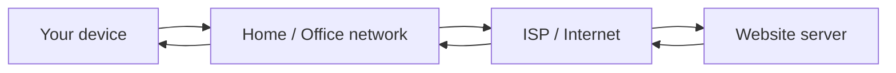
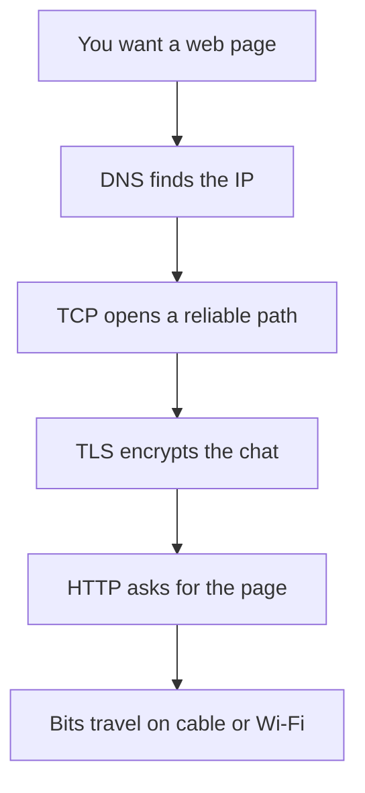
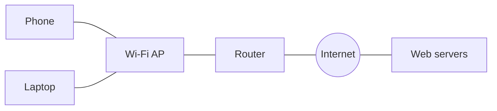

# What Is a Network?

A **network** is simply devices that can share information. Your phone, laptop, Wi‑Fi router, and a website’s server are all “talking” so a page can appear on your screen.

> **Remember:** Networking = **move data from here to there**, safely and on time.

---

## The Everyday Story

Imagine sending a letter:

1. You write a message (**data**)
2. You put it in an envelope with an address (**headers**)
3. The postal system moves it hop by hop (**routers**)
4. It arrives at the right building and room (**host + app**)

Computers do the same thing — only with packets instead of paper.



---

## Core Words (click to learn more)

| Word | Plain meaning | Deep dive |
|------|---------------|-----------|
| Packet | A small chunk of data with delivery info | [IPv4](#protocols-reference/ipv4) |
| Protocol | Agreed rules for talking | [Protocols Reference](#protocols-reference) |
| IP address | “Where is the computer?” | [IPv4](#protocols-reference/ipv4) · [IPv6](#protocols-reference/ipv6) |
| MAC address | “Which NIC on this LAN?” | [Ethernet](#protocols-reference/ethernet) · [ARP](#protocols-reference/arp) |
| Port | “Which app on that computer?” | [TCP](#protocols-reference/tcp) · [UDP](#protocols-reference/udp) |
| Switch | Forwards frames inside a LAN | [Data Link](#data-link-layer) |
| Router | Forwards packets between networks | [Network Layer](#network-layer) |
| Firewall | Allows / blocks traffic by policy | [Firewall](#protocols-reference/firewall) |

---

## Why Networks Feel Magical (but are layered)

One big problem (“show me a website”) is split into small jobs:



You will learn each job as an **OSI layer**. Layers keep networking **simple to remember**:

| Layer idea | Memory hook |
|------------|-------------|
| Physical | The road / cable / radio |
| Data Link | Street address on your block ([MAC](#protocols-reference/ethernet)) |
| Network | City + postal routing ([IP](#protocols-reference/ipv4)) |
| Transport | Apartment number + delivery style ([TCP](#protocols-reference/tcp)/[UDP](#protocols-reference/udp)) |
| Application | The actual conversation ([HTTP](#protocols-reference/http), [DNS](#protocols-reference/dns)) |

---

## LAN vs WAN (tiny glossary)

- **LAN** — local area network (home, office floor)
- **WAN** — wide area network (links cities / the Internet)
- **Internet** — many networks interconnected with common protocols



---

## What pktana Helps You See

pktana lets you **watch the conversation on the wire**: packets, flows, connections, and protocols. While you learn, keep asking:

1. **Who** is talking? (IP / MAC)
2. **Which app?** (port / protocol)
3. **Is it healthy?** (handshake, errors, weird destinations)

---

## Knowledge Check

```quiz
QUESTION: What is the simplest definition of a computer network?
OPTIONS:
A single cable with no devices
Two or more devices that can exchange data
Only cloud servers
Only wireless phones
ANSWER: 1
EXPLAIN: A network exists when devices can share information — wired or wireless.
```

```quiz
QUESTION: Which item answers “which application on the computer?”
OPTIONS:
MAC address
IP address
Port number
Cable category
ANSWER: 2
EXPLAIN: Ports select the application/service. IP selects the host; MAC selects the NIC on the local link.
```

```quiz
QUESTION: A router’s main job is to:
OPTIONS:
Assign MAC addresses to printers
Forward packets between different networks
Replace DNS entirely
Encrypt every Wi‑Fi password
ANSWER: 1
EXPLAIN: Routers move packets across network boundaries using IP routing.
```

---

## Next

Continue with the map of all layers: [The OSI Model](#osi-model).
