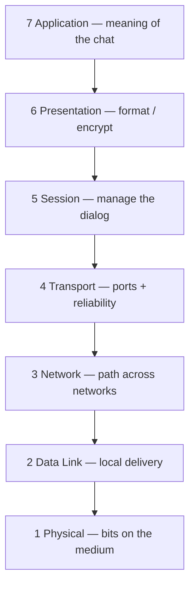
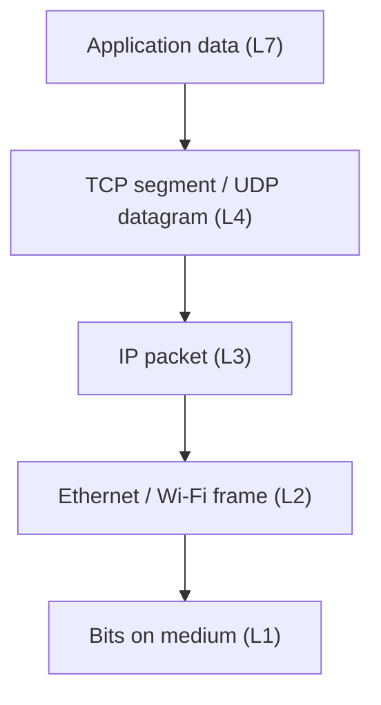
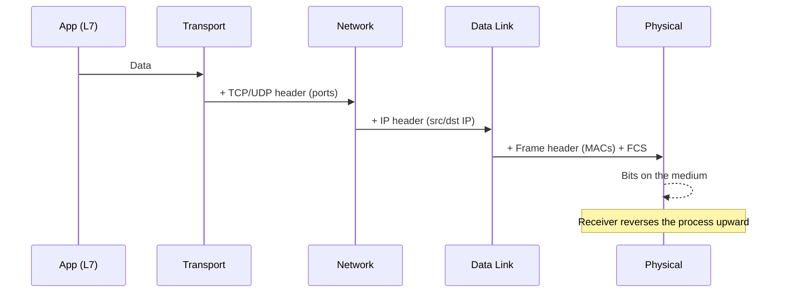
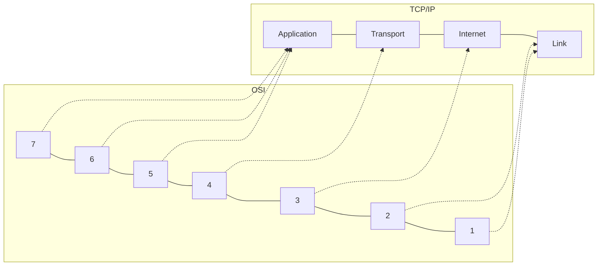
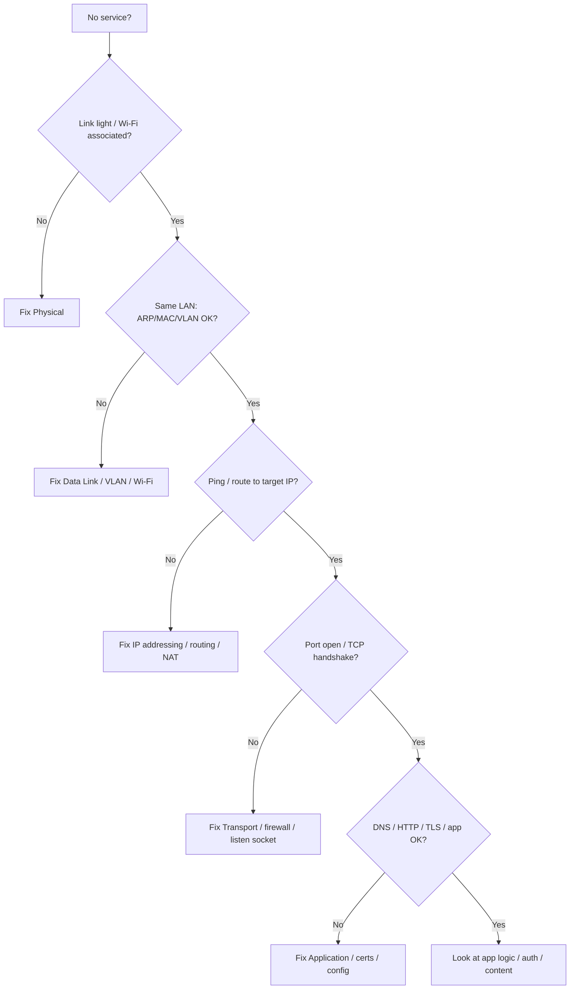

# The OSI Model

The **Open Systems Interconnection (OSI) model** is a seven-layer map of how networked systems talk. It was created so engineers could describe problems without drowning in vendor jargon. You do not need OSI to send a single packet — stacks on your laptop and phone are closer to the **TCP/IP** model — but you *do* need OSI (or something like it) to **think clearly**. When a website fails, OSI gives you a checklist: Is the cable lit? Can we reach the neighbor? Can we route across networks? Can the application on the far host accept the connection? Is the name resolving? Is the page encrypted and formatted correctly?

This chapter is the master map for the Networking Learning Hub. Every later lesson — Physical, Data Link, Network, Transport, Application — is one floor of this building. Read it once for the big picture, then return whenever a capture or outage feels confusing. The goal is not to recite layer numbers at a dinner party. The goal is to look at a symptom and say, *“That smells like Layer 2,”* or *“That is above TCP,”* and know where to dig next.

> **Remember:** OSI is a **stack of jobs**. Each layer solves one problem, then hands work to the next layer.

---

## Why a Layered Model Exists

Early networking was a mess of proprietary systems. If Vendor A’s “session” idea did not match Vendor B’s “transport,” interoperability failed. Layering creates **clean contracts**:

- A lower layer promises a service (for example, “I will deliver this bit stream across this cable”).
- An upper layer uses that service without caring how the lower layer is implemented (copper vs fiber, Ethernet vs Wi‑Fi).
- You can replace one layer’s technology without rewriting every application.

That separation is why you can change from copper to fiber and still run the same [HTTP](#protocols-reference/http) and [DNS](#protocols-reference/dns). It is also why troubleshooting works: you isolate which contract is broken instead of guessing randomly.



**Memory sentence (say it out loud):**  
*Apps speak → Transport delivers → IP routes → Link frames → Wire carries bits.*

---

## The Seven Layers in Detail {#seven-layers}

### Layer 1 — Physical {#layer-1}

**Job:** Move **bits** as energy: voltage on copper, light pulses on fiber, radio waves in air.

Physical does not understand “web page” or “IP address.” It only cares whether ones and zeros can be represented and recovered with acceptable error rates. Cables, connectors, NICs’ PHY chips, optical modules, antennas, and signal clocks live here.

**Failure symptoms:** no link light, flapping link, CRC errors from bad cabling, wrong speed/duplex, dirty fiber connectors, RF interference on Wi‑Fi.

**Deep dive:** [Physical Layer](#physical-layer).

### Layer 2 — Data Link {#layer-2}

**Job:** Turn a raw bit stream into **frames** that can be delivered to the correct **neighbor** on a local network.

[Ethernet](#protocols-reference/ethernet) and Wi‑Fi (802.11) are the stars. Addresses are **MAC** addresses. Switches forward frames using MAC learning. [ARP](#protocols-reference/arp) maps IP→MAC on IPv4 LANs. [VLANs](#protocols-reference/vlan) and [STP](#protocols-reference/stp) shape and stabilize Layer 2 domains.

**Failure symptoms:** wrong VLAN, ARP failures, broadcast storms, loops, MAC flapping, Wi‑Fi association failures.

**Deep dive:** [Data Link Layer](#data-link-layer).

### Layer 3 — Network {#layer-3}

**Job:** Deliver packets **across networks** using logical addresses — mainly [IPv4](#protocols-reference/ipv4) and [IPv6](#protocols-reference/ipv6).

Routers choose **next hops**. [ICMP](#protocols-reference/icmp) reports errors and supports ping/traceroute. Routing protocols such as [OSPF](#protocols-reference/ospf) and [BGP](#protocols-reference/bgp) distribute reachability.

**Failure symptoms:** wrong subnet mask, missing default route, black holes, asymmetric routing, NAT surprises, unreachable prefixes.

**Deep dive:** [Network Layer](#network-layer).

### Layer 4 — Transport {#layer-4}

**Job:** Deliver data to the **correct application** on a host, using **ports**, and choose a delivery style.

[TCP](#protocols-reference/tcp) offers a reliable, ordered byte stream with congestion awareness. [UDP](#protocols-reference/udp) offers lightweight datagrams. A **socket** is the combination of IP + port + protocol that identifies one endpoint of a conversation.

**Failure symptoms:** connection refused, timeout (firewall drop), RST storms, port blocked, UDP silently lost.

**Deep dive:** [Transport Layer](#transport-layer).

### Layer 5 — Session {#layer-5}

**Job:** Establish, manage, and tear down **dialogs** between applications.

In classic OSI textbooks, Session handles checkpoints and conversation control. In modern Internet practice, session behavior is often absorbed into application protocols and libraries (HTTP keep‑alive, SSH channels, TLS session tickets). You still *feel* Layer 5 when a long-lived login or remote desktop session drops while lower layers look healthy.

### Layer 6 — Presentation {#layer-6}

**Job:** Make data **understandable and (often) private**: encoding, compression, encryption/decryption.

Character encodings, serialization formats, and especially [TLS](#protocols-reference/tls) sit here conceptually. Your browser does not send raw secrets in the clear when HTTPS works; Presentation/security machinery transforms the bytes.

### Layer 7 — Application {#layer-7}

**Job:** Give meaning to the conversation for users and services: fetch a page, resolve a name, send mail, open a shell.

[HTTP](#protocols-reference/http)/[HTTPS](#protocols-reference/https), [DNS](#protocols-reference/dns), [DHCP](#protocols-reference/dhcp), [SSH](#protocols-reference/ssh), [SMTP](#protocols-reference/smtp), [NTP](#protocols-reference/ntp) live here in everyday speech.

**Deep dive:** [Application Layer](#application-layer) (covers OSI 5–7 mapped to real life).

> **Remember:** Layers 5–7 are often collapsed into one “Application” layer in TCP/IP talk. That is fine — OSI still helps you **name the job**.

---

## Layer Cheat Sheet

| # | Layer | Job in one line | Learn here | Key protocols / ideas |
|---|-------|-----------------|------------|------------------------|
| 7 | Application | What the user/app wants | [Application](#application-layer) | [HTTP](#protocols-reference/http), [DNS](#protocols-reference/dns), [SSH](#protocols-reference/ssh) |
| 6 | Presentation | Encode / encrypt / format | [Application](#application-layer) | [TLS](#protocols-reference/tls) |
| 5 | Session | Start / manage / end dialogs | [Application](#application-layer) | Sessions inside apps |
| 4 | Transport | App-to-app delivery | [Transport](#transport-layer) | [TCP](#protocols-reference/tcp), [UDP](#protocols-reference/udp) |
| 3 | Network | Host-to-host across networks | [Network](#network-layer) | [IPv4](#protocols-reference/ipv4), [ICMP](#protocols-reference/icmp) |
| 2 | Data Link | Neighbor-to-neighbor on a LAN | [Data Link](#data-link-layer) | [Ethernet](#protocols-reference/ethernet), [ARP](#protocols-reference/arp) |
| 1 | Physical | Move bits as signals | [Physical](#physical-layer) | Copper, fiber, radio |

---

## PDUs: What Each Layer Calls Its Unit {#pdus}

Networking people say **PDU** (Protocol Data Unit) for “the chunk this layer deals with.” Names change by layer:

| Layer | Common PDU name | Typical contents |
|-------|-----------------|------------------|
| 7–5 | Data / message | Application payload |
| 4 | Segment (TCP) or datagram (UDP) | Ports + transport header + data |
| 3 | Packet / datagram | IP header + transport |
| 2 | Frame | MAC header + payload + FCS |
| 1 | Bits / symbols | Signal on the medium |

Casual speech often says “packet” for everything. Analysts still benefit from precise words when reading captures: *Is this an Ethernet frame wrapping an IP packet wrapping a TCP segment wrapping HTTP?*



---

## Encapsulation and De-Encapsulation {#encapsulation}

**Encapsulation** is wrapping. As data moves **down** the stack toward the wire, each layer adds its header (and sometimes a trailer).

**De-encapsulation** is unwrapping. As data moves **up** the stack on the receiver, each layer strips *its* header, checks correctness, and passes the payload upward.

Imagine mailing a gift:

1. You write a note (application data).
2. You put it in a box labeled with apartment number (transport ports).
3. You add a city address label (IP).
4. The local courier adds a street sticker for *this* neighborhood hop (MAC).
5. The truck carries the physical package (bits).

At each hop along a path, routers typically unwrap only enough to route (L2/L3), then re-encapsulate for the next link. End hosts unwrap all the way to the application.



> **Remember:** **IP finds the house. TCP/UDP finds the room. Ethernet finds the door on this street.**

### A concrete example: HTTPS GET

1. Browser builds an [HTTP](#protocols-reference/http) request.
2. [TLS](#protocols-reference/tls) encrypts that request (presentation/security).
3. [TCP](#protocols-reference/tcp) segments the stream; ports often 443 on the server.
4. [IPv4](#protocols-reference/ipv4)/[IPv6](#protocols-reference/ipv6) add source and destination IPs.
5. [Ethernet](#protocols-reference/ethernet) or Wi‑Fi frames carry the IP packet to the next hop.
6. Physical media carry the bits.

In a capture you see the outer headers first. Decrypting TLS (when you have keys) reveals HTTP inside.

---

## OSI vs TCP/IP Mapping {#tcpip-mapping}

The Internet’s practical model is **TCP/IP** (also called the DoD or Internet model). It has fewer named layers, but the jobs still map:

| TCP/IP layer | Rough OSI mapping | Examples |
|--------------|-------------------|----------|
| Application | OSI 5–7 | [DNS](#protocols-reference/dns), [HTTP](#protocols-reference/http), [TLS](#protocols-reference/tls), [SSH](#protocols-reference/ssh) |
| Transport | OSI 4 | [TCP](#protocols-reference/tcp), [UDP](#protocols-reference/udp) |
| Internet | OSI 3 | [IPv4](#protocols-reference/ipv4), [IPv6](#protocols-reference/ipv6), [ICMP](#protocols-reference/icmp) |
| Link (Network Access) | OSI 1–2 | [Ethernet](#protocols-reference/ethernet), Wi‑Fi, PPP |



Use OSI when teaching and troubleshooting vocabulary. Use TCP/IP when reading RFCs and OS documentation. Both describe the same reality.

---

## Devices and Where They Live {#devices}

| Device / function | Mostly lives at | Why |
|-------------------|-----------------|-----|
| Cable, patch panel, optical module | L1 | Signals and connectors |
| NIC PHY / transceiver | L1–L2 boundary | Signal ↔ bits ↔ frames |
| Hub (legacy) | L1 (bit blender) | Repeats electrical signal to all ports |
| Switch | L2 | Forwards by MAC / VLAN |
| Wireless AP | L1–L2 | Radio + 802.11 framing |
| Router | L3 | Forwards by IP, separates L2 domains |
| Multilayer switch | L2 + L3 | Switching + routing features |
| Firewall / NGFW | L3–L7 | Policy on addresses, ports, apps |
| Load balancer | L4–L7 | Ports and/or HTTP content |
| Browser / server app | L7 | Meaning of the data |

A single box can implement multiple layers. Your laptop’s OS stack walks the entire model for every connection.

---

## Same-Layer and Adjacent-Layer Communication

Two useful mental rules:

1. **Peer layers talk “logically.”** Your TCP talks to the remote TCP (same layer), even though the bytes physically travel through IP, Ethernet, and fiber.
2. **Adjacent layers talk “locally.”** TCP on your host hands a segment to IP on your host; IP hands a packet to the NIC driver.

Headers are how peer layers understand each other. Interfaces/APIs are how adjacent layers cooperate inside one device.

---

## Troubleshooting Bottom-Up {#troubleshooting}

When a service fails, start low and climb. Upper layers cannot succeed if lower layers are broken.



### A practical ladder

1. **L1:** Link LEDs, `ethtool`, cable reseat, known-good patch cord, AP signal.
2. **L2:** Correct VLAN, MAC learning, ARP (`ip neigh`), no loop symptoms.
3. **L3:** Address/mask/gateway, `ping`, `traceroute`/`tracepath`, routing table.
4. **L4:** `ss -lntup`, firewall rules, TCP SYN vs SYN-ACK vs RST.
5. **L7:** DNS answers, TLS errors, HTTP status codes, app logs.

> **Remember:** Bottom-up saves time. Do not debug HTTP headers when the cable is unplugged.

### Top-down when the problem is clearly “app-ish”

If thousands of users can ping the server but one URL returns 500, start at the application. OSI is a guide, not a religion.

---

## How Layers Appear in Packet Analysis

In pktana (or any analyzer), a typical frame tree looks like:

- Frame / Ethernet II (L2)
- Internet Protocol Version 4 (L3)
- Transmission Control Protocol (L4)
- Transport Layer Security (L6-ish)
- Hypertext Transfer Protocol (L7)

Filters follow the same idea: `tcp.port == 443`, `ip.addr == …`, `eth.dst == …`, `dns`, `http`.

### pktana practical tips

```bash
# Capture on an interface (example)
pktana capture -i eth0 -w lesson.pcap

# Open in the web UI for layered dissection
pktana web --port 8080

# Quick conversation overview
pktana connections -r lesson.pcap
```

When you click a packet, ask: *Which layer’s header answers my question?* MAC mismatch → L2. Wrong gateway → L3. SYN with no SYN-ACK → L4 path/firewall. Certificate error → TLS/app.

---

## Common Myths to Drop Early

- **“OSI is obsolete.”** The *implementation* is TCP/IP; the *thinking tool* remains OSI.
- **“Switches are Layer 3.”** Classic switches are L2; multilayer switches also route.
- **“TCP is Layer 3.”** TCP is transport (L4). IP is network (L3).
- **“Wi‑Fi is only Physical.”** Radio is L1; 802.11 framing and association are L2.
- **“HTTPS replaces TCP.”** HTTPS is HTTP over TLS, almost always over TCP (or sometimes QUIC/UDP).

---

## Connecting This Chapter to the Rest of the Hub

| If you care about… | Go next |
|--------------------|---------|
| Cables, optics, duplex, CRC | [Physical](#physical-layer) |
| MAC, ARP, VLANs, STP | [Data Link](#data-link-layer) |
| Subnets, routing, ICMP, NAT | [Network](#network-layer) |
| Ports, TCP/UDP | [Transport](#transport-layer) |
| DNS, HTTP, TLS, SSH | [Application](#application-layer) |
| Dictionary of names | [Protocols Reference](#protocols-reference) |

---

## What You Should Feel Confident Saying

After this chapter you should be able to:

- name all seven layers and each one’s job in plain language,
- explain encapsulation with a nested-envelope story,
- map OSI to TCP/IP,
- place switch, router, firewall, and browser on the stack,
- troubleshoot with a bottom-up habit,
- recognize PDU names (bits, frames, packets, segments).

---

## Hands-On Tasks

```task
TITLE: Label a real packet by layer
LEVEL: beginner
STEPS:
1. Capture a short HTTPS or HTTP conversation with pktana
2. Pick one frame and write L2 / L3 / L4 / L7 fields you can see
3. Note which addresses are MAC, IP, and port
GOAL: Prove you can map a capture tree onto the OSI jobs
```

```task
TITLE: Bottom-up drill on a failed service
LEVEL: intermediate
STEPS:
1. Pick any “cannot reach the service” scenario (lab or home)
2. Walk the ladder: link → ARP/neighbor → ping → port → DNS/app
3. Write which layer first failed and why
GOAL: Build the troubleshooting reflex before memorizing more protocols
```

```task
TITLE: Encapsulation sketch
LEVEL: beginner
STEPS:
1. On paper, draw HTTP → TLS → TCP → IP → Ethernet wrappers
2. Mark which header is added or removed at a router hop
3. Compare your sketch to one packet in pktana
GOAL: Internalize what changes hop-by-hop vs end-to-end
```

---

## Knowledge Check

```quiz
QUESTION: Which layer is mainly about IP addresses and routing between networks?
OPTIONS:
Physical
Data Link
Network
Application
ANSWER: 2
EXPLAIN: Layer 3 (Network) moves packets between networks using IP.
```

```quiz
QUESTION: Ports (like 443) belong primarily to which layer?
OPTIONS:
Transport
Physical
Data Link
Presentation only
ANSWER: 0
EXPLAIN: Transport (TCP/UDP) uses ports to reach the correct application.
```

```quiz
QUESTION: Encapsulation means:
OPTIONS:
Deleting headers to save space
Adding headers as data moves down the stack
Only Wi-Fi encryption
Only DNS caching
ANSWER: 1
EXPLAIN: Each lower layer wraps the data from above with its own header.
```

```quiz
QUESTION: A switch forwards traffic mainly using:
OPTIONS:
ASN numbers
MAC addresses
HTTP cookies
TLS certificates
ANSWER: 1
EXPLAIN: Switches are Layer 2 devices and forward frames by MAC.
```

```quiz
QUESTION: In the TCP/IP model, OSI Layers 5–7 map mainly into:
OPTIONS:
The Physical layer only
The Application layer
BGP exclusively
The Ethernet FCS
ANSWER: 1
EXPLAIN: TCP/IP collapses Session, Presentation, and Application into Application.
```

```quiz
QUESTION: The PDU name most associated with Layer 2 is:
OPTIONS:
Segment
Frame
Autonomous system
Certificate
ANSWER: 1
EXPLAIN: Layer 2 units are typically called frames (for example Ethernet frames).
```

```quiz
QUESTION: You have link light and correct IP, but TCP SYN never gets SYN-ACK. Start investigating:
OPTIONS:
Only optical wavelength
Mostly Layer 4 path/firewall/listen issues (after confirming L3)
Only Layer 1 patch panels forever
Only SMTP banners
ANSWER: 1
EXPLAIN: Reachability at IP without a handshake points to transport path, filtering, or the service not listening.
```

```quiz
QUESTION: ARP is best described as helping which relationship?
OPTIONS:
DNS name to URL path
IP address to MAC address on the local link
TCP port to process name only
BGP AS to country code
ANSWER: 1
EXPLAIN: ARP resolves IPv4 addresses to MAC addresses on a LAN.
```

---

## Next

Start at the bottom of the stack: [Layer 1 — Physical](#physical-layer) — media, signaling, connectors, speed/duplex, and when a problem is truly L1.
