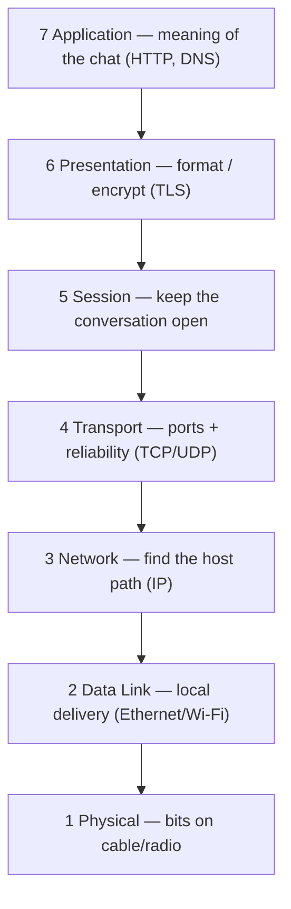
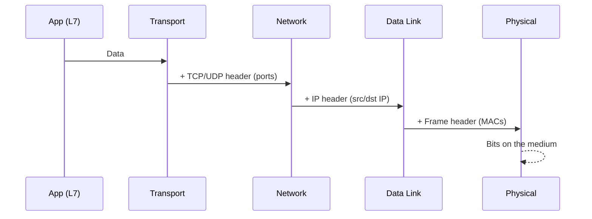
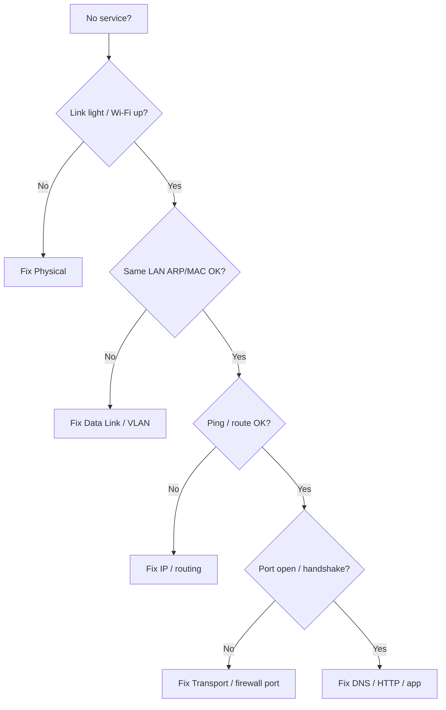

# The OSI Model

The **OSI model** is a 7‑layer map of networking. You do not need to memorize jargon first — memorize the **jobs**.

> **Remember:** OSI = a **stack of jobs**. Each layer solves one problem, then hands work to the next.

---

## One Picture to Keep Forever



**Memory sentence (say it out loud):**  
*Apps speak → Transport delivers → IP routes → Link frames → Wire carries bits.*

---

## Layer Cheat Sheet (with links)

| # | Layer | Job in one line | Learn here | Key protocols |
|---|-------|-----------------|------------|---------------|
| 7 | Application | What the user/app wants | [Application](#application-layer) | [HTTP](#protocols-reference/http), [DNS](#protocols-reference/dns), [SSH](#protocols-reference/ssh) |
| 6 | Presentation | Encode / encrypt / format | [Application](#application-layer) | [TLS](#protocols-reference/tls) |
| 5 | Session | Start / manage / end dialogs | [Application](#application-layer) | Sessions inside apps |
| 4 | Transport | App-to-app delivery | [Transport](#transport-layer) | [TCP](#protocols-reference/tcp), [UDP](#protocols-reference/udp) |
| 3 | Network | Host-to-host across networks | [Network](#network-layer) | [IPv4](#protocols-reference/ipv4), [ICMP](#protocols-reference/icmp) |
| 2 | Data Link | Neighbor-to-neighbor on a LAN | [Data Link](#data-link-layer) | [Ethernet](#protocols-reference/ethernet), [ARP](#protocols-reference/arp) |
| 1 | Physical | Move bits as signals | [Physical](#physical-layer) | Copper, fiber, radio |

In real life, people often collapse 5–7 into “Application” (TCP/IP model). That is fine — OSI is still the best **memory map**.

---

## Encapsulation Flow {#encapsulation}

Going **down** the stack = wrap more headers (like nested envelopes).  
Going **up** = unwrap.



> **Remember:** **IP finds the house. TCP/UDP finds the room. Ethernet finds the door on this street.**

---

## Devices and Layers

| Device | Mostly lives at | Why |
|--------|-----------------|-----|
| Cable / NIC PHY | L1 | Signals |
| Switch | L2 | Forwards by MAC |
| Router | L3 | Forwards by IP |
| Firewall | L3–L7 | Policy on addresses/ports/apps |
| Browser / server app | L7 | Meaning of the data |

---

## Troubleshooting Habit (bottom‑up)



---

## Knowledge Check

```quiz
QUESTION: Which layer is mainly about IP addresses and routing between networks?
OPTIONS:
Physical
Data Link
Network
Application
ANSWER: 2
EXPLAIN: Layer 3 (Network) moves packets between networks using IP.
```

```quiz
QUESTION: Ports (like 443) belong primarily to which layer?
OPTIONS:
Transport
Physical
Data Link
Presentation only
ANSWER: 0
EXPLAIN: Transport (TCP/UDP) uses ports to reach the correct application.
```

```quiz
QUESTION: Encapsulation means:
OPTIONS:
Deleting headers to save space
Adding headers as data moves down the stack
Only Wi‑Fi encryption
Only DNS caching
ANSWER: 1
EXPLAIN: Each lower layer wraps the data from above with its own header.
```

```quiz
QUESTION: A switch forwards traffic mainly using:
OPTIONS:
ASN numbers
MAC addresses
HTTP cookies
TLS certificates
ANSWER: 1
EXPLAIN: Switches are Layer 2 devices and forward frames by MAC.
```

---

## Next

Start at the bottom: [Layer 1 — Physical](#physical-layer).
