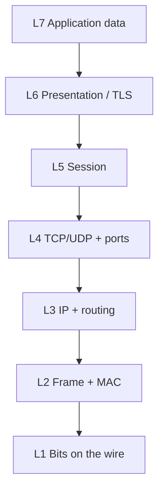

# The OSI Model

The **OSI Model** (Open Systems Interconnection) is a 7-layer conceptual framework that standardises how communication functions work in a network. Defined by ISO in 1984, it is the universal reference model used for networking education, protocol design, vendor interoperability, and troubleshooting.

---

## Why a Layered Model?

Networking is a complex problem. Without structure, designing, building, and troubleshooting a network would require every component to know about every other component. Layering breaks the problem into smaller, independent sub-problems.

Each layer:
- Solves exactly one networking problem
- Provides services to the layer above it
- Uses services from the layer below it
- Communicates with the same layer on the remote device (peer-to-peer communication)

This design gives four major benefits:

**Modularity** — You can change one layer without affecting others. Ethernet can be replaced by Wi-Fi at Layer 1–2 without modifying TCP or HTTP at Layers 4–7.

**Interoperability** — A Cisco router, a Juniper switch, and a Linux server all communicate because they each implement the same layer specifications. Vendors compete on implementation, not on invented standards.

**Standardised troubleshooting** — When a problem occurs, you methodically work up or down the stack to isolate which layer is failing. "The IP route is wrong" immediately tells you it is a Layer 3 problem.

**Independent development** — Engineers can design a new transport protocol without rewriting DNS. Application developers can build apps without understanding cable physics.

---

## The 7 Layers at a Glance

```
Number   Name            PDU Unit    Key Role
──────────────────────────────────────────────────────────────────────
  7      Application     Data        Defines application protocols (HTTP, DNS, SMTP)
  6      Presentation    Data        Encoding, encryption, compression (TLS, JPEG)
  5      Session         Data        Session lifecycle, dialog control (SIP, RPC)
  4      Transport       Segment     End-to-end delivery, ports, reliability (TCP, UDP)
  3      Network         Packet      Logical addressing, routing (IP, ICMP, OSPF)
  2      Data Link       Frame       Local delivery, MAC addressing (Ethernet, Wi-Fi)
  1      Physical        Bit         Raw bit transmission (cables, radio, light)
```

**Memory aid — top to bottom (7→1):** All People Seem To Need Data Processing
**Memory aid — bottom to top (1→7):** Please Do Not Throw Sausage Pizza Away

---

## Layer 1 — Physical

The Physical Layer converts bits into signals and transmits them across a medium. It defines everything you can physically touch and measure: voltage levels, cable specifications, connector shapes, signal timing, and bit rates.

It does not address, frame, or detect errors. Its only job is to faithfully put bits onto the wire and take them off the other end.

Examples: 1000BASE-T (Gigabit Ethernet over Cat 5e), 10GBASE-SR (10 Gbps over multimode fiber), IEEE 802.11 (Wi-Fi radio), coaxial cable, RJ-45 connector.

Devices: hubs, repeaters, media converters, NICs (physical side), transceivers (SFP/QSFP).

---

## Layer 2 — Data Link

The Data Link Layer organises raw bits into **frames** and handles delivery between devices on the **same physical network segment**. It adds source and destination **MAC addresses**, detects transmission errors using a CRC checksum, and controls who gets to access the shared medium.

It has two sub-layers:
- **MAC (Media Access Control)** — framing, MAC addressing, CRC, media access
- **LLC (Logical Link Control)** — identifies which Layer 3 protocol is inside the frame, flow control, error notification

At each router hop, the Layer 2 frame is stripped and rebuilt with new MAC addresses for the next segment. The IP packet inside is untouched.

Examples: Ethernet (IEEE 802.3), Wi-Fi (IEEE 802.11), PPP, HDLC, ARP.

Devices: switches, wireless access points, bridges.

---

## Layer 3 — Network

The Network Layer handles **routing packets across multiple networks** to reach any destination on the planet. It uses **logical IP addresses** (assigned in software) rather than the hardware MAC addresses used by Layer 2.

A router reads the destination IP address in the packet header, consults its routing table, and forwards the packet out the correct interface toward the destination. This process repeats at every hop until the packet arrives.

Layer 3 is also responsible for logical address assignment, fragmentation (IPv4), and network-layer diagnostics via ICMP.

Examples: IPv4, IPv6, ICMP, OSPF, BGP, EIGRP.

Devices: routers, Layer 3 switches, firewalls.

---

## Layer 4 — Transport

The Transport Layer provides **end-to-end communication between specific applications** on two hosts. IP gets a packet to the right machine; the Transport Layer gets it to the right application on that machine using **port numbers**.

It also decides the reliability model for the communication:
- **TCP** provides a reliable, ordered, connection-oriented byte stream with acknowledgements, retransmission, flow control, and congestion control.
- **UDP** provides a fast, connectionless datagram service with no delivery guarantee.

Applications choose TCP or UDP based on whether they need reliability or prefer speed.

Examples: TCP (port 80 HTTP, port 443 HTTPS), UDP (port 53 DNS, port 67/68 DHCP).

---

## Layer 5 — Session

The Session Layer manages the **lifecycle of a conversation (session)** between two applications. It establishes, maintains, synchronises, and terminates sessions.

Key functions:
- **Session establishment** — authenticates and sets up a logical dialogue
- **Dialog control** — determines whether communication is simplex, half-duplex, or full-duplex
- **Synchronisation** — places checkpoints in a long data transfer so that if interrupted, transmission can resume from a checkpoint rather than the beginning
- **Session termination** — gracefully ends the dialogue

Examples: SIP (VoIP/video call setup), RPC (remote procedure calls), NetBIOS, SOCKS, SQL session management.

In TCP/IP practice, session functions are handled by a combination of TCP connections and application-level session tokens (cookies, authentication tokens).

---

## Layer 6 — Presentation

The Presentation Layer handles **data format translation** so that both communicating applications interpret the data identically, regardless of their internal representation.

Key functions:
- **Translation** — converts between character encodings: ASCII ↔ EBCDIC, ASCII ↔ Unicode ↔ UTF-8
- **Encryption and Decryption** — TLS encrypts application data before handing it to the Transport Layer; the receiver decrypts it before passing it to the application
- **Compression** — gzip, Brotli, and zlib reduce the size of data before transmission
- **Serialisation** — converts application objects (program data structures) into a transmittable byte format: JSON, XML, Protobuf, ASN.1

Examples: TLS/SSL, JPEG, MPEG, MP4, PNG, gzip, ASCII, UTF-8, Base64, Protobuf.

In TCP/IP practice, presentation functions are performed by libraries inside the application (TLS libraries like OpenSSL, codec libraries, serialisation libraries).

---

## Layer 7 — Application

The Application Layer is the layer closest to the user. It defines the **specific rules and protocols** that applications use to communicate — the "language" two applications must speak to exchange web pages, email, DNS queries, or files.

This layer does not mean the application itself (Chrome, Outlook, etc.) — it means the protocol that application uses to send and receive data.

Key functions:
- Identifies communication partners and verifies their availability
- Determines and synchronises resource availability
- Defines the message format, sequencing, and error handling for each protocol
- Enables user-facing services: web browsing, email, file transfer, name resolution, remote access

Examples: HTTP, HTTPS, FTP, SFTP, SMTP, IMAP, POP3, DNS, DHCP, SSH, Telnet, SNMP, NTP, SIP, RDP.

---

## Peer-to-Peer Communication Across Layers

When Host A sends data to Host B, each layer on Host A communicates logically with the same layer on Host B — this is called **peer-to-peer communication**. However, the actual path goes down the stack on the sender, across the physical medium, and up the stack on the receiver.

```
Host A                                              Host B
─────────────────────────────────────────────────────────────
Layer 7 App  ◄ ─ ─ ─ (logical L7-to-L7 channel) ─ ─ ─► Layer 7 App
Layer 6 Pres ◄ ─ ─ ─ (logical L6-to-L6 channel) ─ ─ ─► Layer 6 Pres
Layer 5 Sess ◄ ─ ─ ─ (logical L5-to-L5 channel) ─ ─ ─► Layer 5 Sess
Layer 4 Trans◄ ─ ─ ─ (logical L4-to-L4 channel) ─ ─ ─► Layer 4 Trans
Layer 3 Net  ◄ ─ ─ ─ (logical L3-to-L3 channel) ─ ─ ─► Layer 3 Net
Layer 2 DL   ◄ ─ ─ ─ (logical L2-to-L2 channel) ─ ─ ─► Layer 2 DL
Layer 1 Phys ──────── (actual physical medium) ─────────► Layer 1 Phys
```

Only Layer 1 has a real physical path. All higher layers are logical — they "talk" to their peer by adding/removing headers as data moves through the stack.

---

## Encapsulation and De-encapsulation

**Encapsulation** is the process of each layer adding its own header (and sometimes trailer) to the data it receives from the layer above, as data travels down the stack from sender to wire.

```
Application   [HTTP Request]
Presentation  [TLS Header][Encrypted HTTP]
Session       (handled by TCP + app tokens in TCP/IP)
Transport     [TCP Header | src port, dst port, seq, ack, flags, window][encrypted data]
Network       [IP Header | src IP, dst IP, TTL, protocol][TCP segment]
Data Link     [Eth Header | dst MAC, src MAC, EtherType][IP packet][Eth FCS]
Physical      10110100110101... (bits transmitted over the medium)
```

**De-encapsulation** is the reverse — each layer on the receiver strips its own header and passes the remainder up.

The data unit at each layer has a specific name:

| Layer | Data Unit (PDU) |
|-------|----------------|
| 7–5   | Data (Message) |
| 4     | Segment (TCP) / Datagram (UDP) |
| 3     | Packet |
| 2     | Frame |
| 1     | Bit |

---

## How Routers Use the OSI Model

A router operates at **Layer 3**. It processes incoming traffic up to the Network Layer and no higher (unless it is a firewall or load balancer doing deep inspection).

At each hop:
1. **Layer 1 (Physical)** — receives electrical/optical/radio bits on the incoming interface
2. **Layer 2 (Data Link)** — checks the incoming Ethernet frame's FCS; if valid, strips the frame header and trailer
3. **Layer 3 (Network)** — reads the destination IP address; performs a routing table lookup; decrements TTL; re-calculates IP checksum
4. **Layer 2 (Data Link)** — wraps the packet in a new Ethernet frame with new source/destination MACs for the next hop
5. **Layer 1 (Physical)** — converts the frame to bits and transmits out the correct interface

The IP packet's source and destination addresses never change across hops. The Ethernet frame's MAC addresses change at every hop.

---

## OSI vs. TCP/IP Model

The Internet was built on the **TCP/IP model** (also called the DoD model or Internet model), which predates OSI. TCP/IP has 4 layers:

| TCP/IP Layer | Equivalent OSI Layers | Key Protocols |
|---|---|---|
| **Application** | 5 + 6 + 7 | HTTP, DNS, SMTP, FTP, SSH, TLS |
| **Transport** | 4 | TCP, UDP, QUIC |
| **Internet** | 3 | IP, ICMP |
| **Network Access (Link)** | 1 + 2 | Ethernet, Wi-Fi, PPP |

**OSI** is a reference model — it describes how communication *should* be structured. It is used for teaching, documentation, and troubleshooting.

**TCP/IP** is an implementation model — it describes how the Internet *actually* works. It is what real software implements.

Knowing both models matters because:
- Documentation and vendor literature use OSI layer numbers ("this is a Layer 3 problem")
- Protocol implementation follows TCP/IP
- Security tools (Wireshark, pktana) decode packets by OSI layer

---

## Network Devices and Their OSI Layer

| Device | OSI Layer | What It Reads / Processes |
|--------|-----------|--------------------------|
| Hub | 1 — Physical | Repeats raw bits to all ports |
| Repeater / Extender | 1 — Physical | Regenerates signal to extend distance |
| NIC | 1 + 2 | Converts bits ↔ frames |
| Switch | 2 — Data Link | Reads MAC addresses to forward frames |
| Wireless Access Point | 1 + 2 | 802.11 radio + 802.11 MAC framing |
| Bridge | 2 — Data Link | Connects two LAN segments, filters by MAC |
| Router | 3 — Network | Reads IP addresses to route packets |
| Layer 3 Switch | 2 + 3 | Switches at L2 speed, routes at L3 |
| Firewall | 3–7 | Inspects packets, sessions, or application content |
| Load Balancer | 4–7 | Distributes traffic by port, URL, or content |
| Proxy | 7 — Application | Terminates and re-originates application connections |

---

## Troubleshooting with the OSI Model

A structured approach to diagnosing network issues is to move through the OSI layers systematically. Two methods are common:

**Bottom-up (most common):** Start at Layer 1 and move up. This is preferred when you have a "can't connect" problem with no obvious clue.

| Layer | What to Check |
|-------|--------------|
| 1 — Physical | Is the cable plugged in? Is the link light on? Is the NIC detected? |
| 2 — Data Link | Is the MAC table correct? Is a VLAN misconfigured? Is STP blocking a port? |
| 3 — Network | Is the IP address set? Is the default gateway right? Is the routing table correct? |
| 4 — Transport | Is the destination port open? Is a firewall blocking the port? Is the service listening? |
| 5–6 — Session/Pres | Has the TLS certificate expired? Is the session timing out? |
| 7 — Application | Does DNS resolve? Is the URL correct? Is authentication working? |

**Top-down:** Start at Layer 7 and work down. Used when you know the network is otherwise healthy and suspect an application or DNS problem.

---

## Data Flow: A Complete Example

**Scenario:** You open a browser and load `https://www.example.com`.

| Step | Layer | What Happens |
|------|-------|-------------|
| 1 | L7 App | Browser creates an HTTP GET request for `www.example.com` |
| 2 | L6 Pres | TLS encrypts the HTTP request using the negotiated session key |
| 3 | L5 Session | The TLS session (established earlier during the TLS handshake) is maintained |
| 4 | L4 Transport | TCP wraps the data in a segment: src port ~54321, dst port 443, with SEQ/ACK |
| 5 | L3 Network | IP wraps in a packet: src IP (your machine), dst IP (93.184.216.34), TTL=64 |
| 6 | L2 Data Link | Ethernet wraps in a frame: src MAC (your NIC), dst MAC (your router), EtherType=0x0800 |
| 7 | L1 Physical | Frame converted to electrical signals and sent over the cable |
| 8 | Router hop | Router strips L2 frame, routes the L3 packet, wraps in a new L2 frame |
| 9 | At server | Server de-encapsulates each layer: Ethernet → IP → TCP → TLS → HTTP |
| 10 | Server responds | Same process in reverse — HTTP 200 response travels back to your browser |



---

## Knowledge Check

```quiz
QUESTION: Encapsulation adds headers mainly when data moves:
OPTIONS:
Up the stack toward the application
Down the stack toward the physical medium
Only inside DNS answers
Only on wireless networks
ANSWER: 1
EXPLAIN: Each lower layer wraps the PDU from above (headers, and sometimes trailers).
```

---

## Summary

- The OSI model has **7 layers**, each solving one networking sub-problem
- Layers allow **modularity** — swap components at one layer without touching others
- Data is **encapsulated** going down the stack (headers added), **de-encapsulated** going up (headers stripped)
- **TCP/IP** collapses 7 OSI layers into 4; OSI is the conceptual reference, TCP/IP is the implementation
- Devices operate at specific layers: hub=L1, switch=L2, router=L3, firewall=L3–L7
- **Peer-to-peer** communication means each layer "talks" logically to the same layer on the remote host

**Next:** [Layer 1 — Physical](#physical-layer) — cables, signals, and how bits travel
