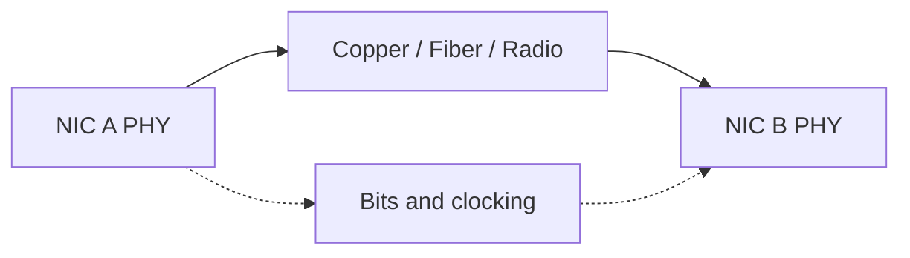
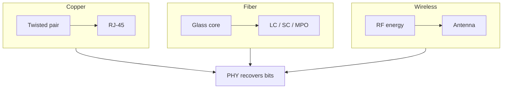
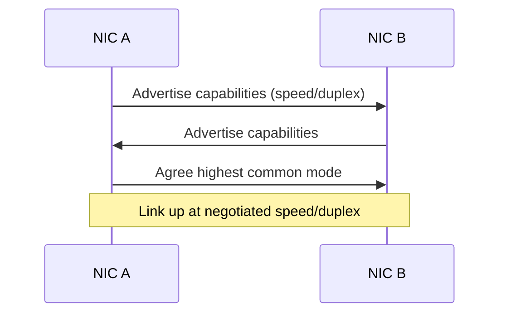
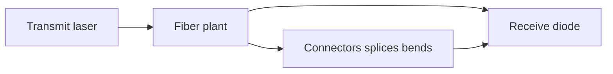
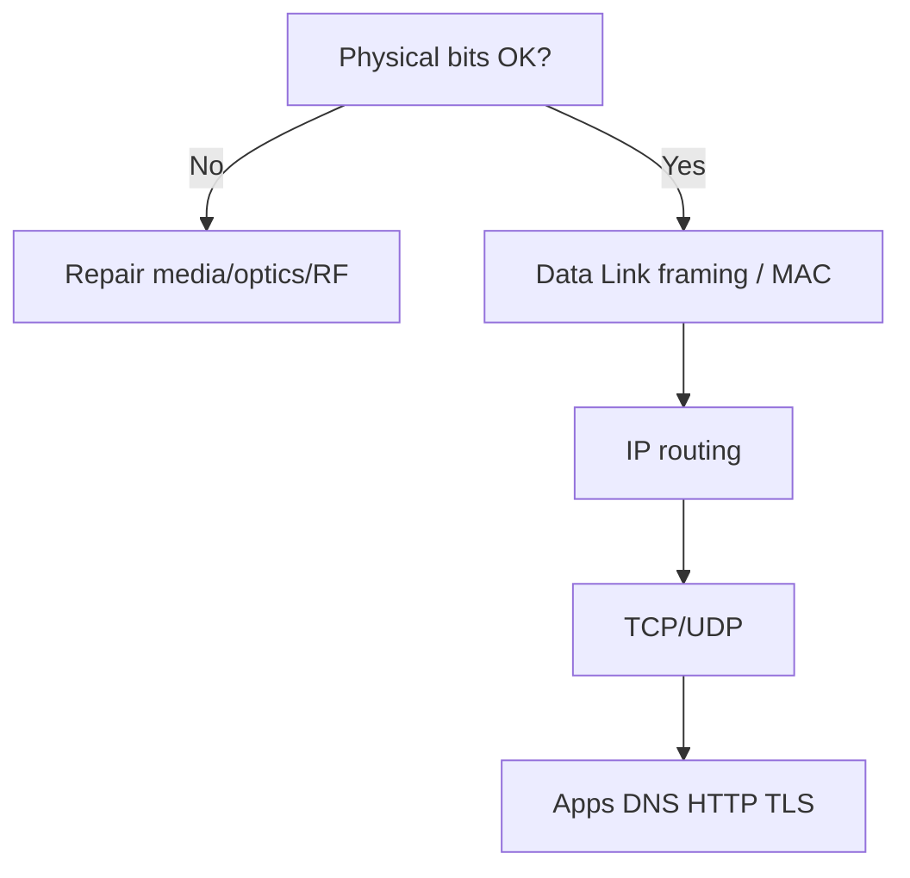

# Layer 1 — Physical

The **Physical layer** is where networking stops being abstract and becomes physics. Before frames, IP addresses, ports, or web pages exist as meaningful structures, there must be a way to represent **bits** as energy that another device can recover. That energy might be voltage levels on a twisted copper pair, flashes of laser light in a glass fiber, or radio waves bouncing through an office. If Layer 1 fails, every clever protocol above it is irrelevant — you cannot route a packet across a cable that is not carrying a usable signal.

This chapter teaches you to recognize Physical-layer building blocks: media types, connectors, signaling ideas, speed and duplex, autonegotiation, common error patterns, and optical basics. You will also learn the critical judgment call for troubleshooting: **when is this actually an L1 problem?** Analysts who skip this step waste hours staring at TCP retransmissions caused by a bent fiber or a bad patch cord.

> **Remember:** Physical = **the road**. If the road is broken, nothing above it works.

---

## What Layer 1 Actually Does

Layer 1 answers questions like:

- How do we encode a `1` and a `0` on this medium?
- How fast can we send symbols?
- How do two NICs agree on speed and duplex?
- How do we detect that a link is “up”?
- What connectors and pinouts are required?

It does **not** decide which host is the destination on the Internet. It does **not** know TCP ports. It only moves bits between directly attached interfaces (or between radio peers in a wireless cell).



Upper layers treat a working L1 link as a pipe. Your job as an engineer is to know when that pipe is leaking.

---

## Transmission Media {#media}

### Copper (twisted pair)

Most office Ethernet uses **unshielded twisted pair (UTP)** copper, category-rated cables such as Cat5e, Cat6, and Cat6a. Twisting reduces electromagnetic interference. Common standards:

| Standard | Typical medium | Nominal speed | Notes |
|----------|----------------|---------------|-------|
| 10BASE-T | Cat3+ | 10 Mb/s | Legacy |
| 100BASE-TX | Cat5+ | 100 Mb/s | Fast Ethernet |
| 1000BASE-T | Cat5e+ | 1 Gb/s | Gigabit over copper |
| 2.5/5/10GBASE-T | Cat5e/6/6a | multi‑Gb/s | Length and quality matter |

Copper is cheap and easy to terminate, but it has distance limits (often ~100 m for horizontal runs) and is sensitive to poor terminations, EMI near power cables, and damaged sheaths.

### Fiber optics

Fiber carries **light**, not electricity. Core benefits: longer distance, immunity to EMI, higher bandwidth potential, electrical isolation between buildings.

| Type | Core idea | Typical use |
|------|-----------|-------------|
| Multimode (MMF) | Larger core, LED/VCSEL, shorter reaches | Buildings, racks, campus short runs |
| Single-mode (SMF) | Narrow core, laser, long reaches | Metro, long campus, ISP, DCI |

Wavelengths (for example 850 nm multimode, 1310/1550 nm single-mode) and transceiver types (SFP, SFP+, QSFP…) must match on both ends. A copper SFP will not talk to an optical SFP.

### Wireless (radio)

[Wi‑Fi](#wireless-networking), cellular, and microwave links use radio spectrum. Physical properties include frequency band, channel width, modulation, transmit power, and antenna gain. Walls, interference, and distance dominate performance. Wireless still has a Layer 2 (802.11 framing) above the radio PHY — see [Wireless Networking](#wireless-networking) and [Data Link](#data-link-layer).



> **Remember:** Medium choice is an L1 decision with L2/L3 consequences (distance, error rate, topology).

---

## Signaling: From Bits to Energy {#signaling}

**Baseband** Ethernet places digital symbols directly on the wire using line codes designed for that speed. Older systems used simpler encodings; modern multi‑gigabit PHYs use sophisticated modulation and DSP inside the transceiver chip.

You do not need to memorize every line code. You *do* need these ideas:

- **Clocking:** Receiver must sample at the right times. Recovered clock depends on signal quality.
- **Attenuation:** Signal weakens with distance and poor connectors.
- **Noise / interference:** Distorts symbols → bit errors.
- **Dispersion (fiber):** Pulses spread in time, limiting reach/rate.
- **Reflection:** Impedance mismatches (bad terminations) bounce energy.

When bit errors rise, Layer 2 often reports **FCS/CRC errors**. The *cause* is frequently Physical: cable, connector, optics, or electromagnetic environment.

---

## Connectors and Cabling Practice {#connectors}

### Copper

- **RJ-45** modular plugs dominate twisted-pair Ethernet.
- Pinouts follow T568A or T568B; both ends of a straight-through cable must match the same scheme.
- **Straight-through** vs **crossover** mattered more in hub/early NIC days; modern ports usually auto‑MDIX.
- Punch-down quality at patch panels matters as much as the cable category printed on the jacket.

### Fiber

- Common connectors: **LC** (very common in data centers), **SC**, **ST** (older), **MPO/MTP** (multi-fiber).
- **Cleanliness is not optional.** Dust on a connector end-face can destroy a link or create intermittent errors.
- Respect bend radius. Micro-bends increase loss.
- Match fiber type (OM3/OM4 multimode vs OS2 single-mode) to the optic.

### Wireless

- Antenna connectors and placement are part of L1 design.
- Cable loss between radio and antenna can be significant at higher frequencies.

---

## Speed, Duplex, and Autonegotiation {#speed-duplex}

### Speed

Speed is how many bits per second the PHY attempts to move. Both ends must agree (via standards and negotiation). A 1G NIC linked at 100 Mb/s may still “work” but will bottleneck and can indicate cable or negotiation issues.

### Duplex

| Mode | Meaning |
|------|---------|
| Half duplex | One direction at a time; collisions possible (classic CSMA/CD era) |
| Full duplex | Send and receive simultaneously; normal for switched Ethernet |

Modern switched Ethernet is almost always **full duplex**. A duplex mismatch (one side full, other forced half) causes late collisions, CRC errors, and horrible performance that looks “random” at higher layers.

### Autonegotiation

Autonegotiation lets two PHYs advertise capabilities and pick the best common mode. Best practice:

- Prefer **auto/auto** on both ends for copper access ports.
- If you hard-code speed/duplex on one side, hard-code **matching** values on the other (or expect pain).
- Fiber often uses fixed profiles depending on optic and standard; still verify both ends.



> **Remember:** Duplex mismatch is a classic L1/L2 boundary foot-gun. Prefer autoneg both sides.

---

## Link State: How You Know L1 Is Alive

Operating systems and switches expose **carrier / link** status:

- Link LED on the NIC or switchport
- `ip link` / `ethtool` on Linux
- Interface protocol up/down on network OS

Link up means the PHY believes it has a partner signal. Link up does **not** guarantee zero errors, correct VLAN, or working IP. It only clears the first gate in bottom-up troubleshooting ([OSI troubleshooting](#osi-model/troubleshooting)).

---

## Errors, CRC/FCS, and What They Mean {#errors}

Layer 2 Ethernet frames include a **Frame Check Sequence (FCS)**. If received bits do not match the FCS, the frame is typically dropped. Counters you may see:

| Symptom / counter | Often points to |
|-------------------|-----------------|
| FCS / CRC errors | Bad cable, dirty optics, EMI, failing NIC/port, duplex mismatch |
| Runts / giants | Framing problems, bad hardware, sometimes wrong MTU interactions |
| Symbol / alignment errors | PHY/signaling trouble |
| Output errors / collisions (half duplex) | Shared media or duplex issues |
| Flapping link | Loose connector, failing optic, spanning-tree/other loops (verify), bad cable |

Important nuance: **CRC errors are counted at L2, but root cause is frequently L1.** Always inspect physical plant when CRC climbs.

### Failure patterns that feel like “application bugs”

- Intermittent web timeouts that correlate with touching a patch cable
- High TCP retransmissions on one switchport only
- One direction works poorly (asymmetric dirty fiber)
- Wi‑Fi “slow” when microwave ovens or neighboring APs thrash the channel

---

## Optical Basics for Network Engineers {#optical}

You do not need to be an optical physicist. Know this checklist:

1. **Tx power / Rx power** — Is received light within the optic’s sensitivity range?
2. **Loss budget** — Connectors, splices, and distance consume the budget.
3. **Wavelength match** — Both ends same standard family.
4. **Fiber type match** — Do not mix multimode and single-mode casually.
5. **DOM/DDM readings** — Many SFPs report temperature, voltage, Tx/Rx power.
6. **Clean → inspect → clean** — Visual inspection tools exist for a reason.

Too much light (short fiber with hot optics) can saturate a receiver. Too little light fails the link or raises bit errors.



---

## Power over Ethernet (PoE) Note

Many access devices (phones, cameras, APs) draw power over the same copper Ethernet cable. PoE is still Physical-world engineering: wattage classes, cable resistance, and switch power budgets. A device that boots then dies may be power-budget starved — an L1 power problem presenting as “AP keeps rebooting.”

---

## When a Problem Is Layer 1 {#when-l1}

Treat it as L1 when you see:

- No link / link flaps correlated with movement or weather (outdoor plant)
- Errors isolated to one cable path or optic
- Negotiation stuck at unexpected speed
- Dirty/mismatched fiber evidence
- Wi‑Fi RSSI terrible or noise floor high
- Known-good device works in same port with different cable

Usually **not** primarily L1 when:

- Link is clean and error-free, but wrong subnet or no route ([Network](#network-layer))
- ARP fails on an otherwise clean LAN ([Data Link](#data-link-layer) / VLAN)
- TCP refused while ping works ([Transport](#transport-layer) / firewall)
- DNS fails while IP works ([DNS](#protocols-reference/dns))

> **Remember:** Clean counters + link up → climb the stack. Dirty counters or dark link → stay at L1.

---

## Physical Layer and Ethernet Frames

[Ethernet](#protocols-reference/ethernet) is mostly discussed as Layer 2 framing, but every Ethernet frame still rides a Physical coding sublayer. Standards documents split **MAC** (L2) from **PHY** (L1). As a practitioner:

- MAC addresses and EtherTypes → think L2 ([Data Link](#data-link-layer))
- Cat6 runs, SFP types, dBm readings → think L1

Wi‑Fi similarly splits radio PHY from 802.11 MAC.

---

## Designing with Physical Constraints

| Constraint | Design response |
|------------|-----------------|
| Distance > copper limit | Fiber or intermediate switch |
| EMI near industrial gear | Fiber or shielded cable + careful grounding practice |
| High density leaf-spine | DAC/AOC/optics planning, airflow, bend radius |
| Outdoor wireless | Fresnel zone, mounting height, weatherproofing |
| Campus buildings | Structured cabling standards, labeled panels |

Physical design mistakes become permanent operational tax.

---

## pktana and Host-Level L1 Checks

pktana analyzes packets; L1 health often shows up as **missing packets**, **retransmits**, or interface statistics gathered beside the capture.

```bash
# Linux: link state and basics
ip link show
ethtool eth0

# Error counters (interface stats)
ip -s link show eth0

# Capture while gently flexing a suspect cable (lab only)
pktana capture -i eth0 -w l1-suspected.pcap
pktana connections -r l1-suspected.pcap
```

If captures show bursts of retransmissions only on one path, pair that with switchport CRC counters before blaming the application.

On switches (vendor CLI varies), look for: `show interface`, CRC, input errors, output errors, and optical DOM.

---

## Safety and Operational Hygiene

- Do not stare into fiber — invisible laser light can damage eyes.
- Label both ends of every cable; future-you is a different person.
- Keep spare known-good cords and a fiber cleaning kit in the NOC bag.
- Change **one** variable at a time when swapping optics/cables.

---

## How L1 Connects to Other Layers



A perfect HTTP stack cannot overcome a dark fiber. Conversely, perfect optics cannot fix a missing default route. Use [OSI](#osi-model) discipline.

---

## What You Should Feel Confident Saying

- what copper, fiber, and radio each buy you,
- why duplex mismatch hurts,
- why CRC often means “check the plant,”
- what to verify on optics (clean, match, power),
- when to stop debugging apps and reseat a cable.

---

## Hands-On Tasks

```task
TITLE: Prove link state before packet blame
LEVEL: beginner
STEPS:
1. Unplug a lab cable and observe link down in ip link / LEDs
2. Reconnect and confirm link up
3. Capture a few frames with pktana only after link is up
GOAL: Make L1 verification a reflex before analyzing protocols
```

```task
TITLE: Find a duplex or speed story
LEVEL: intermediate
STEPS:
1. Use ethtool (or switch CLI) to read speed and duplex on both ends of a link
2. Document whether autoneg is on
3. Explain what would happen if one side were forced incorrectly
GOAL: Connect negotiation settings to real failure modes
```

```task
TITLE: CRC hunt (lab)
LEVEL: intermediate
STEPS:
1. Identify a port with error counters (or simulate with a damaged test cord if available)
2. Swap cable/optic and re-check counters
3. Note whether higher-layer symptoms (retransmits) improved
GOAL: Tie L1 plant changes to observable traffic quality
```

```task
TITLE: Optical hygiene checklist
LEVEL: beginner
STEPS:
1. List Tx/Rx power, fiber type, connector type, and cleaning status for one fiber link
2. Mark pass/fail for each item
3. Decide go/no-go for production use
GOAL: Build a practical optical pre-flight habit
```

---

## Knowledge Check

```quiz
QUESTION: Layer 1 is primarily concerned with:
OPTIONS:
HTTP status codes
Moving bits as signals on a medium
BGP path selection
DNS recursion
ANSWER: 1
EXPLAIN: Physical layer deals with signaling and media, not application meaning.
```

```quiz
QUESTION: A duplex mismatch on Ethernet commonly causes:
OPTIONS:
Perfect silent success forever
CRC/collision-like symptoms and poor performance
Automatic conversion to OSPF
Replacement of IP with MAC-only Internet routing
ANSWER: 1
EXPLAIN: Mismatched duplex produces errors and awful throughput.
```

```quiz
QUESTION: CRC/FCS errors on a switchport most often urge you to inspect:
OPTIONS:
Only TLS cipher suites
Cabling, connectors, optics, EMI, or PHY health
SMTP banners exclusively
BGP communities only
ANSWER: 1
EXPLAIN: Frame check failures frequently originate in the physical plant.
```

```quiz
QUESTION: Multimode vs single-mode fiber is mainly a difference in:
OPTIONS:
TCP window size
Optical core design and typical reach/optics
HTTP cookie length
UDP checksum algorithms
ANSWER: 1
EXPLAIN: Fiber types and matching optics determine reach and standards used.
```

```quiz
QUESTION: Link light is on, CRC counters are clean, but the host has the wrong gateway. This is:
OPTIONS:
Primarily an L1 dark-fiber problem
Likely above L1 (addressing/routing)
Proof that Physical layer includes DNS
Always a failed SFP laser
ANSWER: 1
EXPLAIN: Clean L1 means climb the stack; wrong gateway is L3 configuration.
```

```quiz
QUESTION: Autonegotiation’s best common practice on copper access ports is:
OPTIONS:
Force 10 half on one side only
Auto on both sides when possible
Disable all link LEDs
Set mismatched duplex intentionally
ANSWER: 1
EXPLAIN: Auto/auto avoids classic mismatch mistakes.
```

```quiz
QUESTION: Wi-Fi radio energy is Layer 1, while 802.11 framing/association is mainly:
OPTIONS:
Layer 7 only
Layer 2 (with L1 radio beneath)
BGP layer
Presentation encryption only
ANSWER: 1
EXPLAIN: Wireless splits PHY (radio) from MAC (framing), similar in spirit to Ethernet.
```

```quiz
QUESTION: Dirty fiber connectors typically cause:
OPTIONS:
Higher optical loss and errors or link failure
Faster BGP convergence
Larger TCP MSS automatically
Mandatory VLAN 1 success
ANSWER: 0
EXPLAIN: Contamination increases loss and bit errors; cleaning matters.
```

---

## Next

With bits flowing, learn local delivery: [Layer 2 — Data Link](#data-link-layer) — framing, MAC addresses, switches, ARP, VLANs, and STP.
