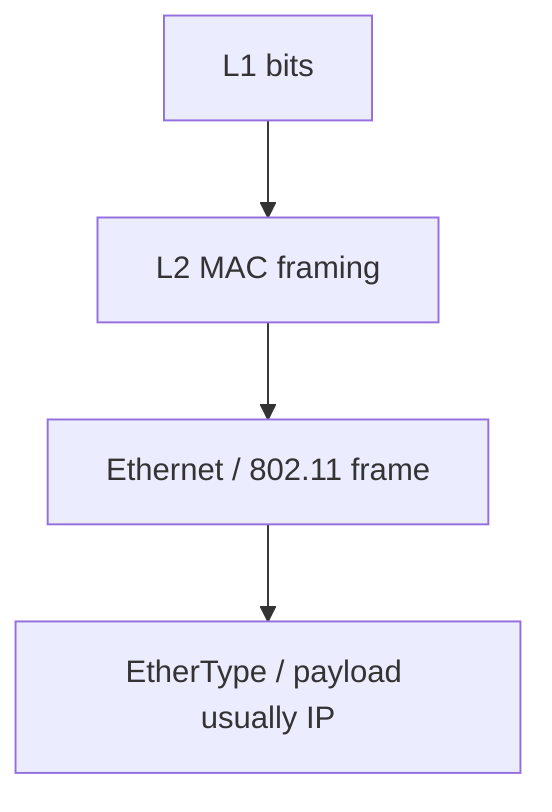
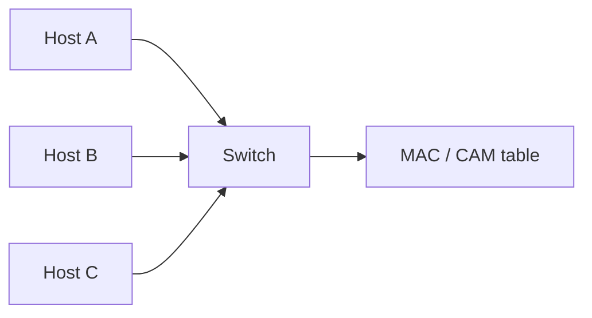
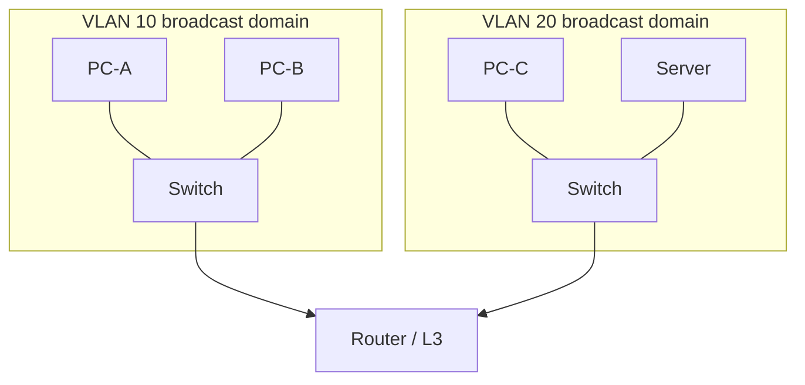
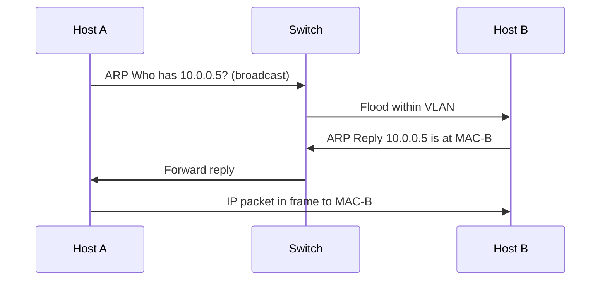
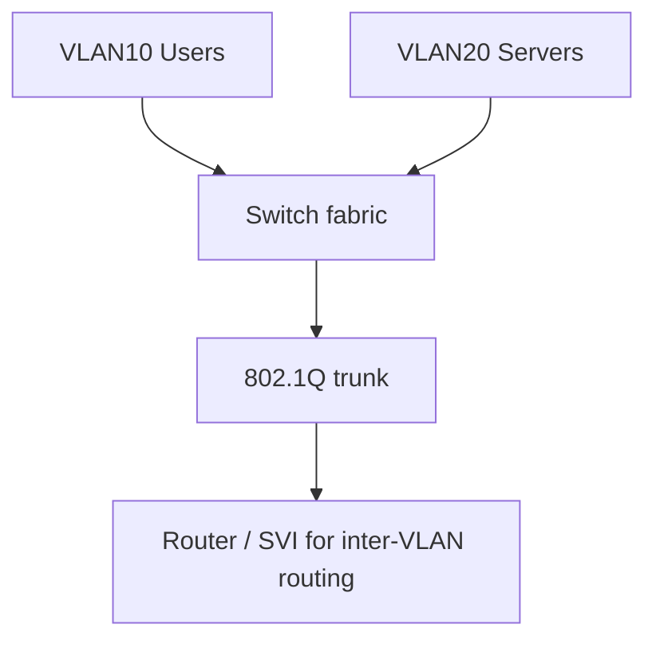
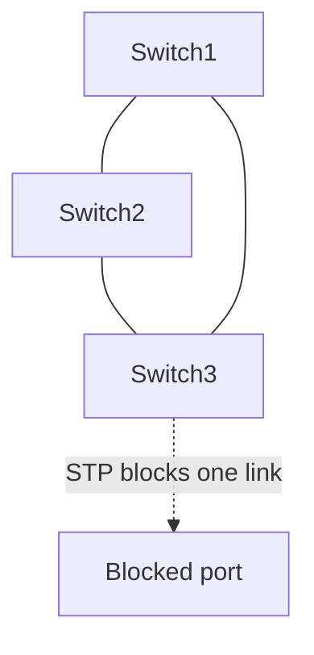
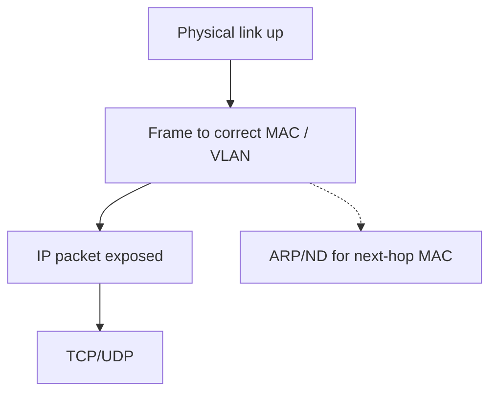

# Layer 2 — Data Link

The **Data Link layer** turns a stream of bits into **frames** that can be delivered to the correct **neighbor** on a local network. If Layer 1 is the road, Layer 2 is the system of street names and house numbers for *this block*. Devices on the same LAN use **MAC addresses** to say “this frame is for that network interface.” Switches learn those addresses and forward frames intelligently. Protocols such as [ARP](#protocols-reference/arp), [VLAN](#protocols-reference/vlan) tagging (802.1Q), and [STP](#protocols-reference/stp) exist because Ethernet neighborhoods need discovery, segmentation, and loop protection.

This chapter goes deep on framing, MAC addressing, hubs vs switches, CAM/MAC tables, ARP, broadcast domains, VLANs, STP’s purpose, and how Wi‑Fi relates at Layer 2. You will finish able to explain why a host can ping its gateway yet fail across VLANs, why ARP spoofing is dangerous, and why a bridging loop can melt a LAN in seconds.

> **Remember:** Layer 2 = **neighborhood delivery**. MAC is the house number on this block; [IP](#protocols-reference/ipv4) is city‑to‑city (Layer 3).

---

## Why Data Link Exists

Physical can move bits, but bits alone do not say where a message stops and starts, who it is for on the wire, or whether it arrived intact. Data Link adds:

1. **Framing** — mark frame boundaries
2. **Local addressing** — MAC source and destination
3. **Error detection** — FCS/CRC (detect, usually drop)
4. **Media access control** — who may transmit when (critical on shared media / Wi‑Fi)
5. **Optional virtualization & stability** — VLANs, STP

Without L2, you would have a glowing cable with no local delivery rules.



---

## Framing and the Ethernet Frame {#framing}

[Ethernet](#protocols-reference/ethernet) is the dominant wired LAN technology. A simplified Ethernet II frame:

| Field | Role |
|-------|------|
| Dest MAC | Who should accept the frame on this LAN |
| Source MAC | Who sent it |
| EtherType | What payload follows (IPv4, IPv6, ARP, …) |
| Payload | Often an IP packet |
| FCS | CRC for error detection |

Common EtherTypes:

| EtherType | Payload |
|-----------|---------|
| 0x0800 | [IPv4](#protocols-reference/ipv4) |
| 0x86DD | [IPv6](#protocols-reference/ipv6) |
| 0x0806 | [ARP](#protocols-reference/arp) |
| 0x8100 | [VLAN](#protocols-reference/vlan) (802.1Q) tag |


Minimum and maximum frame sizes matter for interoperability (historic minimum padding; MTU typically 1500 byte payload on standard Ethernet). Jumbo frames exist in some fabrics but must match end-to-end on a path.

> **Remember:** Ethernet delivers **frames to MACs**. It does not, by itself, route across the Internet.

---

## MAC Addresses {#mac}

A **MAC address** is a 48-bit identifier burned into (or assigned to) a network interface, usually written like `aa:bb:cc:dd:ee:ff`.

| Kind | Meaning |
|------|---------|
| Unicast | One specific interface |
| Broadcast | `ff:ff:ff:ff:ff:ff` — everyone on the LAN segment |
| Multicast | One-to-many interested receivers |

Historically, the first half related to an OUI (vendor). Locally administered addresses and virtualization (VMs, containers, bonds) mean MACs are not mystical truths — they are **local delivery labels**.

Hosts accept frames for their unicast MAC, plus relevant broadcast/multicast. Switches use MACs to decide egress ports.

---

## Hubs vs Switches {#hubs-vs-switches}

### Hubs (legacy)

A hub is mostly a Physical-layer multiport repeater: bits in one port blast out all others. Everyone shares one collision domain. Hubs are rare today but teaching them clarifies why switches won.

### Switches

A switch is a Layer 2 device that:

1. Receives a frame
2. Learns the **source MAC** → ingress port mapping
3. Forwards based on **destination MAC**
   - known unicast → specific port(s)
   - unknown unicast / broadcast / multicast (depending on config) → flood within VLAN



**Collision domains:** each switched full-duplex port is typically its own collision domain (practically: collisions cease to be the main story).  
**Broadcast domains:** by default, a VLAN is one broadcast domain — broadcasts go everywhere in that VLAN.

> **Remember:** Switches **narrow unicast**; they still **flood broadcasts** inside a VLAN.

---

## The CAM / MAC Address Table {#cam}

The switch’s learning table (often called **MAC table** or **CAM table**) stores:

`VLAN + MAC → port + age timer`

### Learning and aging

- When a frame arrives, the switch records source MAC on that port.
- Entries age out if quiet (timer depends on vendor/config).
- If a MAC moves ports, the table updates (MAC move). Rapid flapping can signal loops or bad cabling.

### Forwarding outcomes

| Destination MAC | Action |
|-----------------|--------|
| Known unicast | Forward out learned port |
| Unknown unicast | Flood VLAN |
| Broadcast | Flood VLAN |
| Multicast | Flood or constrained by IGMP snooping etc. |

### Failure symptoms

- **MAC flapping** logs: loop or duplicate MAC
- **Wrong port learning:** miswired patching
- **Overflow / security:** CAM flooding attacks historically forced flooding (port security / modern controls help)

---

## Broadcast Domains and Flooding {#broadcast-domains}

A **broadcast domain** is the set of interfaces that receive each other’s broadcast frames. On Ethernet, that is usually **one VLAN**.

Why it matters:

- [ARP](#protocols-reference/arp) requests are broadcasts
- Too many hosts in one VLAN → chatty broadcast/multicast load
- Security: broadcasts are visible to everyone in the domain

Routers (L3) **do not forward** Ethernet broadcasts between interfaces. That is how VLANs + routers segment networks.



---

## ARP Deep Dive {#arp-deep}

Hosts speak [IP](#protocols-reference/ipv4), but Ethernet needs MACs. **Address Resolution Protocol ([ARP](#protocols-reference/arp))** answers: *Who has IP X? Tell me your MAC.*

### The happy path

1. Host A wants to send to IP B on the **same subnet**.
2. A checks its ARP cache.
3. On miss, A broadcasts an ARP request.
4. B unicasts an ARP reply with its MAC.
5. A caches the mapping and builds an Ethernet frame to B’s MAC.



### ARP and the default gateway

If the destination IP is **off-subnet**, A does not ARP for the remote IP. A ARPs for the **gateway’s IP**, then sends the packet to the gateway’s MAC. The gateway routes at L3 and re-encapsulates on the next LAN.

### Gratuitous ARP

A host may announce its own IP/MAC mapping (for example after failover). Useful for updates; also abusable.

### Failure symptoms

- Incomplete ARP (`ip neigh` shows FAILED/INCOMPLETE)
- Wrong VLAN → ARP never answered
- Firewall/client isolation blocking
- Duplicate IP → flapping ARP ownership
- Spoofed ARP → MitM ([Network Security](#network-security))

> **Remember:** **ARP maps IP → MAC on the local link.** No ARP answer often means “not on my L2 segment,” not “Internet is down.”

### IPv6 note

IPv6 uses **Neighbor Discovery** (ICMPv6) instead of ARP. Same job, different protocol.

---

## VLANs and 802.1Q {#vlans}

A **VLAN** (Virtual LAN) splits one physical switching fabric into multiple logical broadcast domains. Ports are assigned access VLANs; links between switches often carry **tagged** frames.

[802.1Q](#protocols-reference/vlan) inserts a tag (EtherType 0x8100) including the VLAN ID (0–4095, usable IDs depend on platform).

| Port mode (typical language) | Behavior |
|------------------------------|----------|
| Access | One untagged VLAN for an end host |
| Trunk | Multiple VLANs tagged between switches/routers |
| Native VLAN | Untagged VLAN on a trunk (handle with care) |



### Why VLANs exist

- Security segmentation (users vs printers vs servers)
- Smaller broadcast domains
- Policy boundaries before L3 firewalls
- Multi-tenant campus designs

### Inter-VLAN communication

Hosts in different VLANs need a **router** (or multilayer switch SVI/L3 interface). Same switch fabric ≠ same L3 network.

### Failure symptoms

- Host “online” but cannot ARP the gateway (wrong access VLAN)
- Trunk missing allowed VLAN list
- VLAN mismatch on etherchannels
- Native VLAN mismatches causing leaks/confusion

---

## STP: Why Loops Are Deadly {#stp}

Ethernet learning assumes a **loop-free** active topology. If switches are redundantly cabled without loop control, broadcasts circulate forever → **broadcast storm**, CAM thrashing, network meltdown.

**Spanning Tree Protocol ([STP](#protocols-reference/stp)** and family: RSTP, MSTP) builds a logical tree by blocking some ports. Redundant links stay ready as backups.



### What you should remember (not every timer)

- STP prevents L2 loops by blocking ports
- Topology changes can cause temporary flushing/relearning
- Miswiring + disabled STP = outage
- Modern networks may use alternative fabrics, but the *problem STP solves* remains: **loop freedom at L2**

Related reading: [STP](#protocols-reference/stp) in Protocols Reference.

---

## Wi‑Fi as a Layer 2 Relative {#wifi-l2}

Wi‑Fi (IEEE 802.11) has a Physical radio and a MAC layer that performs local delivery jobs analogous to Ethernet: addressing, framing, checksums, and coordination of shared media access.

Differences that matter:

- Association/authentication to an AP before data flows
- Shared half-duplex-ish radio contention (airtime)
- Often translated to Ethernet on the wired side by the AP/controller

From an IP/ARP perspective, a wireless client still needs L2 adjacency to its gateway’s MAC (often via the AP’s bridging). Deep RF detail: [Wireless Networking](#wireless-networking).

---

## Switches vs Routers (Boundary Clarity)

| Question | Switch (L2) | Router (L3) |
|----------|-------------|-------------|
| Primary address | MAC | IP |
| Forwards broadcasts? | Yes within VLAN | No between interfaces |
| Breaks broadcast domains? | Only via VLANs | Yes by nature |
| Needs ARP? | Uses MACs directly | Uses ARP/ND on each LAN interface |

Many devices are multilayer. Mentally separate the **function** you are using.

---

## Data Link Failure Symptoms Cheat Sheet

| Symptom | Likely L2 angle |
|---------|-----------------|
| Cannot reach same-subnet host | VLAN, MAC filtering, ARP, Wi‑Fi isolation |
| Works on Wi‑Fi, fails on dock Ethernet | Port VLAN / cable / port security |
| Intermittent mass outage with storms | Loop / STP issue |
| One IP stolen by two MACs | Duplicate IP / spoofing |
| Trunk up but some subnets dead | Allowed VLAN list |

---

## pktana Practical Tips

ARP and Ethernet headers appear on nearly every LAN capture.

```bash
# Capture and focus on ARP chatter
pktana capture -i eth0 -w arp-study.pcap
pktana web --port 8080

# On Linux, inspect neighbor table
ip neigh show

# See MAC of your interface
ip link show
```

In the analyzer, open an ARP request and note:

- Ethernet dst `ff:ff:ff:ff:ff:ff`
- ARP opcode request vs reply
- Target IP you care about

Then open a normal IP frame and confirm Ethernet dest MAC equals the gateway (off-subnet) or the peer (on-subnet).

---

## Security Touchpoints at L2

- **ARP spoofing / poisoning** → MitM on the LAN
- **MAC flooding** (classic) → force flooding
- **VLAN hopping** (misconfig) → cross-tenant risk
- **Rogue DHCP** on the broadcast domain

Controls include dynamic ARP inspection, port security, DHCP snooping, 802.1X — see [Network Security](#network-security).

> **Remember:** L2 trust is often “anyone plugged into my VLAN.” Design VLANs like security zones, not mere convenience labels.

---

## How L2 Connects Up and Down



Down: needs healthy [Physical](#physical-layer).  
Up: delivers payloads to [Network](#network-layer).  
Sideways: ARP glues L3 addresses to L2 delivery.

---

## What You Should Feel Confident Saying

- what an Ethernet frame contains and why FCS exists,
- how switches learn and forward,
- what a broadcast domain is,
- how ARP works step-by-step including the gateway case,
- why VLANs segment LANs and need routing between them,
- why STP exists,
- how Wi‑Fi still presents an L2 adjacency problem to IP.

---

## Hands-On Tasks

```task
TITLE: Trace on-subnet vs off-subnet MACs
LEVEL: beginner
STEPS:
1. Capture a ping to a same-subnet host and to an Internet IP
2. Compare Ethernet destination MACs
3. Explain why the off-subnet frame targets the gateway MAC
GOAL: Cement ARP’s role for local delivery vs routing
```

```task
TITLE: ARP cache experiment
LEVEL: beginner
STEPS:
1. Clear or note ip neigh entries for a lab peer
2. Generate traffic and watch ARP request/reply in pktana
3. Confirm the neigh table populates
GOAL: See discovery, not just static theory
```

```task
TITLE: VLAN mismatch mental sim
LEVEL: intermediate
STEPS:
1. Draw two PCs on different access VLANs on one switch
2. Predict ARP to each other (should fail without router)
3. Add a router and sketch the new ARP targets
GOAL: Internalize broadcast domain boundaries
```

```task
TITLE: Spot a broadcast in a capture
LEVEL: beginner
STEPS:
1. Find any frame to ff:ff:ff:ff:ff:ff
2. Identify whether it is ARP, DHCP discovery, or other
3. Note how often broadcasts appear on your LAN
GOAL: Connect broadcast domains to real traffic volume
```

---

## Knowledge Check

```quiz
QUESTION: A switch forwards ordinary unicast frames primarily using:
OPTIONS:
ASN numbers
Destination MAC addresses
HTTP cookies
TLS certificate CNs
ANSWER: 1
EXPLAIN: L2 switches learn and forward by MAC.
```

```quiz
QUESTION: ARP’s job on IPv4 LANs is to:
OPTIONS:
Encrypt HTTP
Map IP addresses to MAC addresses
Assign public ASNs
Compress TCP windows
ANSWER: 1
EXPLAIN: ARP resolves IP to MAC on the local link.
```

```quiz
QUESTION: Hosts in different VLANs typically need what to talk via IP?
OPTIONS:
Only a longer copper cable
A router / L3 gateway between VLANs
Identical MAC addresses
Disabled FCS checks
ANSWER: 1
EXPLAIN: VLANs separate broadcast domains; routing interconnects them.
```

```quiz
QUESTION: STP’s main purpose is to:
OPTIONS:
Replace IP with AppleTalk
Prevent Layer 2 loops while allowing redundant cabling
Terminate TLS sessions
Assign DNS names
ANSWER: 1
EXPLAIN: Spanning Tree blocks ports to keep a loop-free active topology.
```

```quiz
QUESTION: Sending to an off-subnet IP, a host ARPs for:
OPTIONS:
The remote server’s IP always
The default gateway’s IP (on-link next hop)
A random multicast MAC only
The ASN of the destination
ANSWER: 1
EXPLAIN: Remote IPs are reached via the gateway’s MAC on the local LAN.
```

```quiz
QUESTION: Ethernet broadcast domain on a modern campus is usually equal to:
OPTIONS:
The entire Internet
One VLAN
One TCP port
One BGP community
ANSWER: 1
EXPLAIN: Broadcasts stay within a VLAN unless weird misconfig exists.
```

```quiz
QUESTION: Unknown unicast destination MAC on a switch causes:
OPTIONS:
Silent discard always
Flooding within the VLAN (typical default)
Automatic conversion to OSPF
HTTP 404
ANSWER: 1
EXPLAIN: Switches flood frames when they lack a MAC table entry.
```

```quiz
QUESTION: Wi-Fi 802.11 relative to Ethernet is best described as:
OPTIONS:
Only a Layer 7 protocol
A different L1/L2 technology with similar local-delivery goals
A replacement for IP
Identical to BGP
ANSWER: 1
EXPLAIN: Wi-Fi provides local framing/delivery over radio instead of Ethernet copper/fiber.
```

---

## Next

Leave the neighborhood and cross the city: [Layer 3 — Network](#network-layer) — IP addressing, subnetting, routing, ICMP, NAT, and IPv6.
