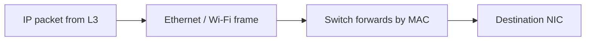
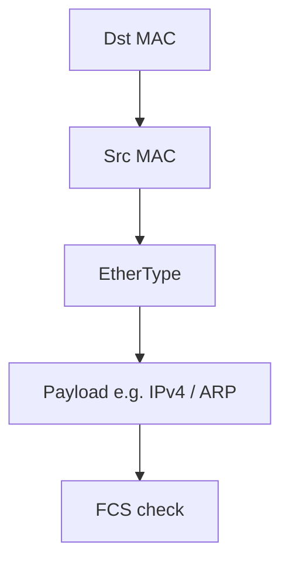
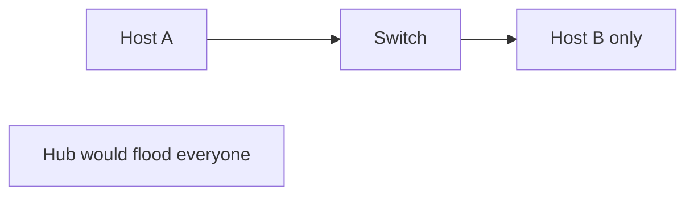
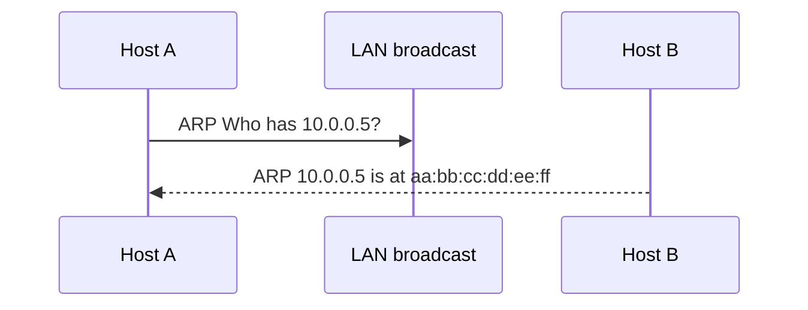
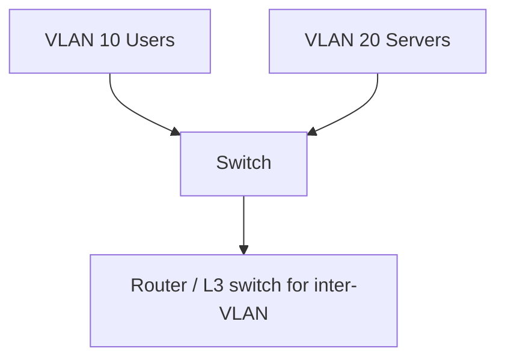

# Layer 2 — Data Link

Layer 2 delivers data **on the same local network** using **frames** and **MAC addresses**. Think: “get this to the right NIC on this street.”

> **Remember:** Layer 2 = **neighborhood delivery**. [MAC](#protocols-reference/ethernet) is the house number on this block; [IP](#protocols-reference/ipv4) is for city‑to‑city (Layer 3).

---

## Big Idea Flow



---

## Jobs at Layer 2

1. Framing (start/end, addresses, type)
2. Local addressing (**MAC**)
3. Error detection (FCS / CRC)
4. Multiplexing upper protocols (EtherType → IPv4/IPv6/ARP…)
5. Optional: VLANs, loop prevention ([STP](#protocols-reference/stp))

Deep dives: [Ethernet](#protocols-reference/ethernet) · [ARP](#protocols-reference/arp) · [VLAN](#protocols-reference/vlan) · [STP](#protocols-reference/stp)

---

## Ethernet Frame (mental model)



| Field | Meaning |
|-------|---------|
| Dst MAC | Who on this LAN |
| Src MAC | Who sent it |
| EtherType | What’s inside (`0x0800` IPv4, `0x86DD` IPv6, `0x0806` ARP) |
| FCS | Did bits get corrupted? |

---

## Switch vs Hub (why it matters)



- **Hub** (legacy): repeats bits to all — noisy, insecure
- **Switch**: learns MAC→port table; forwards smarter

---

## ARP — “Who has this IP?” {#arp-on-lan}

Hosts know an IP, but Ethernet needs a MAC. [ARP](#protocols-reference/arp) asks the LAN.



> **Remember:** **ARP maps IP → MAC on the local link.** Spoofed ARP can enable MitM — see [Network Security](#network-security).

---

## VLANs (one switch, many logical LANs)

[VLAN](#protocols-reference/vlan) tags separate traffic like colored lanes.



---

## Knowledge Check

```quiz
QUESTION: Layer 2 addresses are typically:
OPTIONS:
Port numbers
MAC addresses
AS numbers
URL paths
ANSWER: 1
EXPLAIN: Data Link uses MAC addresses for local delivery.
```

```quiz
QUESTION: ARP is used to:
OPTIONS:
Encrypt HTTPS
Resolve IP to MAC on the local network
Assign public DNS names
Compress TCP windows
ANSWER: 1
EXPLAIN: ARP answers “who has this IP?” with a MAC address.
```

```quiz
QUESTION: A VLAN primarily:
OPTIONS:
Replaces the need for IP addresses
Separates Layer 2 broadcast domains
Stops all routing forever
Is only a Layer 1 cable color
ANSWER: 1
EXPLAIN: VLANs split one physical LAN into multiple logical L2 networks.
```

---

## Next

Leave the neighborhood and cross networks: [Layer 3 — Network](#network-layer).
