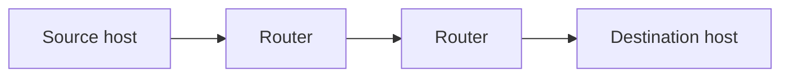
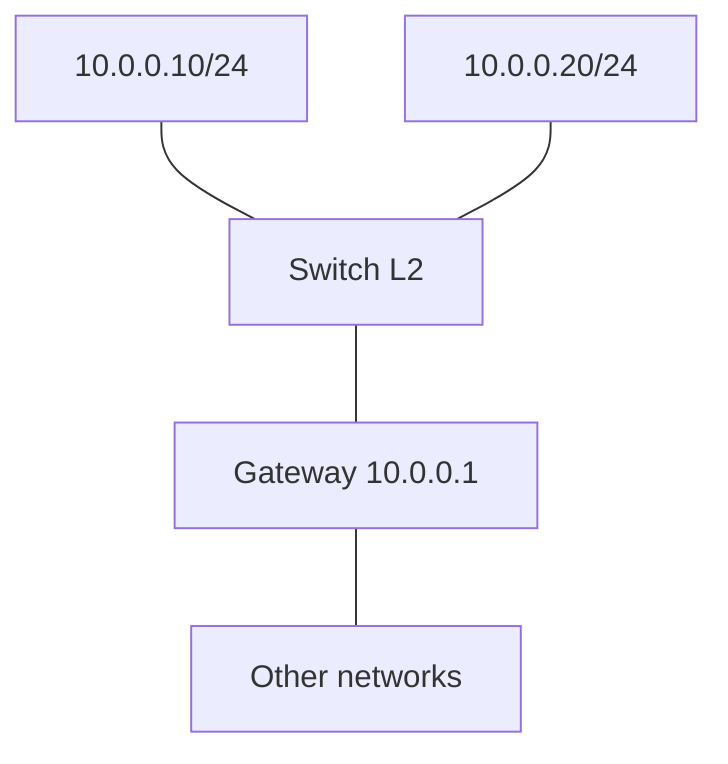
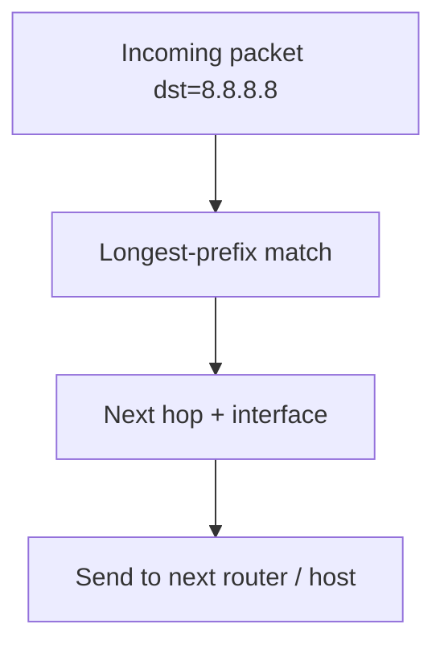
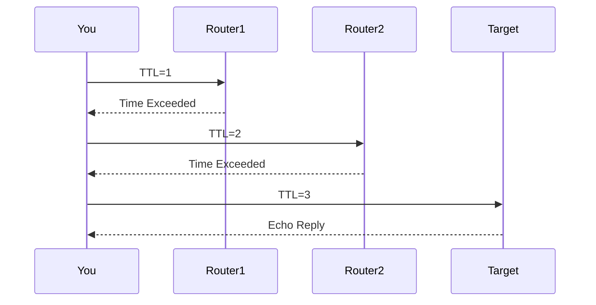

# Layer 3 — Network

Layer 3 moves **packets** from any source host to any destination host — across LANs, WANs, and the Internet — using **IP addresses** and **routing**.

> **Remember:** Layer 3 = **GPS for packets**. [IPv4](#protocols-reference/ipv4)/[IPv6](#protocols-reference/ipv6) name the destination; routers choose the next hop.

---

## Big Idea Flow



Each hop: look at **dst IP** → choose outbound interface / next hop → decrease TTL/Hop Limit.

---

## Jobs at Layer 3

1. Logical addressing (IP)
2. Path selection (routing)
3. Forwarding packets
4. Fragmentation / MTU issues (sometimes)
5. Control/error messaging ([ICMP](#protocols-reference/icmp))

Deep dives: [IPv4](#protocols-reference/ipv4) · [IPv6](#protocols-reference/ipv6) · [ICMP](#protocols-reference/icmp) · [OSPF](#protocols-reference/ospf) · [BGP](#protocols-reference/bgp) · [IPsec](#protocols-reference/ipsec)

---

## IPv4 Address + Subnet (simple)

An IPv4 address is 32 bits, written like `192.168.1.10`.  
A **subnet mask** (or `/24`) says which part is the **network** vs **host**.

| Example | Meaning |
|---------|---------|
| `10.0.0.0/24` | Network has addresses `10.0.0.0–10.0.0.255` |
| Host `10.0.0.15` | Same LAN as `10.0.0.1` if mask `/24` |
| Different /24 | Need a **router** to talk |



---

## What a Router Table Does



Routes come from:
- Connected interfaces
- Static routes
- Dynamic protocols ([OSPF](#protocols-reference/ospf) inside orgs, [BGP](#protocols-reference/bgp) on the Internet)

---

## ICMP — network’s “status SMS”

[Ping](#protocols-reference/icmp) uses Echo Request/Reply. Traceroute uses Time Exceeded messages.



---

## NAT (why home networks share one public IP)

Home routers often translate many private IPs → one public IP.

Related ideas later: firewalls and security in [Network Security](#network-security).

---

## Knowledge Check

```quiz
QUESTION: Layer 3’s main address type is:
OPTIONS:
MAC
IP
Port
SSID
ANSWER: 1
EXPLAIN: Network layer uses IP addresses for end-host location across networks.
```

```quiz
QUESTION: Two hosts in different IP subnets usually need a:
OPTIONS:
Only a Layer 2 hub
Router (or L3 gateway)
DNS TXT record
Longer Ethernet cable only
ANSWER: 1
EXPLAIN: Inter-subnet traffic is routed at Layer 3.
```

```quiz
QUESTION: Ping is primarily associated with:
OPTIONS:
ARP
ICMP
STP
TLS
ANSWER: 1
EXPLAIN: Ping uses ICMP Echo Request/Reply.
```

---

## Next

Reach the right application reliably (or fast): [Layer 4 — Transport](#transport-layer).
