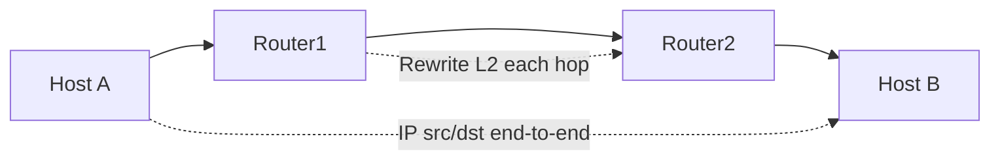
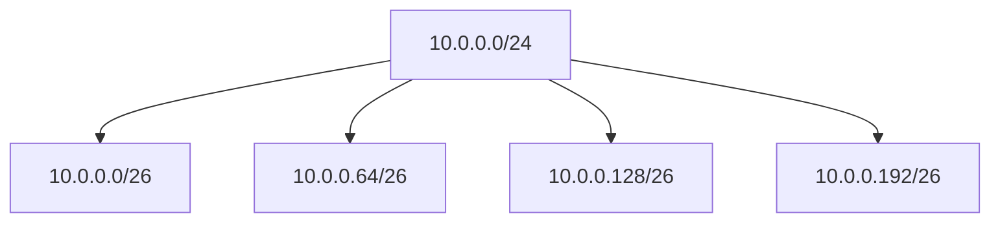
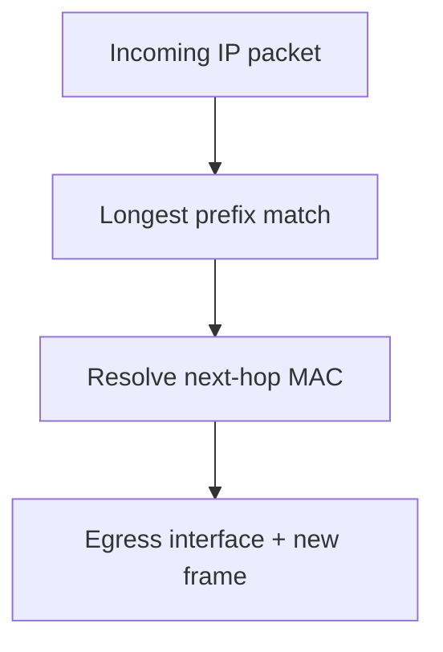
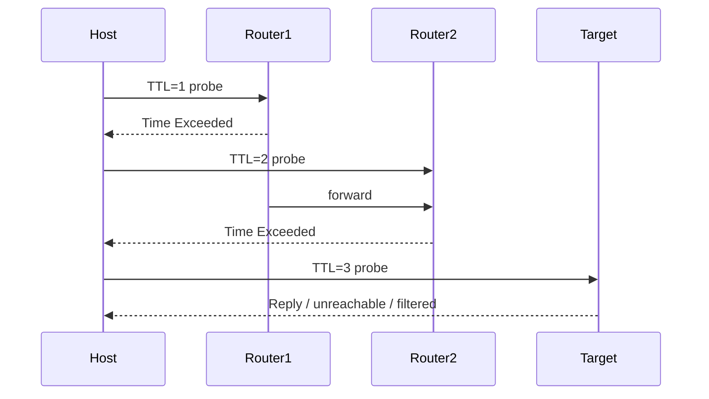
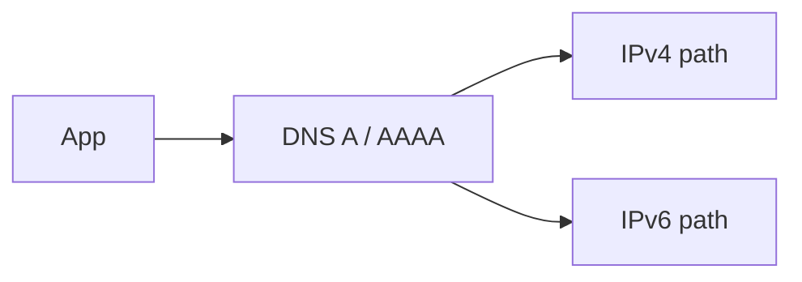
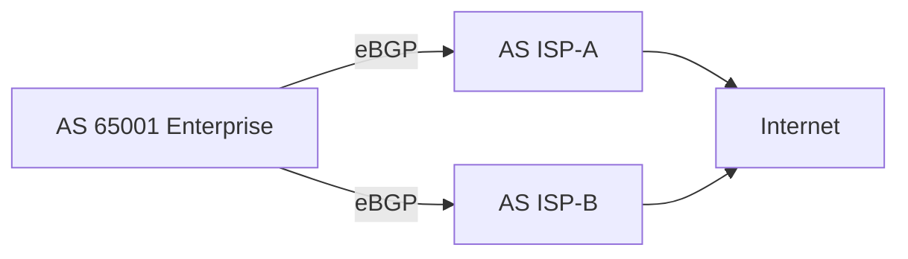
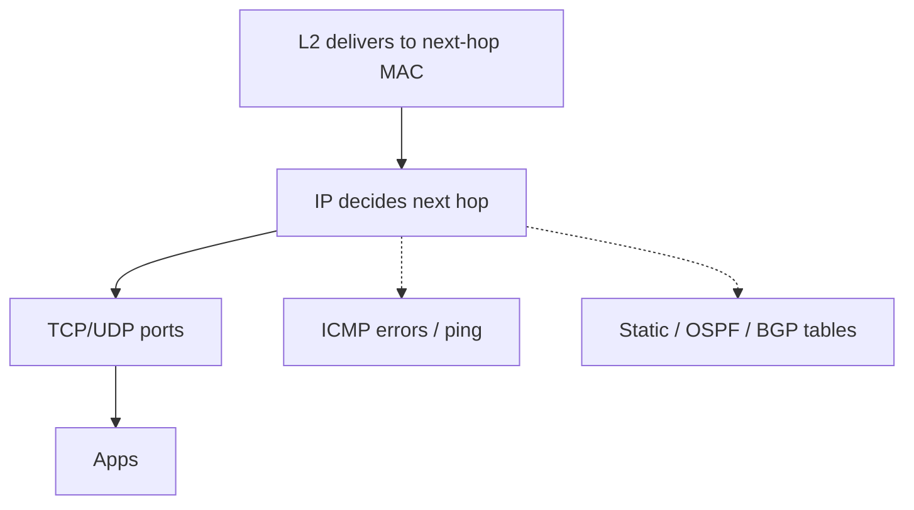

# Layer 3 — Network

The **Network layer** is how packets find a path **across networks**. Layer 2 can deliver a frame to the next hop on a LAN; Layer 3 decides *which* hop that should be when the destination is not local. The hero protocols are [IPv4](#protocols-reference/ipv4) and [IPv6](#protocols-reference/ipv6). Around them sit [ICMP](#protocols-reference/icmp) for errors and diagnostics, routing protocols such as [OSPF](#protocols-reference/ospf) and [BGP](#protocols-reference/bgp) for sharing reachability, and everyday operational realities like subnetting, default gateways, and NAT.

This chapter teaches addressing carefully, with worked subnetting examples, then builds routing intuition (longest prefix match, next hops), ICMP tools (ping and traceroute), NAT overview, an IPv6 introduction, and readable but detailed roles for OSPF and BGP. Read slowly through subnetting — it is the skill that makes everything else in IP networking click.

> **Remember:** Layer 3 = **GPS for packets**. IP names the destination; routers choose the next hop.

---

## Why the Network Layer Exists

LANs do not scale to the planet as one giant Ethernet. Broadcast domains would explode; MAC tables would drown; policies would be impossible. The Network layer provides:

1. **Global (or organization-wide) logical addressing**
2. **Hierarchical aggregation** (prefixes / subnets)
3. **Hop-by-hop forwarding** across diverse link types
4. **Decoupling** from specific L2 technologies (Ethernet, Wi‑Fi, PPP, cellular…)
5. **Control and error messaging** ([ICMP](#protocols-reference/icmp))

Deep dives: [IPv4](#protocols-reference/ipv4) · [IPv6](#protocols-reference/ipv6) · [ICMP](#protocols-reference/icmp) · [OSPF](#protocols-reference/ospf) · [BGP](#protocols-reference/bgp) · [IPsec](#protocols-reference/ipsec)



> **Remember:** IP addresses stay end-to-end (NAT aside). MAC addresses change every hop.

---

## IPv4 Addressing Basics {#ipv4-addressing}

An **IPv4 address** is 32 bits, usually written in dotted decimal: `192.168.10.45`.

Each address has two conceptual parts when combined with a **mask** or **prefix length**:

- **Network portion** — which subnet
- **Host portion** — which device on that subnet

Examples of the same idea:

- `192.168.10.45` with mask `255.255.255.0` → prefix `192.168.10.0/24`
- `10.0.0.5` with `/8` → network `10.0.0.0/8` (classic classful memory aid, but modern networks use classless CIDR)

### Special addresses you must recognize

| Address / range | Meaning |
|-----------------|---------|
| `0.0.0.0/0` | Default route (all destinations) |
| `127.0.0.0/8` | Loopback (this host) |
| `169.254.0.0/16` | Link-local APIPA (often “DHCP failed”) |
| `10.0.0.0/8`, `172.16.0.0/12`, `192.168.0.0/16` | Private RFC1918 space |
| `255.255.255.255` | Limited broadcast |

Private addresses need [NAT](#nat) or proxying to reach the public Internet.

---

## Subnet Masks and CIDR {#subnetting}

A **subnet mask** marks which bits are network vs host. **CIDR** notation `/N` means “first N bits are the prefix.”

| Prefix | Mask | Host bits | Approx usable hosts (simple Ethernet LAN) |
|--------|------|-----------|---------------------------------------------|
| /24 | 255.255.255.0 | 8 | 254 |
| /25 | 255.255.255.128 | 7 | 126 |
| /26 | 255.255.255.192 | 6 | 62 |
| /30 | 255.255.255.252 | 2 | 2 (common on point-to-point) |
| /32 | 255.255.255.255 | 0 | Single host route |

Usable host count ≈ `2^(host_bits) - 2` on classic networks that reserve network and broadcast addresses. (Point-to-point and some modern practices differ; learn the classic rule first.)

### Worked example 1: Is host A local to host B?

- A: `192.168.1.10/24`
- B: `192.168.1.200/24`
- Gateway: `192.168.1.1`

Same `/24` prefix `192.168.1.0/24` → A and B are **on-link**. A sends via [ARP](#protocols-reference/arp) directly for B’s MAC.

### Worked example 2: Off-subnet

- A: `192.168.1.10/24`
- B: `192.168.2.10/24`

Different subnets → A sends to its **default gateway** MAC, IP destination still B.

### Worked example 3: Split a /24 into /26s

Start: `10.0.0.0/24` (256 addresses).

`/26` needs 64-address blocks:

| Subnet | Range | Usable (classic) |
|--------|-------|------------------|
| `10.0.0.0/26` | `.0`–`.63` | `.1`–`.62` |
| `10.0.0.64/26` | `.64`–`.127` | `.65`–`.126` |
| `10.0.0.128/26` | `.128`–`.191` | `.129`–`.190` |
| `10.0.0.192/26` | `.192`–`.255` | `.193`–`.254` |

### Worked example 4: Finding network and broadcast

Address `172.16.5.130/25`:

- Mask `255.255.255.128`
- `/25` blocks: `172.16.5.0/25` (`.0`–`.127`) and `172.16.5.128/25` (`.128`–`.255`)
- `130` falls in second block → network `172.16.5.128`, broadcast `172.16.5.255`, usable `.129`–`.254`

Practice until you can do this without panic. Subnetting is arithmetic plus calm.



> **Remember:** Same subnet → ARP peer. Different subnet → ARP gateway, route toward destination.

---

## Host Forwarding Logic (What Your PC Does)

For each packet, a host roughly asks:

1. Is destination IP me? → deliver locally to L4.
2. Is destination on-link (same subnet / connected route)? → resolve MAC via ARP/ND, send.
3. Else look up routing table for best match → send to that next hop’s MAC.
4. If no route → fail (unreachable).

The **default route** `0.0.0.0/0` is the “everything else” escape hatch toward a gateway.

```bash
ip addr show
ip route show
ip neigh show
ping -c 3 192.168.1.1
```

---

## Routing and Next Hops {#routing}

A **router** forwards packets between networks. For each packet it:

1. Checks destination IP
2. Finds the **best matching route** (longest prefix match)
3. Sends the packet out the chosen interface toward the **next hop**
4. Decrements TTL (IPv4) / Hop Limit (IPv6)
5. Re-encapsulates with new L2 headers for the egress LAN



### Longest prefix match example

Routes:

- `10.0.0.0/8` → next hop R1
- `10.1.0.0/16` → next hop R2
- `10.1.5.0/24` → next hop R3

Packet to `10.1.5.9` matches all three, but **/24 wins**. Specificity beats summary.

### Static vs dynamic routing

| Style | Pros | Cons |
|-------|------|------|
| Static | Simple, predictable | Does not adapt; operational burden at scale |
| Dynamic | Adapts to failures; scalable | More complex; needs design discipline |

---

## ICMP, Ping, and Traceroute {#icmp}

[ICMP](#protocols-reference/icmp) carries control and error messages for IP — Destination Unreachable, Time Exceeded, Echo Request/Reply, and more.

### Ping

Ping sends Echo Request; a healthy target replies Echo Reply. Success proves rough L3 reachability (unless filtered). Failure does **not** always mean the host is down — firewalls often drop ICMP.

### Traceroute

Traceroute maps hops by sending probes with increasing TTL. When TTL hits zero, routers send Time Exceeded. The source learns each hop’s address.



> **Remember:** Ping/traceroute are **tools**, not proofs of application health. TCP/443 can work while ICMP is blocked — or the reverse.

---

## NAT Overview {#nat}

**Network Address Translation** rewrites IP addresses (and often ports) as packets cross a boundary — commonly private LAN → public Internet.

| NAT flavor | Idea |
|------------|------|
| SNAT / PAT / masquerade | Many private clients share public IPs; track by ports |
| DNAT / port forward | Map inbound public ip:port to internal server |
| 1:1 NAT | Static mapping between public and private |

### Why NAT exists

- IPv4 scarcity
- Hide internal addressing
- Simple home gateway model

### Pain NAT introduces

- Breaks end-to-end address transparency
- Complicates inbound services and some protocols
- Makes logs harder (many users behind one IP)
- Troubleshooting needs to think about **pre-NAT and post-NAT** views

In captures inside the LAN you see private sources; on the WAN you see the public translated address.

---

## IPv6 Introduction {#ipv6}

[IPv6](#protocols-reference/ipv6) uses **128-bit** addresses, written in hex with compression (`2001:db8::1`). Goals include vast address space, simpler header, and Neighbor Discovery instead of ARP.

### Ideas to keep

- Addresses are plentiful; designs often use `/64` on LANs
- Multiple addresses per interface are normal (link-local `fe80::/10`, global, ULA)
- ICMP is even more central (ND, RA)
- Dual-stack hosts may prefer IPv6 when DNS returns AAAA records

You do not need to memorize every transition technology on day one. You *do* need to stop treating IPv6 as optional trivia — many networks run it quietly beside IPv4.



---

## Interior Routing: OSPF Role {#ospf}

[OSPF](#protocols-reference/ospf) (Open Shortest Path First) is a common **IGP** (Interior Gateway Protocol) inside an organization.

### What OSPF is for

- Routers share link-state information within an AS / administrative domain
- Each router builds a map and computes shortest paths (Dijkstra)
- Fast convergence relative to old distance-vector protocols when designed well
- Supports hierarchy with **areas** (area 0 backbone) to scale

### What OSPF is not for

- Internet-wide policy between independent organizations (that is BGP’s world)
- Replacing Ethernet switching inside a VLAN

### Operator mental model

Think of OSPF as the campus/data-center voice that says: *“Here are the subnets I can reach, and at what cost.”* When a link dies, SPF recalculates and traffic shifts.

Failure symptoms: missing adjacencies (timers, MTU, network type mismatch), area design mistakes, unexpected route filtering.

---

## Exterior Routing: BGP Role {#bgp}

[BGP](#protocols-reference/bgp) (Border Gateway Protocol) is the routing protocol of the **Internet**. Autonomous Systems (ASNs) exchange prefixes and apply **policy**.

### What BGP optimizes for

- Scale (hundreds of thousands of prefixes)
- Policy control (prefer this transit, avoid that peer, advertise only these nets)
- Stability over instant micro-optimality

### What “best path” means in BGP

BGP’s decision process is not “always shortest.” It considers local preference, AS path length, MED, and more. Two networks may choose different exits toward the same destination — **asymmetric routing** is normal on the Internet.



### Enterprise vs ISP use

- Enterprises may run eBGP to ISPs for multihoming
- iBGP distributes external routes inside an AS
- Default routing + statics may suffice for smaller sites

> **Remember:** **OSPF finds paths inside your kingdom. BGP negotiates paths between kingdoms.**

---

## TTL, MTU, and Fragmentation (Practical)

- **TTL/Hop Limit** prevents immortal packets; traceroute abuses this deliberately.
- **MTU** is the max IP packet size a link accepts; Ethernet LAN default often 1500.
- Fragmentation is painful; modern stacks prefer **PMTUD**. Black-hole paths appear when ICMP “needs fragmentation” messages are filtered.

If large transfers stall but small pings work, think MTU/PMTUD.

---

## Network Layer Failure Symptoms

| Symptom | Possible L3 cause |
|---------|-------------------|
| APIPA 169.254 address | DHCP failure → no valid IP |
| Ping gateway fails | Wrong mask/VLAN/gateway or L2 issue beneath |
| Ping gateway OK, remote fails | Missing default route / upstream routing |
| Traceroute dies at hop N | Filter or routing issue beyond N |
| One-way traffic | Asymmetry, ACL, NAT state |
| Works by IP, not by name | Not L3 — check [DNS](#protocols-reference/dns) |

Always confirm L1/L2 before deep routing rabbit holes ([OSI troubleshooting](#osi-model/troubleshooting)).

---

## pktana Practical Tips

```bash
# Capture while pinging and tracerouting
ping -c 5 8.8.8.8
traceroute -n 8.8.8.8   # or tracepath / tracert on other OS

pktana capture -i eth0 -w l3-tools.pcap
pktana web --port 8080
pktana connections -r l3-tools.pcap
```

In the capture, identify:

- ICMP Echo vs Time Exceeded
- IP TTL values changing
- Whether your source is private and where NAT would rewrite (if you also capture WAN)

Filter ideas in analyzers: `icmp`, `ip.addr == …`, `ipv6`.

---

## How L3 Connects to Other Layers



Downward dependency: ARP/ND and healthy links.  
Upward service: best-effort packet delivery to hosts for [Transport](#transport-layer).

---

## What You Should Feel Confident Saying

- how to read `/prefix` and decide on-link vs via-gateway,
- what longest prefix match means,
- what ping and traceroute actually prove,
- why NAT exists and what it breaks,
- the different jobs of OSPF vs BGP,
- why IPv6 matters even if your lab is still v4-first.

---

## Hands-On Tasks

```task
TITLE: Subnet worksheet
LEVEL: beginner
STEPS:
1. Take 192.168.10.0/24 and split into four /26s
2. Write network, broadcast, and usable ranges for each
3. Pick a host IP in the third subnet and identify its gateway candidate (.first usable)
GOAL: Make CIDR arithmetic automatic
```

```task
TITLE: On-link vs gateway capture
LEVEL: intermediate
STEPS:
1. Capture ARP+ICMP to a same-subnet host
2. Capture traffic to an off-subnet IP
3. Prove Ethernet dest MAC equals peer vs gateway
GOAL: Connect subnet math to real frames
```

```task
TITLE: Read your routing table
LEVEL: beginner
STEPS:
1. Run ip route show (or route print)
2. Identify default route and interface
3. Explain where a packet to 1.1.1.1 goes first
GOAL: See next-hop selection on a live host
```

```task
TITLE: Traceroute interpretation
LEVEL: intermediate
STEPS:
1. Run traceroute to a public IP
2. Note where timeouts appear
3. Write whether hop failure means destination down or ICMP filtered
GOAL: Avoid over-interpreting diagnostic tools
```

---

## Knowledge Check

```quiz
QUESTION: Two hosts 10.0.0.5/24 and 10.0.1.5/24 want to talk. They typically:
OPTIONS:
ARP for each other directly as on-link
Use a router/gateway between subnets
Share one MAC address
Disable IP and use only hubs
ANSWER: 1
EXPLAIN: Different /24 prefixes are different subnets; routing is required.
```

```quiz
QUESTION: Longest prefix match means:
OPTIONS:
Always use the default route first
Prefer the most specific matching route
Prefer the oldest static route only
Ignore /32 host routes
ANSWER: 1
EXPLAIN: More specific prefixes win over summaries.
```

```quiz
QUESTION: Ping uses which protocol family messages?
OPTIONS:
BGP UPDATEs only
ICMP Echo Request/Reply
STP BPDUs
TLS certificates
ANSWER: 1
EXPLAIN: Classic ping is ICMP echo.
```

```quiz
QUESTION: NAT’s common home-gateway role is to:
OPTIONS:
Replace Ethernet with Token Ring
Translate many private clients to public addressing
Encrypt DNS exclusively
Assign BGP ASNs to laptops
ANSWER: 1
EXPLAIN: PAT/masquerade shares public IPv4 among private hosts.
```

```quiz
QUESTION: OSPF is primarily used as:
OPTIONS:
An Internet inter-domain policy protocol
An interior routing protocol within an organization
A Layer 2 loop prevention protocol
An HTTP status code
ANSWER: 1
EXPLAIN: OSPF is a common IGP; BGP dominates inter-AS Internet routing.
```

```quiz
QUESTION: BGP’s big-picture job is to:
OPTIONS:
Compress JPEG images
Exchange reachability and policy between Autonomous Systems
Terminate copper pairs
Assign Wi-Fi channels
ANSWER: 1
EXPLAIN: BGP glues the Internet’s independently operated networks together.
```

```quiz
QUESTION: A host with 169.254.x.x address often indicates:
OPTIONS:
Perfect DHCP success
Link-local APIPA after DHCP failure
A valid public Google IP
Mandatory IPv6-only mode
ANSWER: 1
EXPLAIN: APIPA commonly appears when DHCP does not provide an address.
```

```quiz
QUESTION: IPv6 Neighbor Discovery replaces which IPv4 function most closely?
OPTIONS:
SMTP
ARP
FTP data ports
STP root election exclusively
ANSWER: 1
EXPLAIN: ND maps IP to link-layer addresses on the local link, ARP’s job.
```

---

## Next

Deliver data to the correct application: [Layer 4 — Transport](#transport-layer) — ports, sockets, TCP, and UDP.
