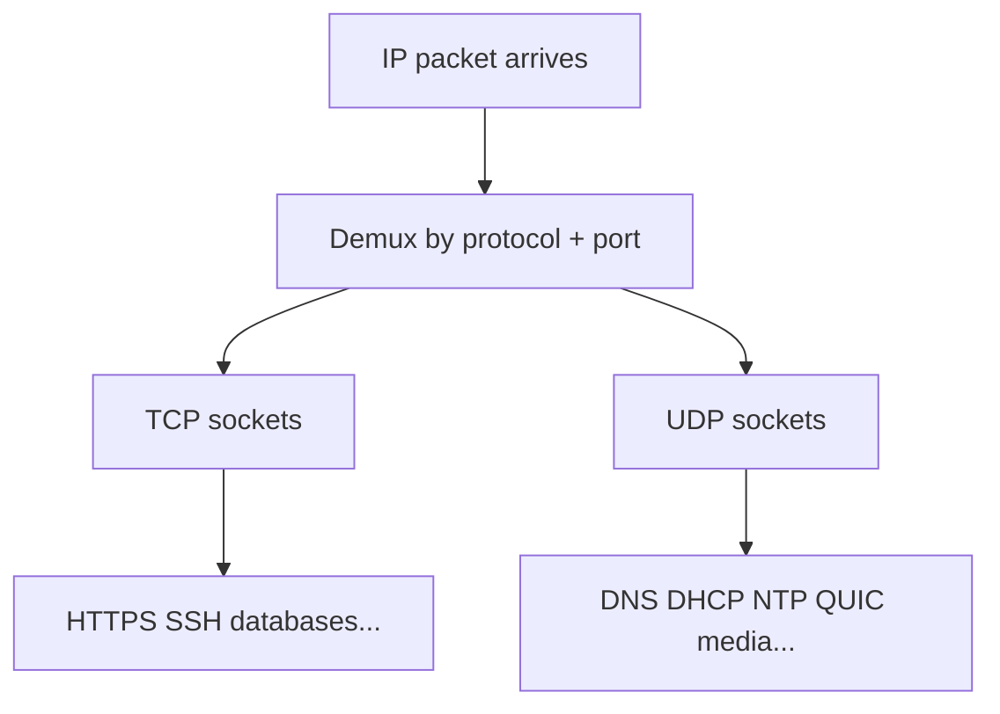
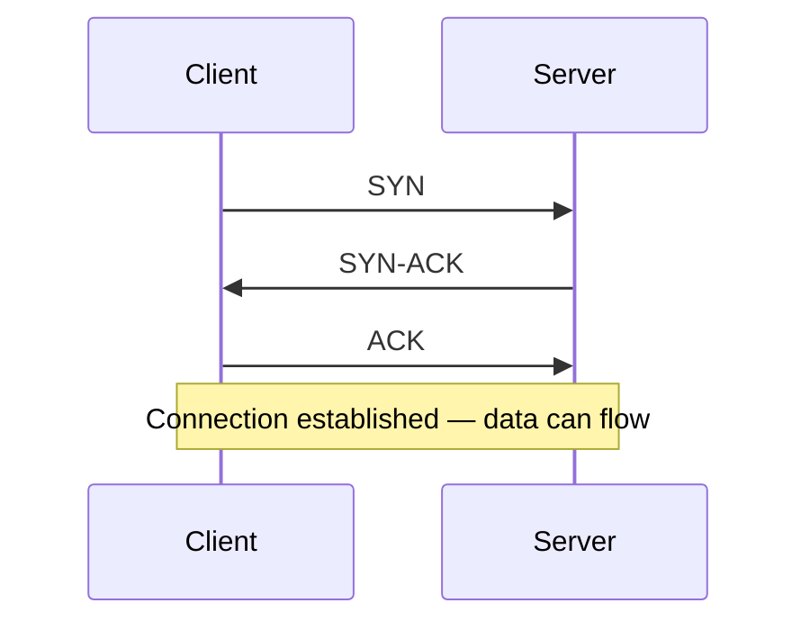
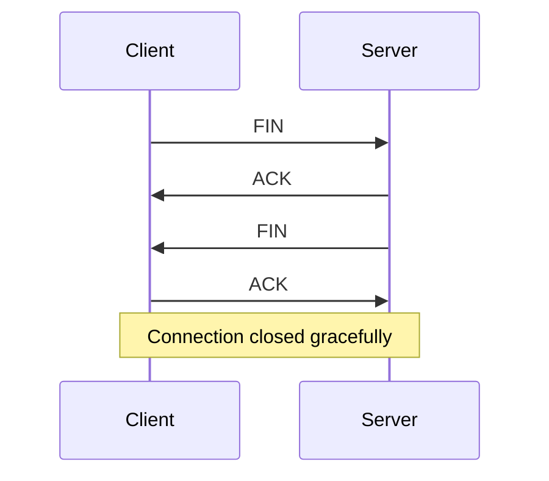
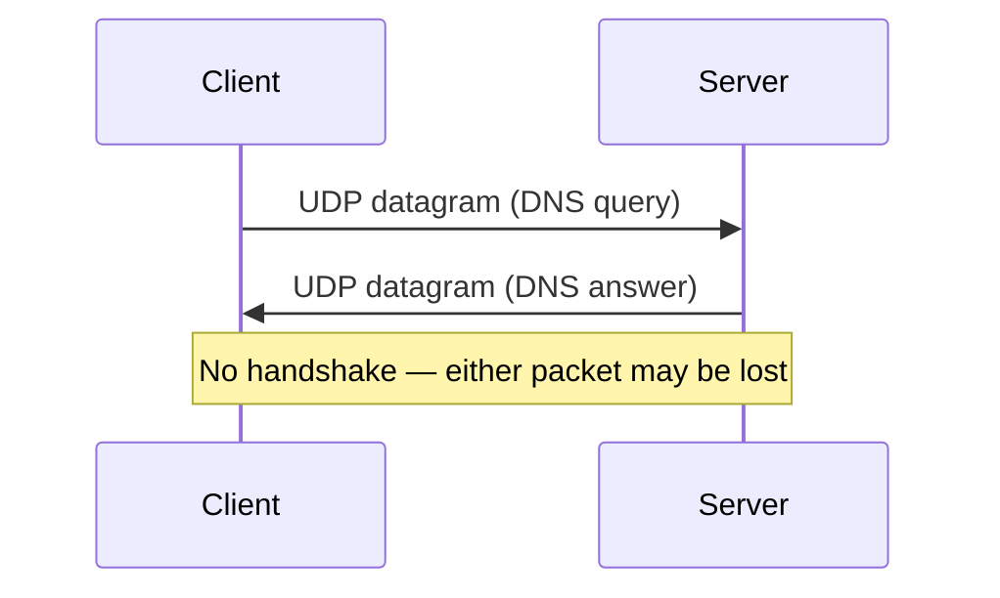
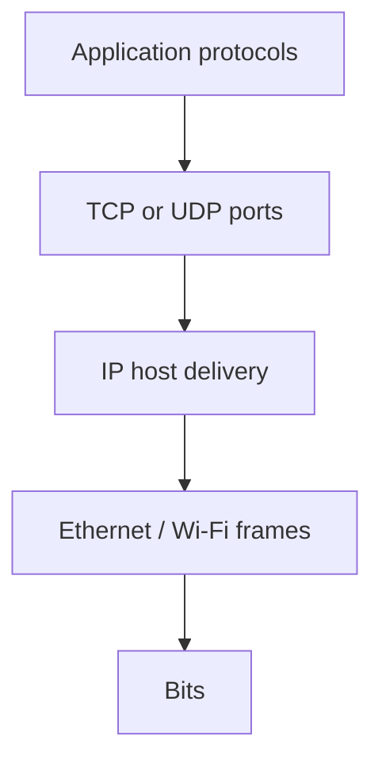

# Layer 4 — Transport

The **Transport layer** delivers data to the **correct application** on a host and chooses how carefully that delivery is managed. [IP](#protocols-reference/ipv4) gets a packet to a machine; Transport decides *which conversation* on that machine should receive the payload. The two classic Internet transport protocols are [TCP](#protocols-reference/tcp) and [UDP](#protocols-reference/udp). TCP behaves like a tracked courier service: connection setup, acknowledgments, retransmission, ordering, and congestion awareness. UDP behaves like a postcard: fast, minimal headers, no built-in delivery guarantee.

This chapter explains ports and sockets, walks TCP’s handshake and teardown, introduces flow control and congestion concepts in plain language, explores UDP use cases, compares TCP and UDP extensively, and catalogs common ports with links into the [Protocols Reference](#protocols-reference). By the end you should read a capture and know whether you are looking at a healthy handshake, a refused connection, a stall, or a fire-and-forget datagram flow.

> **Remember:** **IP finds the house. Port finds the room.** TCP = tracked courier. UDP = postcard.

---

## Why Transport Exists

Without ports, a host with one IP address could run only one network service at a time. With ports, thousands of conversations share one IP:

- Browser tabs to many [HTTPS](#protocols-reference/https) servers
- [SSH](#protocols-reference/ssh) sessions
- [DNS](#protocols-reference/dns) queries
- Background update checks

Transport also defines the **reliability contract** apps can assume. Some apps need every byte in order (file transfer, web). Others prefer timely delivery over perfect recovery (voice, games, some telemetry) and implement their own strategies atop UDP.



---

## Ports {#ports}

A **port** is a 16-bit number (0–65535) that identifies a transport endpoint on a host.

| Range | Traditional role |
|-------|------------------|
| 0–1023 | Well-known / system services (often privileged to bind) |
| 1024–49151 | Registered / user services |
| 49152–65535 | Dynamic / ephemeral client ports |

Servers **listen** on known ports. Clients usually pick an ephemeral source port for each conversation.

### Common ports table (with links)

| Port | Protocol | Typical service | Learn more |
|------|----------|-----------------|------------|
| 53 | UDP/TCP | Domain names | [DNS](#protocols-reference/dns) |
| 67/68 | UDP | Host autoconfig | [DHCP](#protocols-reference/dhcp) |
| 80 | TCP | Web cleartext | [HTTP](#protocols-reference/http) |
| 443 | TCP | Web over TLS | [HTTPS](#protocols-reference/https) / [TLS](#protocols-reference/tls) |
| 22 | TCP | Secure remote shell | [SSH](#protocols-reference/ssh) |
| 25 | TCP | Mail transfer | [SMTP](#protocols-reference/smtp) |
| 123 | UDP | Time sync | [NTP](#protocols-reference/ntp) |
| 161/162 | UDP | Device monitoring | [SNMP](#protocols-reference/snmp) |
| 3389 | TCP | Remote desktop | [RDP](#protocols-reference/rdp) |
| 445 | TCP | Windows files | [SMB](#protocols-reference/smb) |
| 21 | TCP | Legacy file transfer | [FTP](#protocols-reference/ftp) |

Full encyclopedia: [Protocols Reference](#protocols-reference).

> **Remember:** Port numbers are **hints**, not cryptographic proof of the application. Malware can speak TLS on 443 too.

---

## Sockets and the 5-Tuple {#sockets}

A **socket** is an OS endpoint for network communication. For Internet TCP/UDP, conversations are identified by a **5-tuple**:

1. Protocol (TCP or UDP)
2. Source IP
3. Source port
4. Destination IP
5. Destination port

Example:

- Client `192.168.1.10:53122` → Server `203.0.113.5:443` (TCP)

Many clients can connect to one server port; the source ports (and client IPs) distinguish them.

```bash
# Listening sockets and established connections (Linux)
ss -lntup
ss -ntup
```

---

## TCP Deep Dive {#tcp}

[TCP](#protocols-reference/tcp) provides a **reliable, ordered, bidirectional byte stream** between two sockets. Applications write bytes; TCP segments them, tracks delivery, and presents a stream to the peer application.

### TCP segment essentials

Important header ideas (conceptual):

| Field / idea | Role |
|--------------|------|
| Source / dest ports | Demux to apps |
| Sequence number | Position in byte stream |
| Acknowledgment number | Next byte expected from peer |
| Flags (SYN, ACK, FIN, RST, PSH…) | Connection control |
| Window | Flow control advertise |
| Checksum | Integrity over header+data |

### Three-way handshake {#tcp-handshake}

Before data, TCP establishes synchronized sequence numbers:

1. Client → Server: **SYN**
2. Server → Client: **SYN-ACK**
3. Client → Server: **ACK**



### What handshake failures mean

| What you see | Likely meaning |
|--------------|----------------|
| SYN, no reply | Dropped (firewall, routing blackhole, silent filter) or dead path |
| SYN, then RST | Port closed / explicitly refused |
| SYN-ACK, client never ACKs | Client-side issue, asymmetric path, or middlebox weirdness |
| Handshake OK, then app errors | Above TCP ([TLS](#protocols-reference/tls)/[HTTP](#protocols-reference/http)/auth) |

### Data transfer and acknowledgments

TCP expects ACKs for data. Lost segments are retransmitted. Duplicate ACKs and timers drive recovery. From an app’s view: write() eventually succeeds or errors — TCP hides most loss events unless the connection collapses.

### Graceful close and abrupt reset {#tcp-close}

**Graceful close** uses FIN/ACK exchanges so each direction can finish cleanly.

**RST** aborts immediately — “this conversation is dead.” RSTs appear when connecting to closed ports, after crashes, or when middleboxes reject.



### Flow control vs congestion control {#flow-congestion}

These two ideas are related but not identical:

| Concept | Question it answers | Mechanism idea |
|---------|---------------------|----------------|
| **Flow control** | Can the *receiver* accept more data right now? | Receiver window (how much buffer space left) |
| **Congestion control** | Can the *network path* absorb more data? | Sender congestion window; reacts to loss/ECN/delay signals |

If the receiver is slow, flow control pauses the sender. If the path is congested, congestion control slows the sender to protect the network. Both can make a transfer look “stuck” even when the app is willing.

> **Remember:** Retransmissions are TCP working. Endless retransmissions mean the path or peer is unhealthy.

### TCP strengths and costs

**Strengths:** reliability, ordering, congestion awareness, universal support.  
**Costs:** handshake latency (mitigated by TLS1.3/0-RTT and other tricks in modern stacks), head-of-line blocking within a stream, poorer fit for ultra-low-latency lossy media unless tuned carefully.

---

## UDP Deep Dive {#udp}

[UDP](#protocols-reference/udp) adds ports and an optional checksum to IP — little else. No handshake, no retransmission, no ordering guarantee, no congestion control inside UDP itself.

### Why apps choose UDP

- **One request / one reply** patterns ([DNS](#protocols-reference/dns) queries, [DHCP](#protocols-reference/dhcp), [NTP](#protocols-reference/ntp))
- **Real-time media** where late data is useless — drop and continue
- **Custom reliability** built in the application or library (QUIC is a modern example running over UDP)
- **Multicast / broadcast** friendly patterns on LANs (with care)



### UDP failure mode

Loss is **silent** at the transport layer. Apps must timeout and retry. In captures you simply see “missing replies,” not TCP retransmissions.

---

## TCP vs UDP — Extensive Comparison {#tcp-vs-udp}

| Dimension | TCP | UDP |
|-----------|-----|-----|
| Connection | Yes (handshake) | No |
| Reliability | Acknowledgments + retransmit | Best effort |
| Ordering | Yes (byte stream) | No |
| Flow / congestion | Yes (built-in) | No (app/library must handle) |
| Header overhead | Heavier | Lightweight |
| Latency to first byte | Handshake cost | Immediate send |
| Typical apps | [HTTP](#protocols-reference/http)/[HTTPS](#protocols-reference/https), [SSH](#protocols-reference/ssh), [SMTP](#protocols-reference/smtp), databases | [DNS](#protocols-reference/dns), [DHCP](#protocols-reference/dhcp), [NTP](#protocols-reference/ntp), games, voice, QUIC |
| Firewall friendliness | Stateful tracking common | Often allowed for replies; policy varies |
| Capture clues | SYN/FIN/RST/retrans | Datagrams; app timeouts |

### Choosing for design

Ask:

1. Must every byte arrive in order?
2. Is a late packet worthless?
3. Do you need to invent congestion control yourself?
4. Is there already a standard (HTTP/3 over QUIC/UDP vs HTTP/1.1 over TCP)?

For learning packet analysis: master TCP conversations first; then study UDP services by their app payloads.

---

## Middleboxes: Firewalls, NATs, and Load Balancers

Transport is where many security devices enforce policy:

- Allow established TCP; drop unsolicited inbound
- DNAT maps public `ip:443` → internal server
- Load balancers terminate or pass TCP to pools

Symptoms of policy:

- SYN timeout → often filtered
- RST → sometimes explicit reject
- Works internally, fails externally → NAT/ACL/WAN policy

See also [Firewall](#protocols-reference/firewall) and [Network Security](#network-security).

---

## Performance Intuition for Analysts

| Observation in capture | Possible story |
|------------------------|----------------|
| Repeated identical data segments | Loss / retransmit |
| Dup ACKs | Fast retransmit hints |
| Zero window | Receiver not reading / flow control stuck |
| Slow start then steady | Normal TCP probing capacity |
| Huge UDP loss | Congestion or RF issues; app may glitch |

Do not confuse **application slowness** with TCP always being “broken.” TCP may be correctly slowing down on a bad path ([Physical](#physical-layer)/[Network](#network-layer) problems).

---

## pktana Practical Tips

```bash
# Capture a web fetch and an SSH attempt
pktana capture -i eth0 -w l4-study.pcap
pktana connections -r l4-study.pcap
pktana web --port 8080

# Host view of sockets
ss -lntup
```

In the UI, open a TCP stream and verify:

1. Handshake order SYN → SYN-ACK → ACK
2. Server port (80/443/22…)
3. Whether closure is FIN or RST
4. Presence of retransmissions under loss

For UDP DNS, confirm query and response share the 5-tuple relationship (transaction IDs live in DNS payload).

---

## How Transport Sits in the Stack



Related chapters: [Network](#network-layer) below, [Application](#application-layer) above, [OSI](#osi-model) for the map.

---

## What You Should Feel Confident Saying

- what a port and a 5-tuple are,
- how the TCP handshake and close look,
- the difference between flow control and congestion control at a conceptual level,
- when UDP is the right tool,
- how to interpret SYN timeout vs RST,
- which everyday services use which ports.

---

## Hands-On Tasks

```task
TITLE: Map sockets on your machine
LEVEL: beginner
STEPS:
1. Run ss -lntup (or netstat equivalent)
2. Identify listeners for SSH/web if present
3. Generate a browser connection and find its established tuple
GOAL: Connect port theory to live OS state
```

```task
TITLE: Handshake gallery in pktana
LEVEL: beginner
STEPS:
1. Capture a successful HTTPS connection
2. Annotate SYN, SYN-ACK, ACK packet numbers
3. Optionally capture a connection to a closed port and compare RST
GOAL: Recognize success vs refusal instantly
```

```task
TITLE: DNS over UDP observation
LEVEL: beginner
STEPS:
1. Capture a DNS lookup (nslookup/dig)
2. Confirm UDP/53 and absence of TCP handshake
3. Note what happens if you force a large response (may escalate to TCP)
GOAL: See UDP’s simplicity and DNS’s TCP fallback story
```

```task
TITLE: Retransmission detective
LEVEL: intermediate
STEPS:
1. Find any TCP retransmission in a capture (or induce mild loss in a lab)
2. Explain whether the root cause is likely local Wi-Fi, remote server, or path congestion
3. Check L1/L2/L3 health before blaming the app
GOAL: Use TCP symptoms as clues, not final verdicts
```

---

## Knowledge Check

```quiz
QUESTION: Which identifier primarily selects the application on a host?
OPTIONS:
MAC address
IP address alone
Port number (with protocol)
SSID only
ANSWER: 2
EXPLAIN: Transport ports demultiplex applications on a host.
```

```quiz
QUESTION: The TCP three-way handshake is:
OPTIONS:
FIN FIN ACK
SYN SYN-ACK ACK
ARP request reply only
DNS query response only
ANSWER: 1
EXPLAIN: TCP starts with SYN, SYN-ACK, then ACK.
```

```quiz
QUESTION: UDP’s best one-line description is:
OPTIONS:
Reliable ordered byte stream with congestion control
Lightweight datagram delivery without built-in reliability
A Layer 1 fiber encoding
A BGP policy language
ANSWER: 1
EXPLAIN: UDP is minimal and best-effort.
```

```quiz
QUESTION: Client SYN followed by server RST usually means:
OPTIONS:
Successful TLS login
The target port is closed / connection refused
Perfect VLAN trunking
OSPFv3 adjacency up
ANSWER: 1
EXPLAIN: RST commonly signals refusal/reset rather than silent drop.
```

```quiz
QUESTION: Flow control primarily protects:
OPTIONS:
The receiving application’s buffers
BGP route reflectors only
Optical Tx power
DNS recursion depth exclusively
ANSWER: 0
EXPLAIN: The TCP window advertises what the receiver can accept.
```

```quiz
QUESTION: HTTPS on the Internet most commonly uses:
OPTIONS:
UDP/22
TCP/443
Ethernet EtherType only
ICMP Echo
ANSWER: 1
EXPLAIN: HTTPS is typically HTTP over TLS over TCP port 443.
```

```quiz
QUESTION: A 5-tuple includes:
OPTIONS:
Only MAC addresses
Protocol, src/dst IP, src/dst port
HTTP cookies and JPG EXIF
STP bridge priority alone
ANSWER: 1
EXPLAIN: Those five fields identify a transport conversation.
```

```quiz
QUESTION: DNS commonly uses UDP/53 because:
OPTIONS:
It needs multi-hour handshakes
Many lookups are short request/response exchanges
TCP cannot carry DNS ever
VLANs require UDP
ANSWER: 1
EXPLAIN: Short queries fit UDP well; large responses may use TCP.
```

---

## Next

Give meaning to the bytes: [Application Layer](#application-layer) — DNS, HTTP, HTTPS/TLS, SSH, DHCP, and the end-to-end browser story.
