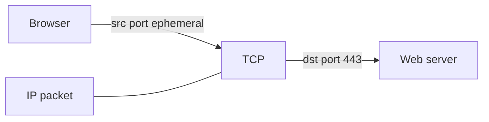
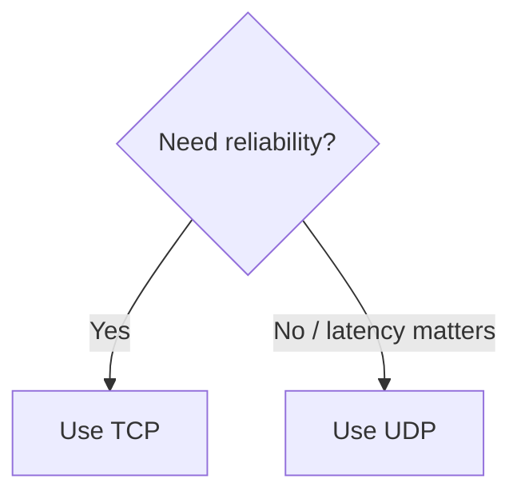
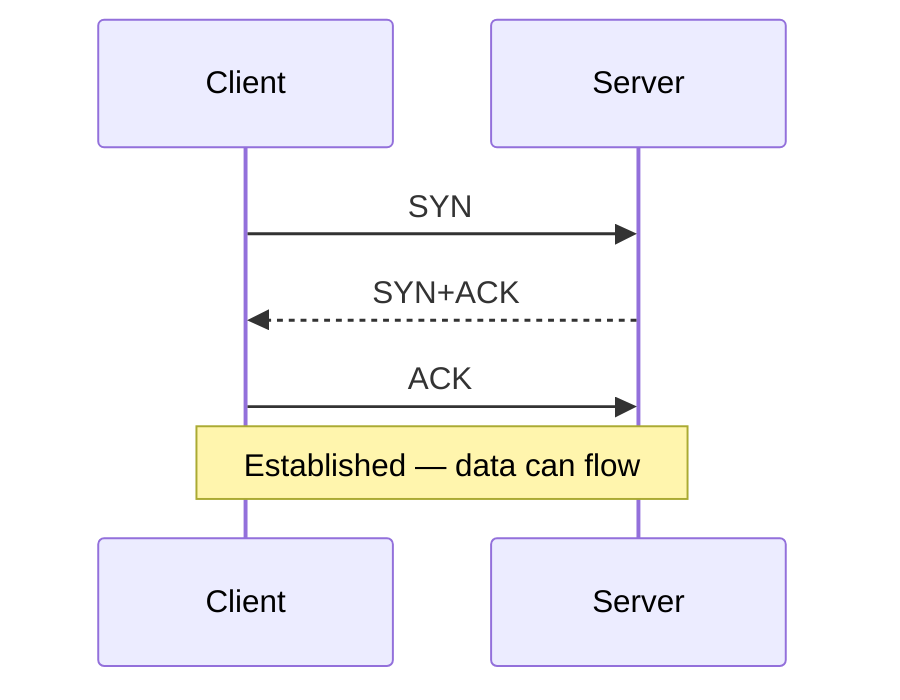

# Layer 4 — Transport

Layer 4 delivers data to the **correct application** on a host using **ports**. It also chooses the delivery style: reliable stream ([TCP](#protocols-reference/tcp)) or lightweight datagrams ([UDP](#protocols-reference/udp)).

> **Remember:** **IP finds the house. Port finds the room.** TCP = tracked courier. UDP = postcard.

---

## Big Idea Flow



---

## Ports (the apartment numbers)

| Port | Common service | Link |
|------|----------------|------|
| 53 | DNS | [DNS](#protocols-reference/dns) |
| 67/68 | DHCP | [DHCP](#protocols-reference/dhcp) |
| 80 | HTTP | [HTTP](#protocols-reference/http) |
| 443 | HTTPS | [HTTPS](#protocols-reference/https) / [TLS](#protocols-reference/tls) |
| 22 | SSH | [SSH](#protocols-reference/ssh) |
| 123 | NTP | [NTP](#protocols-reference/ntp) |

Full tables: [Protocols Reference](#protocols-reference).

---

## TCP vs UDP (choose deliberately)

| | TCP | UDP |
|---|-----|-----|
| Connection | Yes (handshake) | No |
| Reliable / ordered | Yes | Best effort |
| Speed / overhead | More | Less |
| Great for | Web, SSH, file transfers | DNS queries, video, gaming, VoIP |
| Deep dive | [TCP](#protocols-reference/tcp) | [UDP](#protocols-reference/udp) |



---

## TCP Three‑Way Handshake



Closing uses FIN/ACK (graceful) or RST (abort). Details: [TCP](#protocols-reference/tcp).

---

## UDP Mental Model

```mermaid
sequenceDiagram
  participant C as Client
  participant S as Server
  C->>S: Datagram to port 53
  S-->>C: Datagram reply (maybe)
  Note over C,S: No handshake; app handles loss/retry if needed
```

[DNS](#protocols-reference/dns) often uses UDP/53 for quick lookups; large responses may use TCP.

---

## Sockets (how apps plug in)

A **socket** is roughly: `(protocol, local IP, local port, remote IP, remote port)`.

pktana **Connections** view is basically “live sockets on the machine.”

---

## Knowledge Check

```quiz
QUESTION: Which layer introduces ports like 443?
OPTIONS:
Physical
Data Link
Transport
Network
ANSWER: 2
EXPLAIN: Transport (TCP/UDP) uses port numbers.
```

```quiz
QUESTION: TCP handshake order is:
OPTIONS:
ACK, SYN, FIN
SYN, SYN+ACK, ACK
FIN, RST, SYN
UDP only
ANSWER: 1
EXPLAIN: Classic three-way handshake: SYN → SYN+ACK → ACK.
```

```quiz
QUESTION: DNS queries are commonly sent with:
OPTIONS:
Only TCP 443
UDP 53 (and TCP when needed)
ARP only
ICMP Echo only
ANSWER: 1
EXPLAIN: Most DNS queries use UDP/53; TCP is used for large answers/zone transfers.
```

---

## Next

The conversation meaning: [Layers 5–7 — Application](#application-layer).
