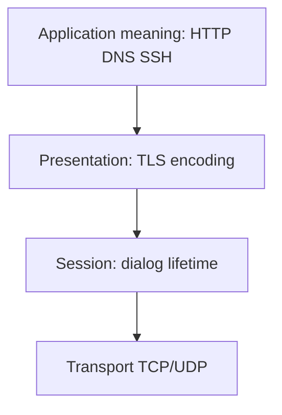
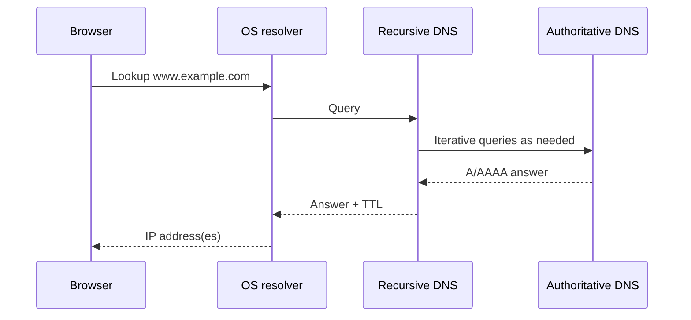
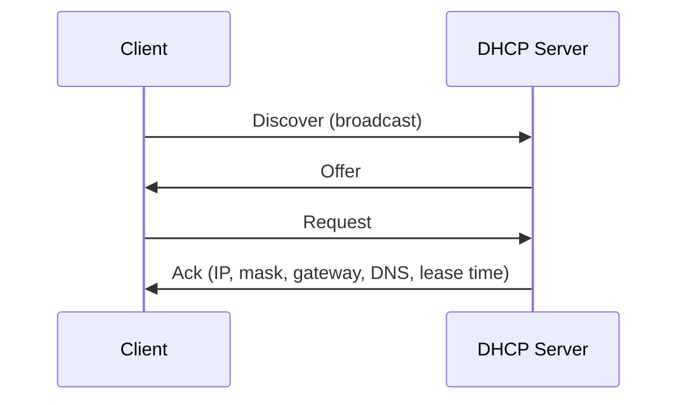
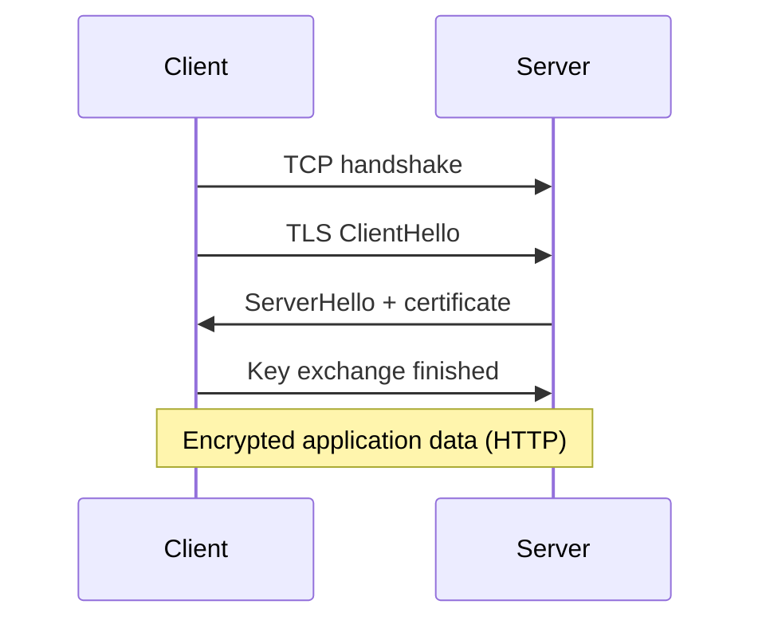
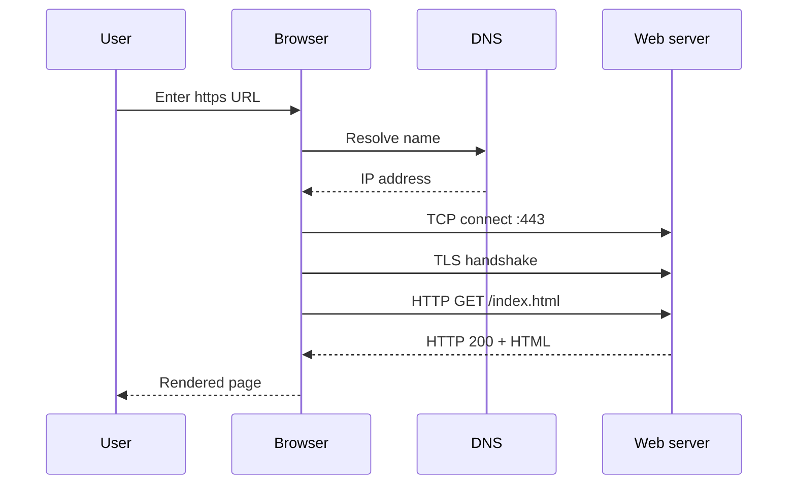
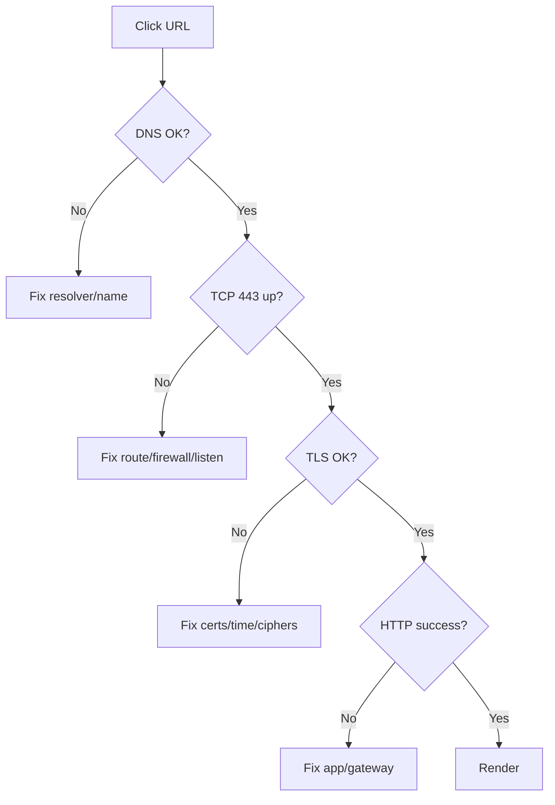
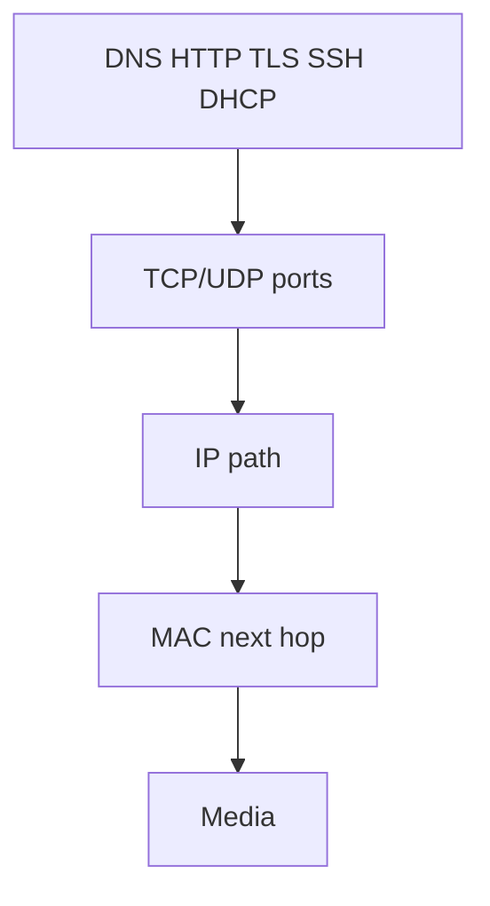

# Application Layer (OSI 5–7 in Real Life)

The **Application layer** is where networking becomes human: loading a website, resolving a name, getting an IP address automatically, opening a remote shell, sending mail, synchronizing clocks. In the strict OSI model this territory is split across **Session (5)**, **Presentation (6)**, and **Application (7)**. In the practical TCP/IP world — and in almost every engineering conversation — people simply say **Application layer** for the protocols you recognize by name: [DNS](#protocols-reference/dns), [HTTP](#protocols-reference/http), [HTTPS](#protocols-reference/https), [TLS](#protocols-reference/tls), [SSH](#protocols-reference/ssh), [DHCP](#protocols-reference/dhcp), [NTP](#protocols-reference/ntp), [SMTP](#protocols-reference/smtp), and friends.

This chapter maps OSI 5/6/7 to real life, then teaches the major protocols with flows and failure symptoms. It ends with a careful end-to-end walkthrough of what happens when a browser fetches a page — the story that ties the entire Learning Hub together.

> **Remember:** Lower layers **deliver**. The Application layer **means something** — a page, a name lookup, a login shell.

---

## OSI 5, 6, and 7 Mapped to Reality {#osi-567}

| OSI layer | Classic job | Real-life examples |
|-----------|-------------|--------------------|
| 5 Session | Start, manage, end dialogs | SSH session, HTTP keep-alive, RPC call lifetimes, remote desktop sessions |
| 6 Presentation | Encode, compress, encrypt | UTF-8 vs legacy charsets, JSON/XML encoding, [TLS](#protocols-reference/tls) record protection |
| 7 Application | Application protocol semantics | [HTTP](#protocols-reference/http) methods/URLs, [DNS](#protocols-reference/dns) query types, [SMTP](#protocols-reference/smtp) mail commands |

Modern stacks blur the boundaries: TLS libraries, HTTP/2 multiplexing, and SSH channels implement session/presentation ideas inside “app” protocols. Use OSI labels as **jobs**, not rigid code modules.



---

## The Application Toolkit Landscape

### Bootstrap & infrastructure

- [DHCP](#protocols-reference/dhcp) — “Please give me an address and friends (mask, gateway, DNS)”
- [DNS](#protocols-reference/dns) — “What IP is www.example.com?”
- [NTP](#protocols-reference/ntp) — “What time is it?” (critical for auth logs and certificates)

### User-facing services

- [HTTP](#protocols-reference/http) / [HTTPS](#protocols-reference/https) — web and many APIs
- [SSH](#protocols-reference/ssh) — secure remote administration
- [SMTP](#protocols-reference/smtp) (+ IMAP/POP3) — mail movement and retrieval
- [FTP](#protocols-reference/ftp) — legacy file transfer (prefer SFTP/HTTPS uploads today)
- [RDP](#protocols-reference/rdp) / [SMB](#protocols-reference/smb) — remote desktop / file shares

### Operations

- [SNMP](#protocols-reference/snmp) — device monitoring
- Directory protocols (LDAP) for identity in enterprises

Full dictionary: [Protocols Reference](#protocols-reference).

---

## DNS — The Internet’s Phonebook {#dns}

Without [DNS](#protocols-reference/dns), humans would memorize IP addresses. DNS maps names to records:

| Record | Typical meaning |
|--------|-----------------|
| A | Name → IPv4 |
| AAAA | Name → IPv6 |
| CNAME | Name → another name |
| MX | Mail servers for a domain |
| NS | Authoritative name servers |
| TXT | Arbitrary text (SPF, verification, etc.) |

### Resolution flow (simplified)

1. App asks OS stub resolver for `www.example.com`
2. Stub asks a recursive resolver (often the LAN/[DHCP](#protocols-reference/dhcp)-provided DNS, or 1.1.1.1 / 8.8.8.8)
3. Recursive resolver walks the hierarchy: root → TLD → authoritative
4. Answer returns with TTL; caches remember for a while



Transport: usually [UDP](#protocols-reference/udp)/53; large responses or zone transfers may use [TCP](#protocols-reference/tcp)/53.

### Failure symptoms

- Timeout → resolver unreachable or filtered
- NXDOMAIN → name does not exist
- Wrong answer → cache poisoning, hostile DNS, split-horizon confusion
- Works by IP, fails by name → classic DNS problem

```bash
dig www.example.com +short
resolvectl status   # systemd-resolved environments
```

> **Remember:** If IP works and the name fails, stop blaming [TCP](#protocols-reference/tcp) — fix DNS first.

---

## DHCP — Automatic Host Configuration {#dhcp}

[DHCP](#protocols-reference/dhcp) leases addressing parameters so users do not statically configure every laptop.

### DORA dance

1. **Discover** — client broadcast “any DHCP servers?”
2. **Offer** — server proposes an lease
3. **Request** — client asks for that offer
4. **Ack** — server confirms



Often UDP ports **67** (server) and **68** (client). Relays forward across subnets because broadcasts do not cross routers.

### Failure symptoms

- Stuck on APIPA `169.254.x.x`
- Has IP but wrong gateway/DNS
- Rogue DHCP on the VLAN ([Security](#network-security) issue)

---

## HTTP — The Language of the Web {#http}

[HTTP](#protocols-reference/http) is a request/response protocol. A client sends a method + path + headers; a server returns a status code + headers + body.

### Common methods and statuses

| Method | Intent |
|--------|--------|
| GET | Read a resource |
| POST | Submit data |
| PUT/PATCH | Update |
| DELETE | Remove |

| Status | Meaning class |
|--------|---------------|
| 2xx | Success (200 OK) |
| 3xx | Redirect |
| 4xx | Client error (404 not found, 401/403 auth) |
| 5xx | Server error |

HTTP/1.1 often uses one [TCP](#protocols-reference/tcp) connection with keep-alive; HTTP/2 multiplexes streams; HTTP/3 uses QUIC over [UDP](#protocols-reference/udp). Conceptually, you still send requests and get responses.

Cleartext HTTP on port 80 is readable on the wire — treat as postcard.

---

## TLS and HTTPS — Encryption and Identity {#tls-https}

[TLS](#protocols-reference/tls) provides confidentiality, integrity, and server authentication (via certificates). [HTTPS](#protocols-reference/https) is HTTP over TLS, typically on TCP/443.

### What the TLS handshake achieves (conceptual)

1. Agree cryptographic parameters
2. Authenticate the server (certificate chain to a trusted CA)
3. Derive keys for symmetric encryption of application data
4. Then HTTP (or other protocol) rides inside the encrypted tunnel



### Failure symptoms

- Certificate expired / wrong name / untrusted CA
- Protocol version mismatch
- Middlebox TLS inspection surprises
- Mixed content warnings (HTTPS page loading HTTP assets)

> **Remember:** HTTPS protects the channel. It does not magically make a phishing site “safe.”

---

## SSH — Secure Remote Shell {#ssh}

[SSH](#protocols-reference/ssh) (TCP/22) replaces insecure Telnet with encrypted remote login and features like port forwarding and secure file copy (SCP/SFTP).

### Flow sketch

1. TCP connect to port 22
2. SSH protocol version exchange
3. Key exchange + server host key verification
4. User authentication (public key, password, etc.)
5. Session channels for shell or commands

Host key verification prevents naive MitM — do not blindly ignore changed host key warnings on known servers.

---

## NTP — Time Is a Dependency {#ntp}

[NTP](#protocols-reference/ntp) (UDP/123) synchronizes clocks. Bad time breaks:

- Kerberos/auth
- TLS certificate validity checks
- Log correlation during incidents

If “certificates are not yet valid,” check the system clock before rebuilding PKI.

---

## SMTP — Moving Mail {#smtp}

[SMTP](#protocols-reference/smtp) (commonly TCP/25 between MTAs; submission often 587 with auth/TLS) transfers email between servers.

Simplified path:

1. Mail client submits to its mail server
2. Sending server looks up recipient domain **MX** records via [DNS](#protocols-reference/dns)
3. SMTP conversation delivers to receiving MTA
4. Recipient retrieves via IMAP/POP3 (separate protocols)

Spam filtering, SPF/DKIM/DMARC (DNS TXT-related), and TLS opportunism complicate the real world — but the spine remains DNS MX + SMTP.

---

## End-to-End: Browser Fetch Walkthrough {#browser-fetch}

Here is the full story that unifies every layer you have studied.

### Scene

You type `https://www.example.com/index.html` and press Enter.

### Step-by-step

1. **Application intent (L7):** Browser wants the resource at that URL.
2. **DNS (L7 over UDP/TCP):** Resolve `www.example.com` → IP(s). If DNS fails, stop.
3. **Routing decision (L3):** Is the IP on-link or via default gateway?
4. **ARP/ND (L2 helper):** Find next-hop MAC on the local network.
5. **Frame/bits (L2/L1):** Ethernet or Wi‑Fi carries the first IP packet.
6. **TCP handshake (L4):** SYN → SYN-ACK → ACK to `IP:443`.
7. **TLS handshake (L6-ish):** Authenticate server, derive keys.
8. **HTTP request (L7):** `GET /index.html HTTP/1.1` (or HTTP/2 equivalent) inside TLS.
9. **HTTP response:** Status, headers, HTML body.
10. **More fetches:** Browser parses HTML, requests CSS/JS/images (often parallel connections or multiplexed streams).
11. **Render:** Presentation to the user — success!



### Where failures hide in this story

| Symptom | Likely layer/protocol |
|---------|------------------------|
| No link / no Wi‑Fi | [Physical](#physical-layer) / Wi‑Fi |
| DNS timeout | [DNS](#protocols-reference/dns) / path to resolver |
| TCP SYN timeout | Firewall/routing/[Transport](#transport-layer) |
| Certificate error | [TLS](#protocols-reference/tls) |
| HTTP 502/503 | App/load balancer origin |
| Blank page / JS errors | Content/app logic after networking succeeded |



---

## Putting Session and Presentation Back Into the Story

During the browser fetch:

- **Session flavor:** persistent connections, cookies/session tokens, HTTP/2 stream lifetimes
- **Presentation flavor:** TLS encryption, content-encoding (gzip/br), character encoding
- **Application flavor:** HTTP semantics, URL paths, status codes

You rarely configure “OSI Layer 5” as a knob — but you *feel* these jobs when sessions drop or TLS fails.

---

## pktana Practical Tips

```bash
# Capture a real browser fetch (close other noisy tabs first)
pktana capture -i eth0 -w browser-fetch.pcap

# Optional: generate DNS + HTTPS deliberately
dig www.example.com
curl -I https://www.example.com

pktana connections -r browser-fetch.pcap
pktana web --port 8080
```

What to click through in the capture tree:

1. DNS query/response for the name
2. TCP handshake to port 443
3. TLS ClientHello / certificates (if not encrypted beyond visibility)
4. Application data records (HTTP may be opaque if TLS keys unavailable)

Even without decrypting HTTPS, the **metadata** (SNI in older visible handshakes, IPs, timing, sizes) teaches the flow.

For cleartext lab HTTP:

```bash
curl http://example.com/
# Then find HTTP request lines in pktana
```

---

## Application Security Habits

- Prefer [HTTPS](#protocols-reference/https) over [HTTP](#protocols-reference/http)
- Prefer [SSH](#protocols-reference/ssh) over [Telnet](#protocols-reference/telnet)
- Keep clocks honest ([NTP](#protocols-reference/ntp))
- Treat DNS as critical infrastructure (including DNSSEC awareness later)
- Remember encryption does not remove the need for [firewalls](#protocols-reference/firewall), [DLP/IDPS](#dlp-idps), and least privilege

---

## How This Chapter Connects Downward



You now have language for every floor. Continue into [Topologies](#topologies), [Wireless](#wireless-networking), [Security](#network-security), and the [Protocols Reference](#protocols-reference) dictionary for mastery.

---

## What You Should Feel Confident Saying

- how OSI 5–7 map to TLS/HTTP/session behavior,
- how DNS resolution works at a high level,
- DORA for DHCP,
- what TLS buys you and what it does not,
- the full browser fetch chain from name to rendered page,
- which failure symptom points to which protocol.

---

## Hands-On Tasks

```task
TITLE: Browser fetch lab notebook
LEVEL: intermediate
STEPS:
1. Capture while loading one HTTPS site
2. Write the ordered list: DNS → TCP → TLS → HTTP
3. Note packet numbers for each stage in pktana
GOAL: Turn the end-to-end story into muscle memory
```

```task
TITLE: Break DNS on purpose (lab)
LEVEL: intermediate
STEPS:
1. Point a lab VM at a bogus DNS resolver
2. Observe browser failure mode
3. Restore DNS and confirm recovery without changing routes
GOAL: Feel a pure L7 infrastructure failure
```

```task
TITLE: HTTP vs HTTPS visibility
LEVEL: beginner
STEPS:
1. Capture a cleartext HTTP request in a safe lab
2. Capture an HTTPS request to another host
3. Compare what payload you can read in each
GOAL: Internalize why TLS matters on shared networks
```

```task
TITLE: DHCP lease inspection
LEVEL: beginner
STEPS:
1. Renew a DHCP lease on a lab client
2. Capture DORA if possible
3. Match offered IP/gateway/DNS to ip addr and resolvers
GOAL: Connect broadcasts to host configuration reality
```

```task
TITLE: Certificate error triage
LEVEL: intermediate
STEPS:
1. Visit a lab site with an expired or name-mismatched cert (safe lab only)
2. Record the exact browser error
3. Map it to TLS validation checks (time, name, trust chain)
GOAL: Diagnose Presentation/TLS failures without blaming TCP
```

---

## Knowledge Check

```quiz
QUESTION: OSI Layers 5–7 are most often collapsed into which TCP/IP layer name?
OPTIONS:
Physical
Application
BGP
Ethernet FCS
ANSWER: 1
EXPLAIN: TCP/IP commonly uses a single Application layer for these jobs.
```

```quiz
QUESTION: DNS’s primary everyday job is to:
OPTIONS:
Encrypt all Ethernet frames
Map names to addresses (and other record types)
Replace OSPF inside LANs
Assign VLANs to trunks
ANSWER: 1
EXPLAIN: DNS is the naming system of the Internet.
```

```quiz
QUESTION: HTTPS is best described as:
OPTIONS:
HTTP over TLS (typically on TCP/443)
Raw HTTP with no TCP
BGP with certificates glued on
DHCP version 6 only
ANSWER: 0
EXPLAIN: HTTPS wraps HTTP in TLS for security.
```

```quiz
QUESTION: DHCP DORA stands for:
OPTIONS:
Data Open Route Ack
Discover Offer Request Ack
Drop Optimize Retransmit Amplify
DNS OSPF RIP IS-IS
ANSWER: 1
EXPLAIN: The classic DHCP exchange is Discover-Offer-Request-Ack.
```

```quiz
QUESTION: A site opens by IP but not by hostname. First suspect:
OPTIONS:
Only broken fiber everywhere
DNS resolution problems
Mandatory STP root guard
UDP checksum offload exclusively
ANSWER: 1
EXPLAIN: Name failure with IP success points to DNS.
```

```quiz
QUESTION: TLS certificate name mismatch means:
OPTIONS:
The TCP handshake never completed
The cert does not match the name you intended to visit
ARP is disabled globally
The VLAN ID is 0
ANSWER: 1
EXPLAIN: Browsers validate that the certificate belongs to the expected identity.
```

```quiz
QUESTION: In a browser HTTPS fetch, which happens before TLS?
OPTIONS:
HTTP response body parse always
DNS resolution and TCP connection setup to the server
SMTP MX delivery
Gratuitous ARP to the entire Internet
ANSWER: 1
EXPLAIN: You need an IP and a TCP socket before the TLS handshake.
```

```quiz
QUESTION: NTP matters for security because:
OPTIONS:
It replaces firewalls
Wrong clocks break certificate validity and auth/log correlation
It assigns MAC addresses
It compresses HTTP/2 frames
ANSWER: 1
EXPLAIN: Time-dependent security controls fail when clocks drift.
```

```quiz
QUESTION: SSH should be preferred over Telnet primarily because:
OPTIONS:
Telnet uses better congestion control
SSH encrypts the session and modernizes remote admin security
Telnet has larger ports
SSH cannot use TCP
ANSWER: 1
EXPLAIN: Telnet is cleartext; SSH protects credentials and session data.
```

---

## Next

Zoom out from protocols to shape: [Network Topologies](#topologies) — how devices are arranged, and why design choices create or avoid single points of failure.

Or jump into the dictionary anytime: [Protocols Reference](#protocols-reference).
