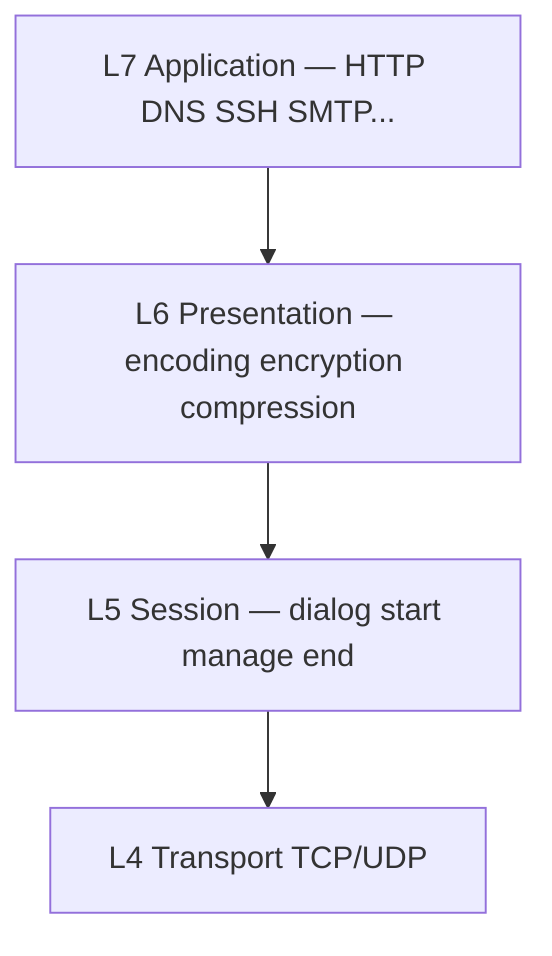
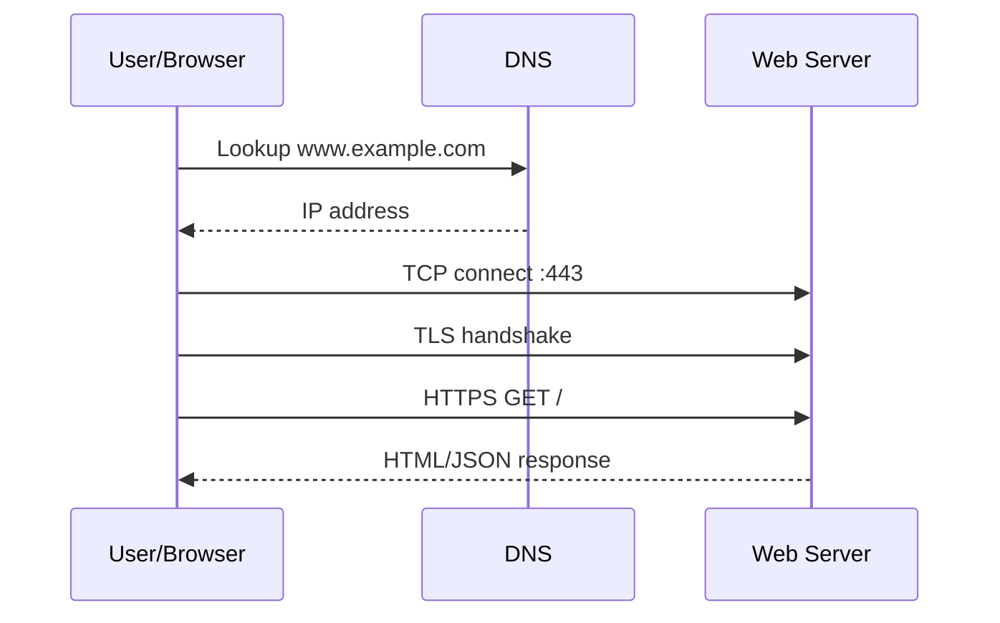
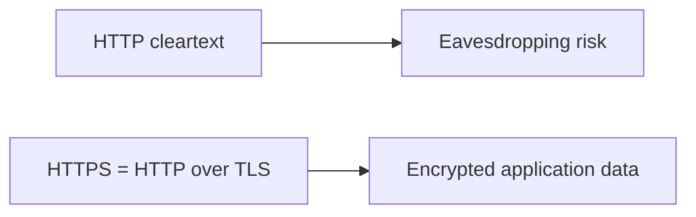

# Layers 5–7 — Application

In OSI, Layers 5–7 are Session, Presentation, and Application. In everyday TCP/IP talk, they are one **Application** layer: the protocols people recognize — [DNS](#protocols-reference/dns), [HTTP](#protocols-reference/http), [TLS](#protocols-reference/tls), [SSH](#protocols-reference/ssh), mail, and more.

> **Remember:** Lower layers **deliver**. Application layer **means something** (a page, a name lookup, a login shell).

---

## How the Three OSI Pieces Fit



| OSI piece | Plain job | Example |
|-----------|-----------|---------|
| Session | Keep a conversation context | Login session, RPC call lifetime |
| Presentation | Make data understandable / secret | [TLS](#protocols-reference/tls), character sets, compression |
| Application | User/service protocol | [HTTP](#protocols-reference/http), [DNS](#protocols-reference/dns) |

---

## The Web Path (most important flow)



Study each hop:
- Name → IP: [DNS](#protocols-reference/dns)
- Reliable path: [TCP](#protocols-reference/tcp)
- Encryption: [TLS](#protocols-reference/tls) / [HTTPS](#protocols-reference/https)
- Request language: [HTTP](#protocols-reference/http)

---

## Protocol Families You’ll See Daily

### Name & address helpers
- [DNS](#protocols-reference/dns) — names to addresses  
- [DHCP](#protocols-reference/dhcp) — “please give me an IP”  
- [NTP](#protocols-reference/ntp) — clocks must match for security/logs  

### Human services
- [HTTP](#protocols-reference/http) / [HTTPS](#protocols-reference/https) — web  
- [SSH](#protocols-reference/ssh) — secure remote shell  
- [SMTP](#protocols-reference/smtp) / IMAP / POP3 — mail  
- [FTP](#protocols-reference/ftp) — file transfer (often replaced by SFTP)  
- [RDP](#protocols-reference/rdp) / [SMB](#protocols-reference/smb) — remote desktop / Windows file shares  

### Management
- [SNMP](#protocols-reference/snmp) — device monitoring  
- [LDAP](#protocols-reference/ldap) — directories  

Full explanations: [Protocols Reference](#protocols-reference).

---

## Presentation Spotlight: TLS

Without [TLS](#protocols-reference/tls), HTTP is a postcard anyone can read on the path. With TLS, you get encryption + server authentication (certificates).



---

## Session Spotlight

Apps create sessions so the server remembers “this is still the same user/browser” (cookies, tokens). Network analysts still see the **transport flows** even when payload is encrypted.

---

## Knowledge Check

```quiz
QUESTION: DNS’s main job is to:
OPTIONS:
Encrypt passwords
Map names to IP addresses
Assign MAC addresses
Replace TCP
ANSWER: 1
EXPLAIN: DNS resolves domain names to addresses (and more record types).
```

```quiz
QUESTION: HTTPS is best described as:
OPTIONS:
HTTP only on UDP 53
HTTP over TLS (usually TCP 443)
Raw Ethernet with no IP
FTP renamed
ANSWER: 1
EXPLAIN: HTTPS wraps HTTP inside a TLS-protected channel, commonly on port 443.
```

```quiz
QUESTION: Which protocol is commonly used for secure remote command lines?
OPTIONS:
Telnet only
SSH
STP
ARP
ANSWER: 1
EXPLAIN: SSH provides encrypted remote shell and file copy features.
```

---

## Next

How networks are shaped: [Network Topologies](#topologies).  
Or jump to deep protocol pages: [Protocols Reference](#protocols-reference).
