# Network Topologies

A **topology** is the shape of connections in a network — both the cables and radios you can touch, and the logical paths traffic is allowed to take. Topology decisions drive cost, performance, how you troubleshoot, and what happens when something fails.

This chapter is a full textbook pass: physical vs logical maps, classic shapes with trade-offs, enterprise hierarchical design, redundancy, failure analysis, and how topologies relate to [VLANs](#protocols-reference/vlan) and [routing](#network-layer).

> **Remember:** Topology = **who connects to whom**. Always ask: *Where is the single point of failure?*

---

## Why Topology Matters {#why-topology}

Two networks can use the same protocols — [Ethernet](#protocols-reference/ethernet), [IP](#protocols-reference/ipv4), [TCP](#protocols-reference/tcp) — and still behave very differently because their shapes differ:

- A home with one switch is cheap and simple.
- A campus with core/distribution/access tiers scales to thousands of users.
- A data center with leaf-spine mesh prioritizes east–west traffic and fast failover.

Topology answers practical questions:

| Question | Topology influence |
|----------|-------------------|
| What dies if one cable is cut? | Path redundancy |
| How hard is cabling? | Star vs mesh cost |
| Where do you place firewalls? | Edge, DMZ, segmentation points |
| Why can’t two PCs talk on the same switch? | Logical topology ([VLAN](#protocols-reference/vlan)) |

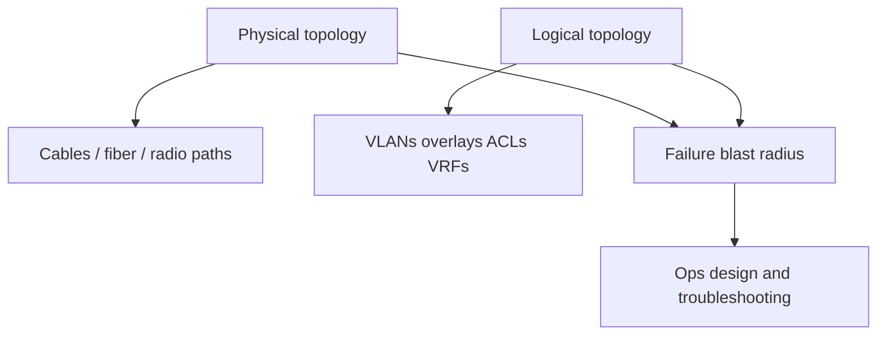

---

## Physical vs Logical Topology {#physical-vs-logical}

### Physical topology

**Physical** topology is the real wiring and radio layout:

- Which ports are patched to which switches
- Which buildings the fiber rings connect
- Where access points sit relative to users
- Which uplink is copper vs fiber

If you walk the closet with a cable tracer, you are studying physical topology.

### Logical topology

**Logical** topology is how frames and packets are allowed to flow:

- [VLAN](#protocols-reference/vlan) membership and trunking
- [STP](#protocols-reference/stp) blocking redundant L2 loops
- [IP](#protocols-reference/ipv4) subnets and routes
- Overlay networks (VXLAN, cloud VPCs — see [Modern Networking](#modern-networking))
- Firewall and Zero Trust policy (see [Network Security](#network-security))

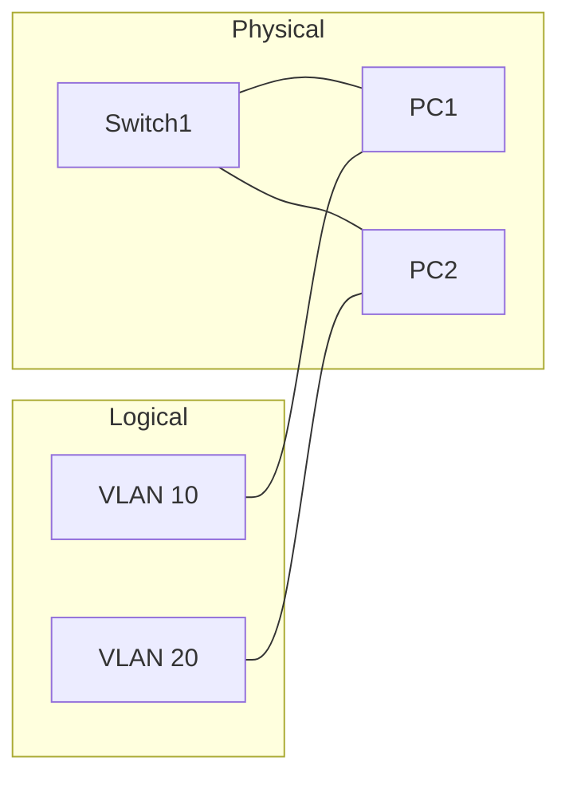

Two PCs on the **same** physical switch can be **isolated** logically by different VLANs. The physical map looks flat; the logical map is segmented.

> **Remember:** **Physical** answers “where do the wires go?” **Logical** answers “is traffic allowed to go there?”

### Why both matter in incidents

| Symptom | Check physical first | Check logical first |
|---------|----------------------|---------------------|
| Link light dark | Cable, SFP, port power | — |
| Link up, no ARP | — | VLAN, access port mode |
| Same subnet, no ping | Bad patch? | ACL, private VLAN, wrong VRF |
| Intermittent drops | Bad fiber / duplex | STP flapping, routing flaps |

---

## Classic Topologies {#classic-shapes}

### Bus (legacy) {#bus}

All devices share one backbone cable. Classic coax LANs used this shape.

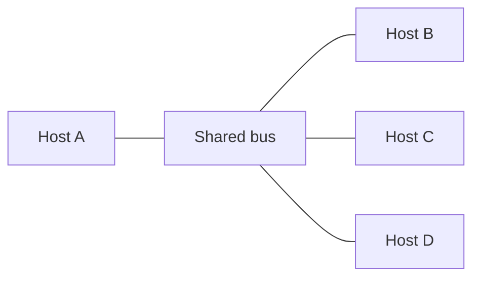

| Advantages | Disadvantages |
|------------|---------------|
| Very simple concept | One cut can kill the segment |
| Low cabling count historically | Collisions / shared bandwidth |
| Easy to draw | Hard to scale and troubleshoot |

Modern Ethernet LANs almost never use true shared bus; switches create a star of point-to-point links instead.

### Star {#star}

Every device connects to a central hub or switch. This is the dominant **access** shape today.

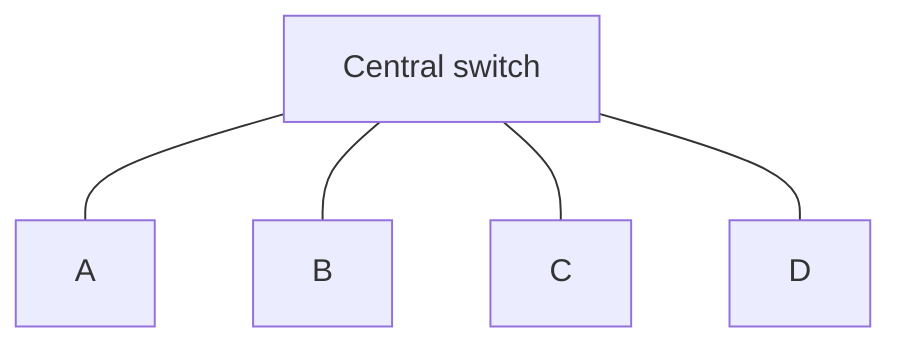

| Advantages | Disadvantages |
|------------|---------------|
| Easy adds/moves/changes | Center device is critical |
| One bad edge cable affects one host | Hub (legacy) shared collisions |
| Clear troubleshooting focus | Uplink overload if oversubscribed |

With a **switch**, each edge link is its own collision domain. With an old **hub**, everyone shared one collision domain — worse performance.

> **Remember:** In a star, **edge failures are small; center failures are huge.**

### Ring {#ring}

Devices form a circle. Each node has two neighbors. Some metro and storage fabrics still use ring ideas; Token Ring is mostly history.

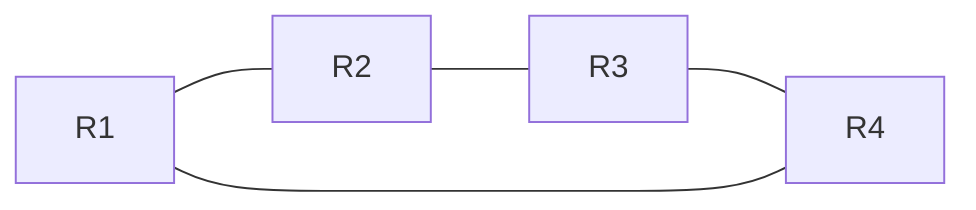

| Advantages | Disadvantages |
|------------|---------------|
| Predictable hop count | Dual failures can split the ring |
| Dual-ring designs can heal one cut | Latency grows with ring size |
| Useful in some WAN/metro designs | More complex than star for LAN access |

### Mesh {#mesh}

Many devices interconnect with multiple cross-links. **Full mesh** connects every pair; **partial mesh** connects strategically.

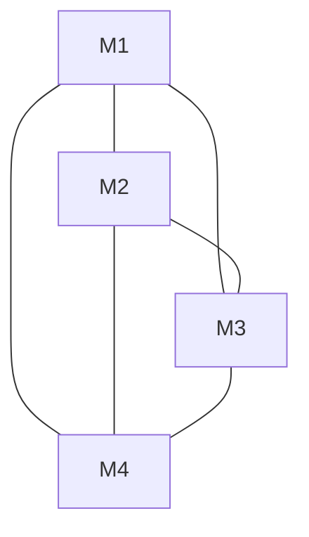

| Advantages | Disadvantages |
|------------|---------------|
| High resilience / alternate paths | Cabling and config cost explode |
| Good for core / WAN / DC fabrics | Harder to document and secure |
| Supports load sharing | More protocols needed (routing, ECMP) |

Full mesh link count grows roughly as \(n(n-1)/2\). That is why campuses use **hierarchical** designs and data centers use **leaf-spine** (a controlled mesh), not every-to-every wiring.

### Tree / Hierarchical {#tree}

A tree is layered stars: root (core) → branches (distribution) → leaves (access).

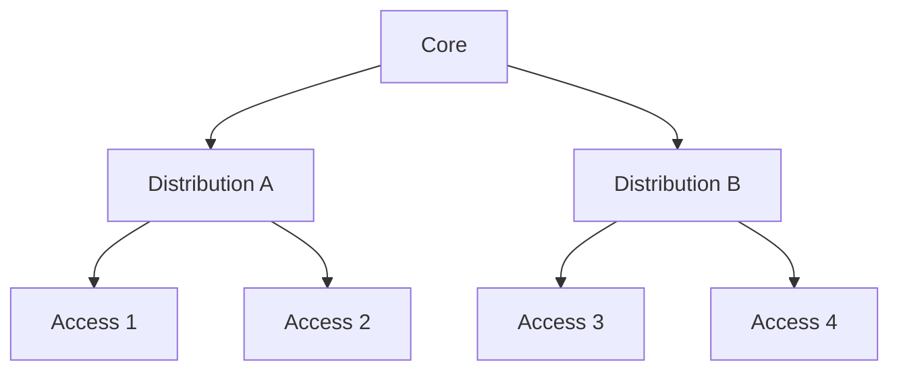

| Advantages | Disadvantages |
|------------|---------------|
| Scales for enterprises | Root / aggregation can bottleneck |
| Clear policy placement points | Bad design creates spanning-tree pain |
| Matches org geography | Oversubscription must be planned |

This is the default mental model for campus networks (next section).

### Hybrid {#hybrid}

Real networks mix shapes: star access, partial mesh core, ring metro fiber, wireless mesh outdoors.

| Advantages | Disadvantages |
|------------|---------------|
| Practical and cost-aware | Must document carefully |
| Fit each tier’s needs | Hybrid complexity hides SPOFs |
| Matches brownfield reality | Training harder for new staff |

> **Remember:** **Hybrid is normal.** Your job is to draw both physical and logical maps, not pretend everything is one pure shape.

---

## Enterprise Hierarchical Design {#enterprise-hierarchical}

Campus and many enterprise LANs use three tiers:

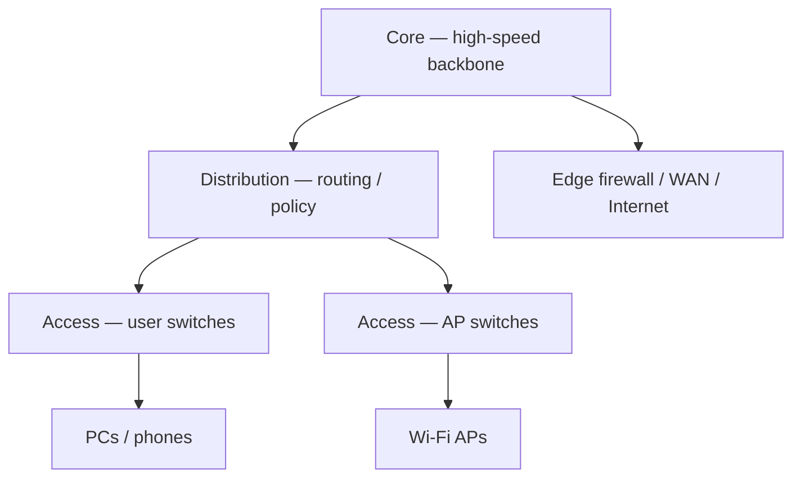

### Access layer

- End devices attach here: PCs, phones, printers, [Wi‑Fi APs](#wireless-networking)
- Usually Layer 2 switching, [VLAN](#protocols-reference/vlan) access ports
- Port security, PoE, 802.1X often live here

### Distribution layer

- Aggregates access switches
- Often where [L3](#network-layer) routing between VLANs begins
- ACLs, QoS, summarization, redundancy (HSRP/VRRP) common

### Core layer

- Fast, simple forwarding between distribution blocks and data centers / WAN edge
- Minimize complex filtering here; keep it fast and redundant

| Tier | Typical job | Failure impact |
|------|-------------|----------------|
| Access | Connect endpoints | One closet / floor |
| Distribution | Route & filter | Building / wing |
| Core | High-speed interconnect | Campus-wide |

Related reading: [Data Link](#data-link-layer) for switching/VLANs, [Network Layer](#network-layer) for inter-VLAN routing, [Security](#network-security) for edge firewalls.

---

## Redundancy Patterns {#redundancy}

Redundancy means alternate paths so one failure does not black-hole traffic.

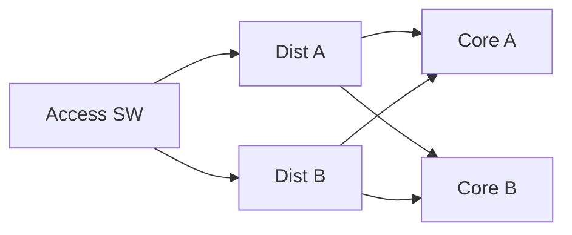

### Layer 2 redundancy and loops

Extra Ethernet links without care create **broadcast storms**. [STP](#protocols-reference/stp) / RSTP / MSTP block some links until needed. Modern designs often push L3 closer to access to reduce large L2 domains.

### Layer 3 redundancy

- Multiple default gateways with VRRP/HSRP/GLBP
- Dynamic routing ([OSPF](#protocols-reference/ospf), [BGP](#protocols-reference/bgp)) for alternate paths
- ECMP for load sharing across equal-cost links

### Device and path redundancy

| Technique | Protects against |
|-----------|------------------|
| Dual uplinks | Single cable/SFP failure |
| Stacked / chassis pairs | Single switch failure |
| Dual power / dual supervisors | Power or control-plane failure |
| Dual firewalls / HA pairs | Edge security appliance failure |

> **Remember:** Redundant **links** without redundant **brains** (routing, STP, HA config) can still fail closed — or worse, fail flapping.

---

## Failure Analysis Drills {#failure-analysis}

Train yourself to predict blast radius before the outage happens.

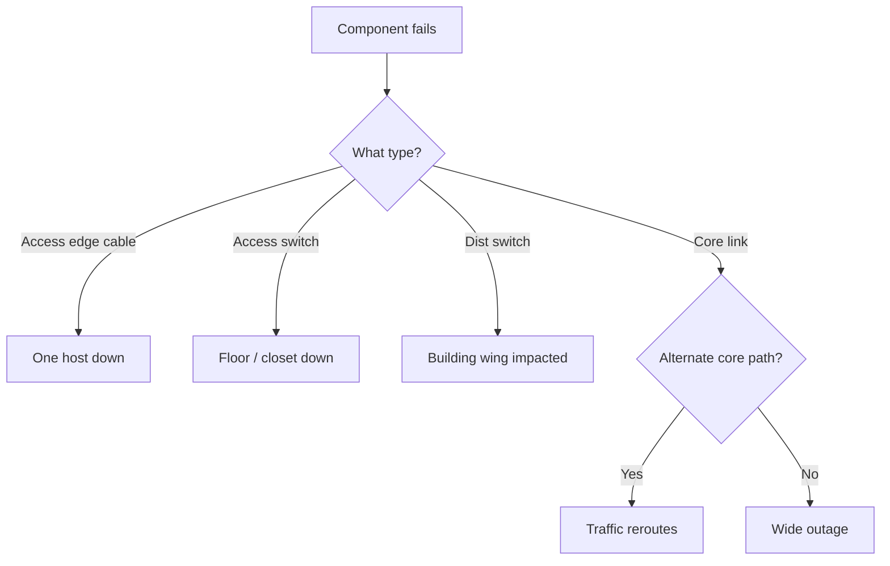

### Worked examples

**1. Star access, single uplink** — Fiber cut → whole closet offline. Fix: dual uplinks + L2/L3 redundancy.

**2. Logical isolation** — Two PCs on one switch, different VLANs, no route: ping fails though cables are fine.

**3. STP surprise** — A blocking link is your backup; bad timers/config → black hole or loop after failover.

**Analyst habit:** draw physical path → logical path (VLAN → gateway → routes → firewall) → mark SPOFs → prove each hop (link, ARP, ping, traceroute, PCAP). pktana shows whether traffic still exists after a topology change.

---

## Topologies, VLANs, and Routing {#vlans-and-routing}

Topology and addressing work together.

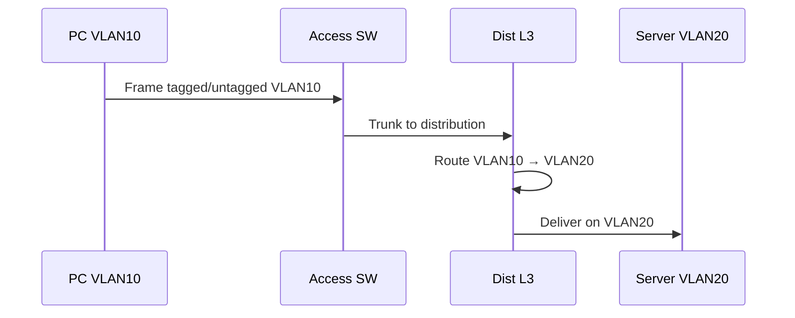

| Concept | Topology role |
|---------|---------------|
| [VLAN](#protocols-reference/vlan) | Logical L2 segments on shared physical switches |
| Trunk | Carries many VLANs between switches |
| SVI / router-on-a-stick | Connects logical segments at L3 |
| [ARP](#protocols-reference/arp) | Resolves gateway MAC inside a VLAN |
| Routing table | Chooses next hop across the logical map |

### Design rules of thumb

- Keep broadcast domains reasonably sized (do not make one giant VLAN campus-wide).
- Align VLAN / subnet boundaries with security zones when possible.
- Prefer clear L3 boundaries at distribution for large campuses.
- Document both maps: rack elevations **and** VLAN/VRF diagrams.

Wireless access points hang off the same hierarchical tree; SSIDs often map to VLANs — continue in [Wireless Networking](#wireless-networking).

---

## Hands-On Tasks

```task
TITLE: Draw physical vs logical for one closet
LEVEL: beginner
STEPS:
1. Sketch one access switch with 4 PCs and dual uplinks
2. Assign two VLANs so half the PCs cannot talk at L2
3. Mark the gateway where inter-VLAN routing would happen
GOAL: Separate cable reality from policy reality
HINT: Same switch can host many logical LANs
```

```task
TITLE: Single point of failure hunt
LEVEL: intermediate
STEPS:
1. Pick a star, a partial mesh, and a 3-tier campus sketch
2. For each, list what fails if the “center” or a core link dies
3. Propose one redundancy fix that is realistic (not infinite mesh)
GOAL: Practice blast-radius thinking used in change reviews
```

```task
TITLE: VLAN black-hole lab story
LEVEL: intermediate
STEPS:
1. Invent: PC cannot reach server; both link lights are green
2. Write a bottom-up check: L1 → VLAN → gateway ARP → route → ACL
3. Note which pktana views would show ARP vs TCP attempts
GOAL: Tie topology theory to packet evidence
HINT: Review ARP and VLAN pages in Protocols Reference
```

---

## Knowledge Check

```quiz
QUESTION: Physical topology primarily describes:
OPTIONS:
Firewall rule order only
Where cables, fiber, and radio paths actually run
DNS TTL values
TLS cipher suites
ANSWER: 1
EXPLAIN: Physical topology is the real connectivity layout.
```

```quiz
QUESTION: Two PCs on one switch but different VLANs illustrates:
OPTIONS:
Broken copper only
Logical segmentation on a shared physical device
That IP no longer exists
That STP deletes MAC addresses
ANSWER: 1
EXPLAIN: VLANs create logical topology independent of physical adjacency.
```

```quiz
QUESTION: In a star LAN, the usual critical SPOF is the:
OPTIONS:
End-user wallpaper theme
Central switch or hub
DNS TXT record color
SSID emoji
ANSWER: 1
EXPLAIN: Star edges depend on the center device.
```

```quiz
QUESTION: A full mesh is chosen mainly for:
OPTIONS:
Lowest cabling cost always
Maximum alternate paths / resilience
Avoiding IP addresses
Replacing TCP with STP
ANSWER: 1
EXPLAIN: Mesh adds redundant paths at higher cost and complexity.
```

```quiz
QUESTION: Enterprise core–distribution–access is an example of:
OPTIONS:
Bus-only legacy coax
Hierarchical / tree design
Peer-to-peer Bluetooth PAN only
Application-layer encoding
ANSWER: 1
EXPLAIN: Campus designs commonly use hierarchical tiers.
```

```quiz
QUESTION: Extra Ethernet links between switches without STP or L3 design risk:
OPTIONS:
Faster DNS only
Layer 2 loops / broadcast storms
Mandatory WireGuard
Removal of MAC addresses
ANSWER: 1
EXPLAIN: L2 redundancy needs loop control or routed designs.
```

```quiz
QUESTION: Inter-VLAN communication typically requires:
OPTIONS:
Only a longer copper cable
A Layer 3 gateway / router function
Deleting all trunks
Disabling ARP forever
ANSWER: 1
EXPLAIN: Different VLANs are separate L2 domains; routing connects them.
```

```quiz
QUESTION: Hybrid topologies are common because:
OPTIONS:
Standards forbid pure shapes
Real sites mix star, mesh, and ring pieces for practical needs
IP only works on rings
Firewalls require bus topology
ANSWER: 1
EXPLAIN: Production networks combine shapes to fit cost and geography.
```

```quiz
QUESTION: Logical topology changes when you:
OPTIONS:
Only repaint the rack door
Re-assign ports to different VLANs or alter routing/policy
Change the carpet color
Rename a hostname wallpaper
ANSWER: 1
EXPLAIN: VLANs, overlays, and routing policy reshape logical paths.
```

---

## What You Should Feel Confident Saying

- Physical vs logical maps, and why both matter in outages
- Pros/cons of bus, star, ring, mesh, tree, and hybrid
- How campus hierarchical design places switching and routing
- How redundancy and STP/routing interact with failure domains
- How VLANs and L3 gateways reshape traffic on the same cables

---

## Next

Topology without the copper: [Wireless Networking](#wireless-networking).  
Refresh switching ideas in [Data Link](#data-link-layer) and paths in [Network Layer](#network-layer).
