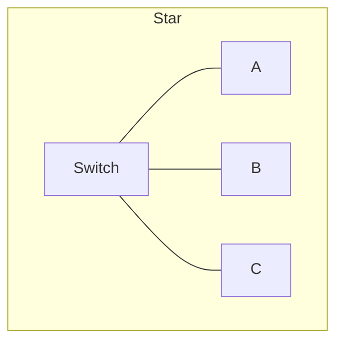
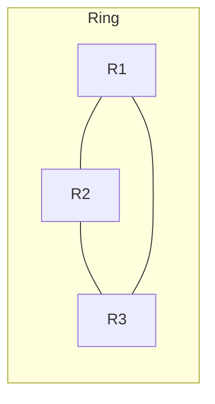
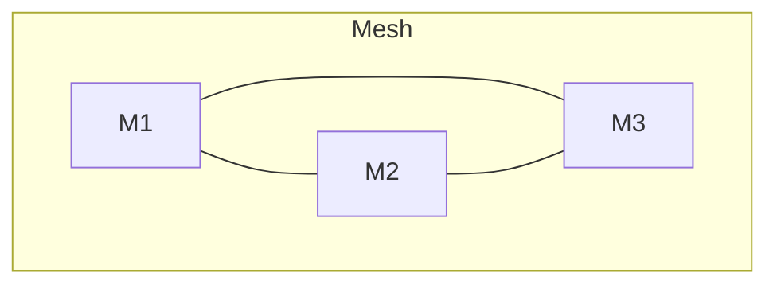
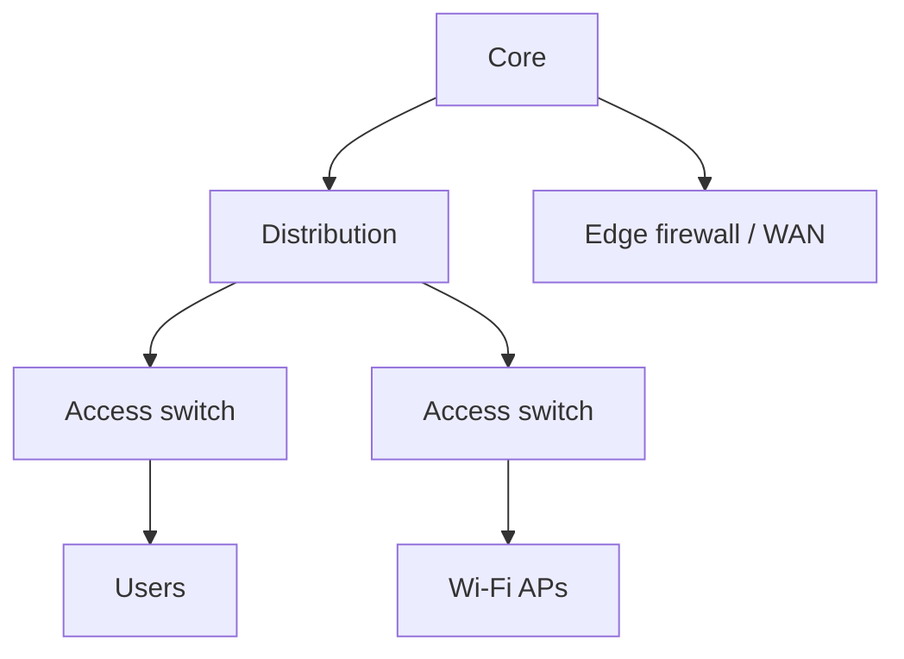
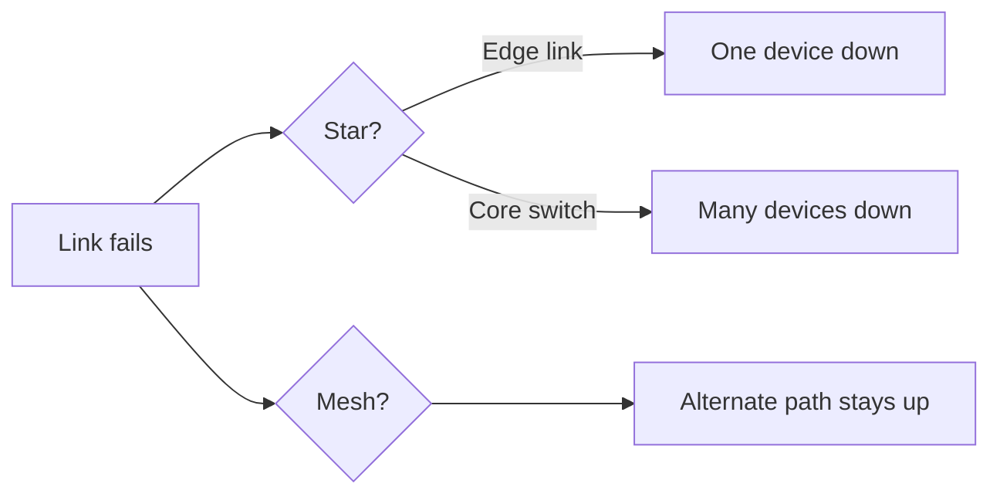

# Network Topologies

A **topology** is the shape of connections — physical cables and logical traffic paths. Shape drives cost, speed, and what breaks when one link fails.

> **Remember:** Topology = **map of who connects to whom**. Always ask: *single point of failure?*

---

## Common Shapes







| Topology | Look like | Strength | Weakness |
|----------|-----------|----------|----------|
| Bus (legacy) | One shared backbone | Simple | Collisions / one cut kills all |
| Star | Devices → central switch | Easy to manage | Center switch is critical |
| Ring | Circle of hops | Predictable path | Dual failures matter |
| Mesh | Many cross links | High resilience | Cost/complexity |
| Tree / hierarchical | Core → distribution → access | Scales for campuses | Design must be careful |
| Hybrid | Mix of the above | Practical reality | Must document clearly |

---

## Enterprise Access Pattern



This pairs with L2/[VLAN](#protocols-reference/vlan) separation and L3 routing between tiers — see [Data Link](#data-link-layer) and [Network](#network-layer).

---

## Logical vs Physical

- **Physical:** where cables actually run  
- **Logical:** how frames/packets are allowed to flow (VLANs, overlays, SD‑WAN)

Two PCs on the same switch may be **isolated** by VLAN policy even though the physical topology looks flat.

---

## Failure Thinking (memorable)



---

## Knowledge Check

```quiz
QUESTION: In a star topology, the most critical single point of failure is usually the:
OPTIONS:
End-user patch cable color
Central switch / hub
DNS TXT record
Client wallpaper
ANSWER: 1
EXPLAIN: Star edges depend on the center device.
```

```quiz
QUESTION: VLANs mainly change:
OPTIONS:
Cable copper category only
Logical Layer 2 segmentation
Optical wavelength of the sun
TCP handshake order
ANSWER: 1
EXPLAIN: VLANs alter logical topology / broadcast domains.
```

```quiz
QUESTION: A full mesh is chosen when you need:
OPTIONS:
Lowest cabling cost always
Maximum alternate paths / resilience
To avoid IP addresses
Only wireless SSIDs
ANSWER: 1
EXPLAIN: Mesh adds redundant paths at higher cost/complexity.
```

---

## Next

[Wireless Networking](#wireless-networking) — topology without cables.
