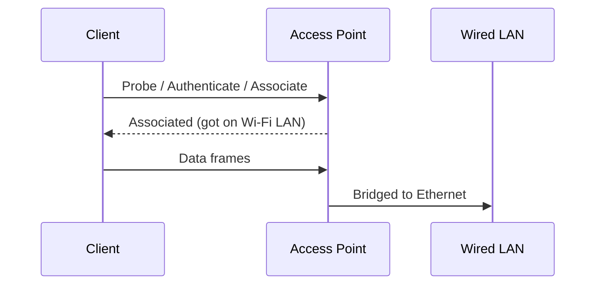
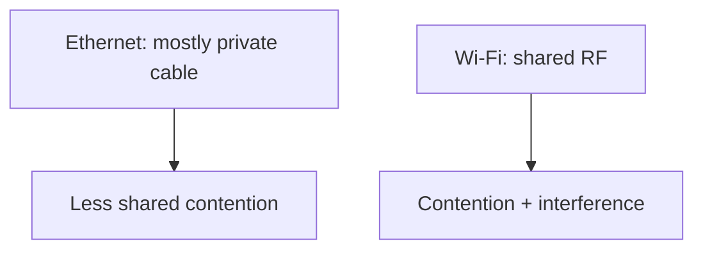
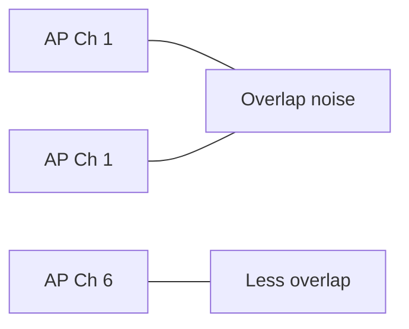

# Wireless Networking

Wireless networking sends bits as **radio**. Layer 1 is the RF energy; Layer 2 (802.11) adds Wi‑Fi framing, association, and local delivery — similar goals to [Ethernet](#protocols-reference/ethernet), different medium.

> **Remember:** Wi‑Fi = **shared air**. Air is a crowded room — collisions, walls, and interference matter.

---

## Big Idea Flow



---

## Key Terms

| Term | Meaning | Link |
|------|---------|------|
| SSID | Network name you see | — |
| AP | Access point (radio + bridge) | — |
| Association | Client joins an AP | — |
| Channel | RF lane | Physical constraints |
| Encryption | WPA2/WPA3 protect air | Security |
| Roaming | Move AP to AP | Session continuity |

Security overlap: [Network Security](#network-security), [TLS](#protocols-reference/tls) still protects apps even on open Wi‑Fi (but open Wi‑Fi is still risky).

---

## Wi‑Fi vs Ethernet (memory)



| | Ethernet | Wi‑Fi |
|---|----------|-------|
| Medium | Cable/fiber | Radio |
| Collision domain | Switched / small | Shared air per channel |
| Addressing | MAC | MAC (+ 802.11 quirks) |
| Extra steps | Plug in | Scan, auth, associate |

---

## Channels & Interference (simple)



Good design spaces APs and channels. Bad design stacks same channel in one hallway.

---

## Capture Notes with pktana

On many systems you can capture on a wireless interface, but **monitor mode / radio details** depend on OS and driver. For learning protocols, wired capture of clients behind an AP still shows [DHCP](#protocols-reference/dhcp), [DNS](#protocols-reference/dns), [TLS](#protocols-reference/tls), etc.

---

## Knowledge Check

```quiz
QUESTION: Wi‑Fi association primarily happens at which conceptual layer?
OPTIONS:
Only Layer 3 routing
Layer 2 (802.11) over Layer 1 RF
Only Layer 7 HTTP
Only BGP
ANSWER: 1
EXPLAIN: RF is L1; 802.11 association/framing is Data Link.
```

```quiz
QUESTION: Why is open public Wi‑Fi riskier?
OPTIONS:
IP stops working
Many clients share the air and weak auth increases attack surface
Switches cannot have MAC tables
DNS cannot use UDP
ANSWER: 1
EXPLAIN: Shared medium + weak authentication invites eavesdropping/MitM; use VPN/TLS.
```

```quiz
QUESTION: An SSID is:
OPTIONS:
A TCP port
The Wi‑Fi network name
An IPv6 prefix only
A fiber wavelength
ANSWER: 1
EXPLAIN: SSID is the network identifier shown to users.
```

---

## Next

Defend the network: [Network Security](#network-security).
