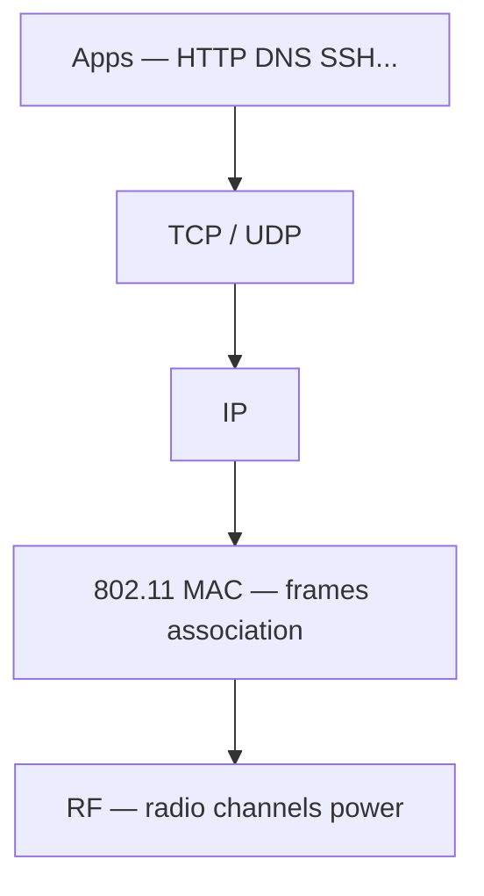
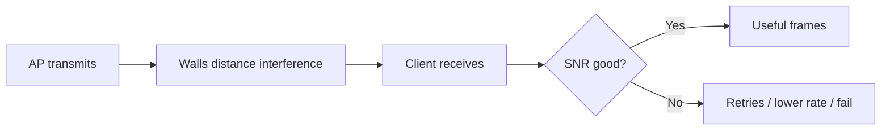
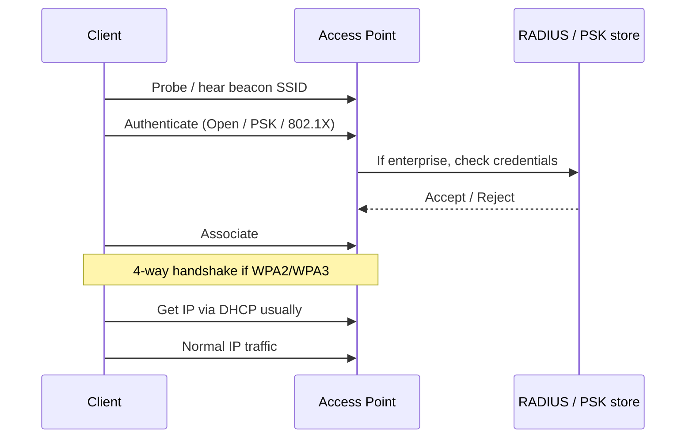
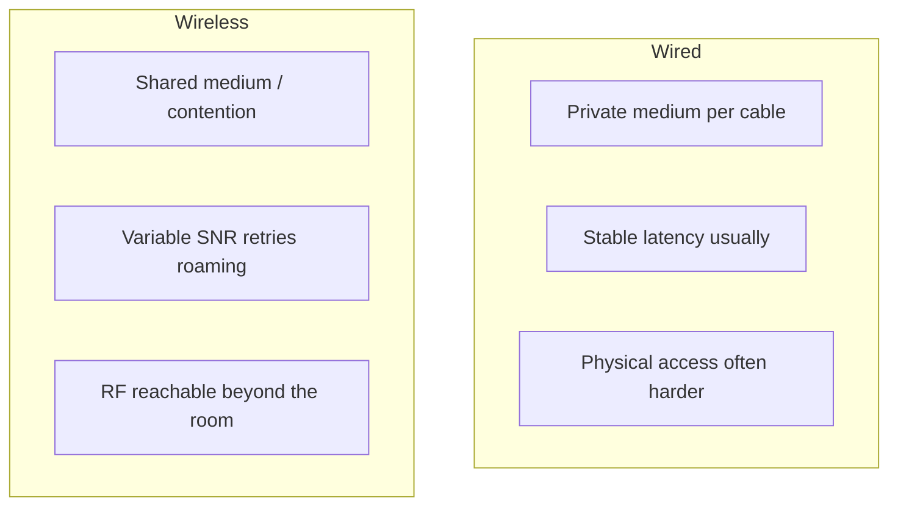
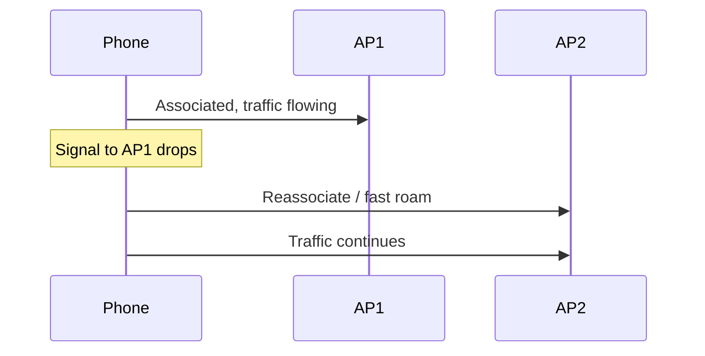
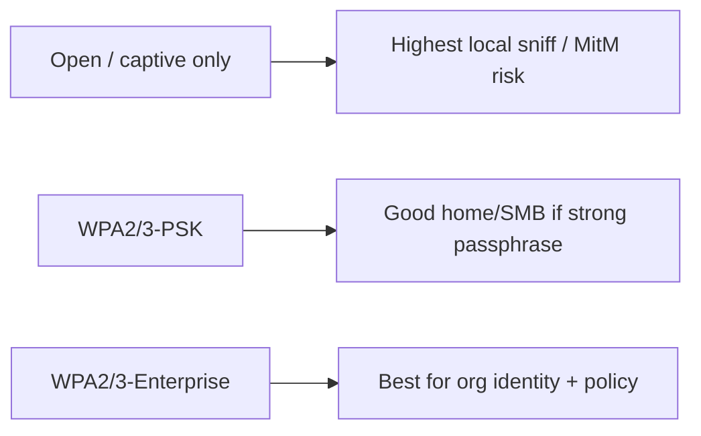
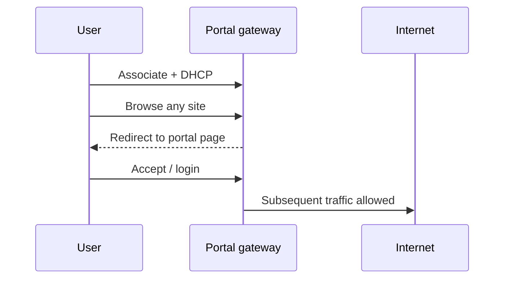
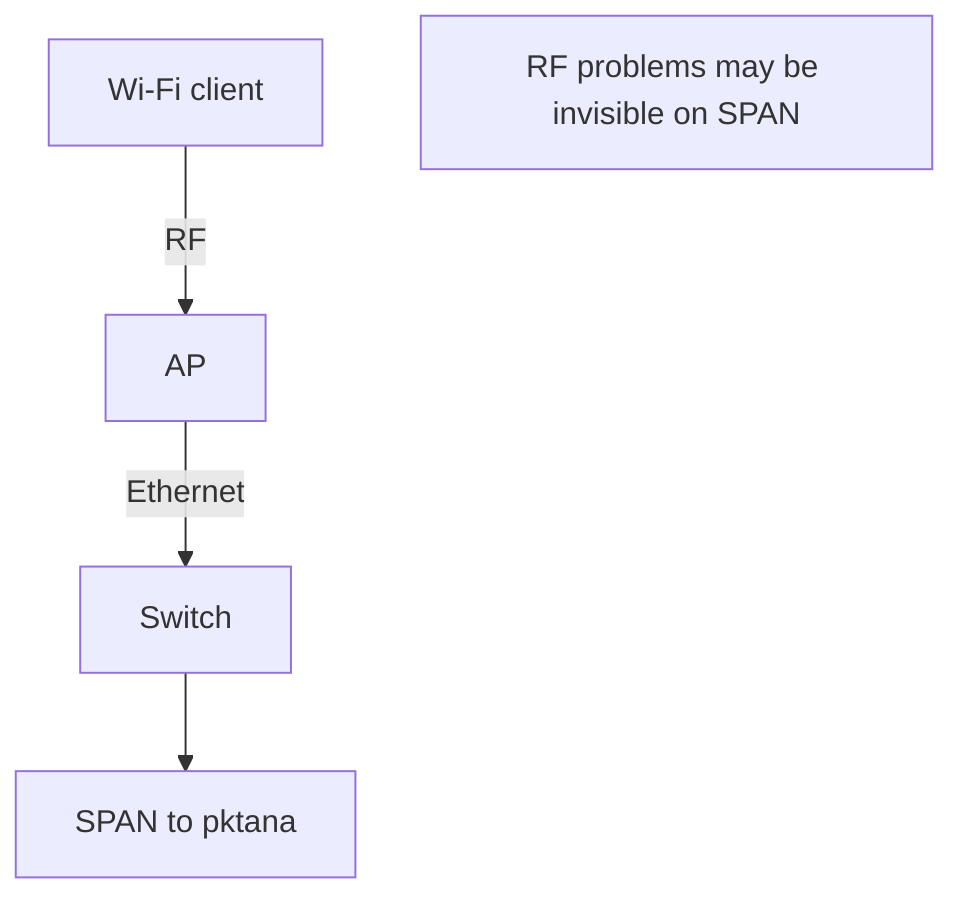
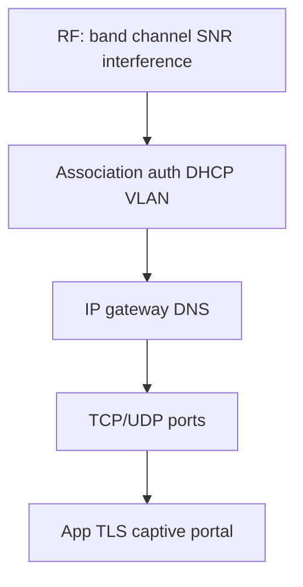

# Wireless Networking

Wireless networking moves frames over radio instead of copper or fiber. Above the radio and Wi‑Fi MAC, you still meet familiar friends: [IP](#protocols-reference/ipv4), [TCP](#protocols-reference/tcp)/[UDP](#protocols-reference/udp), [DNS](#protocols-reference/dns), [TLS](#protocols-reference/tls). The hard part is the shared, invisible medium.

This chapter covers RF basics, channels and interference, SSID/AP association and auth, Wi‑Fi vs Ethernet, roaming, security (WPA2/WPA3 and open Wi‑Fi risks), captive portals conceptually, capture limitations, and troubleshooting.

> **Remember:** Wi‑Fi is a **shared radio neighborhood**, not a private cable. Courtesy, contention, and security all change because of that.

---

## Where Wireless Fits in the Stack {#wireless-in-stack}



Compare with wired [Ethernet](#protocols-reference/ethernet): Layer 1/2 differ; Layer 3 and up are mostly the same ideas. Campus Wi‑Fi APs still hang under the hierarchical designs in [Topologies](#topologies).

---

## RF Basics (simple physics that saves careers) {#rf-basics}

### Frequency and wavelength

Wi‑Fi commonly uses:

| Band | Rough frequencies | Everyday traits |
|------|-------------------|-----------------|
| 2.4 GHz | ~2.4–2.5 GHz | Longer range, crowded, penetrates walls better |
| 5 GHz | ~5 GHz bands | More channels, shorter range, more capacity |
| 6 GHz | Wi‑Fi 6E / 7 | Even more spectrum where allowed |

Higher frequency → often **less wall penetration** and **more capacity** if designed well.

### Signal, noise, and SNR

- **RSSI / signal strength** — how loud the AP sounds to the client
- **Noise** — energy that is not useful signal
- **SNR** — signal relative to noise; low SNR → retries and slow rates



### Power and coverage vs capacity

Turning AP power to maximum can create **co-channel interference** between APs. Good design balances coverage (can I hear?) with capacity (can many clients talk without fighting?).

> **Remember:** **More power is not always better.** Overlapping APs on the same channel argue like people shouting in one room.

---

## Channels and Interference {#channels-interference}

### 2.4 GHz channel reality

In many regions, 2.4 GHz has channels 1–11 (or 1–13). Only **1, 6, and 11** are commonly treated as non-overlapping when using 20 MHz channels.


### 5 GHz / 6 GHz

More non-overlapping channels → easier to plan high-density offices, but watch DFS channels (radar avoidance) and client support.

### Interference types

| Source | Effect |
|--------|--------|
| Neighbor Wi‑Fi same channel | Contention / airtime wars |
| Microwave ovens, Bluetooth (2.4) | Noise / corruption |
| Bad channel width plan (80/160 MHz) | Fewer clean channels |
| Non-Wi‑Fi RF devices | Mysterious retries |

### Airtime

Even with “fast” PHY rates, one slow distant client can consume disproportionate **airtime**. Capacity planning cares about airtime fairness, not only megabits advertised on the box.

---

## SSID, AP, Association, and Authentication {#ssid-ap-assoc}

### Vocabulary

| Term | Meaning |
|------|---------|
| **AP** | Access point — radio + bridge into the wired LAN |
| **SSID** | Network name clients see (and attackers can see) |
| **BSSID** | AP radio MAC for that BSS |
| **STA / client** | Phone, laptop, IoT device |
| **Controller / cloud** | Optional brain managing many APs |



### Beacons and discovery

APs advertise SSIDs in **beacons**. Clients also **probe**. Hiding the SSID is weak security theater — frames still exist; determined clients and attackers can still find the network.

### Association vs authorization

- **Association** — client is attached to an AP’s radio BSS
- **Authentication / authorization** — proving identity and receiving network access (VLAN, ACL, bandwidth policy)

Enterprise Wi‑Fi often maps SSID → [VLAN](#protocols-reference/vlan) → firewall zone ([Security](#network-security)).

---

## Wi‑Fi vs Ethernet Comparison {#wifi-vs-ethernet}



| Topic | Ethernet | Wi‑Fi |
|-------|----------|-------|
| Medium | Guided cable/fiber | Shared RF |
| Duplex | Full duplex common | Half-duplex airtime model historically |
| Interference | EMI possible but rarer | Everyday (walls, neighbors, microwaves) |
| Mobility | Limited | First-class requirement |
| Capture | SPAN/tap on wire | Harder; need monitor mode / AP telemetry |
| Security edge | Port in a locked closet | Signal may leave the building |

Both still carry [IP](#protocols-reference/ipv4) and benefit from [TLS](#protocols-reference/tls) at the application edge.

> **Remember:** Treat Wi‑Fi as **convenient Ethernet with worse physics and a larger attack surface**, then design accordingly.

---

## Roaming {#roaming}

Users walk; sessions should survive.



### What “good roaming” needs

- Overlapping coverage at usable SNR (not just “one bar”)
- Same SSID/security domain across APs
- Fast transition features (802.11r/k/v in many enterprise systems)
- Sticky-client mitigation (phones that cling to a distant AP)

### Application impact

- [TCP](#protocols-reference/tcp) may pause briefly during roam
- Real-time voice/video feels jitter and loss first
- [VPN](#protocols-reference/vpn) tunnels may survive if the IP address stays stable (or break if DHCP changes)

---

## Wireless Security {#wireless-security}

### Open Wi‑Fi risks

Open networks (coffee shops, hotels) often mean:

- No encryption at the Wi‑Fi layer (or weak portal-only gates)
- Easier passive sniffing of cleartext
- Easier active attacks on the local segment (spoofing, rogue gateways)

Mitigations for users: prefer [HTTPS](#protocols-reference/https)/[TLS](#protocols-reference/tls), use a reputable [VPN](#protocols-reference/vpn), avoid sensitive cleartext protocols ([Telnet](#protocols-reference/telnet), plain [FTP](#protocols-reference/ftp), [HTTP](#protocols-reference/http)).

### WPA2 and WPA3 (conceptual)

| Mode | Idea | Notes |
|------|------|-------|
| WPA2-Personal (PSK) | Shared passphrase | Easy; passphrase sharing / cracking risk if weak |
| WPA2-Enterprise | 802.1X + RADIUS | Per-user credentials; better for orgs |
| WPA3-Personal | Stronger PSK handshake (SAE) | Better resistance to offline PSK attacks |
| WPA3-Enterprise | Stronger enterprise crypto options | Prefer on modern fleets |



### Other wireless threats

- **Evil twin / rogue AP** — fake SSID steals credentials or traffic
- **Deauth attacks** — force disconnects / disrupt service (where still effective)
- **Weak PSK** — offline dictionary attacks against captures (especially WPA2-PSK)
- **Guest isolation failures** — clients should not freely attack each other

Deepen general threat models in [Network Security](#network-security).

> **Remember:** **Encrypted Wi‑Fi protects the air link.** It does not replace app [TLS](#protocols-reference/tls), patching, or firewall policy.

---

## Captive Portals (conceptually) {#captive-portals}

Hotels and cafés often use a **captive portal**:

1. Client associates (often open or limited WPA).
2. First HTTP/HTTPS browsing is redirected to a login/accept page.
3. After accept/pay/login, a gateway allows general Internet access.



Analyst notes:

- Portals are **access control UX**, not end-to-end encryption.
- Broken portals produce odd DNS/HTTP patterns and TLS errors.
- Enterprise guest Wi‑Fi may combine portal + WPA + isolation + bandwidth caps.

---

## Capture Limitations on Wireless {#capture-limits}

Wired capture (SPAN/tap) sees bits on a cable. Wireless capture is messier:

| Challenge | Why it hurts |
|-----------|--------------|
| Encryption | WPA2/3 ciphertext hides payloads without keys |
| Channel hopping | You only hear the channel you monitor |
| AP vs client view | Different frames visible depending on vantage |
| Driver/monitor mode | Not all NICs/OS setups support useful RF capture |
| Management frames | Beacons/probes/auth need special filters |

Practical approaches:

- Capture on the **wired side** of the AP/controller (often easiest for app troubleshooting)
- Use vendor AP telemetry / packet capture features
- For RF issues, use spectrum/Wi‑Fi analyzers, not only IP PCAPs
- In pktana, remember: a clean [TCP](#protocols-reference/tcp) handshake on the wired mirror may still coexist with client RF pain you cannot see



---

## Troubleshooting Playbook {#wifi-troubleshooting}

Work **bottom-up**, same OSI habit as wired:



| Symptom | Likely layer | Checks |
|---------|--------------|--------|
| No networks listed | RF / radio off / band | Airplane mode, AP up, regulatory domain |
| Sees SSID, won’t join | Auth / PSK / 802.1X | Password, certs, RADIUS |
| Joins, no IP | DHCP / VLAN | Helper, DHCP pool, wrong VLAN |
| IP OK, no Internet | Gateway / DNS / portal | Ping gateway, resolve names, portal state |
| Slow / sticky | RF / roaming / airtime | Channel plan, sticky AP, interference |
| Works on Ethernet, fails on Wi‑Fi | Wireless path only | Compare wired vs wireless captures |

### pktana tips

- Compare a failing Wi‑Fi client’s traffic after it reaches the LAN.
- Filter [DHCP](#protocols-reference/dhcp), [DNS](#protocols-reference/dns), then app ports.
- If TLS fails only on guest Wi‑Fi, suspect portal interception or broken time/[NTP](#protocols-reference/ntp).

---

## Hands-On Tasks

```task
TITLE: Explain one coffee-shop session
LEVEL: beginner
STEPS:
1. List: associate → (portal?) → DHCP → DNS → TLS → HTTPS
2. Mark which steps are Wi-Fi-specific vs identical to Ethernet
3. Open Network Security and note one extra risk of open Wi-Fi
GOAL: Separate RF/access steps from Internet application steps
```

```task
TITLE: Channel planning sketch
LEVEL: intermediate
STEPS:
1. Draw three APs in a hallway on 2.4 GHz
2. Assign only 1/6/11 without adjacent same-channel neighbors if possible
3. Write what goes wrong if all three use channel 6
GOAL: Feel co-channel interference before you meet it in a survey
```

```task
TITLE: Wired-side capture mindset
LEVEL: intermediate
STEPS:
1. Invent a user: “Wi-Fi is slow”
2. Decide what a SPAN behind the AP can and cannot prove
3. List two RF checks that need a wireless tool instead of IP PCAP
GOAL: Avoid false confidence from wired-only evidence
```

```task
TITLE: WPA mode chooser
LEVEL: beginner
STEPS:
1. Home with family devices → pick WPA3-Personal or WPA2-PSK strong passphrase
2. Company laptops with directory accounts → pick Enterprise 802.1X
3. Public lobby → guest SSID + isolation + portal/policy notes
GOAL: Match security mode to identity model
```

---

## Knowledge Check

```quiz
QUESTION: Above Wi-Fi Layer 2, traffic is still commonly:
OPTIONS:
Required to abandon IP
Carried as IP packets to apps over TCP/UDP
Replaced entirely by STP
Forced to use Telnet
ANSWER: 1
EXPLAIN: Wi-Fi changes L1/L2; IP and transport remain standard.
```

```quiz
QUESTION: Non-overlapping 2.4 GHz channels commonly recommended are:
OPTIONS:
2, 3, and 4 only
1, 6, and 11
Every integer equally
Only channel 14 everywhere
ANSWER: 1
EXPLAIN: 1/6/11 are the classic non-overlapping 20 MHz set in many regions.
```

```quiz
QUESTION: An SSID is best described as:
OPTIONS:
A Layer 3 routing protocol
The human-readable wireless network name
A TLS certificate field only
A fiber strand color
ANSWER: 1
EXPLAIN: SSID is the network name advertised/selected by clients.
```

```quiz
QUESTION: Compared with Ethernet, Wi-Fi typically has:
OPTIONS:
A private collision-free cable per client always
A shared RF medium with contention and variable SNR
Guaranteed identical latency forever
No need for authentication ever
ANSWER: 1
EXPLAIN: Radio is shared and environment-sensitive.
```

```quiz
QUESTION: Open coffee-shop Wi-Fi is risky mainly because:
OPTIONS:
DNS ceases to exist
Local traffic may be easier to sniff or manipulate without Wi-Fi encryption
Switches cannot learn MACs
IPv6 is illegal there
ANSWER: 1
EXPLAIN: Lack of robust link encryption increases local attack surface.
```

```quiz
QUESTION: WPA3-Personal improves on classic WPA2-PSK partly by:
OPTIONS:
Removing all passwords forever
Using a stronger handshake (SAE) against offline PSK attacks
Replacing IP with ARP only
Disabling DHCP
ANSWER: 1
EXPLAIN: SAE strengthens personal-mode authentication vs older PSK attacks.
```

```quiz
QUESTION: A captive portal primarily:
OPTIONS:
Encrypts all Internet traffic end-to-end by itself
Gates access with a web login/accept step after association
Replaces BGP on the Internet
Is a physical topology shape
ANSWER: 1
EXPLAIN: Portals are access gateways/UX, not full end-to-end crypto.
```

```quiz
QUESTION: SPAN capture behind an AP may miss:
OPTIONS:
All IP addresses always
RF retries, interference, and many over-the-air management issues
The existence of Ethernet
DHCP as a protocol category
ANSWER: 1
EXPLAIN: Wired mirrors see post-wireless traffic, not full RF behavior.
```

```quiz
QUESTION: Sticky client problems are mainly about:
OPTIONS:
Clients refusing to leave a distant weak AP
Fiber polarity
SMTP banner length
VLAN 1 color codes
ANSWER: 0
EXPLAIN: Sticky clients roam too late, hurting performance.
```

```quiz
QUESTION: Enterprise Wi-Fi with 802.1X typically authenticates users via:
OPTIONS:
Only a shared coffee password posted on the wall
RADIUS / directory-backed credentials
Random cable colors
STP root priority alone
ANSWER: 1
EXPLAIN: Enterprise mode uses 802.1X and an authentication server.
```

---

## What You Should Feel Confident Saying

- How RF bands, channels, SNR, and interference affect users
- SSID/AP association vs authentication
- Why Wi‑Fi differs from Ethernet operationally and forensically
- WPA2/WPA3 and open Wi‑Fi risk in plain language
- How to troubleshoot wireless with OSI habits and honest capture limits

---

## Next

Defend wired and wireless paths: [Network Security](#network-security).  
Optional: revisit [Physical Layer](#physical-layer) and [Data Link](#data-link-layer) for medium vs framing.
