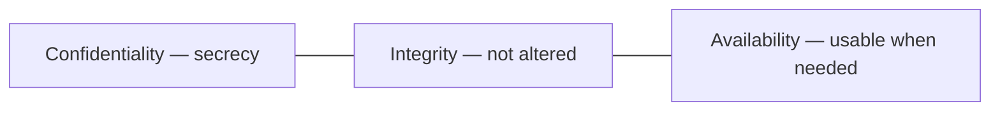
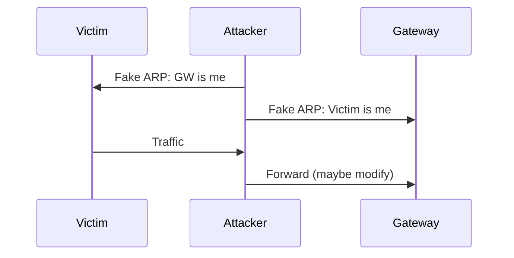
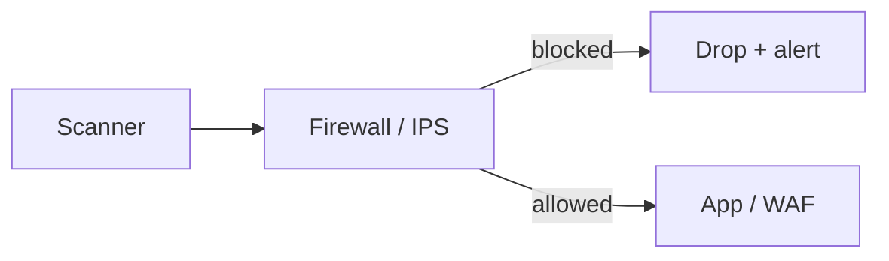
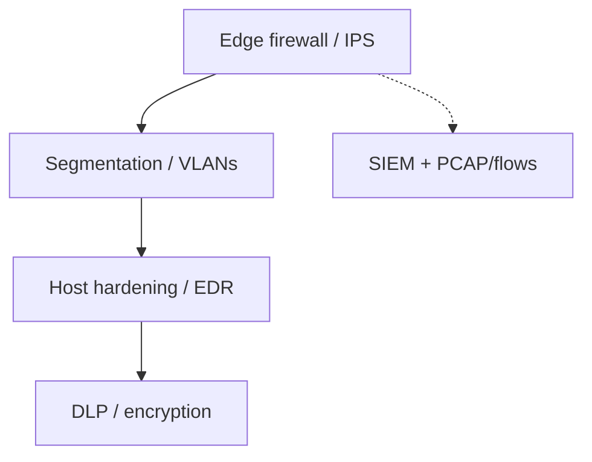

# Network Security

Network security protects **confidentiality**, **integrity**, and **availability** (the CIA triad) using architecture, protocols, and monitoring — not one magic box.

> **Remember:** Security = **assume someone is curious or hostile**, then verify, segment, encrypt, and watch.

---

## CIA Triad (memory pegs)



| Goal | Threat example | Common control |
|------|----------------|----------------|
| Confidentiality | Sniffing | [TLS](#protocols-reference/tls), [VPN](#protocols-reference/vpn), [IPsec](#protocols-reference/ipsec) |
| Integrity | Tampering / MitM | crypto hashes, TLS, signing |
| Availability | DDoS | rate limits, anycast, capacity |

Also see [DLP & IDPS](#dlp-idps).

---

## Attack Flows You’ll Recognize

### MitM via ARP spoofing



Related: [ARP](#protocols-reference/arp), [Data Link](#data-link-layer).

### Path of a typical web exploit attempt



Controls: [Firewall](#protocols-reference/firewall) · [IDPS](#dlp-idps) · [TLS](#protocols-reference/tls)

---

## Control Layers (defense in depth)



| Control | One-liner | Link |
|---------|-----------|------|
| Firewall | Allow/deny by policy | [Firewall](#protocols-reference/firewall) |
| IDS/IPS | Detect / block attacks | [DLP & IDPS](#dlp-idps) |
| VPN | Private tunnel over public network | [VPN](#protocols-reference/vpn), [WireGuard](#protocols-reference/wireguard) |
| TLS | Encrypt app sessions | [TLS](#protocols-reference/tls) |
| Zero Trust | Never trust by location alone | below |
| DLP | Stop sensitive data leaks | [DLP](#dlp-idps) |

---

## Zero Trust (simple)

Old model: “inside LAN = trusted.”  
Zero Trust: **authenticate and authorize every request**, assume breach, least privilege.

---

## What to Look for in pktana

- Unexpected outbound ports ([Connections](#transport-layer) idea)
- Top talkers / odd destinations (Flows)
- Cleartext secrets on [HTTP](#protocols-reference/http)/[FTP](#protocols-reference/ftp)/[Telnet](#protocols-reference/telnet)
- ARP anomalies on the LAN

---

## Knowledge Check

```quiz
QUESTION: Confidentiality mainly means:
OPTIONS:
Systems are never rebooted
Only authorized parties can read the data
Cables are always blue
DNS is disabled
ANSWER: 1
EXPLAIN: Confidentiality is about secrecy / authorized access to content.
```

```quiz
QUESTION: ARP spoofing is dangerous because it can enable:
OPTIONS:
Faster fiber
Man-in-the-Middle on a LAN
Automatic BGP hijacks only in space
VLAN creation by itself
ANSWER: 1
EXPLAIN: Poisoned ARP tables can steer traffic through an attacker.
```

```quiz
QUESTION: Defense in depth means:
OPTIONS:
One firewall is enough forever
Multiple layered controls so one failure is not fatal
Disabling all routing
Using only UDP
ANSWER: 1
EXPLAIN: Layered controls reduce single points of security failure.
```

---

## Next

[DLP & IDPS](#dlp-idps) · or protocol deep dives in [Protocols Reference](#protocols-reference).
