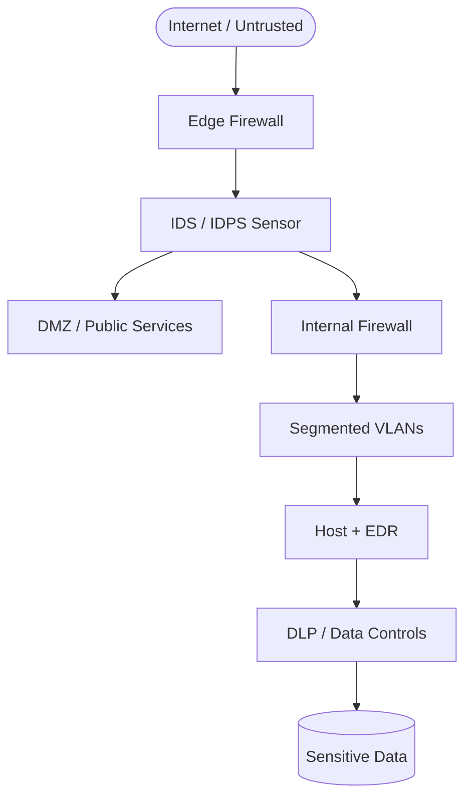
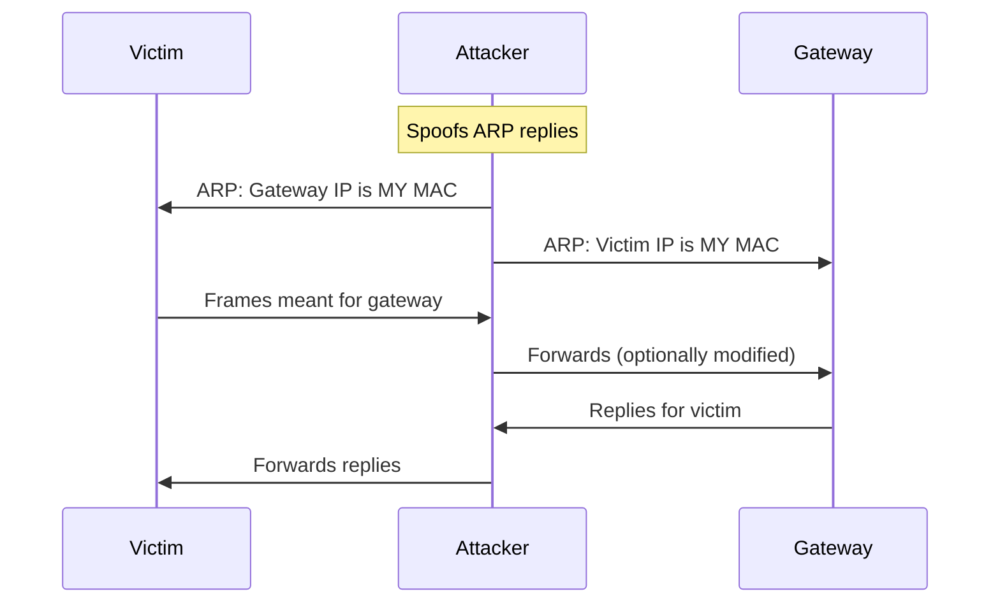

# Network Security

Network security is the practice of protecting a network and the data flowing through it from unauthorized access, misuse, modification, or disruption. It's not a single technology — it's a combination of policies, architectures, tools, and operational practices.

---

## The CIA Triad

Every security control exists to protect one or more of these three properties:

**Confidentiality** — Only authorized parties can read the data. *Threat: eavesdropping, data breach.*

**Integrity** — Data is not modified in transit or at rest without detection. *Threat: man-in-the-middle, tampering.*

**Availability** — Systems and services are accessible when needed. *Threat: DDoS, ransomware.*

---

## Common Network Attacks

### Passive Attacks (intercept without modifying)

**Eavesdropping / Sniffing** — capturing packets flowing through a network. Possible on:
- Shared media (Wi-Fi, old hub-based networks)
- With physical access to cables
- By compromising a switch (ARP poisoning, port mirroring)

Defense: encryption (TLS, IPsec, WireGuard).

**Traffic Analysis** — even encrypted traffic reveals patterns: who talks to whom, how often, how much. Used by nation-state adversaries.

### Active Attacks (modify or inject traffic)

**Man-in-the-Middle (MitM)** — attacker positions themselves between two communicating parties, intercepting and potentially modifying traffic.

Techniques:
- **ARP Poisoning** — send fake ARP replies so devices believe the attacker's MAC is the gateway's IP. All traffic goes through the attacker.
- **DNS Spoofing** — return false DNS answers to redirect users to malicious servers
- **SSL Stripping** — downgrade HTTPS to HTTP so the attacker can read traffic

Defense: mutual TLS (mTLS), HSTS, DNSSEC, 802.1X port authentication.

**Replay Attack** — capture a valid authentication packet and resend it later to impersonate the original sender.

Defense: nonces, timestamps, session tokens.

**IP Spoofing** — forge the source IP address in packets. Used to:
- Impersonate a trusted source
- Amplify DDoS attacks (send request with victim's IP as source; response goes to victim)

Defense: ingress filtering (BCP38) at ISPs, SYN cookies.

### Denial of Service (DoS) and DDoS

**DoS** — flood a target with traffic or exploit a vulnerability to make it unavailable.

**DDoS (Distributed DoS)** — coordinate thousands or millions of compromised machines (a **botnet**) to overwhelm the target. Harder to block because traffic comes from many sources.

Common types:
- **Volume-based:** UDP flood, ICMP flood (saturate bandwidth)
- **Protocol-based:** SYN flood (exhaust server's connection table), Ping of Death
- **Application-layer:** HTTP flood (exhaust server resources with valid requests)

Amplification attacks: send a small request with a spoofed source IP; the response (much larger) goes to the victim.
- DNS amplification: 60-byte query → 3000-byte response (50× amplification)
- NTP amplification: MONLIST request → up to 556× amplification

Defense: BCP38, anycast scrubbing, rate limiting, DDoS mitigation services (Cloudflare, Akamai).

---

## Firewalls

A firewall **controls which traffic is allowed** to pass between network zones based on rules.

### Types

**Packet filter (stateless):** checks each packet individually against rules (src/dst IP, port, protocol). Fast but can't understand session context.

**Stateful firewall:** tracks connection state. Knows that a packet returning on port 443 is a response to a request the inside host made — and only allows it in that context.

**Application-layer gateway (proxy/NGFW):** understands Layer 7 protocols. Can allow HTTP but block uploads, or allow DNS but detect DNS tunneling.

**Next-Generation Firewall (NGFW):** combines stateful inspection with IPS, TLS inspection, application identification, and user identity awareness.

### Common Rule Patterns

```
# Allow established connections (stateful)
ALLOW  TCP  any → any  ESTABLISHED

# Allow outbound HTTPS
ALLOW  TCP  LAN → any  dport=443

# Allow inbound SSH to a bastion host only
ALLOW  TCP  any → 10.0.0.5  dport=22

# Deny everything else
DENY  all  any → any
```

---

## Intrusion Detection and Prevention

**IDS (Intrusion Detection System)** — monitors traffic and alerts on suspicious patterns. Passive — does not block.

**IPS (Intrusion Prevention System)** — inline with traffic; actively blocks attacks.

Detection methods:
- **Signature-based:** compares traffic against a database of known attack patterns (fast, high accuracy, misses zero-days)
- **Anomaly-based:** baseline normal behavior, alert on deviations (catches novel attacks, but high false positive rate)
- **Behavioral / ML-based:** model normal flows, flag unusual ones

---

## VPNs — Virtual Private Networks

A VPN creates an **encrypted tunnel** over a public network, making it appear as if you're on the private network directly.

### IPsec

The most widely deployed VPN protocol. Two modes:
- **Transport mode:** encrypts only the payload (IP header visible)
- **Tunnel mode:** encrypts the entire original packet; new IP header added (used for site-to-site)

Components: IKE (key exchange) + ESP (encapsulating security payload, provides encryption) + AH (authentication header, provides integrity only).

### WireGuard

Modern, lean VPN protocol (~4000 lines of code vs. IPsec's ~400,000). Uses state-of-the-art cryptography (ChaCha20, Curve25519, BLAKE2). Much faster to configure, faster to connect, kernel-native on Linux.

Port: UDP 51820 (configurable).

### SSL/TLS VPN

Runs over HTTPS (port 443 UDP/TCP). Penetrates firewalls that allow HTTPS. Examples: OpenVPN (port 1194 UDP or 443 TCP), Cisco AnyConnect.

---

## Network Segmentation and Zero Trust

**Segmentation:** divide your network into zones; traffic between zones must pass through a firewall.
- DMZ for public-facing servers
- Separate VLANs for OT/IoT, guest, corporate
- Micro-segmentation in the data center (per-workload firewall rules)

**Zero Trust:** "never trust, always verify." No implicit trust based on network location. Every access request is authenticated and authorized regardless of whether it comes from inside or outside the network.

Key Zero Trust principles:
- Verify explicitly (authenticate every request)
- Use least privilege (minimal access)
- Assume breach (detect and respond; limit blast radius)

---

## TLS/Certificate Management

**Certificate Authority (CA):** issues and signs certificates. Your browser trusts a ~150 built-in root CAs.

**PKI (Public Key Infrastructure):** the system of CAs, certificates, and revocation that makes TLS work.

**Certificate Transparency (CT):** all publicly-trusted certificates are logged in public append-only logs. Lets you detect mis-issued certs.

**HSTS (HTTP Strict Transport Security):** tells browsers "always use HTTPS for this domain." Prevents SSL stripping.

**DANE (DNS-Based Authentication of Named Entities):** publish TLS cert fingerprints in DNSSEC-signed DNS records, bypassing the CA system.

---

## Network Monitoring and Detection

**NetFlow / IPFIX:** routers export 5-tuple flow records (src/dst IP, port, protocol, bytes, packets) to a collector. Invaluable for detecting anomalies, lateral movement, and data exfiltration.

**PCAP analysis:** deep packet capture for forensics. pktana is built for this.

**SIEM (Security Information and Event Management):** aggregates logs from firewalls, IDS, endpoints, and cloud services; correlates events; alerts on multi-stage attacks.

**Honeypots:** decoy systems that should never receive legitimate traffic. Any connection to a honeypot is inherently suspicious.

---

## Try It With pktana

```bash
# Watch for suspicious connections (unusual ports, foreign IPs)
pktana connections

# Capture and look for ARP anomalies
pktana capture --interface eth0 --filter "arp" --count 50

# Full packet capture for forensics
pktana capture --interface eth0 --count 1000

# Check interface stats for unusual packet rates
pktana nic stats eth0
```

In the pktana Web UI, the **Flow Capture** tab shows top talkers — useful for spotting:
- Unexpected outbound connections (possible C2 traffic)
- High-volume internal-to-internal traffic (possible lateral movement)
- Unknown protocols (possible covert channel)

---

## Defense-in-Depth Flow

How controls stack from edge to data:



**ARP poisoning MitM — what happens on the wire:**



---

## Hands-On Tasks

```task
TITLE: Spot ARP anomalies with pktana
LEVEL: beginner
STEPS:
1. Start a short capture: `pktana capture --interface eth0 --filter "arp" --count 40`
2. Note how many unique MAC addresses claim the same gateway IP
3. In the Web UI, open Connections and compare local MACs vs expected gateway MAC
GOAL: Explain why duplicate IP→MAC mappings are a red flag for MitM
HINT: On a healthy LAN, one IP should map to one MAC (except brief ARP races)
```

```task
TITLE: Map CIA to real controls
LEVEL: beginner
STEPS:
1. Pick one service you run (SSH, HTTPS site, or file share)
2. List one control for Confidentiality, one for Integrity, one for Availability
3. Write which pktana view would help verify each control (Flows, Connections, Capture)
GOAL: Connect abstract CIA goals to concrete network evidence
```

---

## Knowledge Check

```quiz
QUESTION: Which attack places the adversary between two parties to read or alter traffic?
OPTIONS:
Denial of Service
Man-in-the-Middle
Port scan
DHCP starvation
ANSWER: 1
EXPLAIN: MitM sits on the path (often via ARP/DNS tricks) so traffic can be intercepted or modified.
```

```quiz
QUESTION: What does a stateful firewall track that a pure packet filter does not?
OPTIONS:
Only destination port numbers
Connection / session state
Wi-Fi channel numbers
Cable category ratings
ANSWER: 1
EXPLAIN: Stateful firewalls remember established flows and allow related return traffic.
```

```quiz
QUESTION: In Zero Trust, access is granted primarily because the client is on the corporate LAN.
OPTIONS:
True
False
ANSWER: 1
EXPLAIN: Zero Trust verifies every request; network location alone is not enough.
```

---

## Summary

- The **CIA Triad** (Confidentiality, Integrity, Availability) guides all security decisions
- Common attacks: eavesdropping, ARP poisoning, DNS spoofing, SYN flood, DDoS
- **Firewalls** filter traffic; **IDS/IPS / IDPS** detect and block intrusions
- **DLP** focuses on preventing sensitive data from leaving approved paths
- **VPNs** (IPsec, WireGuard, SSL) encrypt traffic over untrusted networks
- **Zero Trust** replaces implicit network trust with continuous verification
- Monitoring tools (NetFlow, PCAP, SIEM) are essential for detection and forensics

**Next:** [DLP & IDPS](#dlp-idps) — data loss prevention and intrusion detection/prevention, then [Protocols Reference](#protocols-reference)
