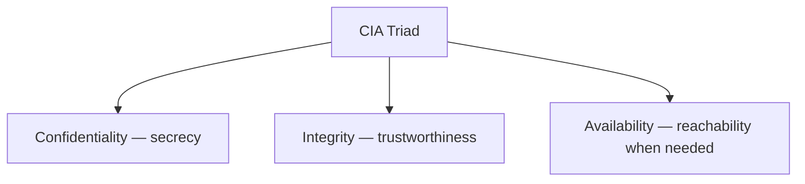
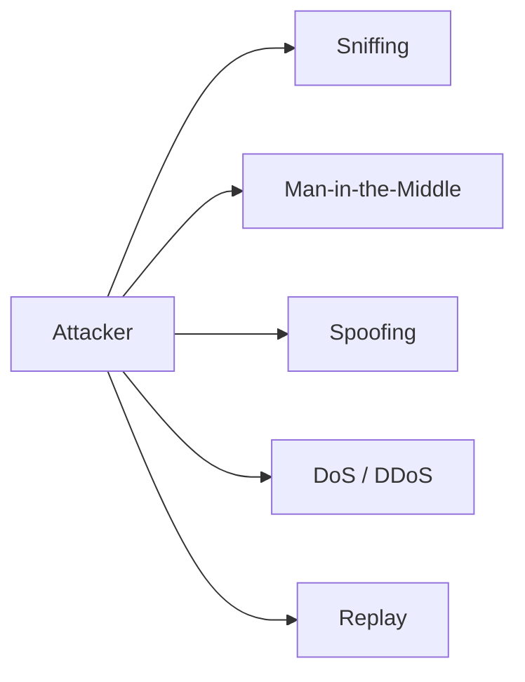
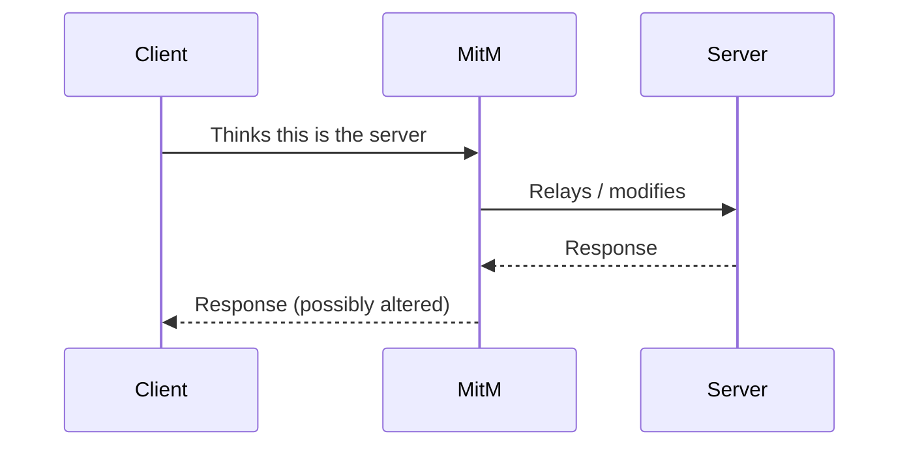
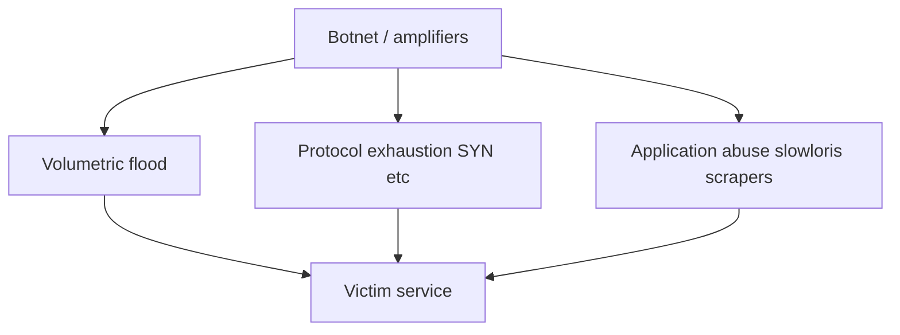
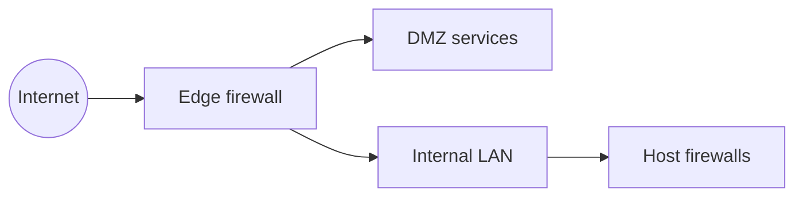
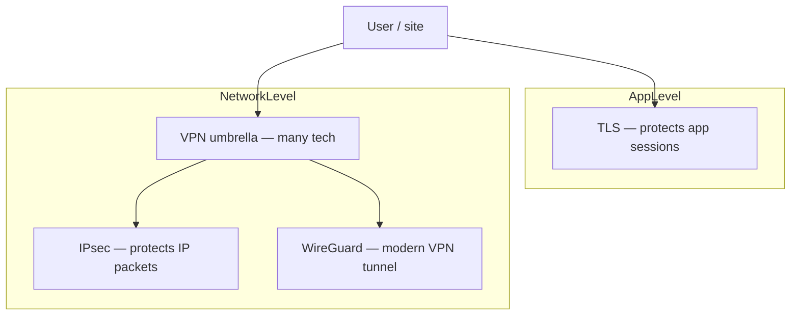
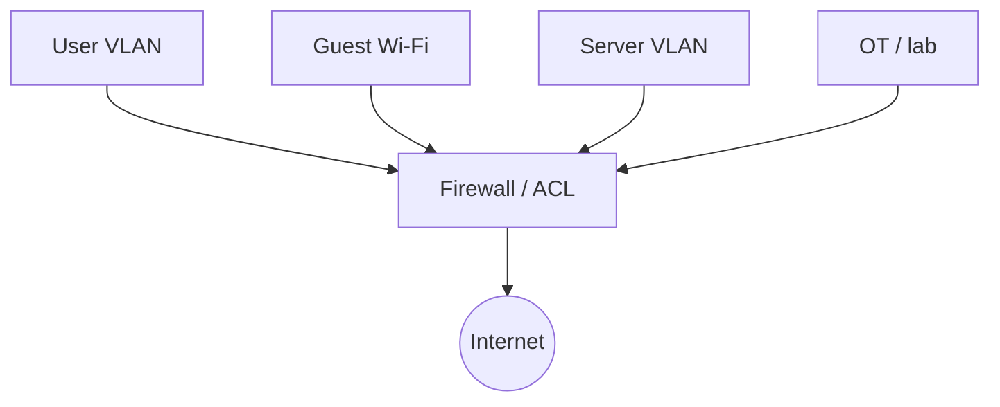
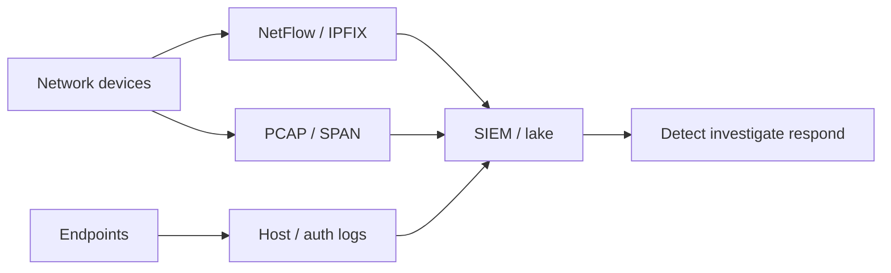
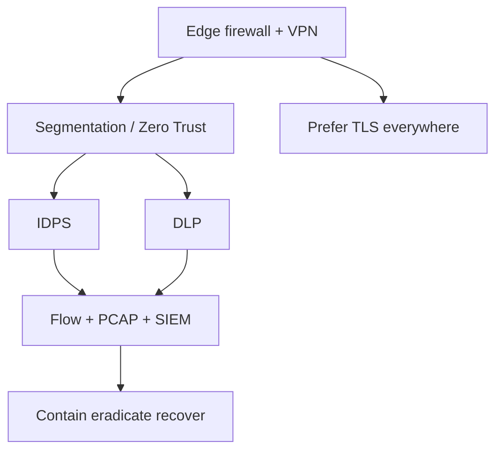

# Network Security

Network security protects **confidentiality**, **integrity**, and **availability** of systems and data as they move across hostile or simply curious paths. You already know the pipes — [Ethernet](#protocols-reference/ethernet), [IP](#protocols-reference/ipv4), [TCP](#protocols-reference/tcp), [DNS](#protocols-reference/dns), [TLS](#protocols-reference/tls). This chapter teaches how attackers abuse those pipes and how defenders add control, encryption, segmentation, and monitoring.

Pair this lesson with [DLP & IDPS](#dlp-idps) for content loss prevention and intrusion detection/prevention depth.

> **Remember:** Security is not a product you buy once. It is **assumptions + controls + evidence** under continuous change.

---

## The CIA Triad (deeply) {#cia-triad}



### Confidentiality

Only authorized parties can read the information.

| Example need | Network-ish control |
|--------------|---------------------|
| Hide web passwords in transit | [TLS](#protocols-reference/tls) / [HTTPS](#protocols-reference/https) |
| Hide site-to-site traffic | [VPN](#protocols-reference/vpn) / [IPsec](#protocols-reference/ipsec) / [WireGuard](#protocols-reference/wireguard) |
| Limit who can even reach a subnet | Firewall, segmentation, Zero Trust |
| Stop secret files leaving | [DLP](#dlp-idps) |

Failure mode: eavesdropping / sniffing cleartext on Wi‑Fi, mirrored ports, or compromised routers.

### Integrity

Data and systems are not altered in unauthorized ways — or alterations are detectable.

| Example need | Control ideas |
|--------------|---------------|
| Detect tampered packets | Cryptographic MACs / AEAD in TLS, IPsec |
| Prevent host file sabotage | Endpoint controls, signed updates |
| Trust DNS answers more | DNSSEC (where deployed), DoH/DoT trade-offs |
| Spot spoofed identities | 802.1X, mutual TLS, SSH host keys |

Failure mode: MitM rewriting traffic, spoofed ARP teaching a false gateway, poisoned cache.

### Availability

Authorized users can use the service when they should.

| Example need | Control ideas |
|--------------|---------------|
| Survive link failure | Redundant topologies ([Topologies](#topologies)) |
| Survive floods | Rate limits, Anycast, scrubbing, firewall/IDPS |
| Survive ransomware | Backups, least privilege, segmentation |
| Survive misconfig | Change control, monitoring, rollback |

Failure mode: DoS/DDoS, cable cuts, certificate expiry taking down [HTTPS](#protocols-reference/https), DHCP exhaustion.

> **Remember:** Attackers only need to break **one** CIA letter to win for their goal. Defenders must hold **all three**.

### CIA trade-offs (honest version)

- Heavy inspection can add latency (availability/performance tension).
- Strict lockdown can block legitimate work (availability vs confidentiality).
- Encryption protects confidentiality/integrity but can hide threats from network DLP/IDPS — see [DLP & IDPS](#dlp-idps).

---

## Threats You Must Recognize {#threats}



### Sniffing (eavesdropping)

Passive capture of traffic on a shared medium or compromised path.

- Clear [HTTP](#protocols-reference/http), [Telnet](#protocols-reference/telnet), [FTP](#protocols-reference/ftp) credentials are historically tragic.
- Open [Wi‑Fi](#wireless-networking) increases opportunity.
- Encrypted payloads still leak **metadata**: IPs, ports, SNI sometimes, sizes, timing.

### Man-in-the-Middle (MitM)

Attacker positions between parties and can read and/or modify traffic.



Classic enablers: ARP spoofing on LAN ([ARP](#protocols-reference/arp)), rogue Wi‑Fi AP, compromised proxy, failed certificate validation.

### Spoofing

Forging identity fields: MAC, IP, DNS answers, email From headers, BGP routes (advanced).

| Spoof type | Local impact |
|------------|--------------|
| MAC spoof | Bypass naive port filters |
| IP spoof | Confuse ACLs / amplify reflection (with care elsewhere) |
| ARP spoof | Steal gateway role → MitM |
| DNS spoof | Send users to fake sites |

### DoS and DDoS

**Denial of Service** makes a resource unavailable. **Distributed** DoS uses many sources.



Not every outage is an attack — misconfig and capacity errors look similar. Evidence matters.

### Replay

Capture a valid message and resend it later to repeat an action (old auth tokens, poorly designed challenge-response). Modern protocols use nonces, timestamps, and session keys to reduce this.

---

## Firewalls — Types and Placement {#firewalls}

A [firewall](#protocols-reference/firewall) enforces who may talk to whom, on which ports/apps, under which conditions.



| Type | Idea | Strength | Weakness |
|------|------|----------|----------|
| Packet filter | IP/port/protocol rules | Fast, simple | Little app awareness |
| Stateful | Tracks connections | Understands return traffic | Still limited app insight |
| Next-gen / app-aware | Users, apps, IPS features | Rich policy | Complexity / cost / TLS limits |
| Host-based | On the endpoint OS | Knows local process context | Must be managed at scale |
| Cloud SG / NSG | Hypervisor / VPC rules | Fits cloud topologies | Easy to mis-open |

### Policy thinking

- Default deny inbound from untrusted zones
- Egress filtering (what should leave?)
- Separate admin paths from user paths
- Log allow/deny decisions for hunting

> **Remember:** A firewall is a **policy enforcement point**, not a magic shield. Bad rules punch holes; unused rules rot.

---

## VPN, IPsec, WireGuard, and TLS {#crypto-paths}

Encryption protects confidentiality/integrity across untrusted networks.



| Technology | Typical job | Learn more |
|------------|-------------|------------|
| [TLS](#protocols-reference/tls) | Encrypt HTTP and many apps | [HTTPS](#protocols-reference/https) |
| [IPsec](#protocols-reference/ipsec) | Site-to-site or host VPN at IP layer | Protocols Reference |
| [WireGuard](#protocols-reference/wireguard) | Simple modern VPN tunnels | Protocols Reference |
| [VPN](#protocols-reference/vpn) | General private overlay idea | Protocols Reference |
| [SSH](#protocols-reference/ssh) | Admin shell + tunnels | Application layer |

### Mental model

- **TLS** = seal the letter contents between apps.
- **VPN** = build a private road across a public city, then send letters on that road.
- You often want **both**: VPN for network reachability/trust boundaries, TLS for application authenticity.

---

## Segmentation and Zero Trust {#segmentation-zero-trust}

### Segmentation

Break flat networks into zones so compromise does not equal “whole company.”



Related to [VLAN](#protocols-reference/vlan) design and [Topologies](#topologies): logical zones on shared physical gear.

### Zero Trust (practical reading)

Classic perimeter thinking: “inside = trusted.” Zero Trust challenges that:

- Authenticate and authorize **every** session as much as practical
- Assume breach; limit lateral movement
- Prefer identity-aware proxies, mTLS, device posture, least privilege
- Network location alone is not enough proof

You will still use firewalls and VLANs — Zero Trust adds continuous verification on top, not “delete the firewall.”

---

## Monitoring: NetFlow, PCAP, SIEM {#monitoring}

You cannot defend what you cannot see.



| Telemetry | Good for | Weak for |
|-----------|----------|----------|
| NetFlow/IPFIX | Who talked to whom, volume, ports | Payloads |
| PCAP | Proof, protocol decode, malware artifacts | Long retention cost |
| SIEM | Correlation, alerts, cases | Garbage-in if sources are blind |
| IDPS alerts | Known/anomalous attacks | Needs tuning — [IDPS](#dlp-idps) |

### pktana hunting tips {#pktana-hunting}

Use pktana as a microscope, not only a dashboard:

1. **Top talkers / flows** — sudden GB to unknown destinations (exfil or backup misconfig).
2. **Odd listeners** — unexpected local ports accepting connections.
3. **Beacon-like patterns** — regular small connections to rare domains/IPs (possible C2).
4. **Cleartext secrets** — HTTP basic auth, Telnet, FTP (fix immediately).
5. **Failed handshakes** — SYN floods, TLS alerts storms, DNS NXDOMAIN spikes.
6. **After an IDPS alert** — filter the 5-tuple and export evidence PCAP for the ticket.

```bash
pktana connections
pktana capture --interface eth0 --filter "tcp port 445 or tcp port 3389" --count 100
pktana web --port 8080
```

Always pair packet proof with identity logs when possible: who was logged into the host that sourced the traffic?

---

## Putting Controls Together {#defense-in-depth}



Defense in depth means no single control is your only hope. Encryption, filtering, detection, and response reinforce each other.

---

## Hands-On Tasks

```task
TITLE: CIA classification drill
LEVEL: beginner
STEPS:
1. For sniffing, MitM, and DDoS, write which CIA letter is primarily hit
2. Name one control that primarily restores that letter
3. Link to the matching protocol or DLP/IDPS page
GOAL: Connect threats to principles, not only product names
```

```task
TITLE: Sketch a three-zone office
LEVEL: intermediate
STEPS:
1. Draw users, servers, guest Wi-Fi, Internet
2. Place a firewall and label two rules (one allow, one deny)
3. Mark where TLS and where site-to-site VPN would sit
GOAL: Practice placement, not vendor CLI
```

```task
TITLE: pktana hunt storyboard
LEVEL: intermediate
STEPS:
1. Invent alert: workstation → rare IP :4444 every 60s
2. List flow fields you would record
3. Decide next: PCAP sample, host isolate, IDPS block, or all three
GOAL: Build an analyst sequence you can reuse
```

```task
TITLE: Encryption layer picker
LEVEL: beginner
STEPS:
1. Browser to bank → choose TLS/HTTPS
2. Branch office to HQ private apps → choose VPN/IPsec/WireGuard
3. Explain why both might still be used together
GOAL: Stop treating VPN and TLS as synonyms
```

---

## Knowledge Check

```quiz
QUESTION: Confidentiality primarily means:
OPTIONS:
Systems are always online
Only authorized parties can read the information
Cables are always blue
DNS is disabled
ANSWER: 1
EXPLAIN: Confidentiality is about secrecy / authorized disclosure.
```

```quiz
QUESTION: Integrity failures include:
OPTIONS:
Unauthorized modification of data or messages
Only using fiber instead of copper
Having too many switch ports
Using UDP for DNS
ANSWER: 0
EXPLAIN: Integrity is about trustworthiness against unauthorized change.
```

```quiz
QUESTION: A volumetric DDoS mainly threatens:
OPTIONS:
Availability
Cable jacket color
STP root bridge name only
Screenshot fonts
ANSWER: 0
EXPLAIN: Floods aim to make services unreachable.
```

```quiz
QUESTION: ARP spoofing on a LAN is often used to enable:
OPTIONS:
Faster fiber optics
Man-in-the-Middle positioning
Mandatory SMTP
Removal of IP
ANSWER: 1
EXPLAIN: Spoofed ARP can steal the gateway role and intercept traffic.
```

```quiz
QUESTION: A stateful firewall improves on simple packet filters by:
OPTIONS:
Ignoring all return traffic
Tracking connection state to allow related return packets intelligently
Deleting TLS
Replacing BGP
ANSWER: 1
EXPLAIN: State tables understand connection context.
```

```quiz
QUESTION: TLS primarily protects:
OPTIONS:
Physical rack bolts
Application session confidentiality and integrity (and auth via certs)
Only Layer 1 voltages
VLAN IDs from existing
ANSWER: 1
EXPLAIN: TLS secures application sessions cryptographically.
```

```quiz
QUESTION: Network segmentation helps mainly by:
OPTIONS:
Making all hosts publicly routable
Limiting blast radius / lateral movement
Eliminating the need for passwords forever
Forbidding diagrams
ANSWER: 1
EXPLAIN: Zones constrain how far an attacker can easily move.
```

```quiz
QUESTION: NetFlow is especially useful to see:
OPTIONS:
Full HTTP passwords always
Conversation metadata — who, whom, ports, volumes
Optical light levels only
Printer toner status
ANSWER: 1
EXPLAIN: Flows summarize conversations without full payloads.
```

```quiz
QUESTION: Zero Trust challenges the idea that:
OPTIONS:
Protocols exist
Being “inside” the network perimeter is enough to be trusted
Switches forward frames
DNS can resolve names
ANSWER: 1
EXPLAIN: Zero Trust reduces implicit trust based on location alone.
```

```quiz
QUESTION: Cleartext Telnet on a capture most directly shows a failure of:
OPTIONS:
Physical topology naming
Confidentiality controls for that admin session
Spanning Tree root priority math only
SSID channel width
ANSWER: 1
EXPLAIN: Telnet exposes session content — a confidentiality problem.
```

```quiz
QUESTION: WireGuard is best categorized as:
OPTIONS:
A Layer 7 markup language
A modern VPN tunnel technology
A replacement for Ethernet FCS
A type of bus topology
ANSWER: 1
EXPLAIN: WireGuard provides encrypted VPN tunnels.
```

```quiz
QUESTION: After an IDPS alert, pktana is most helpful to:
OPTIONS:
Repaint the data center
Pull matching flow/PCAP evidence for investigation
Disable all routing permanently
Change the building SSID emoji
ANSWER: 1
EXPLAIN: Packet and flow evidence supports alert validation and response.
```

---

## What You Should Feel Confident Saying

- CIA triad with concrete network examples
- Sniffing, MitM, spoofing, DoS/DDoS, replay in plain language
- Firewall types and where they sit
- When to use TLS vs VPN/IPsec/WireGuard
- Segmentation / Zero Trust intent
- How Flow, PCAP, SIEM, and pktana support hunting

---

## Next

Specialize in content and intrusion controls: [DLP & IDPS](#dlp-idps).  
Or skim modern fabrics in [Modern Networking](#modern-networking).  
Protocol deep dives: [Protocols Reference](#protocols-reference).
