# Protocols Reference

This page is the **protocols encyclopedia** for the pktana Networking Learning Hub — the deepest single document in the curriculum. Other chapters teach layers, topologies, wireless, and security as *stories*. This chapter is the *dictionary*: every major protocol you will meet in captures, labs, job interviews, and outages, explained in enough detail that a motivated beginner can study **only this page for a week** and walk away fluent.

> **Remember:** A protocol is a **shared agreement**. If both sides obey it, packets become conversations. If they disagree, you get silence, resets, or weird half-working apps.

---

## How to Use This Encyclopedia {#how-to-use}

Treat this page like a reference desk, not a novel you must finish in one sitting.

1. **Skim the Quick Jump** below and pick one protocol you keep seeing in captures (start with [Ethernet](#ethernet), [IPv4](#ipv4), [TCP](#tcp), [DNS](#dns), [TLS](#tls)).
2. **Read the full section** — not just the first sentence. Each entry covers *what*, *why*, *how* (step-by-step), important numbers, a diagram when it helps, common failures, security notes, and a **pktana / capture filter** hint.
3. **Follow Related links** on this page (`#tcp` style) or jump to layer lessons (`#transport-layer` anchors, or hub pages like Application Layer from the sidebar).
4. **Do the mid-chapter quizzes and tasks** as you go. Spaced practice beats passive scrolling.
5. **Finish with the big quiz** and the port / EtherType / IP protocol tables when you need a drill sheet.

**Link conventions on this page:**

- Same-page protocol jump: `[TCP](#tcp)`
- Same-page layer section: `[Transport Layer](#transport-layer)`
- From *other* hub pages into here, learn.html uses `#protocols-reference/tcp` — that is cross-page routing. **On this page, use `#tcp`.**

**Study plan (one week):**

| Day | Focus |
|-----|--------|
| 1 | L2: Ethernet, VLAN, ARP, STP, LLDP |
| 2 | L3: IPv4, IPv6, ICMP/ICMPv6, NAT |
| 3 | Routing & tunnels: OSPF, EIGRP, BGP, GRE, IPsec |
| 4 | Transport: TCP, UDP, SCTP, QUIC |
| 5 | Core apps: DNS, DHCP, HTTP/HTTPS, TLS |
| 6 | Ops apps: SSH, SNMP, NTP, SMTP/IMAP/POP3, LDAP, SMB, RDP |
| 7 | Security concepts: Firewall, VPN, WireGuard, OpenVPN + big quiz |

> **Remember:** When pktana shows a frame, read **outside-in**: Ethernet → (VLAN) → IP → TCP/UDP → application. This encyclopedia is ordered the same way.

---

## Quick Jump {#quick-jump}

**Layer 2 — Data Link:** [Ethernet](#ethernet) · [VLAN](#vlan) · [ARP](#arp) · [STP](#stp) · [LLDP](#lldp) · [PPPoE](#pppoe) · [CDP](#cdp) · [LACP](#lacp)

**Layer 3 — Network:** [IPv4](#ipv4) · [IPv6](#ipv6) · [ICMP](#icmp) · [ICMPv6](#icmpv6) · [NAT](#nat) · [OSPF](#ospf) · [EIGRP](#eigrp) · [BGP](#bgp) · [GRE](#gre) · [IPsec](#ipsec) · [VRRP](#vrrp)

**Layer 4 — Transport:** [TCP](#tcp) · [UDP](#udp) · [SCTP](#sctp) · [QUIC](#quic)

**Application & ops:** [DNS](#dns) · [DHCP](#dhcp) · [HTTP](#http) · [HTTPS](#https) · [TLS](#tls) · [SSH](#ssh) · [Telnet](#telnet) · [FTP](#ftp) · [SMTP](#smtp) · [IMAP](#imap) · [POP3](#pop3) · [NTP](#ntp) · [SNMP](#snmp) · [LDAP](#ldap) · [SMB](#smb) · [RDP](#rdp) · [RADIUS](#radius) · [SIP](#sip)

**Security & tunnels:** [Firewall](#firewall) · [VPN](#vpn) · [WireGuard](#wireguard) · [OpenVPN](#openvpn) · [mTLS](#mtls)

**Cheat sheets:** [Ports](#port-cheat-sheet) · [EtherTypes](#ethertype-table) · [IP protocol numbers](#ip-protocol-numbers)

**Layer hubs on this page:** [Physical](#physical-layer) · [Data Link](#data-link-layer) · [Network](#network-layer) · [Transport](#transport-layer) · [Application](#application-layer) · [Security concepts](#security-concepts)

---

## Port Cheat Sheet {#port-cheat-sheet}

Memorize these until they feel automatic. Ports are Layer 4 *labels*; the application protocol is what speaks inside.

| Port(s) | Transport | Protocol / service |
|---------|-----------|--------------------|
| 20/21 | TCP | [FTP](#ftp) data/control |
| 22 | TCP | [SSH](#ssh) |
| 23 | TCP | [Telnet](#telnet) (avoid) |
| 25 | TCP | [SMTP](#smtp) |
| 53 | UDP/TCP | [DNS](#dns) |
| 67/68 | UDP | [DHCP](#dhcp) server/client |
| 69 | UDP | TFTP |
| 80 | TCP | [HTTP](#http) |
| 110 | TCP | [POP3](#pop3) |
| 123 | UDP | [NTP](#ntp) |
| 143 | TCP | [IMAP](#imap) |
| 161/162 | UDP | [SNMP](#snmp) / traps |
| 179 | TCP | [BGP](#bgp) |
| 389 | TCP/UDP | [LDAP](#ldap) |
| 443 | TCP | [HTTPS](#https) / [TLS](#tls) |
| 445 | TCP | [SMB](#smb) |
| 465 | TCP | SMTPS (submission over TLS) |
| 500 | UDP | IKE ([IPsec](#ipsec)) |
| 514 | UDP | Syslog (classic) |
| 520 | UDP | RIP (legacy routing) |
| 587 | TCP | SMTP submission |
| 636 | TCP | LDAPS |
| 853 | TCP/UDP | DNS over TLS / DoQ related |
| 993 | TCP | IMAPS |
| 995 | TCP | POP3S |
| 1194 | UDP/TCP | [OpenVPN](#openvpn) (common default) |
| 1701 | UDP | L2TP |
| 1723 | TCP | PPTP (legacy; avoid) |
| 1812/1813 | UDP | [RADIUS](#radius) auth/acct |
| 3306 | TCP | MySQL |
| 3389 | TCP | [RDP](#rdp) |
| 4500 | UDP | [IPsec](#ipsec) NAT-T |
| 5060/5061 | UDP/TCP | [SIP](#sip) / SIP-TLS |
| 5432 | TCP | PostgreSQL |
| 5900 | TCP | VNC |
| 6443 | TCP | Kubernetes API (common) |
| 8080 | TCP | Alternate HTTP |
| 8443 | TCP | Alternate HTTPS |
| 51820 | UDP | [WireGuard](#wireguard) (common default) |

> **Remember:** Port numbers are **hints**, not proof. Attackers and misconfigs reuse ports. Always confirm with payload / handshake behavior in the capture.

---

## EtherType Table {#ethertype-table}

The Ethernet Type field (or 802.1Q Tag Protocol Identifier path) tells the NIC which Layer 3 (or next) protocol follows.

| EtherType | Meaning | Jump |
|-----------|---------|------|
| 0x0800 | IPv4 | [IPv4](#ipv4) |
| 0x0806 | ARP | [ARP](#arp) |
| 0x8100 | 802.1Q VLAN tag | [VLAN](#vlan) |
| 0x86DD | IPv6 | [IPv6](#ipv6) |
| 0x8847 / 0x8848 | MPLS unicast / multicast | (see Modern Networking) |
| 0x8863 / 0x8864 | PPPoE discovery / session | [PPPoE](#pppoe) |
| 0x88CC | LLDP | [LLDP](#lldp) |
| 0x88E5 | MACsec | (L2 encryption) |
| 0x8906 | FCoE | Fibre Channel over Ethernet |
| 0x22F3 | TRILL | (datacenter fabrics; rare in small captures) |

---

## IP Protocol Number Table {#ip-protocol-numbers}

Inside an IPv4/IPv6 header, the **Protocol** (IPv4) or **Next Header** (IPv6) field identifies the payload.

| Number | Protocol | Jump |
|--------|----------|------|
| 1 | ICMP | [ICMP](#icmp) |
| 2 | IGMP | Multicast group management |
| 4 | IP-in-IP | Simple IP tunnel |
| 6 | TCP | [TCP](#tcp) |
| 17 | UDP | [UDP](#udp) |
| 41 | IPv6 encapsulation | 6in4 tunnels |
| 47 | GRE | [GRE](#gre) |
| 50 | ESP | [IPsec](#ipsec) |
| 51 | AH | [IPsec](#ipsec) |
| 58 | ICMPv6 | [ICMPv6](#icmpv6) |
| 89 | OSPF | [OSPF](#ospf) |
| 88 | EIGRP | [EIGRP](#eigrp) |
| 103 | PIM | Multicast routing |
| 112 | VRRP | [VRRP](#vrrp) |
| 132 | SCTP | [SCTP](#sctp) |

---

## Physical Layer Notes {#physical-layer}

This encyclopedia is mostly L2–L7, but every protocol rides on a medium. Copper, fiber, and radio determine **speed, distance, noise, and whether you can even capture**. When a “protocol is broken,” first ask: *Is the link up? Are we seeing frames at all?*

Deep physical lesson: use the hub’s Physical Layer chapter from the sidebar. On this page, treat Physical as the floor everything else stands on.

> **Remember:** No light on the fiber / no carrier on the copper → no Ethernet → nothing above it matters yet.

---

## Data Link Layer {#data-link-layer}

Layer 2 moves frames between **adjacent** nodes on a link or LAN segment. Addressing here is usually by **MAC**. Switching, VLANs, loop prevention, and neighbor discovery live here. Almost every pktana capture begins with an Ethernet (or Wi‑Fi) header.

> **Remember:** Layer 2 = **local street delivery**. Layer 3 = **city-to-city routing**.

---

### Ethernet {#ethernet}

**Layer:** [Data Link](#data-link-layer) (IEEE 802.3 family and Ethernet II framing)  
**Job:** Frame bits for a LAN using 48‑bit MAC addresses, detect basic errors with FCS, and multiplex upper protocols via EtherType.  
**Why it exists:** Early networks needed a shared way to put packets onto a cable and decide “who speaks when.” Ethernet evolved from shared coaxial CSMA/CD into today’s switched full‑duplex fabric, but the **frame format** and **MAC addressing** remain the lingua franca of LANs.

#### How Ethernet works (step-by-step)

1. An application eventually produces an IP packet (or ARP, LLDP, etc.).
2. The host’s networking stack wraps that payload in an **Ethernet frame**: destination MAC, source MAC, optional 802.1Q tag, EtherType, payload, FCS.
3. On a modern switched LAN, the NIC sends the frame toward the switch. The switch learns the source MAC on that port and forwards based on the destination MAC table (or floods if unknown).
4. The destination NIC accepts frames matching its MAC (or broadcast/multicast of interest), checks FCS, demuxes by EtherType, and passes the payload up.

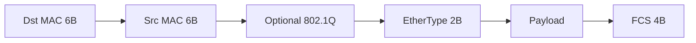

#### Important fields and numbers

| Field | Size | Notes |
|-------|------|-------|
| Destination MAC | 6 bytes | Unicast, multicast, or broadcast `ff:ff:ff:ff:ff:ff` |
| Source MAC | 6 bytes | Sender’s burned-in or virtual MAC |
| EtherType | 2 bytes | See [EtherType table](#ethertype-table) |
| FCS | 4 bytes | CRC; bad FCS frames are dropped |
| MTU (typical) | 1500 bytes | Payload size; jumbo frames optional |

Minimum frame size and inter-frame gap still matter on some media; in practice, for analysis, focus on MACs, VLAN tags, and EtherType.

#### Common problems

- **Wrong VLAN** → hosts look “down” even though copper link lights are green.
- **Duplex mismatch** (rare on auto-negotiate modern gear, painful on forced settings) → CRC errors, late collisions.
- **MAC flapping** → same MAC learned on alternating ports (loop or VM move without proper design).
- **Oversized frames** / MTU mismatch when tunnels or jumbo settings disagree.

#### Security notes

Ethernet itself has no encryption or strong authentication. Anyone on the same L2 segment can often sniff broadcasts and attempt [ARP](#arp) spoofing unless you add controls (Dynamic ARP Inspection, port security, 802.1X, MACsec).

#### pktana / capture filter

Capture on the interface of interest. Almost every frame starts with Ethernet. Display filters ideas: `eth`, `eth.addr == aa:bb:cc:dd:ee:ff`, `eth.type == 0x0800`.

**Related:** [VLAN](#vlan) · [ARP](#arp) · [IPv4](#ipv4) · [LLDP](#lldp)

---

### VLAN {#vlan}

**Layer:** [Data Link](#data-link-layer) (IEEE 802.1Q)  
**Job:** Split one physical switched network into multiple **logical broadcast domains** without buying a separate switch for every department.  
**Why it exists:** Flat L2 networks do not scale: broadcasts, security zones, and policy all need boundaries. VLANs give you those boundaries while still sharing the same physical switches and trunks.

#### How VLANs work (step-by-step)

1. Access ports are assigned to a VLAN (e.g., VLAN 10 for users, VLAN 20 for servers).
2. Untagged frames on an access port are associated with that VLAN’s broadcast domain.
3. **Trunk** ports carry multiple VLANs. Frames on trunks are usually **tagged** with a 4‑byte 802.1Q header (TPID `0x8100`, then PCP/DEI/VID).
4. Switches forward only within the same VLAN unless a **router** (or Layer 3 switch SVI) performs **inter‑VLAN routing**.
5. The native VLAN on a trunk may still send untagged frames — a classic source of confusion and security bugs.

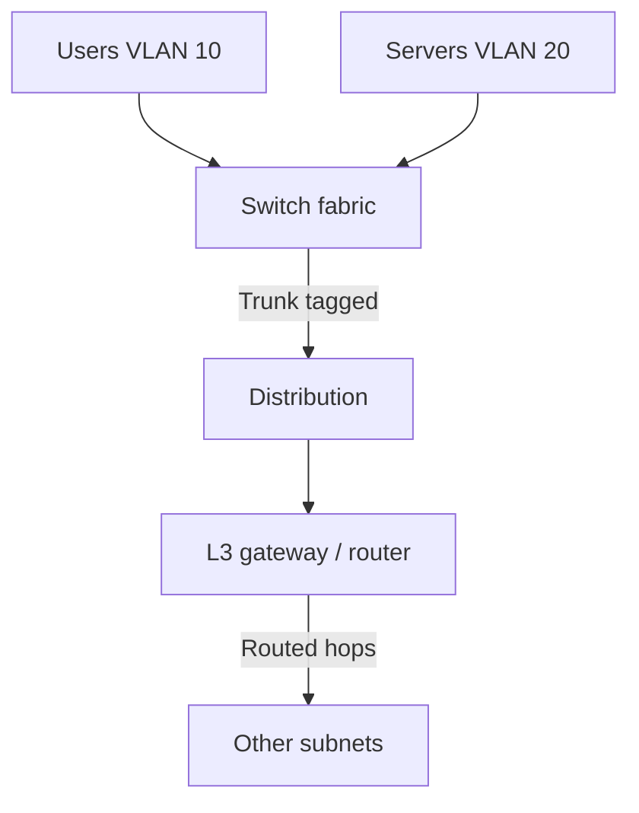

#### Important fields and numbers

| Item | Detail |
|------|--------|
| VID | 12 bits → VLAN IDs 1–4094 (0 and 4095 reserved) |
| TPID | Usually `0x8100` |
| PCP | 3-bit 802.1p priority |
| Native VLAN | Untagged on trunk; keep it unused/hardened |

#### Common problems

- Host in wrong access VLAN.
- Missing allowed VLAN on trunk.
- Native VLAN mismatch between two ends of a trunk.
- Accidental “VLAN hopping” designs (double tagging) on misbuilt trunks.

#### Security notes

VLANs are **not a firewall**. They are a segmentation primitive. Still enforce ACLs/[firewall](#firewall) policy between VLANs. Never assume “different VLAN = safe.”

#### pktana / capture filter

Look for `vlan` or EtherType `0x8100`. Inspect the VLAN ID field. Filter ideas: `vlan 10`, `vlan.id == 20`.

**Related:** [Ethernet](#ethernet) · [STP](#stp) · [IPv4](#ipv4) · Data Link layer lesson

---

### ARP {#arp}

**Layer:** Sits on [Data Link](#data-link-layer), serves [Network](#network-layer)  
**Job:** Resolve **IPv4 address → MAC address** on the local link so Ethernet can deliver the frame.  
**Why it exists:** IPv4 and Ethernet speak different address languages. ARP is the translator for “who has this IP *on my LAN*?”

#### How ARP works (step-by-step)

1. Host A wants to send to `10.0.0.5`. A checks: is it on-link?
2. If on-link, A looks in its **ARP cache**. Miss → A broadcasts an **ARP Request**: “Who has 10.0.0.5? Tell 10.0.0.2.”
3. Host B (owner of 10.0.0.5) unicasts an **ARP Reply** with its MAC.
4. A caches the mapping and sends the IP packet inside an Ethernet frame to B’s MAC.
5. If the destination is off-subnet, A ARPs for the **default gateway** IP instead; the IP destination remains the remote host.

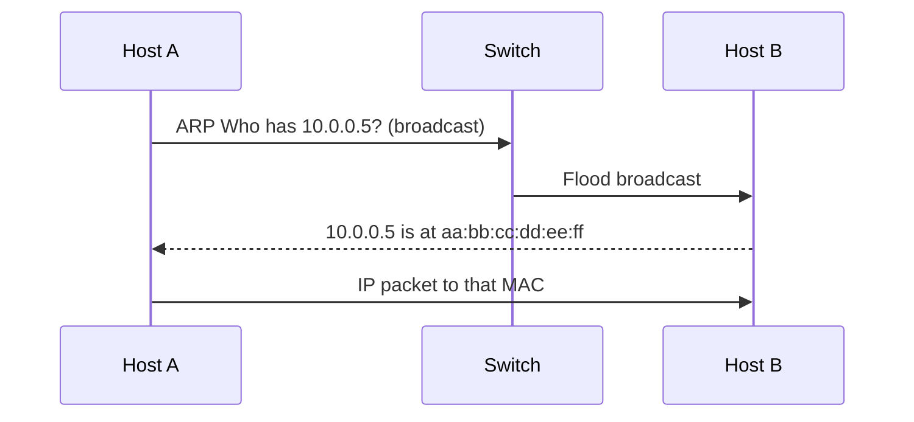

#### Important fields and numbers

| Item | Detail |
|------|--------|
| Opcode | 1 = request, 2 = reply |
| EtherType | `0x0806` |
| Hardware type | 1 = Ethernet |
| Cache timeout | OS-dependent (seconds to minutes) |

Gratuitous ARP (announce own mapping) is used for failover and duplicate detection.

#### Common problems

- Stale ARP cache after VM/IP move → blackhole until timeout.
- Proxy ARP surprises on misconfigured routers.
- Duplicate IP addresses → flapping ARP answers.

#### Security notes

ARP has **no authentication**. ARP spoofing / poisoning enables MitM on a LAN. Mitigations: Dynamic ARP Inspection, 802.1X, static ARP for critical pairs (sparingly), monitoring.

#### pktana / capture filter

Filter: `arp`. Watch request/reply pairs and sudden mapping changes for the gateway MAC.

**Related:** [Ethernet](#ethernet) · [IPv4](#ipv4) · [ICMPv6](#icmpv6) (Neighbor Discovery) · [Firewall](#firewall)

---

### STP {#stp}

**Layer:** [Data Link](#data-link-layer) (IEEE 802.1D / RSTP 802.1w / MSTP 802.1s)  
**Job:** Prevent **Layer 2 loops** by electing a loop-free active topology while keeping redundant links in backup state.  
**Why it exists:** Ethernet has no TTL. A loop turns broadcasts into a **broadcast storm** that can melt a LAN in seconds. STP is the classic brake pedal.

#### How STP works (step-by-step)

1. Switches exchange BPDUs.
2. They elect a **Root Bridge** (lowest Bridge ID: priority + MAC).
3. Each non-root switch picks a **Root Port** (best path toward root).
4. On each segment, a **Designated Port** is elected.
5. Remaining ports go **Blocking/Discarding** so no loop remains.
6. On failure, topology reconverges; RSTP converges much faster than classic STP.

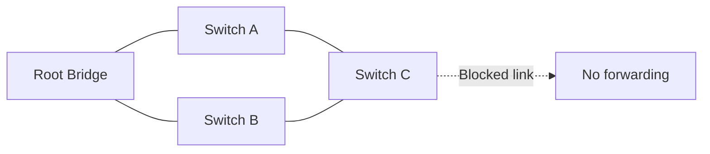

#### Important fields and numbers

| Item | Detail |
|------|--------|
| BPDU | Bridge Protocol Data Unit |
| Priority | Default often 32768; lower wins |
| Classic timers | Hello 2s, MaxAge 20s, ForwardDelay 15s (classic) |
| RSTP | Rapid transitions; preferred today |

#### Common problems

- Unexpected root (bad priority / rogue switch).
- Unidirectional link → forwarding loop (use UDLD / better detection).
- Too aggressive timers without understanding diameter.
- Mixing PVST flavors carelessly across vendors.

#### Security notes

Rogue switches can try to become root (**root guard**, **BPDU guard** on access ports are essential). Never leave unused ports without BPDU guard in enterprise access layers.

#### pktana / capture filter

Filter for STP/RSTP BPDUs (often LLC + SNAP or vendor-specific; Wireshark: `stp`). On many networks you will see BPDUs periodically on trunks.

**Related:** [VLAN](#vlan) · [Ethernet](#ethernet) · [LACP](#lacp) · Topologies chapter

---

### LLDP {#lldp}

**Layer:** [Data Link](#data-link-layer) (IEEE 802.1AB)  
**Job:** Advertise device identity, capabilities, and port information to **directly connected** neighbors.  
**Why it exists:** Operators need “what is plugged into this port?” without walking the closet. LLDP is the open standard neighbor discovery protocol (Cisco’s [CDP](#cdp) is proprietary cousin).

#### How LLDP works (step-by-step)

1. A device periodically multicasts LLDP frames out each port.
2. Neighbors receive TLVs: chassis ID, port ID, system name, capabilities, management address, etc.
3. Information is stored in a local MIB / neighbor table for humans and NMS tools.
4. When a neighbor goes silent past TTL, the entry ages out.

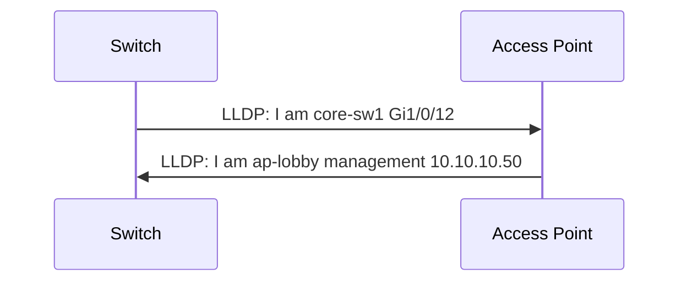

#### Important fields and numbers

| Item | Detail |
|------|--------|
| EtherType | `0x88CC` |
| Destination MAC | `01:80:c2:00:00:0e` (LLDP multicast) |
| TLVs | Type-Length-Value attributes |

#### Common problems

- Disabled LLDP on one side → “blind” troubleshooting.
- Trusting LLDP blindly in hostile environments (info leak).
- Mismatched expectations between LLDP-MED (phones/APs) and basic LLDP.

#### Security notes

LLDP can reveal topology and management IPs to anyone on the wire. Disable on untrusted ports or limit TLVs. Attackers can spoof LLDP; treat it as helpful, not authoritative security.

#### pktana / capture filter

Filter: `lldp` or EtherType `0x88CC`. Great for mapping “who is connected where” from a SPAN/mirror.

**Related:** [CDP](#cdp) · [Ethernet](#ethernet) · [VLAN](#vlan)

---

### CDP {#cdp}

**Layer:** [Data Link](#data-link-layer) (Cisco proprietary)  
**Job:** Same mission as LLDP — neighbor discovery — in many Cisco-heavy networks.  
**Why it exists:** Predates widespread LLDP adoption in enterprise Cisco estates; still common.

CDP uses SNAP encapsulation and multicast `01:00:0c:cc:cc:cc`. Operationally treat it like LLDP: useful for inventory, risky as an information leak on untrusted ports. Prefer standardizing on LLDP when you can; know CDP when the capture shows it.

**pktana filter ideas:** `cdp`  
**Related:** [LLDP](#lldp)

---

### PPPoE {#pppoe}

**Layer:** [Data Link](#data-link-layer) / access encapsulation  
**Job:** Carry PPP sessions over Ethernet — classic **DSL / fiber ISP last-mile** pattern where the ISP authenticates a subscriber session.  
**Why it exists:** PPP already had auth (PAP/CHAP), IPCP addressing, and session semantics. PPPoE lets ISPs reuse that model on Ethernet-based access networks.

#### How PPPoE works (step-by-step)

1. **Discovery** (PADI/PADO/PADR/PADS) finds an access concentrator and establishes a SESSION_ID.
2. **Session** stage carries PPP frames inside PPPoE (EtherTypes `0x8863` discovery, `0x8864` session).
3. PPP negotiates LCP, authentication, then IPCP (or IPv6CP) for address assignment.
4. Subscriber traffic is tunneled logically as a session to the ISP BRAS/BNG.

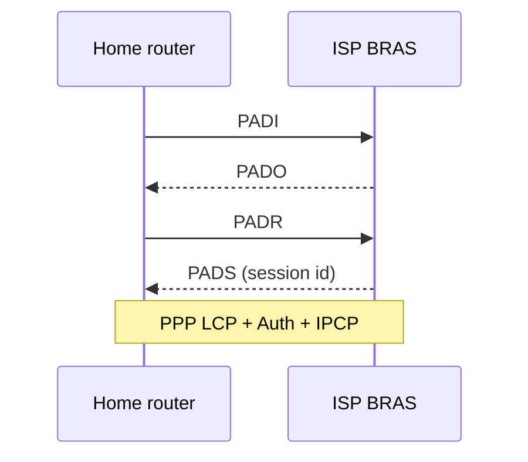

#### Important fields and numbers

| Item | Detail |
|------|--------|
| Discovery EtherType | 0x8863 |
| Session EtherType | 0x8864 |
| Extra overhead | PPPoE + PPP headers shrink effective MTU (often 1492) |

#### Common problems

- MTU / MSS issues (fragmentation, broken large HTTPS).
- Auth failures (wrong ISP credentials).
- Session flaps looking like “Wi‑Fi problems” upstairs.

#### Security notes

Use strong ISP credentials; prefer CHAP over PAP. The session itself is not a substitute for [VPN](#vpn) confidentiality on the Internet path.

#### pktana / capture filter

`pppoed` / `pppoes` or EtherTypes 0x8863/0x8864. Watch discovery vs session and PPP negotiation.

**Related:** [Ethernet](#ethernet) · [IPv4](#ipv4) · [DHCP](#dhcp) (alternate home addressing) · [VPN](#vpn)

---

### LACP {#lacp}

**Layer:** [Data Link](#data-link-layer) (802.3ad / 802.1AX)  
**Job:** Bundle multiple physical links into one logical **port-channel / EtherChannel** with negotiation.  
**Why it exists:** Bandwidth aggregation and active-active redundancy without STP blocking all but one link between the same pair (within the bundle’s hashing limits).

LACP peers exchange LACPDUs, agree on bundle membership, and hash flows across member links. Mis-matched speeds, duplex, VLANs, or MTU break bundles. Hashing is usually per-flow (not per-packet) to avoid reordering.

**Common problems:** one-sided “on” vs “active” config; uneven hashing; member link silently down.  
**Security notes:** still L2 — bundling does not encrypt.  
**Filter ideas:** `lacp`  
**Related:** [STP](#stp) · [Ethernet](#ethernet)

---

## Network Layer {#network-layer}

Layer 3 provides **logical addressing** and **hop-by-hop forwarding** across networks. [IPv4](#ipv4) and [IPv6](#ipv6) are the workhorses. [ICMP](#icmp) / [ICMPv6](#icmpv6) report problems. Routing protocols ([OSPF](#ospf), [EIGRP](#eigrp), [BGP](#bgp)) distribute reachability. Tunnels ([GRE](#gre), [IPsec](#ipsec)) reshape topology. [NAT](#nat) rewrites addresses at boundaries.

> **Remember:** IP addresses (mostly) stay end-to-end. MAC addresses change every hop. NAT is the loud exception.

---

### IPv4 {#ipv4}

**Layer:** [Network](#network-layer)  
**Job:** Address hosts with 32‑bit addresses and route packets across interconnected networks using longest-prefix matching.  
**Why it exists:** The Internet needed a common internetworking layer above many incompatible link technologies. IPv4 became that universal packet format — simple, robust, and eventually exhausted in public address space (hence [NAT](#nat) and [IPv6](#ipv6)).

#### How IPv4 forwarding works (step-by-step)

1. A host creates an IP packet: version, header length, DSCP/ECN, total length, ID/flags/frag offset, TTL, protocol, checksum, source IP, destination IP, options (rare), payload.
2. The host decides: on-link or via gateway? (See subnetting in the Network Layer lesson.)
3. Each router decrements **TTL**, updates checksum, picks the **longest matching prefix** in its routing table, and rewrites the Layer 2 header toward the next hop.
4. If TTL hits 0, the router drops the packet and typically sends ICMP Time Exceeded.
5. Destination host demuxes by **Protocol** field to [TCP](#tcp), [UDP](#udp), [ICMP](#icmp), etc.

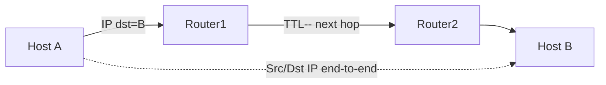

#### Important fields and numbers

| Field | Role |
|-------|------|
| Version | 4 |
| TTL | Hop budget; traceroute relies on it |
| Protocol | See [IP protocol numbers](#ip-protocol-numbers) |
| Source / Dest | 32-bit addresses |
| DF bit | Don’t Fragment — critical for PMTUD |

**Private RFC1918 ranges:** `10.0.0.0/8`, `172.16.0.0/12`, `192.168.0.0/16`  
**Loopback:** `127.0.0.0/8` · **Link-local APIPA:** `169.254.0.0/16`

#### Common problems

- Wrong mask / gateway → “half connectivity.”
- TTL too low across long paths or overlay networks.
- Fragmentation black holes (DF set, ICMP unreachable filtered).
- Asymmetric routing confusing stateful firewalls.

#### Security notes

IP spoofing is trivial without ingress filtering (BCP38). Combine with [firewall](#firewall) policy, uRPF where appropriate, and encrypted transports ([TLS](#tls), [IPsec](#ipsec)).

#### pktana / capture filter

`ip`, `ip.addr == 10.0.0.5`, `ip.proto == 6`. Inspect TTL, DF, and identification/fragmentation fields when debugging odd failures.

**Related:** [IPv6](#ipv6) · [ICMP](#icmp) · [NAT](#nat) · [TCP](#tcp) · [UDP](#udp)

---

### IPv6 {#ipv6}

**Layer:** [Network](#network-layer)  
**Job:** Same mission as IPv4 with **128‑bit addresses**, streamlined headers, and Neighbor Discovery via [ICMPv6](#icmpv6) instead of ARP.  
**Why it exists:** IPv4 public space exhaustion and the desire for cleaner autoconfiguration, larger addressing hierarchy, and fewer kludges (though the real world still has plenty of dual-stack complexity).

#### How IPv6 differs in practice (step-by-step mental model)

1. Addresses look like `2001:db8::1` — eight hextets, compressed zeros with `::`.
2. Hosts typically have a **link-local** `fe80::/10` address on every interface, plus global/ULA addresses.
3. **SLAAC** and/or **DHCPv6** assign addressing; Router Advertisements teach prefixes and gateways.
4. Neighbor Discovery (NS/NA) replaces ARP; DAD detects duplicates.
5. Extension headers replace many IPv4 options; **Next Header** chains protocols.
6. Routers forward similarly with hop limit instead of TTL.

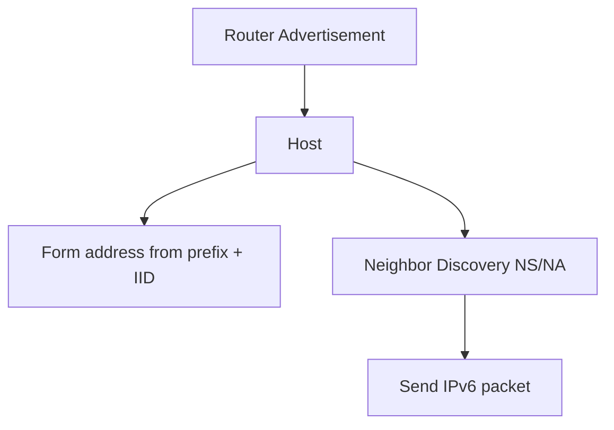

#### Important fields and numbers

| Item | Detail |
|------|--------|
| Address length | 128 bits |
| Link-local | `fe80::/10` |
| ULA | `fc00::/7` (commonly `fd00::/8`) |
| Multicast | `ff00::/8` |
| Header | Fixed 40 bytes base |

#### Common problems

- Dual-stack apps preferring broken IPv6 (Happy Eyeballs helps).
- Missing firewall rules for IPv6 while IPv4 is locked down.
- RA spoofing on open L2 segments.
- People disabling IPv6 “for security” without understanding side effects.

#### Security notes

Filter IPv6 deliberately. Secure NDP/RA where needed (RA-Guard). Do not assume “we only use IPv4” — many OS features still speak IPv6 on-link.

#### pktana / capture filter

`ip6`, `ipv6.addr == 2001:db8::1`, `icmpv6`.

**Related:** [ICMPv6](#icmpv6) · [IPv4](#ipv4) · [DHCP](#dhcp) · Network Layer lesson

---

### ICMP {#icmp}

**Layer:** [Network](#network-layer) companion to [IPv4](#ipv4)  
**Job:** Carry **error messages** and **diagnostics** (unreachable, time exceeded, echo).  
**Why it exists:** Routers and hosts need a standard way to say “I dropped your packet and here’s why,” and operators need ping/traceroute.

#### How ping and traceroute use ICMP (step-by-step)

**Ping:**

1. Sender emits ICMP Echo Request (type 8).
2. Target replies Echo Reply (type 0) if allowed.
3. RTT is measured by the sender.

**Traceroute (common UDP or ICMP variants):**

1. Send probes with TTL=1, then 2, then 3…
2. Each hop that decrements to 0 returns ICMP Time Exceeded (type 11).
3. Final hop returns unreachable (UDP traceroute) or echo reply (ICMP traceroute).

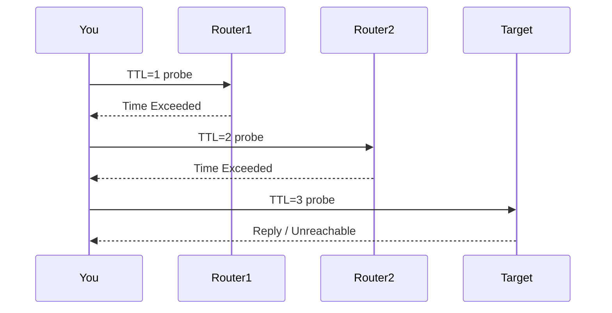

#### Important types

| Type | Code (examples) | Meaning |
|------|-----------------|---------|
| 0 / 8 | 0 | Echo reply / request |
| 3 | 0–15 | Destination unreachable (incl. fragmentation needed) |
| 11 | 0 | Time exceeded (TTL) |

#### Common problems

- “Ping blocked” ≠ “network down” — many firewalls allow TCP 443 but drop ICMP.
- Filtering ICMP type 3 code 4 breaks PMTUD → mysterious TCP stalls.
- Rate limiting makes traceroute look lossy.

#### Security notes

ICMP can be abused for reconnaissance and some covert channels. Still, blindly blocking all ICMP causes self-inflicted outages. Be selective.

#### pktana / capture filter

`icmp`, `icmp.type == 8`. Correlate with dropped TCP sessions when diagnosing black holes.

**Related:** [ICMPv6](#icmpv6) · [IPv4](#ipv4) · [Firewall](#firewall)

---

### ICMPv6 {#icmpv6}

**Layer:** [Network](#network-layer) companion to [IPv6](#ipv6)  
**Job:** Errors **plus** critical IPv6 control plane: Neighbor Discovery, Router Advertisements, MLD, and more.  
**Why it exists:** IPv6 folded ARP-like functions into ICMPv6 so one machinery handles diagnostics and link operations.

#### How Neighbor Discovery works (step-by-step)

1. Host wants MAC of on-link `2001:db8::5`.
2. Sends **Neighbor Solicitation** to solicited-node multicast.
3. Target replies **Neighbor Advertisement**.
4. Router Advertisements teach prefixes, MTU, default router info.
5. DAD uses NS for the tentative address before assigning it.

| ICMPv6 type | Role |
|-------------|------|
| 1 | Destination unreachable |
| 2 | Packet too big (PMTUD critical!) |
| 3 | Time exceeded |
| 128/129 | Echo request/reply |
| 133/134 | Router Solicitation / Advertisement |
| 135/136 | Neighbor Solicitation / Advertisement |

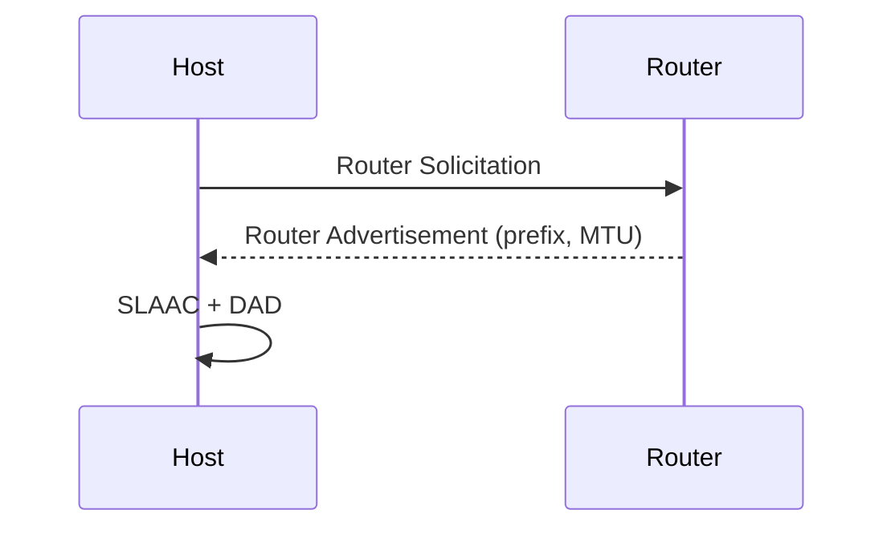

#### Common problems / security

RA spoofing can redirect traffic. Packet Too Big filtering breaks IPv6 PMTUD hard. Treat ICMPv6 as **essential**, not optional noise.

**pktana filter:** `icmpv6`  
**Related:** [IPv6](#ipv6) · [ARP](#arp) · [ICMP](#icmp)

---

### NAT {#nat}

**Layer:** Concept applied at [Network](#network-layer) boundaries (often with [firewall](#firewall) state)  
**Job:** Rewrite IP addresses (and usually transport ports) as packets cross a domain boundary.  
**Why it exists:** Primarily to share scarce [IPv4](#ipv4) public addresses (NAPT/PAT), hide internal topology, and sometimes steer traffic (DNAT/load balancers). It is a **workaround that became infrastructure**.

#### How NAPT (typical home/office NAT) works (step-by-step)

1. Internal host `10.0.0.50:54321` connects to `93.184.216.34:443`.
2. NAT device translates source to `203.0.113.5:40000` and stores a mapping in its state table.
3. Return packets to `203.0.113.5:40000` are translated back to `10.0.0.50:54321`.
4. If state expires or the table is full, connections break.

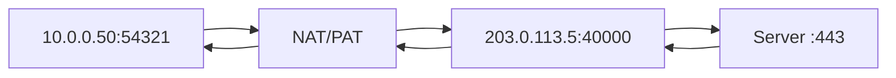

#### Important flavors

| Flavor | Meaning |
|--------|---------|
| SNAT / Masquerade | Change source (egress) |
| DNAT / Port forward | Change destination (ingress) |
| 1:1 NAT | Static address mapping |
| NAT64 | IPv6 clients to IPv4 servers (transition) |

#### Common problems

- CGNAT sharing + protocols that embed IPs (classic SIP/FTP pain).
- Hairpin/NAT loopback surprises.
- Broken [IPsec](#ipsec) without NAT-T.
- Exhausted port pools under heavy egress.

#### Security notes

NAT is **not** a security boundary by itself — stateful firewalling is. Still, lack of inbound mappings reduces casual inbound exposure. Do not invent a false sense of safety.

#### pktana / capture filter

Capture **both sides** of the NAT box when possible. Compare pre/post addresses. Filters alone cannot “see NAT” unless you correlate flows.

**Related:** [IPv4](#ipv4) · [Firewall](#firewall) · [TCP](#tcp) · [UDP](#udp) · [IPsec](#ipsec)

---

### OSPF {#ospf}

**Layer:** [Network](#network-layer) Interior Gateway Protocol (link-state)  
**Job:** Routers flood **link-state advertisements**, build a shared topology map, and run SPF (Dijkstra) for loop-free routes inside an autonomous system / enterprise.  
**Why it exists:** Distance-vector protocols scale poorly and converge slowly for many topologies. OSPF gives fast convergence and hierarchical design with areas.

#### How OSPF works (step-by-step)

1. Routers form **adjacencies** with neighbors (Hello packets).
2. They exchange LSAs describing links, networks, and (depending on type) external routes.
3. Each router builds an identical LSDB (within an area).
4. SPF computes best next hops; results enter the routing table.
5. Hierarchy: Area 0 (backbone) connects other areas; ABRs/ASBRs special-case summarization and redistribution.

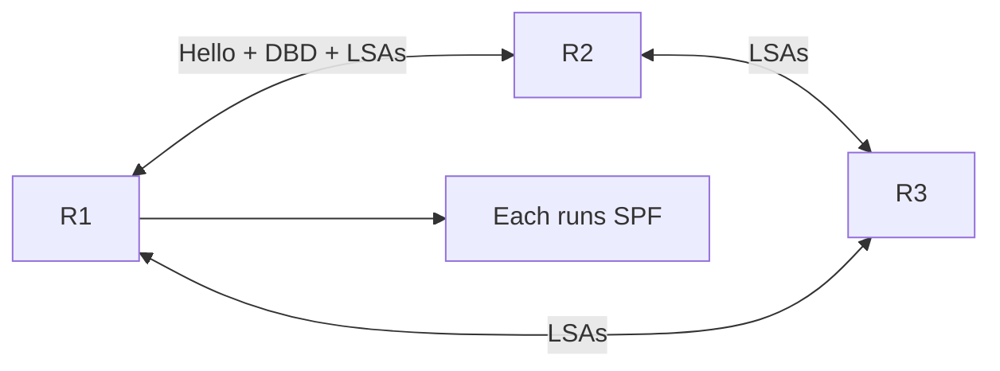

#### Important fields and numbers

| Item | Detail |
|------|--------|
| IP protocol | 89 |
| Multicast | `224.0.0.5` all SPF, `224.0.0.6` DR |
| Areas | 0 backbone; stubs/NSSAs variants |
| Cost | Interface metric (often ref-bw / bw) |

#### Common problems

- Area 0 partition.
- MTU mismatch breaks adjacency (DBD silent failures).
- Duplicate router IDs.
- Redistribution loops / suboptimal external metrics.
- Timer mismatches.

#### Security notes

Use OSPF authentication (and better, careful exposure). Do not run OSPF on untrusted access ports. Attackers who inject LSAs can blackhole or divert traffic.

#### pktana / capture filter

`ip proto 89` or `ospf`. Watch Hellos and whether adjacency reaches FULL.

**Related:** [EIGRP](#eigrp) · [BGP](#bgp) · [IPv4](#ipv4) · Network Layer lesson

---

### EIGRP {#eigrp}

**Layer:** [Network](#network-layer) Interior routing (Cisco advanced distance-vector / DUAL)  
**Job:** Share reachability within an enterprise using composite metrics and DUAL for loop-free backup paths.  
**Why it exists:** Cisco environments historically wanted fast convergence with less flooding than OSPF. EIGRP remains common in Cisco-centric campuses.

#### How EIGRP works (step-by-step)

1. Neighbors discover via Hellos (often multicast `224.0.0.10`).
2. Topology table stores destinations with feasible distances.
3. **DUAL** ensures loop-free successors; feasible successors act as precomputed backups.
4. Query process explores alternatives when a route is lost without a feasible successor.
5. Metrics historically combine bandwidth, delay, reliability, load, MTU (classic K-values); modern designs often keep defaults.

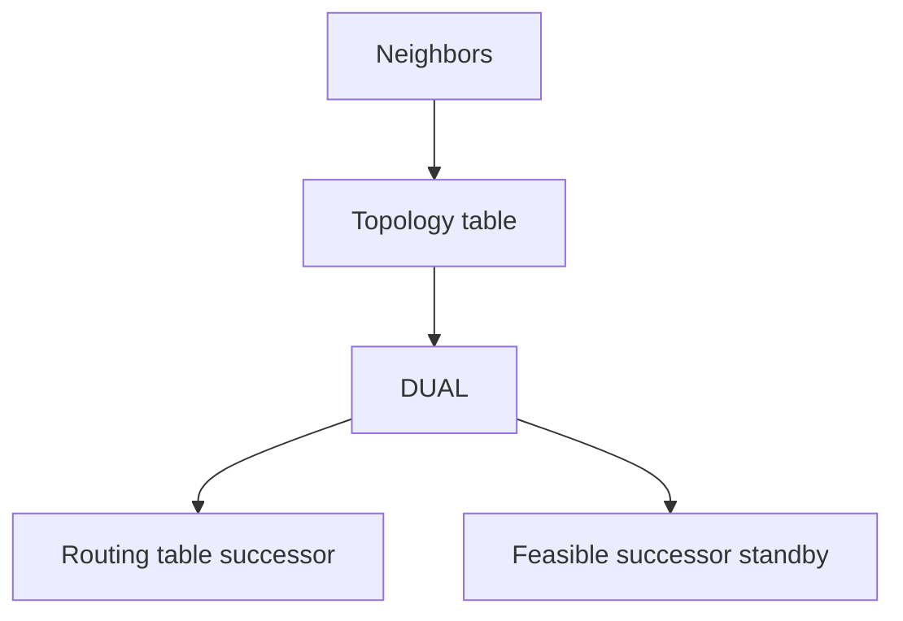

#### Important numbers

| Item | Detail |
|------|--------|
| Protocol | IP 88 |
| Classic vs named | Prefer named mode on modern IOS-XE |
| Wide metrics | Better for high-speed links |

#### Common problems

- K-value mismatch → no adjacency.
- Stub misplaced → missing routes.
- Unequal-cost load sharing surprises (variance).
- Redistribution with OSPF without tags → loops.

#### Security notes

Authenticate EIGRP; limit where it runs. Treat routing as critical infrastructure — poisoning equals traffic control for the attacker.

**pktana filter:** `eigrp` or `ip proto 88`  
**Related:** [OSPF](#ospf) · [BGP](#bgp)

---

### BGP {#bgp}

**Layer:** [Network](#network-layer) Exterior (and sometimes interior) routing — the Internet’s postal treaty  
**Job:** Exchange **prefix reachability** between Autonomous Systems using policy-heavy path selection, not pure shortest bandwidth.  
**Why it exists:** The Internet is a web of independently administered networks. BGP lets them interconnect with business and security policy: what to advertise, what to accept, how to prefer paths.

#### How BGP works (step-by-step)

1. Speakers open a **TCP 179** session (eBGP between ASes, iBGP within).
2. They exchange OPEN, then UPDATE messages carrying NLRI prefixes + path attributes.
3. Decision process ranks paths (WEIGHT/LOCAL_PREF, AS_PATH length, ORIGIN, MED, eBGP over iBGP, IGP metric to NEXT_HOP, Router ID, … — vendor order matters).
4. Selected routes install in RIB/FIB with a NEXT_HOP.
5. Withdrawals remove prefixes; flaps can destabilize — dampening / better ops practices apply.

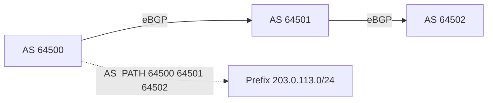

#### Important fields and numbers

| Item | Detail |
|------|--------|
| Port | TCP 179 |
| AS number | 16-bit or 32-bit ASN |
| Key attributes | AS_PATH, NEXT_HOP, LOCAL_PREF, MED, COMMUNITIES |
| Address families | IPv4-uni, IPv6-uni, VPNv4, EVPN… |

#### Common problems

- Missing route maps → accidental transit AS.
- NEXT_HOP unreachable in iBGP designs without proper IGP.
- Route leaks / hijacks (wrong origin).
- Session drops under MTU/MSS or firewall asymmetry.

#### Security notes

Use **RPKI / ROA validation**, prefix filters, max-prefix limits, GTSM, authentication/TCP-AO where available. BGP security failures can blackhole large parts of the Internet.

#### pktana / capture filter

`tcp port 179`. Payload may be encrypted or hard to interpret; still useful to see session establishment and resets.

**Related:** [TCP](#tcp) · [OSPF](#ospf) · [Firewall](#firewall) · Network Layer lesson

---

### GRE {#gre}

**Layer:** [Network](#network-layer) tunneling (IP protocol 47)  
**Job:** Encapsulate arbitrary packets inside IP — a simple “pipe” between endpoints.  
**Why it exists:** Operators need to carry protocols or overlays across an IP underlay (and historically to carry multicast/routing across networks that otherwise wouldn’t). GRE is the duct tape of tunnels.

#### How GRE works (step-by-step)

1. Endpoint A takes an inner packet (IP, or even Ethernet in some designs).
2. Adds GRE header (and optionally key/sequence).
3. Adds outer IP header sourced/destined at tunnel endpoints.
4. Underlay routers forward the outer IP blindly.
5. Endpoint B decapsulates and processes the inner packet.

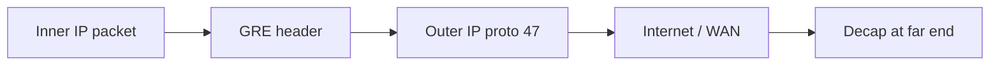

#### Important notes

GRE provides **no confidentiality**. Pair with [IPsec](#ipsec) for secure overlays. Overhead reduces effective MTU — fix MSS/PMTUD.

#### Common problems

- Recursive routing (tunnel destination learned *via* the tunnel).
- MTU black holes.
- Assuming GRE is a VPN (it is not, alone).

**Security:** Always ask “what encrypts this?”  
**pktana filter:** `ip proto 47` or `gre`  
**Related:** [IPsec](#ipsec) · [VPN](#vpn) · [WireGuard](#wireguard)

---

### IPsec {#ipsec}

**Layer:** [Network](#network-layer) security architecture  
**Job:** Provide authentication, integrity, and (usually) confidentiality for IP packets using AH and/or ESP, keyed via IKE.  
**Why it exists:** IP has no native encryption. IPsec became the standards-based VPN and site-to-site security toolkit for enterprises and gateways.

#### How a typical IPsec VPN comes up (step-by-step)

1. Peers negotiate **IKE** (UDP 500; NAT-T uses UDP 4500) — identities, DH, proposals.
2. They build IKE SA (control channel), then Child SAs for traffic.
3. Matching traffic enters **ESP** (protocol 50) — encrypted and authenticated payload — or AH (51) integrity-only (rare today).
4. With NAT, ESP is often UDP-encapsulated (NAT-T).
5. Traffic selectors define what is protected (proxy IDs / TS).

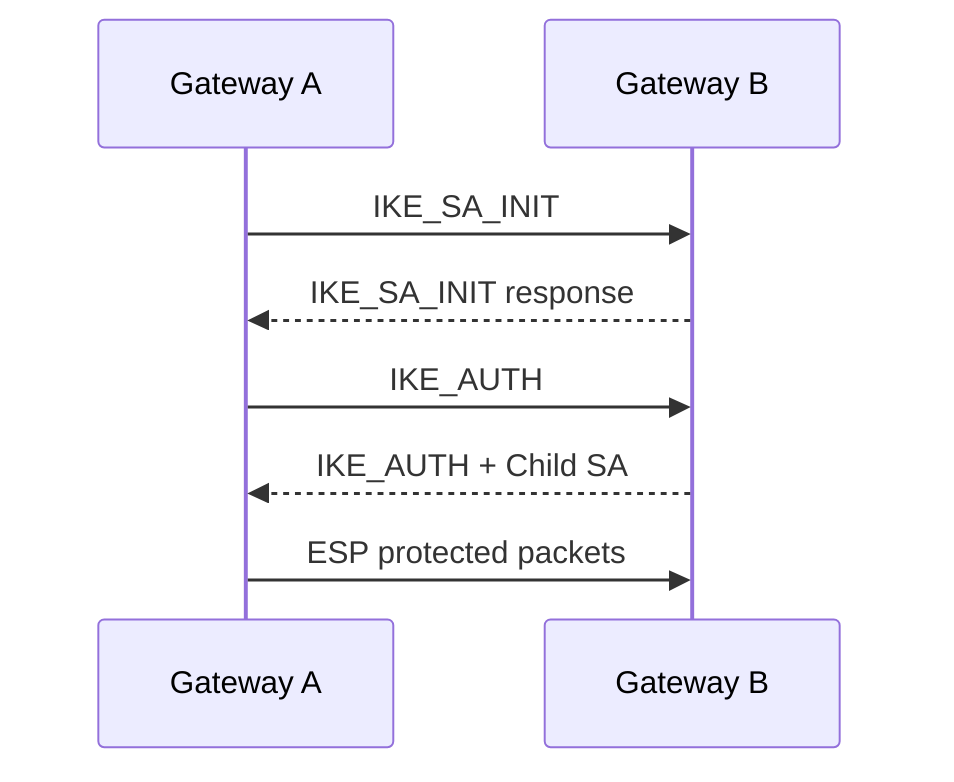

#### Important numbers

| Item | Detail |
|------|--------|
| IKE | UDP 500 |
| NAT-T | UDP 4500 |
| ESP / AH | IP protocols 50 / 51 |
| Modes | Tunnel (common site-to-site) / Transport |

#### Common problems

- Proposal mismatch (encryption/integrity/DH groups).
- Traffic selector mismatch (interesting traffic).
- NAT without NAT-T.
- Firewall missing UDP 500/4500 or ESP.
- MTU issues inside tunnels.

#### Security notes

Prefer modern IKEv2, strong ciphers (AES-GCM), avoid broken legacy (DES, MD5, aggressive mode with PSKs on the open Internet). Manage PSKs/certs like crown jewels.

**pktana filters:** `udp port 500 or udp port 4500`, `ip proto 50`  
**Related:** [VPN](#vpn) · [GRE](#gre) · [WireGuard](#wireguard) · [Firewall](#firewall)

---

### VRRP {#vrrp}

**Layer:** [Network](#network-layer) first-hop redundancy  
**Job:** Multiple routers share a **virtual IP/MAC** so hosts keep a single default gateway while routers elect a master.  
**Why it exists:** A single gateway router is a SPOF. VRRP (and cousins HSRP/GLBP) provide active/standby continuity.

Master sends advertisements; backup takes over on timeout. Priority and preempt behavior matter. Hosts ARP for the virtual IP and learn the virtual MAC.

**Problems:** dual masters on split brain; mismatched timers; asymmetric return paths.  
**Security:** authenticate where supported; filter VRRP on untrusted segments.  
**Filter:** `vrrp` or `ip proto 112`  
**Related:** [ARP](#arp) · [IPv4](#ipv4)

---

```quiz
QUESTION: Which EtherType indicates an 802.1Q VLAN tag?
OPTIONS:
0x0800
0x0806
0x8100
0x86DD
ANSWER: 2
EXPLAIN: 0x8100 is the TPID/EtherType used for 802.1Q VLAN tagging.
```

```quiz
QUESTION: ARP’s primary job is to map:
OPTIONS:
Port to process
IPv4 address to MAC address on-link
AS numbers to ISP names
TLS certificates to domains
ANSWER: 1
EXPLAIN: ARP resolves IPv4 addresses to MAC addresses on the local link.
```

```quiz
QUESTION: OSPF floods what kind of information between routers in an area?
OPTIONS:
Only default routes via TCP 179
Link-state advertisements describing topology
Encrypted Ethernet frames
DHCP leases
ANSWER: 1
EXPLAIN: OSPF is a link-state protocol; routers share LSAs and run SPF.
```

```quiz
QUESTION: NAT/PAT typically rewrites which fields on egress from a private LAN?
OPTIONS:
Only EtherType
Source IP and usually source port
Destination MAC only
BGP AS_PATH
ANSWER: 1
EXPLAIN: NAPT maps many private clients to a public IP by translating source IP/port and tracking state.
```

```task
TITLE: Narrate one packet from laptop to website at L2–L3
LEVEL: beginner
STEPS:
1. Assume laptop 10.0.0.50/24 gateway 10.0.0.1 going to 93.184.216.34
2. Write whether ARP is for the server or the gateway — and why
3. List Ethernet → IPv4 fields you expect in pktana
4. Note where NAT might rewrite the packet on the path
GOAL: Connect ARP, IP, and NAT into one story
HINT: Same subnet ARP peer; different subnet ARP gateway
```

```task
TITLE: Capture filter drill for routing and tunnels
LEVEL: intermediate
STEPS:
1. Write filters for OSPF, BGP, GRE, and IKE
2. Say what security risk each protocol presents if exposed to the Internet
3. Pick one tunnel tech (GRE+IPsec vs WireGuard) and list MTU concerns
GOAL: Be ready to hunt control-plane and VPN traffic in pktana
```

## Transport Layer {#transport-layer}

Transport delivers data to the **correct application** on a host and defines the reliability contract. [TCP](#tcp) is the tracked courier. [UDP](#udp) is the postcard. [SCTP](#sctp) is the multi-stream specialist. [QUIC](#quic) reinvents reliable transport over UDP for the modern web.

> **Remember:** **IP finds the house. Port finds the room.**

---

### TCP {#tcp}

**Layer:** [Transport](#transport-layer)  
**Job:** Provide a **reliable, ordered, byte-stream** connection between two endpoints identified by IP:port pairs.  
**Why it exists:** Applications like file transfer, email, and the web need bytes to arrive completely and in order despite loss, duplication, and reordering on the Internet path. TCP supplies that service end-to-end.

#### How a TCP conversation works (step-by-step)

1. **Passive open:** server listens on a port (e.g., 443).
2. **Three-way handshake:** client SYN → server SYN-ACK → client ACK. Sequence numbers synchronize.
3. Either side sends data; the other **ACKs** cumulative bytes received.
4. Lost segments are **retransmitted** based on timeouts or duplicate ACKs / SACK.
5. **Flow control** uses the receive window; **congestion control** probes path capacity (AIMD variants, CUBIC, BBR…).
6. Teardown typically uses FIN/ACK exchange (or RST for abort).

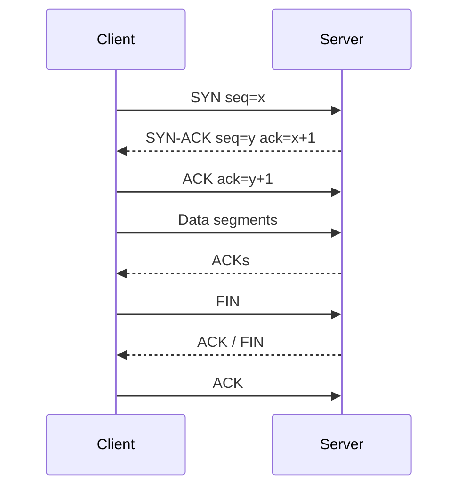

#### Important fields and numbers

| Field | Role |
|-------|------|
| Src/Dst port | 16-bit demux |
| Seq / Ack | Byte numbering |
| Flags | SYN, ACK, FIN, RST, PSH, URG, ECE, CWR |
| Window | Receiver advertised space |
| Options | MSS, WS, SACK, TS |

**Common ports:** 22, 25, 80, 443, 3389, 179 — see [port cheat sheet](#port-cheat-sheet).

#### Common problems

- Handshake fails: filtered port (silence) vs refused (RST).
- Stall after handshake: PMTUD black hole, zero window, middlebox.
- Retransmission storms: lossy path or bufferbloat.
- TIME_WAIT exhaustion on busy NATs/load balancers (architecture issue).

#### Security notes

TCP is not confidential — use [TLS](#tls). Risks include SYN floods, sequence guessing (modern stacks harden), and RST injection on weak paths. Stateful firewalls track TCP carefully.

#### pktana / capture filter

`tcp`, `tcp.port == 443`, `tcp.flags.syn == 1`. Follow streams for app payload when unencrypted.

**Related:** [UDP](#udp) · [TLS](#tls) · [HTTP](#http) · [BGP](#bgp) · Transport Layer lesson

---

### UDP {#udp}

**Layer:** [Transport](#transport-layer)  
**Job:** Offer **minimal datagram** delivery with ports and an optional checksum — no handshake, no reliability, no ordering.  
**Why it exists:** Sometimes latency and simplicity beat guarantees. DNS queries, DHCP, VoIP, games, telemetry, and [QUIC](#quic) all prefer to manage reliability themselves (or live without it).

#### How UDP works (step-by-step)

1. App presents a datagram to a socket bound to a local port.
2. Stack adds UDP header (src port, dst port, length, checksum) and hands to IP.
3. Receiver demuxes by destination port; if nothing listens, typically ICMP unreachable (may be filtered).
4. Loss, duplication, reordering — application’s problem.

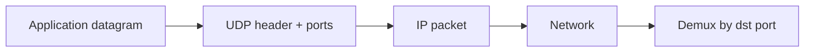

#### Important fields

| Field | Size | Notes |
|-------|------|-------|
| Ports | 2+2 bytes | Same port space concept as TCP |
| Length | 2 bytes | Header + data |
| Checksum | 2 bytes | Mandatory in IPv6 practice |

#### Common problems

- Silent drops through firewalls (no connection state unless conntrack UDP).
- Fragmentation of large datagrams.
- Developers assuming “UDP always arrives.”

#### Security notes

Easy to spoof source IPs for amplification (DNS, NTP, memcached historically). Rate-limit and filter wisely. Prefer authenticated app layers.

**pktana filter:** `udp`, `udp.port == 53`  
**Related:** [DNS](#dns) · [DHCP](#dhcp) · [NTP](#ntp) · [QUIC](#quic) · [TCP](#tcp)

---

### SCTP {#sctp}

**Layer:** [Transport](#transport-layer)  
**Job:** Message-oriented reliable transport with **multi-homing** and **multiple streams** (no head-of-line blocking across streams).  
**Why it exists:** Telecom signaling (SS7 over IP, Diameter) needed something between TCP and UDP: robust like TCP, but with stream independence and endpoint multi-homing.

#### How SCTP works (step-by-step)

1. Four-way handshake with cookie (SYN flood resistance).
2. Data chunks carry messages on stream IDs.
3. Associations can use multiple IP addresses per endpoint.
4. HEARTBEATs monitor path health; failover across addresses.

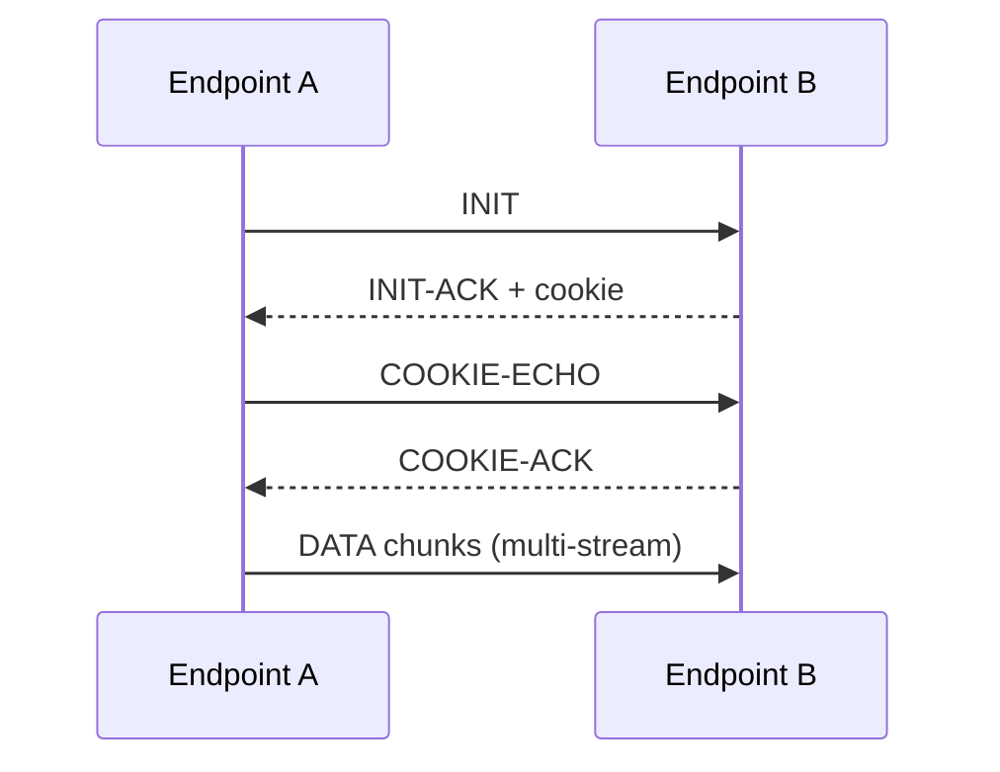

#### Important numbers

| Item | Detail |
|------|--------|
| IP protocol | 132 |
| Use cases | Telecom, some WebRTC data, specialized apps |

#### Common problems / security

Middleboxes often drop SCTP on the public Internet. Firewall awareness is poor compared to TCP/UDP. Still valuable in controlled networks.

**pktana filter:** `sctp` or `ip proto 132`  
**Related:** [TCP](#tcp) · [UDP](#udp)

---

### QUIC {#quic}

**Layer:** Transport-ish over [UDP](#udp); basis for HTTP/3  
**Job:** Provide encrypted, multiplexed, connection-oriented transport with faster handshakes and less head-of-line blocking than TCP+TLS.  
**Why it exists:** TCP+TLS on the web suffered from latency (multi-RTT setup) and HOL blocking when one lost packet stalled all streams. QUIC moves reliability + TLS-like crypto into user space over UDP.

#### How QUIC works (step-by-step)

1. Client sends initial UDP packets; cryptographic handshake (TLS 1.3 design) often completes in 1-RTT (0-RTT resumption possible).
2. Connection IDs allow migration across IP/port changes (mobile networks).
3. Multiple **streams** share one connection without TCP-style HOL across streams.
4. Loss recovery and congestion control live inside QUIC.
5. HTTP/3 maps HTTP semantics onto QUIC streams.

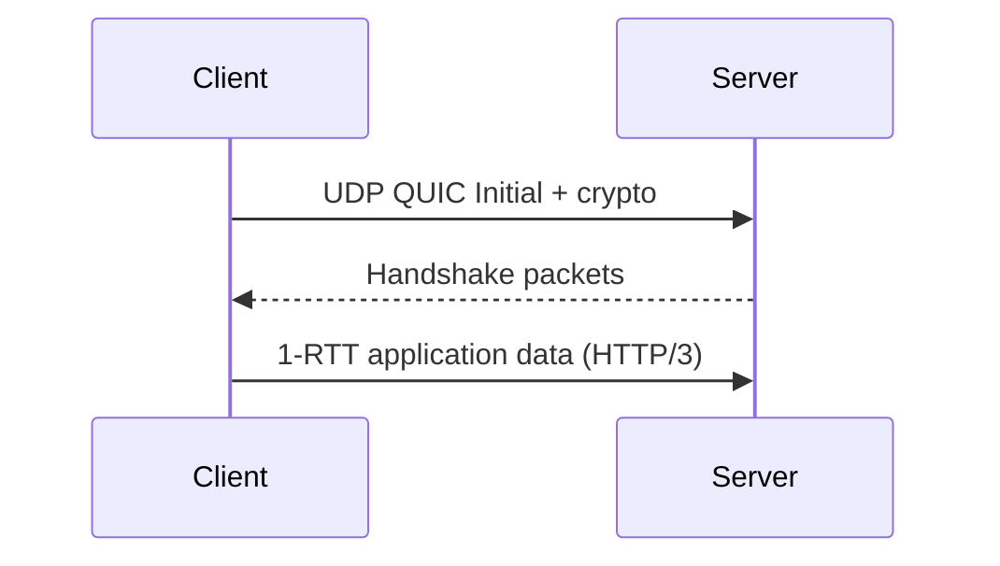

#### Important notes

| Item | Detail |
|------|--------|
| Transport | UDP (often port 443) |
| Visibility | Middleboxes see UDP; payload encrypted |
| Debugging | Harder in plain PCAPs — need SSL keys / specialized tooling |

#### Common problems

- Corporate firewalls blocking UDP 443.
- Operators misreading QUIC as “random UDP.”
- Fallback to TCP/HTTP/2 when QUIC fails.

**Security:** Encryption by default is a feature; still validate certs like TLS.  
**pktana filter:** `udp port 443` (heuristic) — inspect for QUIC if dissectors available.  
**Related:** [UDP](#udp) · [TLS](#tls) · [HTTP](#https) · [HTTPS](#https)

---

```quiz
QUESTION: TCP’s three-way handshake order is:
OPTIONS:
ACK, SYN, FIN
SYN, SYN-ACK, ACK
FIN, FIN-ACK, RST
HELLO, OPEN, UPDATE
ANSWER: 1
EXPLAIN: Client SYN, server SYN-ACK, client ACK establishes TCP.
```

```quiz
QUESTION: Which transport is connectionless and unreliable by design?
OPTIONS:
TCP
SCTP
UDP
BGP
ANSWER: 2
EXPLAIN: UDP sends datagrams without built-in reliability or connection state.
```

---

## Application Layer {#application-layer}

Application protocols create **meaning**: names, web pages, mail, directories, remote desktops. They usually ride [TCP](#tcp), [UDP](#udp), or [QUIC](#quic). When troubleshooting, confirm lower layers first, then inspect the application exchange.

> **Remember:** Lower layers deliver. The Application layer *means something*.

---

### DNS {#dns}

**Layer:** [Application](#application-layer) over [UDP](#udp)/[TCP](#tcp) 53 (and encrypted variants)  
**Job:** Resolve human names to records (A/AAAA/MX/TXT/CNAME/NS…) and support discovery of services.  
**Why it exists:** People cannot memorize every IP. DNS is the Internet’s distributed directory — critical path for almost every connection.

#### How a typical recursive lookup works (step-by-step)

1. Client asks its **recursive resolver** for `www.example.com` A/AAAA.
2. Resolver walks from root hints → TLD → authoritative nameservers (unless cached).
3. Authoritative server returns the answer (or CNAME chain).
4. Resolver caches per TTL and returns to client.
5. Client connects to the resulting IP with TCP/QUIC/etc.

```mermaid
sequenceDiagram
  participant C as Client
  participant R as Recursive resolver
  participant Root as Root
  participant TLD as TLD NS
  participant Auth as Authoritative
  C->>R: Query A www.example.com
  R->>Root: Where is .com?
  Root-->>R: TLD referral
  R->>TLD: Where is example.com?
  TLD-->>R: Auth referral
  R->>Auth: A www?
  Auth-->>R: 93.184.216.34
  R-->>C: Answer + TTL
```

#### Important record types & numbers

| Type | Meaning |
|------|---------|
| A / AAAA | IPv4 / IPv6 address |
| CNAME | Alias |
| MX | Mail servers |
| NS | Nameservers |
| TXT | Arbitrary text (SPF, verification) |
| SRV | Service location |

Port **53** UDP for most queries; TCP for large responses/zone transfers (AXFR/IXFR). DoT/DoH encrypt DNS on 853/443.

#### Common problems

- Wrong resolver / split DNS surprises.
- Stale cache after cutovers (TTL discipline).
- NXDOMAIN vs SERVFAIL confusion.
- Asymmetric views (internal vs external).

#### Security notes

DNS spoofing, cache poisoning, and tunneling (exfil) are real. Deploy DNSSEC where useful, prefer encrypted transport to resolvers, monitor for odd query patterns ([DLP](#application-layer)/security chapters).

**pktana filter:** `port 53` or `dns`  
**Related:** [UDP](#udp) · [TCP](#tcp) · [HTTP](#http) · [TLS](#tls)

---

### DHCP {#dhcp}

**Layer:** [Application](#application-layer) over [UDP](#udp) 67/68 (DHCPv6 differs)  
**Job:** Dynamically lease IPv4 addresses and options (mask, gateway, DNS, more) to clients.  
**Why it exists:** Static addressing does not scale for fleets of endpoints. DHCP centralizes IP management.

#### How DHCPv4 works (DORA step-by-step)

1. **Discover** — client broadcasts looking for servers.
2. **Offer** — server proposes a lease.
3. **Request** — client asks for that offer (may choose among several).
4. **Ack** — server confirms; client configures interface.
5. Renew/Rebind extend the lease before expiry; Release frees it.

```mermaid
sequenceDiagram
  participant C as Client
  participant S as DHCP server
  C->>S: Discover (broadcast)
  S-->>C: Offer
  C->>S: Request
  S-->>C: Ack (lease + options)
```

#### Important options

| Option | Meaning |
|--------|---------|
| 1 | Subnet mask |
| 3 | Router (default gateway) |
| 6 | DNS servers |
| 51 | Lease time |

Ports: server **67**, client **68**. Relays (ip helper) forward across subnets.

#### Common problems

- Exhausted pools / rogue DHCP servers.
- Wrong options → broken DNS or gateway.
- Relay missing on new VLANs.
- Duplicate static IPs colliding with pool.

#### Security notes

Rogue DHCP is a classic MitM. Use DHCP snooping + Dynamic ARP Inspection. Authenticate network access with 802.1X where possible.

**pktana filter:** `udp port 67 or udp port 68` / `bootp`  
**Related:** [IPv4](#ipv4) · [DNS](#dns) · [ARP](#arp) · [VLAN](#vlan)

---

### HTTP {#http}

**Layer:** [Application](#application-layer)  
**Job:** Request/response protocol for hypermedia — the language of the web and countless APIs.  
**Why it exists:** Needed a simple, extensible way to fetch documents and invoke services on the Internet. HTTP/1.1, HTTP/2, and HTTP/3 evolved performance while keeping semantics (methods, status codes, headers).

#### How an HTTP/1.1 request works (step-by-step)

1. Client resolves host via [DNS](#dns).
2. Opens [TCP](#tcp) (and usually [TLS](#tls) for HTTPS).
3. Sends request line: `GET /path HTTP/1.1` plus headers (`Host`, `User-Agent`, cookies…).
4. Server responds with status (`200`, `301`, `404`, `502`…) plus headers and body.
5. Connection may keep-alive for more requests; HTTP/2 multiplexes streams; HTTP/3 uses [QUIC](#quic).

```mermaid
sequenceDiagram
  participant B as Browser
  participant S as Web server
  B->>S: GET /index.html HTTP/1.1
  S-->>B: 200 OK + HTML body
```

#### Important pieces

| Item | Examples |
|------|----------|
| Methods | GET, POST, PUT, DELETE, PATCH, HEAD, OPTIONS |
| Status | 2xx success, 3xx redirect, 4xx client, 5xx server |
| Ports | 80 cleartext, 443 via TLS |

#### Common problems

- Wrong Host header / vhost.
- Redirect loops.
- Caching surprises.
- Expecting cleartext HTTP on networks that block port 80.

#### Security notes

Cleartext HTTP is readable and forgeable on path. Prefer [HTTPS](#https). HTTP security headers (HSTS, CSP) matter at the app layer.

**pktana filter:** `tcp port 80` or `http`  
**Related:** [HTTPS](#https) · [TLS](#tls) · [DNS](#dns) · [TCP](#tcp)

---

### HTTPS {#https}

**Layer:** [Application](#application-layer) — HTTP over [TLS](#tls)  
**Job:** Protect HTTP confidentiality/integrity (and authenticate the server, usually) by wrapping HTTP in TLS on port 443 (typically).  
**Why it exists:** The web outgrew trusting coffee-shop networks. HTTPS makes eavesdropping and trivial MitM much harder.

#### How a browser fetch works (step-by-step)

1. DNS lookup.
2. TCP connect to 443 (or QUIC UDP 443 for HTTP/3).
3. TLS handshake → session keys; certificate validated against trust store + hostname.
4. HTTP request/response inside the encrypted channel.
5. Session tickets/resumption may speed later visits.

```mermaid
flowchart LR
  DNS[DNS] --> TCP[TCP or QUIC]
  TCP --> TLS[TLS handshake]
  TLS --> HTTP[HTTP request/response]
```

> **Remember:** HTTPS protects the **channel**. It does not make a phishing site “safe.”

**pktana notes:** Without keys, see TLS records not URLs. With key log files, some tools decrypt.  
**Filter:** `tcp port 443` / `tls`  
**Related:** [TLS](#tls) · [HTTP](#http) · [QUIC](#quic)

---

### TLS {#tls}

**Layer:** Sits between apps and [TCP](#tcp) (or inside [QUIC](#quic))  
**Job:** Authenticate peers (usually server), negotiate ciphers, and encrypt application data.  
**Why it exists:** The Internet is a hostile transit. TLS (successor to SSL) is the default security layer for modern apps.

#### How TLS 1.3 handshake works (simplified step-by-step)

1. ClientHello: supported versions, cipher suites, key share, SNI, ALPN.
2. ServerHello: chosen parameters + key share; server certificate (typically); Finished.
3. Client checks cert chain + hostname; Finished.
4. Application data protected with AEAD keys derived from handshake secrets.
5. 0-RTT early data optional (replay considerations).

```mermaid
sequenceDiagram
  participant C as Client
  participant S as Server
  C->>S: ClientHello
  S-->>C: ServerHello + Cert + Finished
  C->>S: Finished
  C->>S: Encrypted application data
```

#### Important concepts

| Concept | Meaning |
|---------|---------|
| SNI | Tells server which cert/site (visible in clear in classic TLS) |
| ALPN | Negotiates http/1.1, h2, etc. |
| Cert chain | Leaf → intermediates → trusted root |
| Cipher | Prefer AEAD (AES-GCM, ChaCha20-Poly1305) |

#### Common problems

- Expired/wrong-name certificates.
- Middlebox TLS inspection breaking pinning or HTTP/2.
- Protocol downgrade messes (disable ancient SSL/TLS).
- Clock skew failing validity checks.

#### Security notes

Disable TLS 1.0/1.1; prefer 1.3. Manage private keys carefully. Understand that corporate inspection terminates TLS and re-encrypts — a trust decision, not magic.

**Related:** [HTTPS](#https) · [mTLS](#mtls) · [TCP](#tcp) · [QUIC](#quic) · Security chapter

---

### mTLS {#mtls}

**Layer:** Extension of [TLS](#tls)  
**Job:** Authenticate **both** client and server with certificates.  
**Why it exists:** Service meshes, APIs, and zero-trust designs need stronger client identity than passwords or bearer tokens alone.

In mTLS, the server requests a client certificate during handshake; the client proves possession of the private key. Operational pain is certificate lifecycle. Prefer automation (SPIFFE/SPIRE, ACME-like issuance, short-lived certs).

**Related:** [TLS](#tls) · [Firewall](#firewall) · [VPN](#vpn)

---

### SSH {#ssh}

**Layer:** [Application](#application-layer) over [TCP](#tcp) 22  
**Job:** Secure remote shell, command execution, file transfer (SFTP/SCP), and port forwarding with strong cryptography.  
**Why it exists:** [Telnet](#telnet) and cleartext rsh/rlogin were catastrophic on shared networks. SSH replaced them with authenticated, encrypted sessions.

#### How an SSH session works (step-by-step)

1. Client connects TCP/22.
2. Protocol version exchange, then algorithm negotiation.
3. Key exchange establishes session secrets; server host key authenticates the *machine* (check those fingerprints!).
4. User authentication: publickey, password (less ideal), keyboard-interactive, etc.
5. Channels multiplex shell, exec, subsystems (SFTP), or forwarded ports inside one SSH connection.

```mermaid
sequenceDiagram
  participant C as Client
  participant S as Server
  C->>S: TCP connect :22
  C->>S: KEX + host key verify
  C->>S: User auth (publickey)
  S-->>C: Session open
  C->>S: Channel: shell / sftp / forward
```

#### Important notes

| Item | Detail |
|------|--------|
| Port | 22 (often moved; still detect by handshake) |
| Host keys | Trust-on-first-use vs enterprise CA |
| Agents | ssh-agent holds keys in memory |

#### Common problems

- Host key changed warning (MITM *or* legitimate rebuild — verify!).
- Auth storms from bots on Internet-exposed SSH.
- Broken PTY / keepalive drops on flaky NATs.

#### Security notes

Prefer key auth + disable password where possible; use MFA/bastions; rate-limit; do not expose SSH widely without controls. Tunneling can bypass naive egress filters — monitor.

**pktana filter:** `tcp port 22`  
**Related:** [Telnet](#telnet) · [TLS](#tls) · [Firewall](#firewall) · [VPN](#vpn)

---

### Telnet {#telnet}

**Layer:** [Application](#application-layer) over [TCP](#tcp) 23  
**Job:** Remote terminal access — historically ubiquitous, now a cautionary tale.  
**Why it exists:** Early Internet needed remote login. Telnet delivered it *without encryption*.

Telnet sends keystrokes and screen data in cleartext, including passwords. Use only in isolated labs or on devices that truly have no alternative — and even then prefer out-of-band management. If you see Telnet in a production capture toward the Internet, treat it as an incident until proven otherwise.

```mermaid
flowchart LR
  User[Admin typing password] --> Clear[Cleartext on wire]
  Clear --> Anyone[Anyone sniffing the path]
```

**pktana filter:** `tcp port 23`  
**Related:** [SSH](#ssh) · Security chapter

---

### FTP {#ftp}

**Layer:** [Application](#application-layer) over [TCP](#tcp) 21 (control) + dynamic data  
**Job:** Transfer files using a control channel and separate data connections.  
**Why it exists:** Classic Internet file distribution. Survives in legacy integrations — often painfully through [NAT](#nat)/firewalls.

#### How active vs passive FTP works (step-by-step)

1. Client opens control connection to server port 21; authenticates.
2. **Active mode:** server connects *back* to client’s declared data port (broken by many NATs).
3. **Passive mode:** server listens on a dynamic port; client connects outbound (friendlier to NAT).
4. Data connection carries the file; control carries commands (`RETR`, `STOR`, `LIST`).

```mermaid
sequenceDiagram
  participant C as Client
  participant S as FTP server
  C->>S: Control TCP :21
  C->>S: PASV
  S-->>C: Listen on ephemeral port
  C->>S: Data connect + RETR file
```

#### Security notes

Cleartext FTP exposes credentials and files. Prefer SFTP ([SSH](#ssh)) or FTPS (FTP over [TLS](#tls)). If stuck with FTP, isolate and monitor.

**Common problems:** NAT/firewall vs active mode; helper modules failing on encrypted control.  
**pktana filter:** `tcp port 21`  
**Related:** [SSH](#ssh) · [TLS](#tls) · [NAT](#nat)

---

### SMTP {#smtp}

**Layer:** [Application](#application-layer) over [TCP](#tcp) 25/587/465  
**Job:** Submit and relay Internet email between MTAs and from clients to submission servers.  
**Why it exists:** Needed a standard store-and-forward mail transport across administrative domains.

#### How mail typically flows (step-by-step)

1. User’s client submits via submission port **587** (STARTTLS) or **465** (implicit TLS) with auth.
2. Submitting MTA looks up recipient domain **MX** records in [DNS](#dns).
3. Delivers to receiving MTA on port **25** using SMTP commands: `EHLO`, `MAIL FROM`, `RCPT TO`, `DATA`.
4. Receiving side may run spam/DKIM/SPF/DMARC checks before accepting.
5. Mail lands in store accessed later via [IMAP](#imap)/[POP3](#pop3).

```mermaid
sequenceDiagram
  participant U as User MUA
  participant Sub as Submission MTA
  participant Rx as Receiving MTA
  U->>Sub: SMTP submission :587 + TLS
  Sub->>Rx: SMTP relay :25
  Rx-->>Sub: 250 OK
```

#### Important status ideas

| Code class | Meaning |
|------------|---------|
| 2xx | Success |
| 4xx | Transient failure (retry) |
| 5xx | Permanent failure |

#### Security notes

Authenticate submission; enforce TLS where possible; deploy SPF/DKIM/DMARC. Open relays are disasters. Port 25 from desktops is often blocked to stop bots.

**pktana filter:** `tcp port 25 or tcp port 587 or tcp port 465`  
**Related:** [DNS](#dns) · [IMAP](#imap) · [POP3](#pop3) · [TLS](#tls)

---

### IMAP {#imap}

**Layer:** [Application](#application-layer) over [TCP](#tcp) 143 / 993  
**Job:** Let mail clients **manage messages on the server** (folders, flags, partial fetch) — ideal for multi-device users.  
**Why it exists:** [POP3](#pop3) was download-and-delete oriented. IMAP keeps the mailbox canonical in the server.

IMAP syncs folder state; IDLE can push notifications. Prefer IMAPS **993** or STARTTLS on 143. Credentials and mail bodies must not travel cleartext on untrusted networks.

**pktana filter:** `tcp port 143 or tcp port 993`  
**Related:** [SMTP](#smtp) · [POP3](#pop3) · [TLS](#tls)

---

### POP3 {#pop3}

**Layer:** [Application](#application-layer) over [TCP](#tcp) 110 / 995  
**Job:** Download messages to a single client, traditionally removing them from the server.  
**Why it exists:** Simple mail retrieval for early dial-up era clients. Still seen in legacy setups.

Prefer POP3S **995**. For modern multi-device mail, prefer [IMAP](#imap). Capture filter: `tcp port 110 or tcp port 995`.

**Related:** [IMAP](#imap) · [SMTP](#smtp)

---

### NTP {#ntp}

**Layer:** [Application](#application-layer) over [UDP](#udp) 123  
**Job:** Synchronize clocks across devices to a common time reference.  
**Why it exists:** Logs, certificates ([TLS](#tls) validity), Kerberos, and distributed systems all demand correct time. Without NTP, incidents become un-correlatable and auth breaks.

#### How NTP works (step-by-step)

1. Client queries configured servers/pools.
2. Exchanges timestamps to estimate offset and delay.
3. Disciplines local clock gradually (slew) or steps when far off.
4. Stratum numbers indicate distance from reference clocks (stratum 1 near atomic/GPS sources).

```mermaid
flowchart LR
  GPS[Reference clock] --> S1[Stratum 1]
  S1 --> S2[Stratum 2 enterprise]
  S2 --> Hosts[Servers / workstations]
```

#### Common problems

- Firewalled UDP 123.
- Wrong timezone vs wrong clock (different issues!).
- Attackers spoofing NTP or using amplification (monlist historically).

#### Security notes

Use authenticated NTP where supported (NTS emerging); restrict query types; prefer trusted internal chrony/ntpd hierarchy.

**pktana filter:** `udp port 123`  
**Related:** [UDP](#udp) · [TLS](#tls) · [DNS](#dns)

---

### SNMP {#snmp}

**Layer:** [Application](#application-layer) over [UDP](#udp) 161/162  
**Job:** Monitor and sometimes configure network devices via MIBs (Get/GetNext/GetBulk/Set) and asynchronous traps/informs.  
**Why it exists:** Operators needed a standard way to poll interface counters, CPU, and inventory across multivendor gear.

#### How polling works (step-by-step)

1. NMS sends GetBulk for OID tree to agent UDP/161.
2. Agent responds with variable bindings.
3. Thresholds trigger alerts; devices may send traps to UDP/162.
4. SNMPv3 adds user-based security (auth/priv); v2c uses community strings (cleartext-ish shared secrets).

```mermaid
sequenceDiagram
  participant NMS
  participant SW as Switch agent
  NMS->>SW: GetBulk ifTable
  SW-->>NMS: Counters / statuses
  SW->>NMS: Trap linkDown
```

#### Security notes

SNMPv1/v2c communities on the Internet are a gift to attackers. Prefer v3, ACL management planes, and read-only where possible. Never use `public`/`private` in production.

**pktana filter:** `udp port 161 or udp port 162`  
**Related:** [UDP](#udp) · [Firewall](#firewall) · [SSH](#ssh)

---

### LDAP {#ldap}

**Layer:** [Application](#application-layer) over [TCP](#tcp)/[UDP](#udp) 389 (636 LDAPS)  
**Job:** Query and modify directory information (users, groups, devices) in a hierarchical DIT.  
**Why it exists:** Central identity and organization data for enterprises — the directory behind many logins and mail systems.

LDAP binds authenticate; searches use filters; results return attributes. Active Directory speaks LDAP (among other protocols). Prefer LDAPS or StartTLS; cleartext binds leak passwords.

**Common problems:** referral chasing, slow filters, certificate trust for LDAPS, firewall asymmetry.  
**pktana filter:** `tcp port 389 or tcp port 636`  
**Related:** [RADIUS](#radius) · [TLS](#tls) · [Kerberos](#kerberos)

---

### Kerberos {#kerberos}

**Layer:** [Application](#application-layer) authentication system (UDP/TCP 88 commonly)  
**Job:** Issue time-limited tickets so users/services prove identity without sending passwords to every server.  
**Why it exists:** Enterprise SSO needs scalable mutual auth — AD domains run on Kerberos + DNS + time sync.

AS-REQ/AS-REP obtain TGT; TGS-REQ/TGS-REP obtain service tickets; AP exchanges authenticate to services. Clock skew kills Kerberos — keep [NTP](#ntp) healthy.

**Related:** [LDAP](#ldap) · [NTP](#ntp) · [DNS](#dns) · [SMB](#smb)

---

### SMB {#smb}

**Layer:** [Application](#application-layer) over [TCP](#tcp) 445 (legacy 139/NetBIOS)  
**Job:** File/printer sharing, named pipes, and RPC used heavily by Windows ecosystems (and Samba).  
**Why it exists:** Local networks needed rich file semantics over the wire — locking, auth, directories — not just FTP blobs.

#### How a share access roughly works (step-by-step)

1. Client resolves host, connects TCP/445.
2. Negotiates SMB dialect (SMB2/SMB3 preferred).
3. Session setup authenticates (often via NTLM or Kerberos).
4. Tree connect to `\\server\share`; create/read/write file operations follow.
5. SMB3 can encrypt on the wire.

```mermaid
flowchart LR
  C[Client] --> Neg[Negotiate dialect]
  Neg --> Auth[Session setup]
  Auth --> Tree[Tree connect]
  Tree --> IO[File I/O]
```

#### Security notes

Wormable historic bugs (EternalBlue era) made Internet-exposed SMB infamous. Block 445 at the edge; patch aggressively; prefer SMB3 encryption; segment admin shares.

**pktana filter:** `tcp port 445`  
**Related:** [Kerberos](#kerberos) · [DNS](#dns) · [Firewall](#firewall)

---

### RDP {#rdp}

**Layer:** [Application](#application-layer) over [TCP](#tcp) 3389 (UDP sometimes for graphics)  
**Job:** Remote graphical desktop access to Windows (and some other) systems.  
**Why it exists:** Admins and users need full desktop remoting, not just SSH shells.

RDP negotiates security protocols; NLA helps authenticate before a full session. Internet-exposed RDP is relentlessly scanned and brute-forced. Prefer VPN/bastion + MFA; do not publish raw 3389.

**pktana filter:** `tcp port 3389`  
**Related:** [VPN](#vpn) · [TLS](#tls) · [Firewall](#firewall) · [SSH](#ssh)

---

### RADIUS {#radius}

**Layer:** [Application](#application-layer) over [UDP](#udp) 1812/1813 (1645/1646 legacy)  
**Job:** Centralize AAA — Authentication, Authorization, Accounting — for VPN, 802.1X, Wi‑Fi, and network device logins.  
**Why it exists:** Every NAS (switch, Wi‑Fi controller, VPN concentrator) should not store its own user database.

NAS sends Access-Request; RADIUS server returns Accept/Reject/Challenge; Accounting-Request tracks sessions. Shared secrets protect authenticity (not full payload encryption like TLS — use RadSec where needed). Often fronts [LDAP](#ldap)/AD.

**pktana filter:** `udp port 1812 or udp port 1813`  
**Related:** [LDAP](#ldap) · [VPN](#vpn) · [Wireless](#application-layer)

---

### SIP {#sip}

**Layer:** [Application](#application-layer) over [UDP](#udp)/[TCP](#tcp) 5060 / 5061  
**Job:** Signaling for VoIP/video sessions — invite, ring, answer, tear down — while media often rides RTP separately.  
**Why it exists:** Needed a flexible, text-oriented signaling protocol for real-time sessions across IP networks.

INVITE/200 OK/ACK establishes a call; BYE ends it. SDP describes media endpoints. NAT traversal is historically painful (STUN/TURN/ICE). Secure with SIP-TLS and SRTP.

**pktana filter:** `port 5060 or port 5061`  
**Related:** [UDP](#udp) · [NAT](#nat) · [TLS](#tls) · [RTP notes below](#rtp)

---

### RTP {#rtp}

**Layer:** [Application](#application-layer) media transport (usually over [UDP](#udp))  
**Job:** Carry real-time audio/video with sequence numbers and timestamps.  
**Why it exists:** Media needs timely delivery more than perfect reliability — TCP retries hurt calls.

Often paired with RTCP for quality stats. In captures, look for UDP streams after [SIP](#sip) SDP negotiation. Prefer SRTP for confidentiality.

**Related:** [SIP](#sip) · [UDP](#udp)

---

```quiz
QUESTION: Which protocol should replace Telnet for remote admin shells?
OPTIONS:
FTP
HTTP
SSH
SNMP v2c
ANSWER: 2
EXPLAIN: SSH provides encrypted, authenticated remote shells; Telnet is cleartext.
```

```quiz
QUESTION: DHCP’s DORA sequence is:
OPTIONS:
Discover, Offer, Request, Ack
DNS, OSPF, RIP, ARP
SYN, SYN-ACK, ACK, FIN
Hello, DBD, LSR, LSU
ANSWER: 0
EXPLAIN: DORA = Discover, Offer, Request, Ack.
```

```quiz
QUESTION: SMB file sharing on modern Windows primarily uses TCP port:
OPTIONS:
22
53
445
3389
ANSWER: 2
EXPLAIN: SMB runs on TCP 445 (legacy NetBIOS 139 still appears sometimes).
```

```task
TITLE: Trace a mail send across protocols
LEVEL: intermediate
STEPS:
1. List DNS MX lookup → SMTP submission → SMTP relay → IMAP retrieval
2. Mark which hops must use TLS in a modern design
3. Write pktana filters for ports 53, 587, 25, 993
GOAL: See email as a protocol chain, not one app icon
```

```task
TITLE: Spot cleartext crimes in a PCAP mindset
LEVEL: beginner
STEPS:
1. Name three protocols on this page that often leak credentials in cleartext
2. Name the preferred secure replacement for each
3. Say what you’d filter first in pktana to prove the leak
GOAL: Build instant “insecure protocol” reflexes
HINT: Telnet, FTP, HTTP, SNMPv2c communities…
```

---

## Security Concepts {#security-concepts}

These entries are **patterns** more than single packet formats — but they dominate real networks and show up constantly beside the protocols above.

---

### Firewall {#firewall}

**Layer:** Policy enforcement across layers (commonly L3/L4 stateful, sometimes L7/app-ID)  
**Job:** Allow, deny, or inspect traffic according to rules — the network’s bouncer.  
**Why it exists:** Not every packet deserves a path. Firewalls enforce trust boundaries between Internet, DMZ, campus, OT, and cloud.

#### How a stateful packet filter works (step-by-step)

1. First packet of a flow is evaluated against rules (source/dest IP, port, proto, zone, users, app-ID…).
2. If allowed, a **state/session** entry is created.
3. Return traffic matching state is permitted without re-matching every rule from scratch.
4. Timeouts expire idle states; TCP flags influence teardown.
5. Next-gen features may decrypt [TLS](#tls) (with policy), identify apps, and correlate with IPS/IDPS.

```mermaid
flowchart TB
  Pkt[Packet in] --> Zone[Zone / interface]
  Zone --> Rule[Rule lookup]
  Rule -->|allow| State[Create/update state]
  Rule -->|deny| Drop[Drop/log]
  State --> Out[Forward]
```

#### Common problems

- Asymmetric routing bypassing state.
- Too-broad any/any rules.
- Silent drops without logging.
- UDP “state” surprises.

#### Security notes

Default deny inbound on edges. Log thoughtfully. Firewalls complement — not replace — patching, identity, and [DLP](#application-layer)/IDPS controls (see Security and DLP/IDPS hub chapters).

**pktana:** Capture on both sides of a firewall to see what is rewritten or dropped. Filters alone cannot show “denied” if the packet never arrives.

**Related:** [NAT](#nat) · [TCP](#tcp) · [VPN](#vpn) · [IPsec](#ipsec) · Network Security chapter

---

### VPN {#vpn}

**Layer:** Concept spanning tunnels at L3/L4/app overlays  
**Job:** Create a **protected overlay path** across an untrusted network so remote users or sites appear closer to a private network.  
**Why it exists:** The Internet is convenient but hostile. VPNs provide confidentiality, integrity, and often authentication for remote access and site-to-site connectivity.

#### Common VPN families

| Family | Style | Jump |
|--------|-------|------|
| IPsec | Network-layer SA tunnels | [IPsec](#ipsec) |
| SSL/TLS VPN | App or tunnel over TLS | [TLS](#tls) / [OpenVPN](#openvpn) |
| WireGuard | Modern UDP crypto tunnel | [WireGuard](#wireguard) |
| GRE + crypto | Encapsulation + separate crypto | [GRE](#gre) |

#### How remote-access VPN feels (step-by-step)

1. User authenticates to concentrator ([RADIUS](#radius)/SAML/MFA).
2. Tunnel forms; client receives virtual IP/routes.
3. Selected traffic (full tunnel vs split tunnel) enters the overlay.
4. Corporate [firewall](#firewall)/DNS policies apply as designed.
5. Disconnect tears down keys and routes.

```mermaid
flowchart LR
  User[Remote laptop] --> Inet[Internet]
  Inet --> Conc[VPN concentrator]
  Conc --> LAN[Campus / DC]
```

#### Common problems

- Split tunnel confusion (“why didn’t my traffic go through the VPN?”).
- MTU/MSS black holes.
- Overlapping LAN subnets with home RFC1918.
- DNS leaks.

> **Remember:** A VPN moves your packets through a locked tunnel. It does not automatically make every destination trustworthy.

**Related:** [WireGuard](#wireguard) · [OpenVPN](#openvpn) · [IPsec](#ipsec) · [Firewall](#firewall)

---

### WireGuard {#wireguard}

**Layer:** [Network](#network-layer)-ish VPN tunnel over [UDP](#udp)  
**Job:** Provide a simple, high-performance encrypted tunnel with a tiny codebase and opinionated crypto.  
**Why it exists:** IPsec/OpenVPN configurations grew complex. WireGuard aims for “secure by default, easy to audit.”

#### How WireGuard works (step-by-step)

1. Each peer has a private key; public keys identify peers.
2. Handshake (Noise-based) derives session keys; then data packets flow on UDP (often 51820).
3. Cryptokey routing maps allowed IPs to peers — part ACL, part route table.
4. Roaming updates endpoint addresses when peers move networks.
5. No cipher agility by design (a feature for simplicity).

```mermaid
sequenceDiagram
  participant A as Peer A
  participant B as Peer B
  A->>B: Handshake initiation (UDP)
  B-->>A: Handshake response
  A->>B: Encrypted transport packets
```

#### Common problems

- Wrong AllowedIPs → routes missing or too broad.
- NAT keepalive needed for peers behind strict NAT.
- Confusing “it handshakes but no ping” (routing/firewall).

**Security notes:** Protect private keys; still need endpoint firewalls. Simpler ≠ skip threat modeling.  
**pktana filter:** `udp port 51820` (if default)  
**Related:** [VPN](#vpn) · [OpenVPN](#openvpn) · [IPsec](#ipsec) · [UDP](#udp)

---

### OpenVPN {#openvpn}

**Layer:** VPN over [UDP](#udp) or [TCP](#tcp) (commonly 1194) using [TLS](#tls) for control  
**Job:** Flexible userspace VPN supporting varied auth and network modes (TUN/TAP).  
**Why it exists:** Cross-platform remote access with TLS familiarity and lots of deployment knobs.

#### How OpenVPN typically works (step-by-step)

1. Client connects to server UDP/TCP port.
2. TLS authenticates (certs) and establishes control channel.
3. Data channel keys are negotiated; packets encapsulate IP (TUN) or Ethernet (TAP).
4. Push routes/DNS to clients.
5. Keepalives detect dead peers.

```mermaid
flowchart LR
  C[Client] --> TLS[TLS control channel]
  TLS --> Data[Encrypted data channel]
  Data --> TUN[Virtual TUN interface]
```

#### Common problems

- TCP-over-TCP meltdown when OpenVPN runs over TCP on lossy links (prefer UDP).
- MTU issues; cipher mismatches; expired certs.
- Admin complexity (still real).

**pktana filter:** `udp port 1194 or tcp port 1194` (defaults vary!)  
**Related:** [VPN](#vpn) · [TLS](#tls) · [WireGuard](#wireguard)

---

```quiz
QUESTION: WireGuard traffic on the wire is typically:
OPTIONS:
Cleartext Telnet
UDP-encapsulated encrypted packets
ARP replies only
BGP UPDATEs on TCP 179
ANSWER: 1
EXPLAIN: WireGuard sends encrypted payloads over UDP between peers.
```

```quiz
QUESTION: A stateful firewall primarily creates what after allowing a first packet?
OPTIONS:
A new EtherType
A connection/session state entry
An OSPF LSA
A DNS SOA record
ANSWER: 1
EXPLAIN: Stateful firewalls track allowed flows so return traffic can pass.
```

---

## Master Quiz — Protocols Encyclopedia {#master-quiz}

Work these without scrolling first. Then check explanations.

```quiz
QUESTION: Which protocol maps IPv4 addresses to MAC addresses on a LAN?
OPTIONS:
DNS
ARP
BGP
TLS
ANSWER: 1
EXPLAIN: ARP resolves IPv4→MAC on-link. DNS resolves names; BGP shares prefixes.
```

```quiz
QUESTION: BGP neighbor sessions commonly ride which transport?
OPTIONS:
UDP 161
TCP 179
ICMP Echo
EtherType 0x88CC
ANSWER: 1
EXPLAIN: BGP uses TCP port 179 between speakers.
```

```quiz
QUESTION: Which IP protocol number identifies GRE?
OPTIONS:
6
17
47
89
ANSWER: 2
EXPLAIN: GRE is IP protocol 47. 6=TCP, 17=UDP, 89=OSPF.
```

```quiz
QUESTION: HTTP/3 most directly depends on:
OPTIONS:
QUIC over UDP
SMTP over TCP 25
STP BPDUs
Telnet
ANSWER: 0
EXPLAIN: HTTP/3 maps HTTP onto QUIC, which runs over UDP.
```

```quiz
QUESTION: Which 802.1Q field identifies the VLAN?
OPTIONS:
FCS
VID (VLAN ID)
TTL
AS_PATH
ANSWER: 1
EXPLAIN: The 12-bit VID in the 802.1Q tag selects the VLAN.
```

```quiz
QUESTION: IPsec IKE without NAT-T typically uses:
OPTIONS:
UDP 500
TCP 22
UDP 53
TCP 80
ANSWER: 0
EXPLAIN: IKE uses UDP 500; NAT-T often adds UDP 4500.
```

```quiz
QUESTION: Which protocol is link-state interior routing?
OPTIONS:
OSPF
SMTP
FTP
POP3
ANSWER: 0
EXPLAIN: OSPF floods LSAs and runs SPF inside an AS/enterprise.
```

```quiz
QUESTION: DHCP clients and servers (IPv4) typically use ports:
OPTIONS:
67 server / 68 client
80 / 443
20 / 21
161 / 162
ANSWER: 0
EXPLAIN: BootP/DHCP uses UDP 67 (server) and 68 (client).
```

```quiz
QUESTION: Cleartext remote terminal protocol to avoid on production networks:
OPTIONS:
SSH
Telnet
HTTPS
WireGuard
ANSWER: 1
EXPLAIN: Telnet sends session data including passwords in the clear.
```

```quiz
QUESTION: Which ICMPv6 function replaces much of ARP’s role?
OPTIONS:
Neighbor Discovery (NS/NA)
BGP LOCAL_PREF
SMTP DATA
LACP hashing
ANSWER: 0
EXPLAIN: IPv6 Neighbor Discovery performs on-link address resolution.
```

```quiz
QUESTION: SNI appears during:
OPTIONS:
ARP replies
TLS ClientHello (classic visibility)
STP root election
DHCP Offer only
ANSWER: 1
EXPLAIN: Server Name Indication is sent in the TLS ClientHello.
```

```quiz
QUESTION: A broadcast storm on Ethernet is most directly prevented by:
OPTIONS:
STP/RSTP loop control
SMTP relays
NTP stratum
FTP passive mode
ANSWER: 0
EXPLAIN: Spanning Tree blocks redundant forwarding loops at L2.
```

```quiz
QUESTION: Which protocol number is TCP?
OPTIONS:
1
6
17
50
ANSWER: 1
EXPLAIN: TCP is IP protocol 6. ICMP=1, UDP=17, ESP=50.
```

```quiz
QUESTION: DNAT is most often used to:
OPTIONS:
Encrypt DNS
Map a public destination to an internal server
Elect an OSPF DR
Tag VLAN 0
ANSWER: 1
EXPLAIN: Destination NAT rewrites the destination address/port toward an internal service.
```

```quiz
QUESTION: Which pair is the best modern replacement path for cleartext FTP?
OPTIONS:
Telnet + TFTP
SFTP (SSH) or FTPS (FTP+TLS)
SNMPv1 + HTTP
RDP without NLA on the Internet
ANSWER: 1
EXPLAIN: SFTP or FTPS provide encrypted file transfer alternatives.
```

```quiz
QUESTION: LLDP’s primary operational value is:
OPTIONS:
Encrypting BGP
Neighbor discovery on connected ports
Assigning public IPv4 space
Replacing TCP handshakes
ANSWER: 1
EXPLAIN: LLDP advertises identity/capability info to direct neighbors.
```

```quiz
QUESTION: Which protocol suite provides ESP encryption at the IP layer?
OPTIONS:
IPsec
STP
LLDP
POP3
ANSWER: 0
EXPLAIN: IPsec ESP encrypts/authenticates IP payloads.
```

```quiz
QUESTION: RDP’s common TCP port is:
OPTIONS:
22
445
3389
5060
ANSWER: 2
EXPLAIN: Remote Desktop commonly uses TCP 3389.
```

```quiz
QUESTION: Which statement about NAT is most accurate?
OPTIONS:
NAT alone is a complete security boundary
NAT rewrites addresses/ports and needs state; firewalls enforce policy
NAT replaces the need for DNS
NAT only works with IPv6
ANSWER: 1
EXPLAIN: NAT is address translation with state; security policy is a firewall concern.
```

```quiz
QUESTION: EIGRP traditionally uses IP protocol:
OPTIONS:
88
89
6
47
ANSWER: 0
EXPLAIN: EIGRP is IP protocol 88; OSPF is 89.
```

---

## Capstone Tasks {#capstone-tasks}

```task
TITLE: Week-long study checklist
LEVEL: beginner
STEPS:
1. Day by day, tick the study plan in How to Use
2. For each protocol, write one sentence: job + port/number + one failure mode
3. Recite the port cheat sheet aloud twice
4. Retake the Master Quiz until you miss ≤2
GOAL: Convert this encyclopedia into durable memory
```

```task
TITLE: Build a pktana hunt book
LEVEL: intermediate
STEPS:
1. Create a personal list of 15 capture filters from this page
2. Group them L2 / L3 / L4 / App / VPN
3. Beside each, note what “healthy” looks like vs “suspicious”
4. Practice on any lab PCAP or live capture you have
GOAL: Turn reading into operational muscle memory
```

```task
TITLE: Design a small secure edge
LEVEL: advanced
STEPS:
1. Sketch Internet → firewall → DMZ web (HTTPS) + internal mail (SMTP/IMAP)
2. Place VPN concentrator for admins (WireGuard or IPsec)
3. Mark which protocols are allowed which direction
4. List three protocols you explicitly deny at the edge and why
GOAL: Apply encyclopedia knowledge to architecture judgment
HINT: Firewall + VPN + HTTPS + DNS sections
```

```task
TITLE: Explain one protocol to a human
LEVEL: beginner
STEPS:
1. Pick TCP, DNS, or TLS
2. Teach it in five minutes using only the section on this page
3. Draw the mermaid flow on a whiteboard / paper
4. Ask them to quiz you with three questions
GOAL: Teaching reveals gaps faster than rereading
```

---

## Related Hub Chapters {#related-chapters}

Continue learning in the sidebar (learn.html routes):

| Topic | What you’ll deepen |
|-------|--------------------|
| What is Networking | Big-picture why networks exist |
| OSI Model | How layers stack and demux |
| Physical Layer | Media, signaling, cabling, RF basics |
| Data Link Layer | Switching, MAC, VLANs in narrative form |
| Network Layer | Subnetting drills, routing logic |
| Transport Layer | Ports, TCP mechanics, UDP use cases |
| Application Layer | User-visible protocols in context |
| Topologies | How protocols sit on designs |
| Wireless Networking | Wi‑Fi realities beyond Ethernet assumptions |
| Network Security | Threats, CIA, hardening patterns |
| Modern Networking | Cloud, overlays, evolving practice |
| DLP & IDPS | Detection vs data protection missions |
| Knowledge Check | Final exam style practice |

**On this page, jump back up:** [How to Use](#how-to-use) · [Quick Jump](#quick-jump) · [Ports](#port-cheat-sheet) · [EtherTypes](#ethertype-table) · [IP numbers](#ip-protocol-numbers) · [Master Quiz](#master-quiz)

> **Remember:** Protocols are agreements. Captures are evidence. This encyclopedia is your map between the two — return whenever a frame looks unfamiliar, and leave with the *job*, the *number*, and the *picture*.
