# Protocols Reference

This is the **dictionary** of networking. Every important name has a short, memorable explanation, a flow diagram, and links back to its OSI layer.

> **Remember:** Click any protocol name in other lessons — they jump here. Learn the **job**, **port/number**, and **one picture**.

**How to use:** skim the TOC → open one protocol → take the mini quiz at the end.

---

## Quick Jump

**L2:** [Ethernet](#ethernet) · [VLAN](#vlan) · [ARP](#arp) · [STP](#stp)  
**L3:** [IPv4](#ipv4) · [IPv6](#ipv6) · [ICMP](#icmp) · [OSPF](#ospf) · [BGP](#bgp) · [IPsec](#ipsec) · [GRE](#gre)  
**L4:** [TCP](#tcp) · [UDP](#udp)  
**Apps:** [DNS](#dns) · [DHCP](#dhcp) · [HTTP](#http) · [HTTPS](#https) · [TLS](#tls) · [SSH](#ssh) · [FTP](#ftp) · [SMTP](#smtp) · [NTP](#ntp) · [SNMP](#snmp) · [SMB](#smb) · [RDP](#rdp) · [WireGuard](#wireguard) · [QUIC](#quic)  
**Security ideas:** [Firewall](#firewall) · [VPN](#vpn) · [Telnet](#telnet)

Layer lessons: [L1](#physical-layer) [L2](#data-link-layer) [L3](#network-layer) [L4](#transport-layer) [L7](#application-layer)

---

## Ethernet {#ethernet}

**Layer:** [2 Data Link](#data-link-layer)  
**Job:** Frame bits for a LAN using MAC addresses.  
**Memory:** Ethernet = **local street delivery**.

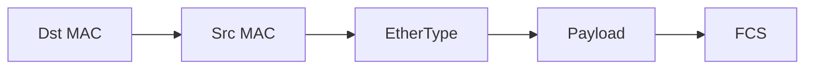

| EtherType | Payload |
|-----------|---------|
| 0x0800 | [IPv4](#ipv4) |
| 0x86DD | [IPv6](#ipv6) |
| 0x0806 | [ARP](#arp) |
| 0x8100 | [VLAN](#vlan) tag |

**pktana:** capture on an interface; you’ll see Ethernet headers on almost every frame.

---

## VLAN {#vlan}

**Layer:** [2](#data-link-layer)  
**Job:** Split one physical LAN into multiple logical LANs (broadcast domains).  
**Memory:** VLANs = **colored lanes** on the same highway.

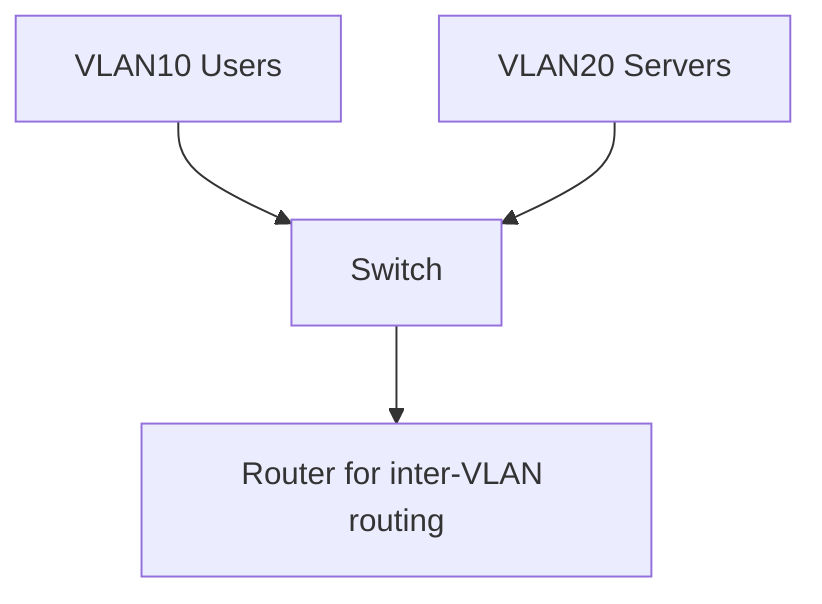

Tagged frames use 802.1Q (EtherType 0x8100).

---

## ARP {#arp}

**Layer:** [2](#data-link-layer) (helps [3](#network-layer))  
**Job:** Map **IP → MAC** on the local link.  
**Memory:** ARP = **“Who lives at this IP on my street?”**

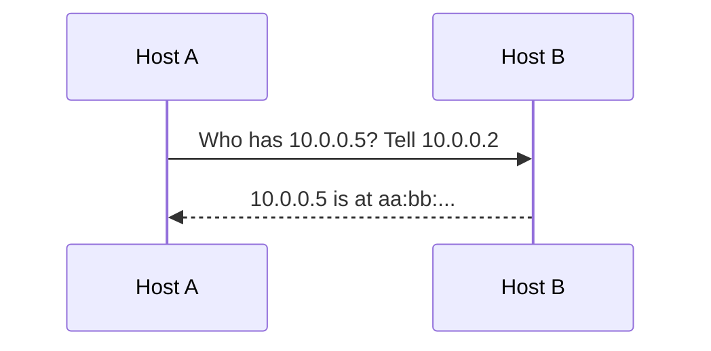

**Risk:** ARP spoofing → MitM ([Security](#network-security)).  
**Filter idea:** `arp`

---

## STP {#stp}

**Layer:** [2](#data-link-layer)  
**Job:** Prevent switching loops by blocking redundant links until needed.  
**Memory:** STP = **loop brakes** for switches.

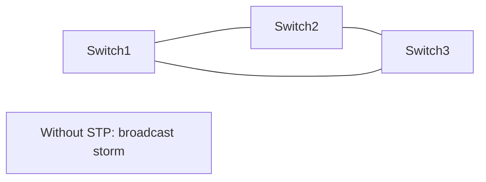

---

## IPv4 {#ipv4}

**Layer:** [3 Network](#network-layer)  
**Job:** Address hosts and route packets across networks (32‑bit addresses).  
**Memory:** IPv4 = **global house number** (with subnets as neighborhoods).

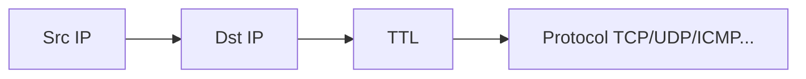

Private ranges you’ll see constantly: `10.0.0.0/8`, `172.16.0.0/12`, `192.168.0.0/16`.  
**Filter:** `ip`

---

## IPv6 {#ipv6}

**Layer:** [3](#network-layer)  
**Job:** Same mission as IPv4 with 128‑bit addresses and cleaner neighbor discovery.  
**Memory:** IPv6 = **more addresses than grains of sand** + modern neighbor features.

Uses [ICMPv6](#icmp) heavily for Neighbor Discovery (replaces much of ARP’s role).  
**Filter:** `ip6`

---

## ICMP {#icmp}

**Layer:** [3](#network-layer)  
**Job:** Network utility & error messages (ping, unreachable, time exceeded).  
**Memory:** ICMP = **network status texts**.

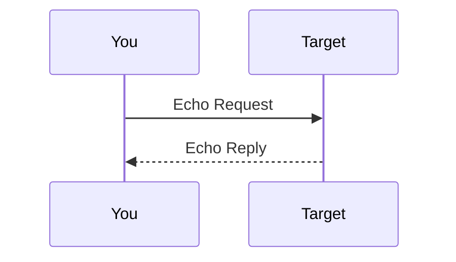

| Type | Meaning |
|------|---------|
| 8 / 0 | Echo request / reply (ping) |
| 3 | Destination unreachable |
| 11 | Time exceeded (traceroute hops) |

**Filter:** `icmp` / `icmp6`

---

## OSPF {#ospf}

**Layer:** [3](#network-layer) routing  
**Job:** Interior routers share link-state maps and compute shortest paths.  
**Memory:** OSPF = **campus GPS updates between routers**.

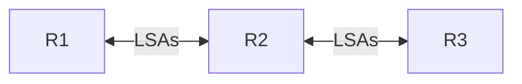

---

## BGP {#bgp}

**Layer:** [3](#network-layer) routing (Internet scale)  
**Job:** Exchange reachability between organizations (ASes).  
**Memory:** BGP = **postal service between countries/ISPs**.


---

## GRE {#gre}

**Layer:** [3](#network-layer) tunneling  
**Job:** Encapsulate packets inside IP (simple tunnel).  
**Memory:** GRE = **bubble wrap** for packets (no encryption by itself).

Often paired with [IPsec](#ipsec) for security.

---

## IPsec {#ipsec}

**Layer:** [3](#network-layer) security  
**Job:** Authenticate/encrypt IP payloads (VPN building block).  
**Memory:** IPsec = **armor around IP packets**.

Uses ESP/AH. Related: [VPN](#vpn).

---

## TCP {#tcp}

**Layer:** [4 Transport](#transport-layer)  
**Job:** Reliable, ordered byte stream between apps (ports).  
**Memory:** TCP = **tracked courier with receipts**.

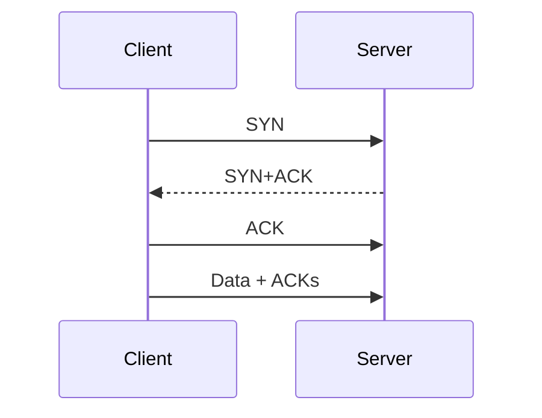

**Common ports:** 80, 443, 22, 25, 3389…  
**Filter:** `tcp`, `tcp port 443`

---

## UDP {#udp}

**Layer:** [4](#transport-layer)  
**Job:** Fast datagrams; no built-in reliability.  
**Memory:** UDP = **postcard** — cheap, may be lost.

Great for [DNS](#dns), [DHCP](#dhcp), [NTP](#ntp), media, gaming.  
**Filter:** `udp`

---

## DNS {#dns}

**Layer:** App ([7](#application-layer)) over [UDP](#udp)/[TCP](#tcp) 53  
**Job:** Resolve names ↔ records (A/AAAA/MX/TXT…).  
**Memory:** DNS = **phonebook of the Internet**.

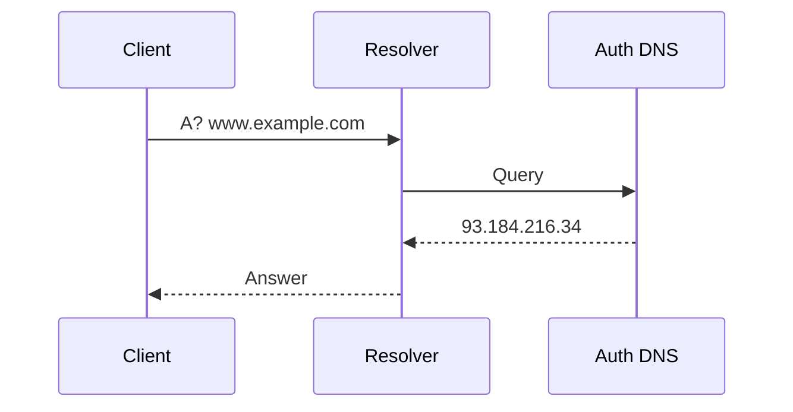

**Filter:** `udp port 53` or `port 53`

---

## DHCP {#dhcp}

**Layer:** App over [UDP](#udp) 67/68  
**Job:** Automatically assign IP, mask, gateway, DNS.  
**Memory:** DHCP = **“welcome kit” for new devices** (DORA).

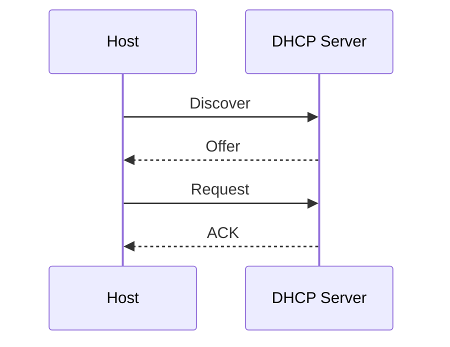

---

## HTTP {#http}

**Layer:** App ([7](#application-layer))  
**Job:** Request/response protocol for web resources.  
**Memory:** HTTP = **asking a library for a book** (`GET /path`).

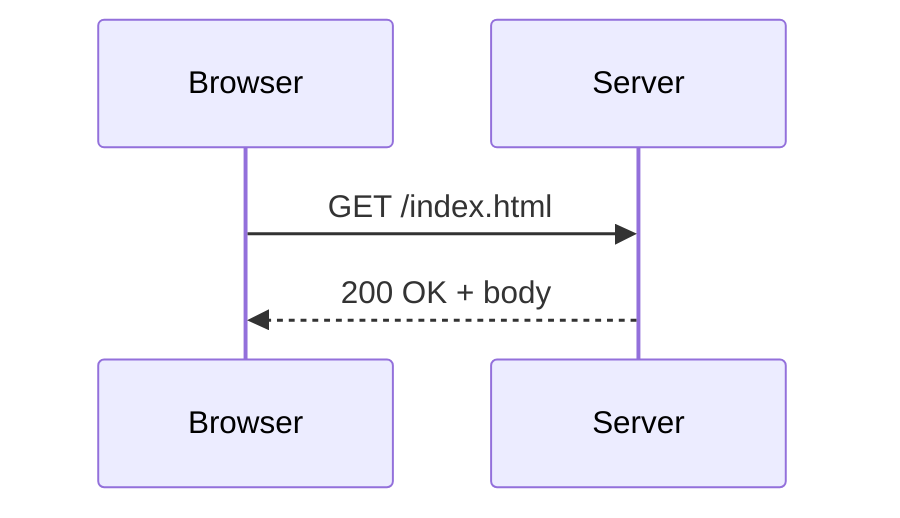

Default port 80 (cleartext). Prefer [HTTPS](#https).

---

## HTTPS {#https}

**Job:** [HTTP](#http) inside [TLS](#tls) (usually [TCP](#tcp) 443).  
**Memory:** HTTPS = **HTTP in a locked tunnel**.

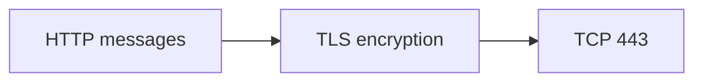

---

## TLS {#tls}

**Layer:** Presentation/App security  
**Job:** Encrypt & authenticate a session before app data.  
**Memory:** TLS = **private booth + ID check** for the server (certificate).

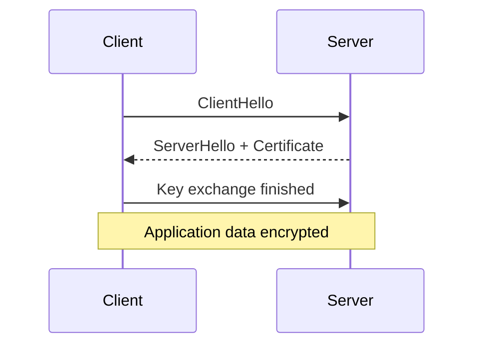

Used by [HTTPS](#https), mail, VPN variants, etc.

---

## SSH {#ssh}

**Port:** [TCP](#tcp) 22  
**Job:** Encrypted remote shell, file copy (SCP/SFTP), tunnels.  
**Memory:** SSH = **secure admin door**.

Avoid [Telnet](#telnet) for management.

---

## Telnet {#telnet}

**Port:** TCP 23  
**Job:** Remote terminal — **cleartext** (legacy).  
**Memory:** Telnet = **postcards of your passwords**. Use [SSH](#ssh).

---

## FTP {#ftp}

**Ports:** TCP 21 (control), 20/data or passive high ports  
**Job:** File transfer (often cleartext). Prefer SFTP ([SSH](#ssh)) or HTTPS uploads.

---

## SMTP {#smtp}

**Port:** TCP 25/587  
**Job:** Send mail between servers / submission.  
**Memory:** SMTP = **sending letters**; IMAP/POP = reading mailbox.

---

## NTP {#ntp}

**Port:** [UDP](#udp) 123  
**Job:** Synchronize clocks.  
**Memory:** Bad time → broken TLS/logs/Kerberos. NTP keeps reality aligned.

---

## SNMP {#snmp}

**Ports:** UDP 161/162  
**Job:** Monitor/manage network devices.  
**Memory:** SNMP = **device health check API**. Use SNMPv3.

---

## LDAP {#ldap}

**Ports:** TCP 389 / 636 (LDAPS)  
**Job:** Directory lookups (users, groups). Often behind login systems.

---

## SMB {#smb}

**Port:** TCP 445  
**Job:** Windows file/printer sharing and related services.  
**Memory:** SMB = **network drives**.

---

## RDP {#rdp}

**Port:** TCP 3389  
**Job:** Windows remote desktop. Expose carefully; prefer VPN + MFA.

---

## WireGuard {#wireguard}

**Port:** UDP 51820 (common default)  
**Job:** Modern, simple [VPN](#vpn) tunnel.  
**Memory:** WireGuard = **small fast encrypted pipe**.

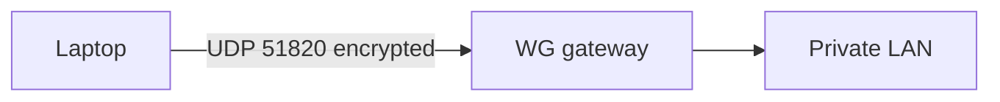

---

## QUIC {#quic}

**Job:** Modern transport over [UDP](#udp), used heavily by HTTP/3.  
**Memory:** QUIC = **TCP+TLS lessons rebuilt on UDP** for fewer round trips.

---

## Firewall {#firewall}

**Job:** Enforce allow/deny policy on traffic (stateless or stateful).  
**Memory:** Firewall = **bouncer with a guest list**.

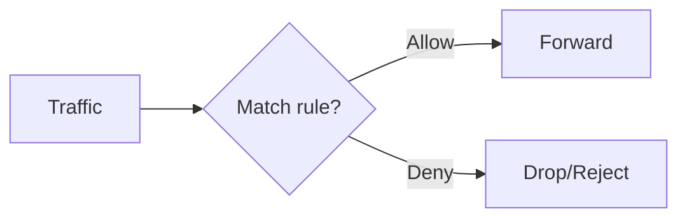

See [Network Security](#network-security).

---

## VPN {#vpn}

**Job:** Private encrypted path over an untrusted network.  
**Memory:** VPN = **secret tunnel through a public city**.

Technologies: [IPsec](#protocols-reference/ipsec), [WireGuard](#protocols-reference/wireguard), OpenVPN-style SSL VPNs, commercial SSL VPNs.

---

## Port Cheat Sheet

| Port | Proto | Service |
|------|-------|---------|
| 22 | TCP | [SSH](#ssh) |
| 53 | UDP/TCP | [DNS](#dns) |
| 67/68 | UDP | [DHCP](#dhcp) |
| 80 | TCP | [HTTP](#http) |
| 123 | UDP | [NTP](#ntp) |
| 443 | TCP | [HTTPS](#https) |
| 445 | TCP | [SMB](#smb) |
| 3389 | TCP | [RDP](#rdp) |
| 51820 | UDP | [WireGuard](#wireguard) |

---

## Knowledge Check

```quiz
QUESTION: Which protocol resolves names to IP addresses?
OPTIONS:
ARP
DNS
STP
FTP
ANSWER: 1
EXPLAIN: DNS is the Internet phonebook for names/records.
```

```quiz
QUESTION: Which protocol resolves IP to MAC on a LAN?
OPTIONS:
DNS
ARP
BGP
TLS
ANSWER: 1
EXPLAIN: ARP maps IP→MAC locally.
```

```quiz
QUESTION: HTTPS is:
OPTIONS:
HTTP over TLS
ARP over Wi‑Fi only
BGP community strings
SMTP without ports
ANSWER: 0
EXPLAIN: HTTPS packages HTTP inside TLS.
```

```quiz
QUESTION: TCP’s first packet in a new connection is typically:
OPTIONS:
FIN
SYN
RST only
DHCP Offer
ANSWER: 1
EXPLAIN: Clients start with SYN.
```

```quiz
QUESTION: WireGuard is primarily a:
OPTIONS:
Layer 2 loop-prevention protocol
VPN tunnel protocol
MAC learning algorithm
Cable category
ANSWER: 1
EXPLAIN: WireGuard creates encrypted VPN tunnels (commonly UDP 51820).
```

---

## Next

[Modern Networking](#modern-networking) · [DLP & IDPS](#dlp-idps) · [Final Knowledge Check](#knowledge-check)
