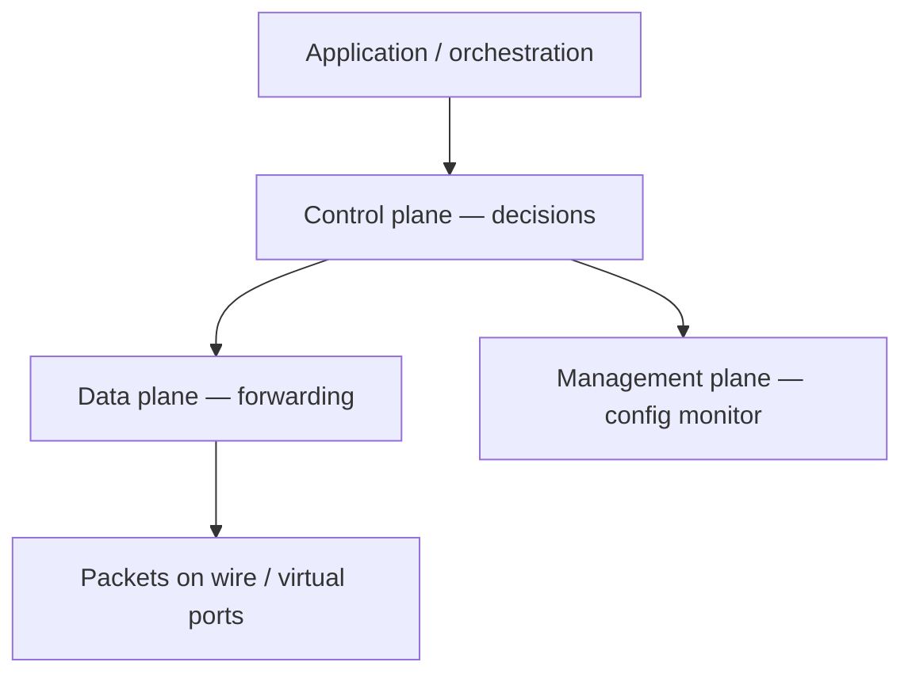
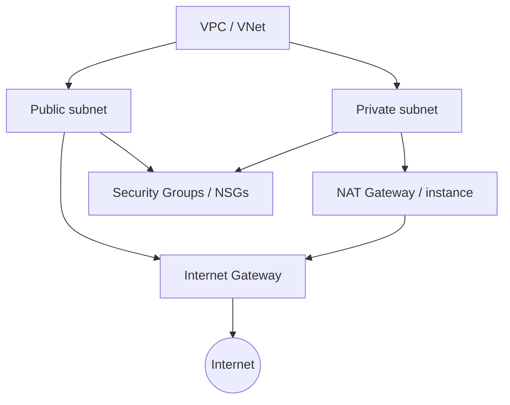
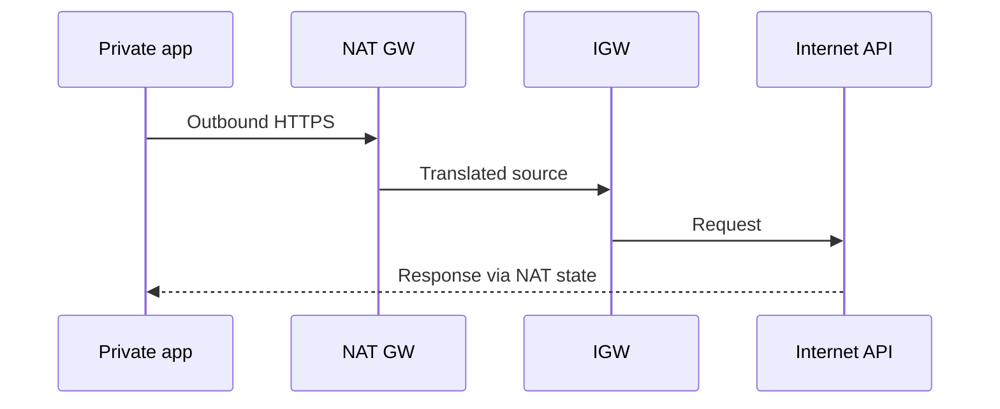
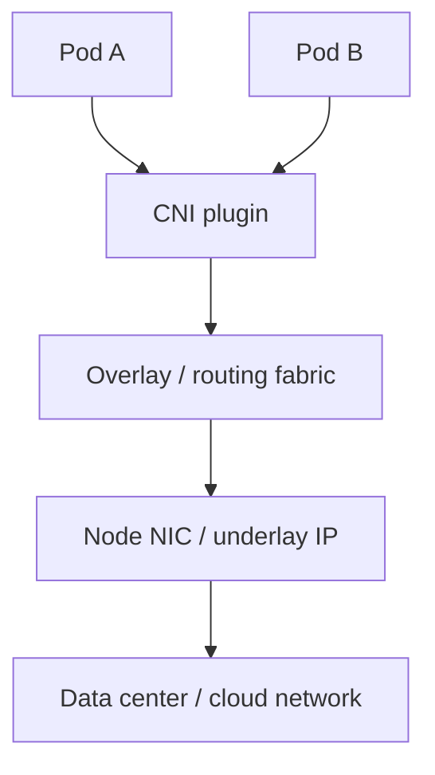
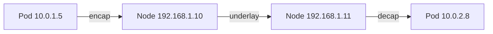
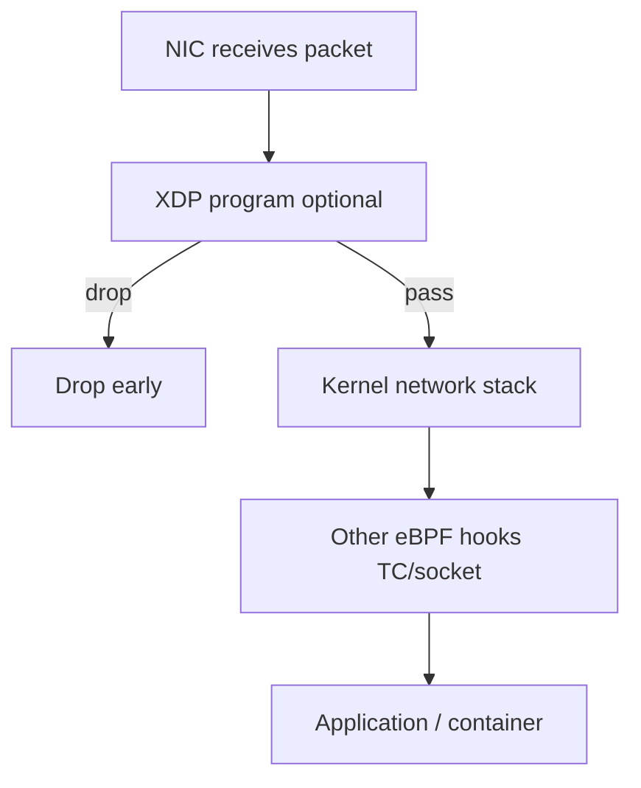
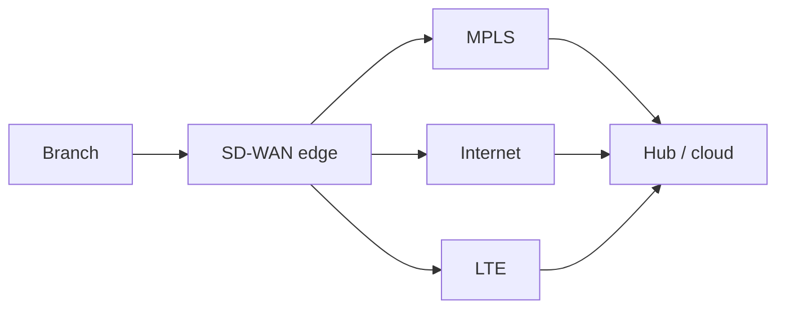
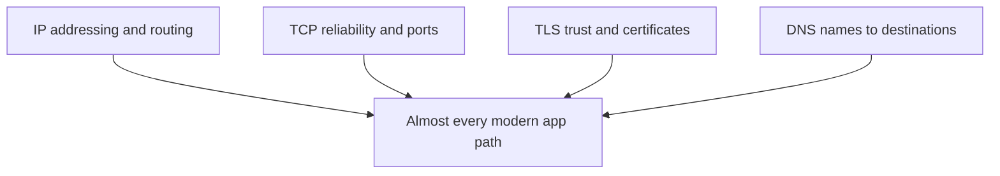

# Modern Networking

Classic lessons still win interviews: [Ethernet](#protocols-reference/ethernet), [IP](#protocols-reference/ipv4)/[IPv6](#protocols-reference/ipv6), [TCP](#protocols-reference/tcp), [DNS](#protocols-reference/dns), [TLS](#protocols-reference/tls). Modern networking wraps those same ideas in software-defined control, cloud virtual networks, containers, programmable data planes, and new edge architectures.

This chapter is a map of **what changed in the last decade** — and what deliberately did **not**.

> **Remember:** Cloud diagrams look new. Underneath, you still debug **IP reachability, DNS names, and TLS trust**.

---

## Software-Defined Networking (SDN) Planes {#sdn-planes}

Traditional boxes mix decision-making and forwarding in one device. SDN language separates concerns:



| Plane | Job | Examples |
|-------|-----|----------|
| **Data / forwarding** | Move packets fast | ASIC pipelines, OVS, cloud vSwitch |
| **Control** | Decide how to forward | SDN controllers, routing protocols, kube-proxy alternatives |
| **Management** | Configure, monitor, inventory | Controllers, APIs, Terraform, NMS |
| **Application** (sometimes listed) | Intent: “connect these apps” | Orchestrators, service meshes |

### Why people wanted SDN

- Central policy instead of 500 divergent box configs
- Faster innovation via software
- Better visibility and automation

### What still bites you

- Controller reachability becomes critical
- Abstractions overlays can hide underlay faults
- You must still understand [STP](#protocols-reference/stp)/routing when the fabric is hybrid

> **Remember:** SDN moves **where** decisions live. It does not repeal packet physics or bad IP plans.

---

## Cloud Networking: VPC Building Blocks {#cloud-vpc}

Public cloud virtual networks (AWS VPC, Azure VNet, GCP VPC — names vary) give you software-shaped [topologies](#topologies).



### Core objects (conceptual glossary)

| Object | Plain meaning |
|--------|---------------|
| **VPC / VNet** | Your isolated virtual network |
| **Subnet** | Slice of address space, often tied to AZ/zone |
| **Internet Gateway (IGW)** | Path for public Internet in/out (with rules) |
| **NAT Gateway** | Private subnets initiate outbound without inbound exposure |
| **Route tables** | “Where do packets for this prefix go?” |
| **Security Group / NSG / firewall rules** | Stateful-ish virtual firewalls on NICs/subnets |
| **Peering / Transit** | Connect VPCs/VNets privately |
| **Private endpoints** | Consume PaaS without public IP path |

### Public vs private subnet mental model



Inbound from Internet to a private instance usually should **fail** unless you add a deliberate path (LB, bastion, VPN, SSM-style access). That is segmentation — same spirit as [Network Security](#network-security).

### Cloud gotchas for packet people

- Overly open Security Groups (“0.0.0.0/0 to the world”) recreate flat networks.
- Asymmetric routing with multiple NICs/firewalls drops stateful flows.
- DNS in cloud often uses special resolvers — broken DNS looks like “network is down.”
- Flow logs ≈ NetFlow cousin; PCAPs may need instance-level or mirror sessions.

---

## Containers, CNI, and Overlays {#containers-cni}

Containers pack apps with dependencies. Orchestrators (especially Kubernetes) schedule many containers across nodes. Networking must answer: **how does pod A reach pod B and the outside world?**



### CNI (Container Network Interface)

CNI plugins attach network namespaces to a cluster network model:

- Assign IPs to pods
- Program routes or encapsulate
- Enforce NetworkPolicies (micro-segmentation)

### Overlays vs underlays

| Term | Meaning |
|------|---------|
| **Underlay** | Real IP network the nodes sit on |
| **Overlay** | Virtual network spanning nodes (often VXLAN/Geneve or similar) |



### Services and load balancing

Clusters invent stable **Service** IPs / DNS names that load-balance to ephemeral pod IPs. Troubleshooting jumps between:

1. Cluster DNS name
2. Service / ClusterIP
3. Pod IP
4. Node underlay
5. Cloud SG / route

pktana on a node may see overlay ports or only underlay — know which vantage you have.

> **Remember:** Containers multiply **east–west** traffic. Flat “allow all pods” is a security debt — use NetworkPolicies like tiny firewalls.

---

## eBPF and XDP (programmable packet smarts) {#ebpf-xdp}

**eBPF** lets safe-ish programs run in the Linux kernel for observability, security, and networking without rewriting the kernel.

**XDP** (eXpress Data Path) is an early hook that can drop/redirect packets at very high speed, often before heavy stack processing.



| Use case | Why eBPF/XDP helps |
|----------|--------------------|
| DDoS shedding | Drop junk early |
| Service mesh alternatives | Sidecar-less load balancing / policy |
| Deep observability | Flow-level metrics without full PCAP forever |
| Runtime security | Detect suspicious syscalls / network patterns |

You do not need to write eBPF to understand the headline: **policy and telemetry are moving into the kernel data path**, closer to where packets live.

---

## SASE and SD-WAN (briefly) {#sase-sdwan}

### SD-WAN

Software-defined WAN steers site traffic across multiple underlays (MPLS, broadband, LTE) with centralized policy.



Benefits: cheaper hybrid transport, app-aware steering, simpler branch config. Still depends on underlay quality and good security design ([VPN](#protocols-reference/vpn)/[IPsec](#protocols-reference/ipsec)/[firewall](#protocols-reference/firewall)).

### SASE (Secure Access Service Edge)

SASE blends WAN + cloud security services: SWG, CASB, ZTNA, often FWaaS — delivered near users as a service.

| Idea | Plain reading |
|------|---------------|
| Users everywhere | Policy follows identity, not only office IP |
| Apps in SaaS/cloud | Inspection moves to cloud edges |
| Less “hairpin to HQ” | Direct-to-net with security in path |

SASE is an architecture category, not a single protocol. Your OSI debugging skills still apply at each hop.

---

## What Stays the Same {#what-stays}

Despite SDN, cloud, and containers, these remain your durable toolkit:



| Durable skill | Why it still matters |
|---------------|----------------------|
| [IPv4](#protocols-reference/ipv4)/[IPv6](#protocols-reference/ipv6) subnetting & routes | VPCs, pods, and SD-WAN all forward IP |
| [TCP](#protocols-reference/tcp)/[UDP](#protocols-reference/udp) ports | Security groups, services, troubleshooting |
| [TLS](#protocols-reference/tls) | Nearly all user-facing apps |
| [DNS](#protocols-reference/dns) | Cloud and K8s are DNS-heavy |
| Packet mental model | Overlays still carry inner packets |
| CIA & segmentation | [Security](#network-security) goals unchanged |

When a “modern” outage hits, narrate it classically:

1. Does DNS resolve?
2. Is there a route / SG allow?
3. Does TCP connect?
4. Does TLS trust?
5. Does the app protocol succeed?

Overlays and controllers add steps **around** that spine — they rarely replace it.

---

## Modern Capture and Visibility Notes {#modern-visibility}

| Environment | Visibility tip |
|-------------|----------------|
| Cloud | VPC flow logs + optional traffic mirroring |
| Containers | Capture on node may show overlay; use CNI/observability tools too |
| eBPF rich nodes | Metrics may exist without full payloads |
| SASE | Logs live in the vendor cloud — export to SIEM |
| Everywhere | Prefer [HTTPS](#protocols-reference/https); expect encrypted payloads |

pktana remains valuable wherever you can mirror or capture frames: lab bridges, VMs, bare metal, and some cloud mirror targets.

---

## Hands-On Tasks

```task
TITLE: Label the SDN planes
LEVEL: beginner
STEPS:
1. Pick a managed cloud VPC or a toy SDN diagram
2. Mark one data-plane element and one control/management element
3. Write what fails if the control channel dies but forwarding ASICs still run
GOAL: Separate “packets still flow” from “no one can change policy”
```

```task
TITLE: VPC story in five objects
LEVEL: intermediate
STEPS:
1. Draw VPC, public subnet, private subnet, IGW, NAT
2. Trace a private instance’s outbound HTTPS
3. Explain why inbound SSH from Internet to private should fail by default
GOAL: Internalize cloud default-deny instincts
```

```task
TITLE: Pod to pod narration
LEVEL: intermediate
STEPS:
1. Write the path: Pod IP → CNI → overlay/underlay → peer pod
2. List two places a NetworkPolicy or cloud SG could drop the flow
3. Note what a node PCAP might show vs a pod namespace capture
GOAL: Practice multi-layer container troubleshooting
```

```task
TITLE: Same-as-ever checklist
LEVEL: beginner
STEPS:
1. For a broken SaaS app behind SASE, list DNS → TCP → TLS checks
2. Link each check to a Protocols Reference page
3. Add one modern-only check (connector status / ZTNA policy)
GOAL: Prove classical skills transfer
```

---

## Knowledge Check

```quiz
QUESTION: In SDN language, the data plane primarily:
OPTIONS:
Writes HR policies only
Forwards packets according to programmed rules
Replaces DNS permanently
Paints rack doors
ANSWER: 1
EXPLAIN: Data plane is forwarding; control plane decides.
```

```quiz
QUESTION: A cloud NAT Gateway is commonly used so that:
OPTIONS:
Private subnets can initiate outbound Internet access without full inbound exposure
All encryption is removed
VLANs cease to exist
BGP is banned
ANSWER: 0
EXPLAIN: NAT enables outbound from private address space via translation.
```

```quiz
QUESTION: An Internet Gateway in a VPC conceptually provides:
OPTIONS:
Only printer sharing
A route path between the VPC and the public Internet (policy permitting)
A replacement for TLS
A Token Ring controller
ANSWER: 1
EXPLAIN: IGW is the Internet attachment point for the virtual network.
```

```quiz
QUESTION: CNI in Kubernetes is mainly about:
OPTIONS:
Container networking attachment and IP connectivity models
Compulsory use of Telnet
Physical bus topology only
Deleting the underlay
ANSWER: 0
EXPLAIN: CNI plugins implement cluster container networking.
```

```quiz
QUESTION: An overlay network typically:
OPTIONS:
Replaces all copper with smoke signals
Encapsulates virtual network traffic across an underlay IP fabric
Removes the need for IP addresses inside pods
Forbids Security Groups
ANSWER: 1
EXPLAIN: Overlays ride on underlay connectivity.
```

```quiz
QUESTION: XDP is valuable because it can:
OPTIONS:
Only configure Wi-Fi channels
Act on packets very early for high-performance drop/redirect
Replace HTTP status codes
Force bus topology
ANSWER: 1
EXPLAIN: XDP hooks early in the receive path.
```

```quiz
QUESTION: SD-WAN primarily focuses on:
OPTIONS:
Steering site traffic across multiple WAN underlays with centralized policy
Replacing Ethernet FCS
Outlawing OSPF in all labs
Removing firewalls forever
ANSWER: 0
EXPLAIN: SD-WAN is policy-driven WAN transport selection/management.
```

```quiz
QUESTION: Despite cloud and containers, which still remains essential?
OPTIONS:
Only Token Ring
IP, DNS, TCP/TLS troubleshooting skills
Abandoning all diagrams
Physical bus coax mandatory
ANSWER: 1
EXPLAIN: Foundational protocols still carry modern apps.
```

```quiz
QUESTION: Security Groups in cloud are closest in spirit to:
OPTIONS:
Wallpaper themes
Virtual firewalls controlling instance/subnet traffic
Optical wavelengths of sunlight
STP optional extras only
ANSWER: 1
EXPLAIN: SGs/NSGs enforce allow/deny network policy.
```

```quiz
QUESTION: East–west traffic in a cluster means:
OPTIONS:
Only Internet ingress
Traffic between workloads inside the environment
Satellite uplinks exclusively
DHCP Discover only
ANSWER: 1
EXPLAIN: East–west is internal lateral communication.
```

---

## What You Should Feel Confident Saying

- SDN planes and why separation matters
- VPC/subnet/IGW/NAT/SG building blocks
- Containers/CNI/overlay vs underlay
- What eBPF/XDP change about visibility and defense
- SD-WAN/SASE at a conceptual level
- Why IP/TCP/TLS/DNS remain the debugging spine

---

## Next

Security tooling depth: [DLP & IDPS](#dlp-idps).  
Then prove mastery: [Knowledge Check](#knowledge-check).  
Refresh any protocol: [Protocols Reference](#protocols-reference).
