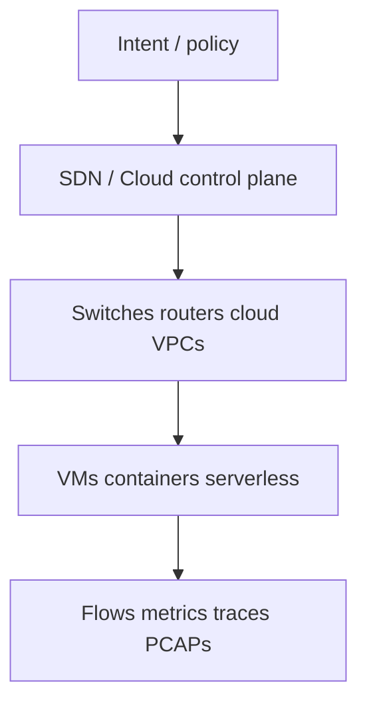
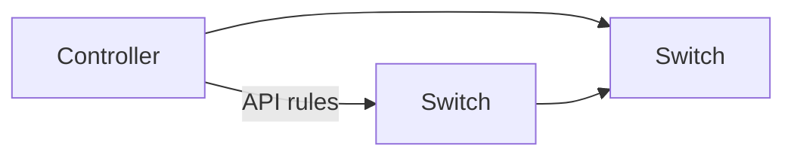
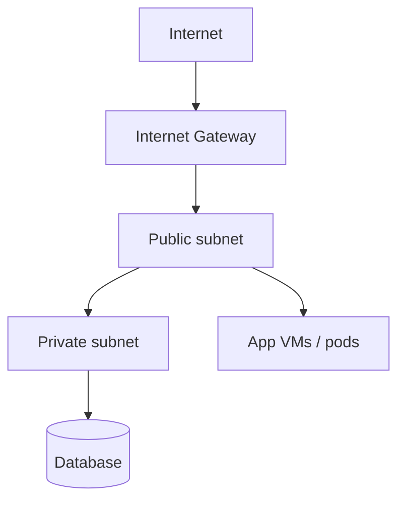
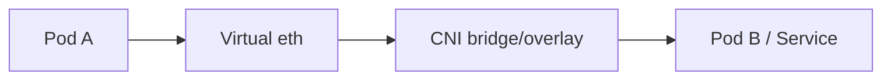

# Modern Networking

Classic packets still move the same way — [Ethernet](#protocols-reference/ethernet), [IP](#protocols-reference/ipv4), [TCP](#protocols-reference/tcp) — but **how we build and operate** networks changed: software control, cloud, containers, and programmable data planes.

> **Remember:** Modern networking = **same layers, new remote controls**.

---

## Big Picture



---

## SDN (Software‑Defined Networking)

**Split the brain from the muscles.**

| Plane | Job |
|-------|-----|
| Control plane | Decide paths / policy |
| Data plane | Forward packets fast |



You still capture [TCP](#protocols-reference/tcp)/[UDP](#protocols-reference/udp) the same way — the difference is where rules come from.

---

## Cloud Networking (VPC mental model)



Ideas to map to earlier lessons:
- Subnets ≈ [IP](#protocols-reference/ipv4) planning ([Network Layer](#network-layer))
- Security groups ≈ host/[firewall](#protocols-reference/firewall) policies
- Peering / transit ≈ routing between networks

---

## Containers & Overlays

Containers share a host but get virtual NICs and overlay networks (VXLAN/Geneve, etc.).



Packet captures may show outer + inner headers — start by identifying [IP](#protocols-reference/ipv4) pairs and ports.

---

## Programmable Data Plane (XDP/eBPF)

Instead of only CPU networking stacks, programs can run at the NIC/driver boundary for filtering, load-balancing, observability.

pktana’s dataplane ideas live in this world: inspect early, act fast, measure precisely.

---

## What Stays Memorable

1. Layers did not vanish — they got virtualized.  
2. [DNS](#protocols-reference/dns), [TLS](#protocols-reference/tls), [TCP](#protocols-reference/tcp) still dominate app traffic.  
3. Observability (flows + PCAP) is how you prove what the software *claims* the network is doing.

---

## Knowledge Check

```quiz
QUESTION: SDN mainly separates:
OPTIONS:
Copper from fiber forever
Control plane decisions from data plane forwarding
DNS from DHCP only
MAC from ARP permanently
ANSWER: 1
EXPLAIN: SDN centralizes/decouples control logic from forwarding hardware/software.
```

```quiz
QUESTION: A cloud private subnet usually:
OPTIONS:
Needs no IP addressing
Has no route to Internet by default (or only via NAT/gateway patterns)
Replaces TLS
Disables all TCP
ANSWER: 1
EXPLAIN: Private subnets are isolated by routing/NAT design.
```

```quiz
QUESTION: Container overlays still ultimately rely on:
OPTIONS:
Only Layer 1 radio
Packet forwarding concepts (IP/MAC/ports) under virtualization
Deleting the OSI model
SMTP exclusively
ANSWER: 1
EXPLAIN: Virtual networks still encapsulate real packet concepts.
```

---

## Next

Security tooling depth: [DLP & IDPS](#dlp-idps) · then [Final Knowledge Check](#knowledge-check).
