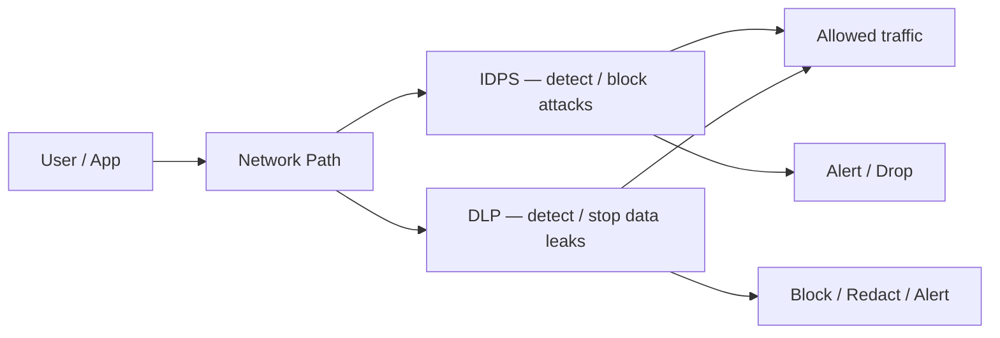
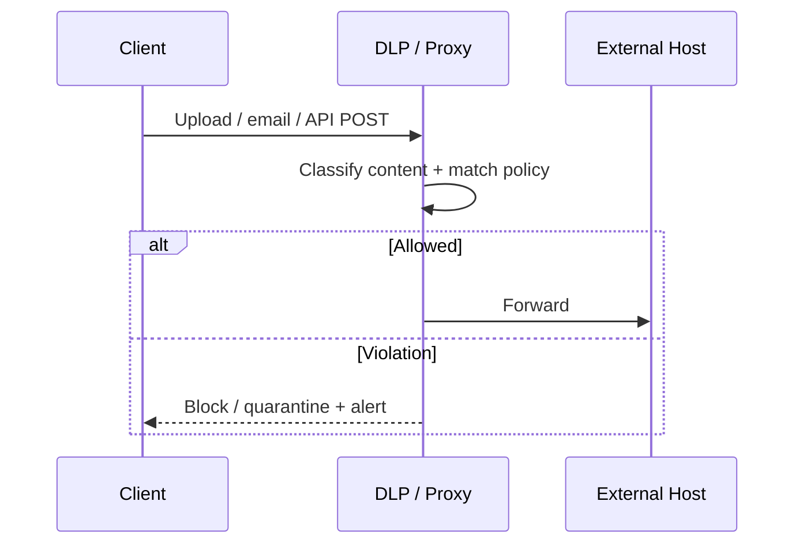
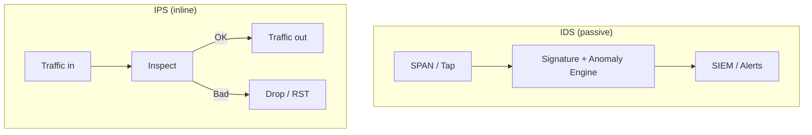
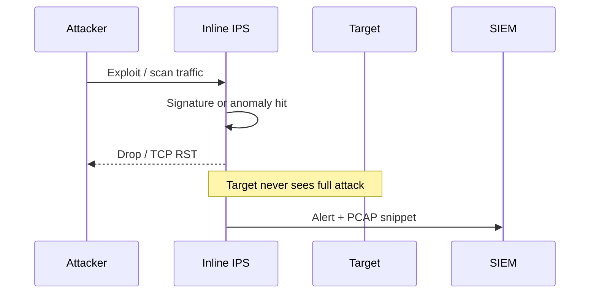
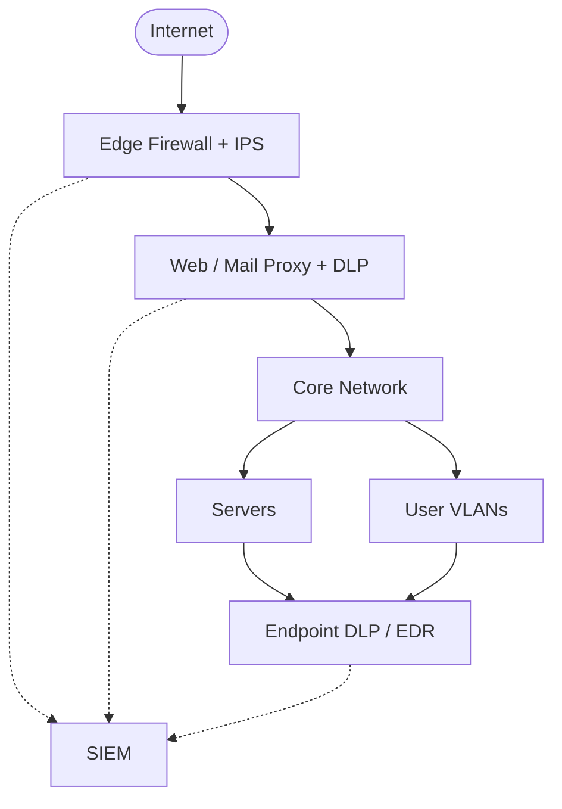

# DLP & IDPS

Data Loss Prevention (**DLP**) and Intrusion Detection / Prevention Systems (**IDS / IPS**, often called **IDPS** together) protect different things: DLP guards *sensitive data*, while IDPS guards the *network and hosts* against attacks. In pktana’s security tooling you will see both ideas — pattern and policy checks on traffic, plus detection and blocking of suspicious behavior.

---

## Why These Matter Together



| Concern | DLP focus | IDPS focus |
|---------|-----------|------------|
| Goal | Stop exfiltration of secrets (PII, keys, PHI) | Stop or detect exploits, scans, malware C2 |
| Typical signal | Content / channel / destination policy | Signatures, anomalies, known bad IPs |
| Action | Allow, alert, block, encrypt, quarantine | Alert (IDS) or block inline (IPS) |
| False positive risk | Business docs that look like secrets | Noisy scanners and lab traffic |

---

## DLP — Data Loss Prevention

### What DLP Is

DLP systems discover, classify, and enforce rules on sensitive data **in use**, **in motion**, and **at rest**.

- **In motion** — email, HTTP uploads, cloud sync, USB, IM
- **In use** — copy/paste, print, screenshot on endpoints
- **At rest** — file shares, databases, object storage

### Common Sensitive Patterns

- Credit card numbers (Luhn-checked), national IDs, health records
- API keys, private keys (`BEGIN PRIVATE KEY`), passwords in cleartext
- Customer lists and regulated fields (GDPR, HIPAA, PCI)

### Network DLP Flow



### DLP Policy Building Blocks

1. **Identify** — what is sensitive? (regex, fingerprints, ML classifiers)
2. **Channel** — where can it go? (corp email OK, personal webmail blocked)
3. **Action** — alert only, block, encrypt, require justification
4. **Exceptions** — legal, backup, approved SaaS with DLP connector

> In packet analysis, cleartext protocols (HTTP, SMTP, FTP) make DLP matching easy; TLS encrypts payloads so you need TLS inspection, endpoint DLP, or metadata policies (destination, volume, time).

---

## IDPS — Intrusion Detection & Prevention

### IDS vs IPS vs IDPS

| Mode | Placement | Action |
|------|-----------|--------|
| **IDS** | Out-of-band (SPAN / tap) | Detect + alert only |
| **IPS** | Inline on the path | Detect + drop / reset |
| **IDPS** | Combined platform | Tunable detect and/or prevent |



### Detection Methods

**Signature-based** — match known bad payloads (CVE exploit bytes, malware beacons). Fast and precise; blind to zero-days.

**Anomaly-based** — baseline “normal” then flag deviations (new ports, odd volumes, rare destinations). Catches unknowns; needs tuning.

**Reputation / threat intel** — block or score known malicious IPs, domains, JA3 hashes.

**Protocol validation** — reject illegal TCP/HTTP/DNS that exploit parser bugs.

### Classic Attack → IDPS Response



### Where pktana Fits

- **Capture / Flows** — evidence for IDPS alerts (who talked to whom, how much)
- **Connections** — unexpected listeners or outbound sessions
- **Security panels** — policies akin to lightweight DLP/IDPS style checks on observed traffic
- Export PCAPs for deeper IDS engines (Suricata, Snort) when needed

---

## Putting DLP + IDPS in an Architecture



**Rule of thumb:** IDPS answers “Is this *hostile*?” DLP answers “Is this *sensitive* and leaving the wrong way?”

---

## Hands-On Tasks

```task
TITLE: Simulate a DLP content hunt in a capture
LEVEL: intermediate
STEPS:
1. Capture traffic that includes cleartext HTTP or SMTP if available in a lab
2. Search payloads or exports for strings like `password=`, `AKIA`, or `BEGIN PRIVATE KEY`
3. Note source/destination and whether the channel should be allowed
GOAL: Practice the analyst workflow DLP engines automate
HINT: Prefer a lab PCAP — never search production captures for real secrets without policy approval
```

```task
TITLE: Distinguish IDS vs IPS placement
LEVEL: beginner
STEPS:
1. Draw your lab network: gateway, switch, one server
2. Mark where a SPAN port IDS would attach
3. Mark where an inline IPS would sit
GOAL: Explain one benefit and one risk of inline IPS vs passive IDS
```

```task
TITLE: Use pktana flows as IDPS context
LEVEL: intermediate
STEPS:
1. Open Flow Capture in the pktana Web UI
2. Sort or note top talkers by bytes
3. Flag any destination that is unexpected for that host role
GOAL: Show how volume and destination anomalies feed IDPS investigations
```

---

## Knowledge Check

```quiz
QUESTION: What is the primary goal of DLP?
OPTIONS:
Accelerate TCP handshakes
Prevent sensitive data from leaking via unauthorized channels
Replace all firewalls
Measure Wi-Fi signal strength
ANSWER: 1
EXPLAIN: DLP focuses on discovering and controlling sensitive data movement.
```

```quiz
QUESTION: An IPS differs from an IDS mainly because it can:
OPTIONS:
Only log to a file
Sit offline with no traffic visibility
Take inline action such as dropping malicious packets
Resolve DNS names faster
ANSWER: 2
EXPLAIN: IPS is inline and can block; IDS is typically detect-and-alert.
```

```quiz
QUESTION: Encrypted TLS uploads make pure network DLP harder because:
OPTIONS:
Ports cannot be numbered
Payloads are not readable without inspection or endpoint controls
Switches stop forwarding frames
ARP no longer works
ANSWER: 1
EXPLAIN: Without TLS inspection or endpoint/cloud DLP, ciphertext hides content.
```

```quiz
QUESTION: Signature-based IDPS is strongest against:
OPTIONS:
Brand-new zero-day exploits with no known pattern
Attacks matching known exploit or malware patterns
Only physical cable cuts
DHCP Discover floods exclusively
ANSWER: 1
EXPLAIN: Signatures match known patterns; novel attacks need anomaly or threat-intel approaches too.
```

---

## Summary

- **DLP** protects sensitive data across channels; policies classify and enforce
- **IDS** detects; **IPS** prevents; **IDPS** platforms often do both
- Defense in depth pairs firewalls, IDPS, DLP, segmentation, and monitoring
- Packet tools like **pktana** supply the evidence layer: flows, PCAPs, and connections

**Next:** [Knowledge Check](#knowledge-check) — mixed quiz across networking and security, or [Protocols Reference](#protocols-reference)
