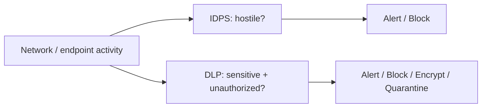
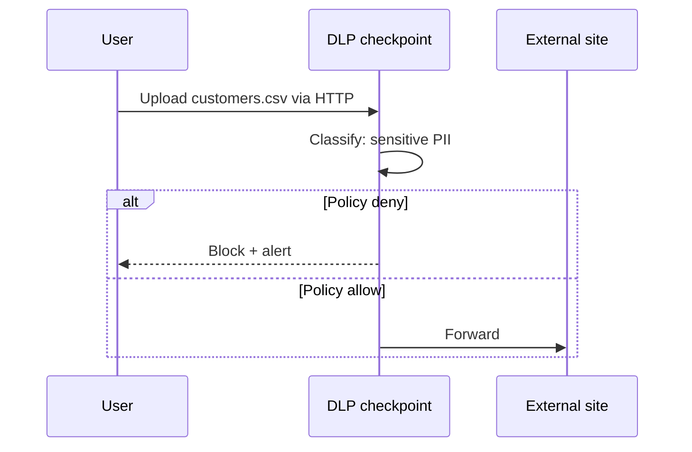
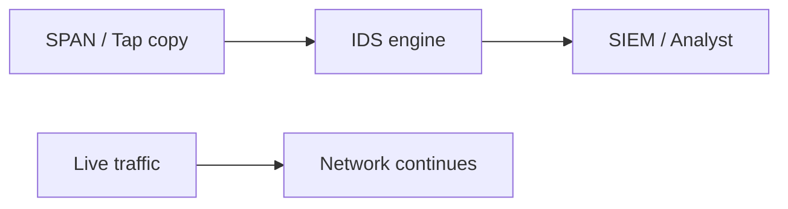
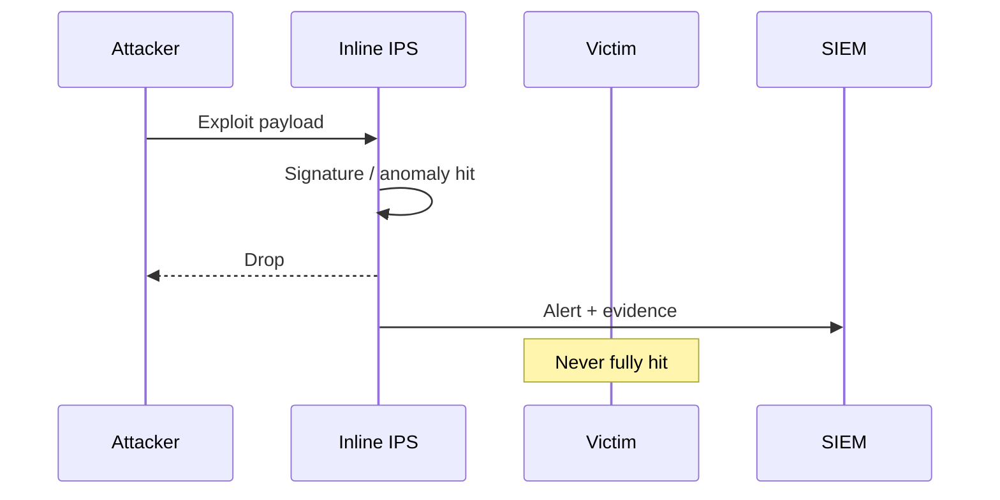

# DLP & IDPS

Two different questions protect you:

1. **Is this traffic an attack?** → [IDS](#ids) / [IPS](#ips) / **IDPS**  
2. **Is sensitive data leaving the wrong way?** → **DLP**

> **Remember:** **IDPS guards the castle. DLP guards the crown jewels.**

---

## Side‑by‑Side



| | DLP | IDPS |
|---|-----|------|
| Focus | Data content & channels | Attacks & misuse |
| Examples | PAN, secrets, source code leaks | Exploits, scans, C2, malware |
| Actions | Warn, block, redact, encrypt | Alert (IDS) or drop (IPS) |
| Hard mode | Encrypted payloads | Encrypted / novel attacks |

---

## DLP — Data Loss Prevention {#dlp}

**Job:** Find sensitive data and enforce “where it may go.”

### States of data
- **In motion** — email, web upload, chat, API  
- **In use** — copy/paste, print  
- **At rest** — disks, shares, buckets  



**Network note:** Cleartext [HTTP](#protocols-reference/http)/[SMTP](#protocols-reference/smtp)/[FTP](#protocols-reference/ftp) is easy to inspect. [TLS](#protocols-reference/tls) hides payloads unless you use approved TLS inspection, endpoint DLP, or cloud app controls.

Related protocols & ideas: [Firewall](#protocols-reference/firewall), [Network Security](#network-security).

---

## IDS — Intrusion Detection {#ids}

**Job:** Spot bad behavior and **alert** (usually passive tap/SPAN).



---

## IPS — Intrusion Prevention {#ips}

**Job:** Sit **inline** and **block** (drop/reset) when confident.


---

## IDPS Together {#idps}

Many platforms combine detect + prevent with tunables (monitor → protect).

### Detection styles
| Style | Strength | Weakness |
|-------|----------|----------|
| Signatures | Known attacks | New/unknown attacks |
| Anomalies | Weird behavior | Tuning / false positives |
| Reputation | Known-bad IPs/domains | Fresh infrastructure |
| Protocol checks | Malformed packets | Encrypted opaque blobs |



---

## How pktana Helps

- **Flows / top talkers** — volume anomalies (exfil or C2-ish patterns)  
- **Connections** — odd listeners / outbound ports  
- **PCAP** — evidence for IDS alerts or DLP investigations  
- Pair with SIEM and dedicated engines (Suricata/Snort/etc.) when needed  

---

## Hands-On Tasks

```task
TITLE: Pick DLP vs IDPS for a scenario
LEVEL: beginner
STEPS:
1. Scenario A: ransomware worm scanning the LAN
2. Scenario B: employee uploads payroll.csv to personal webmail
3. Write which system leads and what evidence you’d capture
GOAL: Choose the right primary control for each case
```

```task
TITLE: Evidence pack with pktana
LEVEL: intermediate
STEPS:
1. Note a suspicious destination from Flows
2. Filter a short capture to that 5-tuple
3. Decide if next step is IPS block rule, DLP channel block, or both
GOAL: Practice analyst workflow, not just tool clicks
```

---

## Knowledge Check

```quiz
QUESTION: DLP’s primary mission is to:
OPTIONS:
Speed up ARP
Prevent sensitive data from leaving via unauthorized channels
Replace fiber optics
Assign VLAN IDs
ANSWER: 1
EXPLAIN: DLP focuses on sensitive data handling and exfiltration paths.
```

```quiz
QUESTION: An inline device that can drop exploit packets is acting as:
OPTIONS:
DNS stub only
IPS
DHCP relay only
STP root bridge only
ANSWER: 1
EXPLAIN: IPS is inline prevention; IDS is typically detect/alert.
```

```quiz
QUESTION: TLS makes pure network DLP harder because:
OPTIONS:
Ports disappear
Payloads are encrypted without inspection or endpoint controls
MAC addresses become IPv6
Switches stop learning
ANSWER: 1
EXPLAIN: Ciphertext hides content from network DLP unless other controls exist.
```

```quiz
QUESTION: Signature-based IDPS is best against:
OPTIONS:
Only brand-new zero-days with no pattern
Attacks matching known exploit/malware patterns
Cable cuts
DHCP Discover exclusively
ANSWER: 1
EXPLAIN: Signatures match known patterns; unknowns need other methods too.
```

---

## Next

Prove yourself: [Knowledge Check](#knowledge-check).  
Refresh any term in [Protocols Reference](#protocols-reference).
