# DLP & IDPS

Two different questions protect you:

1. **Is this traffic an attack?** → **IDS** / **IPS** / **IDPS**
2. **Is sensitive data leaving the wrong way?** → **DLP**

They often share sensors and SIEM tickets, but their missions differ. This chapter is a full textbook treatment: DLP data states and channels, false positives, the TLS inspection challenge, IDS vs IPS vs IDPS, detection methods, architecture, SOC workflow, and how pktana supplies evidence.

> **Remember:** **IDPS guards the castle walls. DLP guards the crown jewels.** You usually need both.

---

## Side-by-Side Map {#side-by-side}

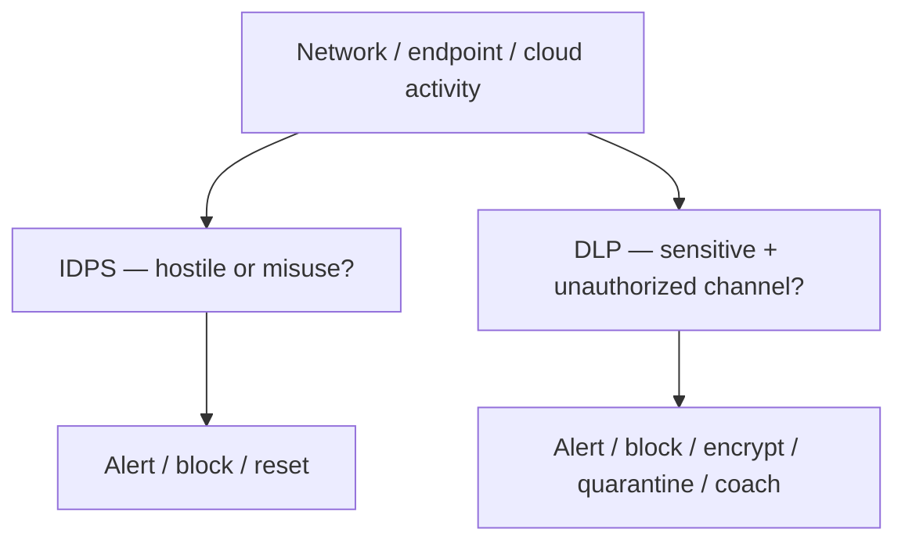

| Dimension | DLP | IDPS |
|-----------|-----|------|
| Primary question | Is valuable data escaping wrongly? | Is this an attack or policy-violating exploit path? |
| Examples | PAN, secrets, source code, health records | Exploits, scans, C2, malware droppers |
| Typical actions | Warn, block, redact, encrypt, watermark | Alert (IDS) or drop/reset (IPS) |
| Hard mode | Encrypted payloads & shadow IT SaaS | Encrypted / novel / living-off-the-land |
| Related hub pages | [Security](#network-security), [HTTP](#protocols-reference/http) | [Firewall](#protocols-reference/firewall), [Security](#network-security) |

---

## DLP — Data Loss Prevention {#dlp}

**Job:** Discover sensitive data, classify it, and enforce **where it may go** and **how**.

### Why DLP exists

Attackers steal data. Insiders err or go rogue. Misconfigured cloud buckets leak. DLP reduces the chance that “payroll.csv” becomes a public pastebin headline.

### States of data {#dlp-states}

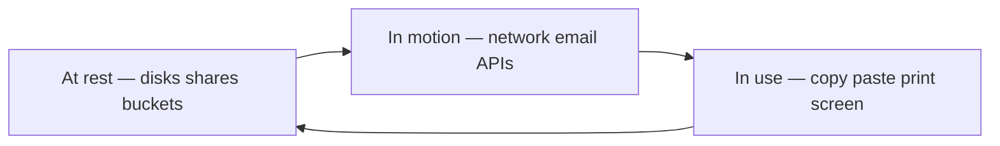

| State | Examples | Common controls |
|-------|----------|-----------------|
| **At rest** | File servers, laptops, S3/Blob, databases | Encryption, access control, discovery scans |
| **In motion** | Email, web upload, chat, SaaS sync, FTP | Network/email DLP, CASB, secure email gateways |
| **In use** | Copy/paste, print, screen capture | Endpoint DLP agents, USB control, watermarking |

A mature program covers **all three**. Network-only DLP misses USB sticks; endpoint-only DLP may miss some cloud API paths.

### Channels DLP watches {#dlp-channels}

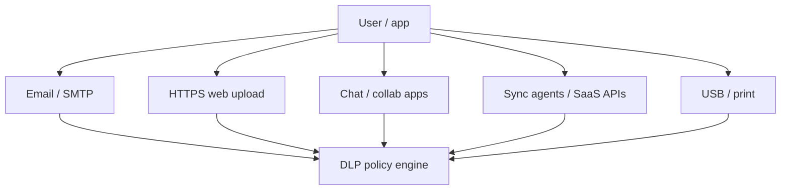

| Channel | Network visibility alone |
|---------|--------------------------|
| Clear [HTTP](#protocols-reference/http) / [SMTP](#protocols-reference/smtp) / [FTP](#protocols-reference/ftp) | High — payloads readable |
| [HTTPS](#protocols-reference/https) / [TLS](#protocols-reference/tls) | Low without inspection or endpoint/CASB |
| Encrypted mail / apps | Needs API/endpoint integration |
| Physical USB | Needs endpoint DLP |

### Classification and policy

DLP engines look for:

- **Structured identifiers** — credit card (PAN), national IDs, health record patterns
- **Keywords / dictionaries** — “confidential”, project codenames
- **Fingerprints / exact data matching** — hashes of known secret documents
- **ML / document classifiers** — contracts, source code styles
- **Context** — user role, destination reputation, time, volume

Policy actions escalate: monitor → user coaching → manager alert → block → encrypt-only allow → quarantine.

### False positives and tuning {#dlp-false-positives}

| False positive pattern | Why it happens | Mitigation |
|------------------------|----------------|------------|
| Random numbers look like PANs | Luhn-valid accidents | Require multi-factor match + context |
| Source code on Git to corp remote | Destination too broad | Allow-list corp repos |
| Encrypted zip blocked | Unknown content | Sandbox / justify workflow |
| Test data in QA | Looks real | Label environments; exceptions |

> **Remember:** Untuned DLP becomes **alarm noise**. Tuned DLP becomes a seatbelt people still complain about — and still need.

### The TLS challenge for network DLP {#dlp-tls}

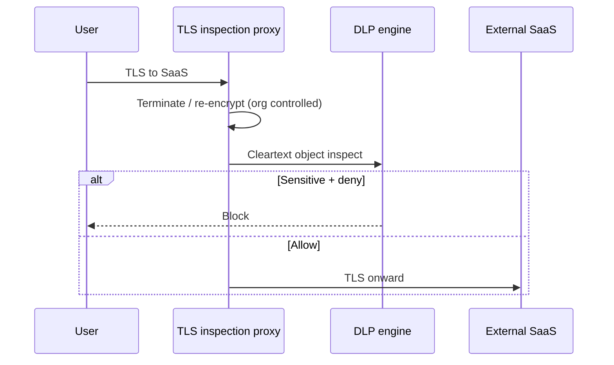

Without inspection, network DLP mostly sees:

- destination IPs/domains,
- SNI / cert metadata (sometimes),
- sizes and timing — **not** file contents.

Organizations then choose combinations of:

1. **Approved TLS inspection** on managed devices (legal/privacy review required)
2. **Endpoint DLP** that sees files before encrypt
3. **CASB / API DLP** inside SaaS
4. **Browser isolation / managed upload portals**

Related: [TLS](#protocols-reference/tls), [Network Security](#network-security).

---

## IDS — Intrusion Detection {#ids}

**Job:** Spot hostile or suspicious activity and **alert** — typically without sitting inline in the blocking path.

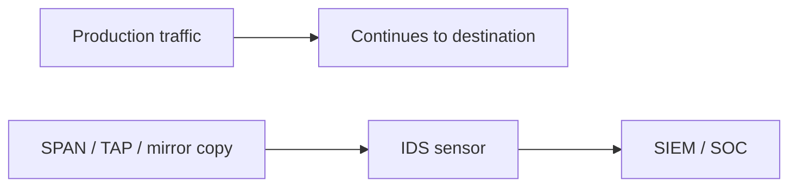

| Strength | Weakness |
|----------|----------|
| Low risk of blocking good traffic | Attacks may succeed before humans respond |
| Great for detection engineering | Alert fatigue if noisy |
| Easy to deploy on taps | Encrypted payloads limit deep inspection |

IDS answers: “Did something bad **happen** or attempt?”

---

## IPS — Intrusion Prevention {#ips}

**Job:** Sit **inline** and **block** (drop, reject, reset) when confidence is high.

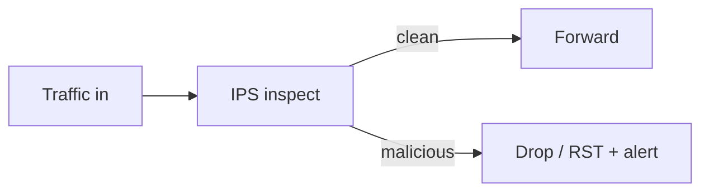

| Strength | Weakness |
|----------|----------|
| Stops attacks automatically | False positive = self-DoS |
| Reduces human reaction time | Latency / capacity planning needed |
| Enforces virtual patches sometimes | Bypass paths must be designed carefully |

IPS answers: “Can we **stop** this now?”

> **Remember:** **IDS watches. IPS blocks.** Both can be wrong — tune before “prevent” mode on critical paths.

---

## IDPS Together {#idps}

Many platforms are **IDPS**: detect always, prevent selectively.

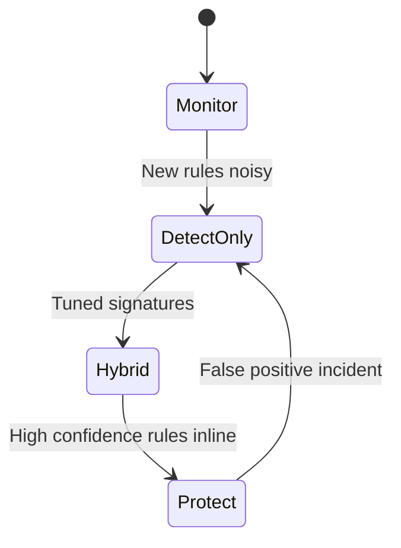

### Detection styles {#detection-styles}

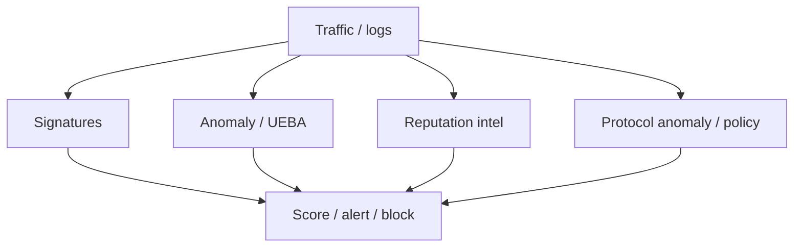

| Style | Strength | Weakness |
|-------|----------|----------|
| **Signatures** | Precise on known exploits/malware | Weak on brand-new unknowns |
| **Anomaly / behavior** | Catches weird volume/timing/paths | Tuning; baseline drift |
| **Reputation** | Fast blocks of known-bad IPs/domains | Fresh infra / shared hosting collisions |
| **Protocol checks** | Malformed packets, policy violations | Opaque encrypted blobs |

Defense uses **layers** of styles — same idea as defense in depth in [Network Security](#network-security).

### Example prevent sequence

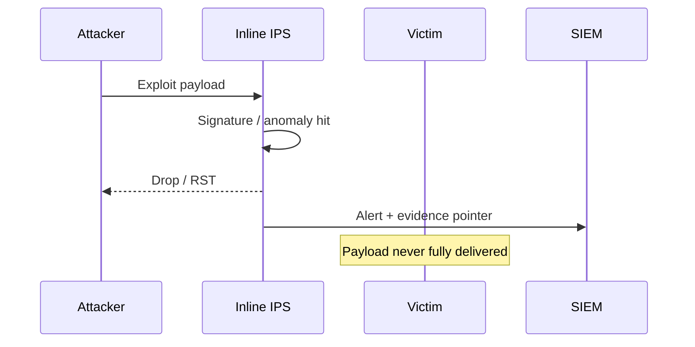

---

## Reference Architectures {#architectures}

### Campus / DC network IDPS

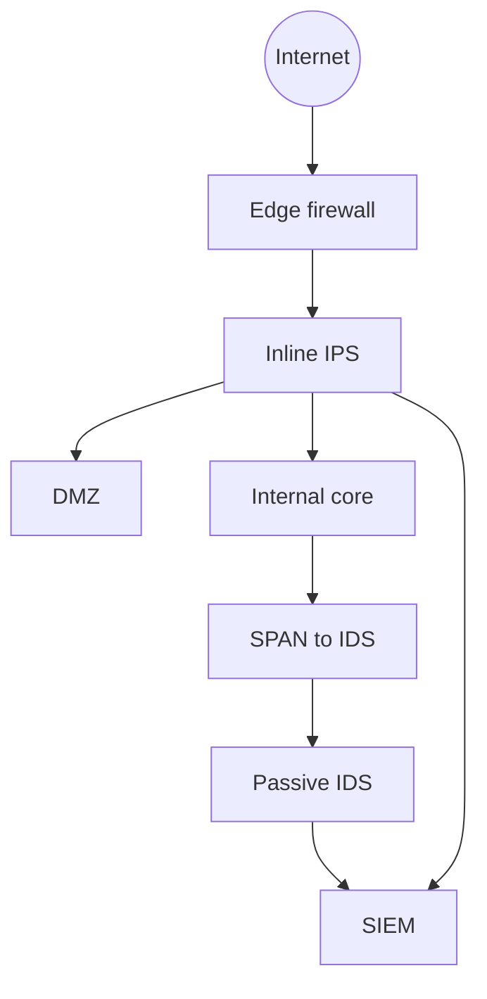

### DLP architecture sketch

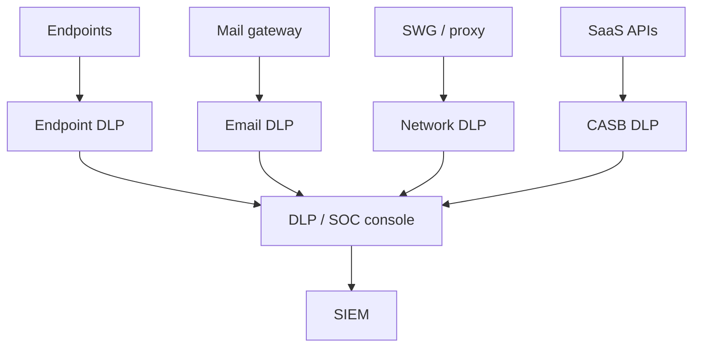

Place controls where the **channel** actually is. A network DLP appliance cannot see an air-gapped USB copy.

---

## SOC Workflow {#soc-workflow}

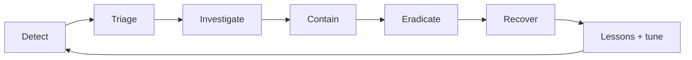

| Stage | DLP-flavored | IDPS-flavored |
|-------|--------------|---------------|
| Detect | Policy match on PAN upload | Signature hit on exploit kit |
| Triage | Business need? False positive? | Severity / asset criticality |
| Investigate | Who, what file, which channel | 5-tuple, host process, timeline |
| Contain | Block channel / disable account | IPS block, isolate host, FW rule |
| Recover | Rotate secrets if leaked | Patch, restore, validate |
| Tune | Exception or tighter rule | Signature threshold / suppress |

Always preserve **evidence** before aggressive containment when legal/HR cases require it — coordinate with policy.

---

## How pktana Helps {#pktana-evidence}

pktana will not replace a dedicated Suricata/Snort engine or enterprise DLP suite. It **will** give analysts packet truth:

| Need | pktana move |
|------|-------------|
| Validate “huge upload” alert | Flows / top talkers by bytes |
| Confirm odd C2 port | Connections view; filter rare destinations |
| Evidence for SIEM ticket | Short filtered PCAP around the 5-tuple |
| Cleartext secret incident | Capture HTTP/FTP/Telnet; prove exposure |
| Post-block verification | Recapture — exploit attempts should stop |

```bash
pktana connections
pktana capture --interface eth0 --filter "host 203.0.113.50" --count 200
pktana web --port 8080
```

Pair with:

- IDPS alert IDs and rule text
- DLP incident IDs and file hashes/classifiers
- Identity logs (who was on the host?)

> **Remember:** Screenshots of dashboards age poorly. **PCAPs and flow records** age like evidence.

---

## Hands-On Tasks

```task
TITLE: Pick DLP vs IDPS lead
LEVEL: beginner
STEPS:
1. Scenario A: ransomware worm scanning SMB across VLANs
2. Scenario B: HR exports payroll.csv to personal webmail
3. Scenario C: both happen the same afternoon
4. Write lead control + one supporting control for each
GOAL: Choose primary mission without mixing vocabulary
```

```task
TITLE: Data-state coverage gaps
LEVEL: intermediate
STEPS:
1. List your org’s (or a fictional org’s) DLP for at rest / in motion / in use
2. Mark the weakest state
3. Propose one control that closes the gap
GOAL: See why single-channel DLP fails
```

```task
TITLE: Evidence pack with pktana
LEVEL: intermediate
STEPS:
1. From a simulated alert, note suspicious destination from Flows
2. Filter a short capture to that 5-tuple
3. Decide next: IPS block, DLP channel block, host isolate — or combination
4. Note who must be told if TLS inspection is used for DLP evidence
GOAL: Practice analyst workflow with governance awareness
```
---

## Knowledge Check

```quiz
QUESTION: DLP’s primary mission is to:
OPTIONS:
Speed up ARP
Prevent sensitive data from leaving via unauthorized channels
Replace fiber optics
Assign VLAN IDs
ANSWER: 1
EXPLAIN: DLP focuses on sensitive data handling and exfiltration paths.
```

```quiz
QUESTION: Data “in motion” most nearly means:
OPTIONS:
Only powered-off hard drives
Data traversing networks or transfer channels
Paint drying on racks
STP convergence only
ANSWER: 1
EXPLAIN: In motion is data being transferred across channels.
```

```quiz
QUESTION: An inline device that drops exploit packets is acting as:
OPTIONS:
DNS stub only
IPS
DHCP relay only
STP root bridge only
ANSWER: 1
EXPLAIN: IPS is inline prevention; IDS typically detects/alerts.
```

```quiz
QUESTION: IDS deployed on a SPAN port typically:
OPTIONS:
Must NAT all packets
Receives a copy of traffic and alerts without being the primary forwarder
Replaces the core switch ASICs
Disables TLS globally
ANSWER: 1
EXPLAIN: Passive IDS watches copies; forwarding continues on the live path.
```

```quiz
QUESTION: TLS makes pure network DLP harder because:
OPTIONS:
Ports disappear
Payloads are encrypted without inspection or endpoint/API controls
MAC addresses become IPv6
Switches stop learning
ANSWER: 1
EXPLAIN: Ciphertext hides content from network DLP unless other controls exist.
```

```quiz
QUESTION: Signature-based IDPS is best against:
OPTIONS:
Only brand-new zero-days with no pattern
Attacks matching known exploit/malware patterns
Cable cuts
DHCP Discover exclusively
ANSWER: 1
EXPLAIN: Signatures match known patterns; unknowns need other methods too.
```

```quiz
QUESTION: A major IPS false-positive risk is:
OPTIONS:
Faster DNS
Blocking legitimate business traffic (self-inflicted outage)
Brighter link LEDs
Mandatory mesh topology
ANSWER: 1
EXPLAIN: Inline blocks can deny good users if rules are wrong.
```

```quiz
QUESTION: Reputation-based detection commonly uses:
OPTIONS:
Only cable category ratings
Known-bad IPs/domains/URLs threat intel
Wallpaper hashes only
Token Ring beacon math
ANSWER: 1
EXPLAIN: Reputation feeds flag previously observed bad infrastructure.
```

```quiz
QUESTION: In a SOC, containment for suspected C2 might include:
OPTIONS:
Ignoring all PCAP evidence
Host isolation and/or IPS/firewall block of the destination
Deleting the CIA triad definition
Disabling all logging
ANSWER: 1
EXPLAIN: Containment limits damage while investigation continues.
```

```quiz
QUESTION: pktana’s best contribution to an IDPS/DLP case is often:
OPTIONS:
Replacing corporate policy documents
Providing flow and PCAP evidence around the suspect conversation
Assigning VLAN colors automatically
Running the company payroll
ANSWER: 1
EXPLAIN: Packet/flow evidence validates and documents incidents.
```

```quiz
QUESTION: IDPS and DLP together are complementary because:
OPTIONS:
They are identical products always
One focuses on attacks; the other on sensitive data misuse/exfil
Neither ever uses logs
They abolish encryption
ANSWER: 1
EXPLAIN: Different questions — hostile activity vs data loss paths.
```

---

## What You Should Feel Confident Saying

- DLP vs IDPS missions without mixing terms
- Data states and channels, including TLS limits
- IDS vs IPS placement and risk
- Signature / anomaly / reputation trade-offs
- A basic SOC loop from detect to tune
- How to pull pktana evidence into a ticket

---

## Next

Prove yourself across the whole hub: [Knowledge Check](#knowledge-check).  
Refresh threats and CIA in [Network Security](#network-security).  
Any protocol term: [Protocols Reference](#protocols-reference).
