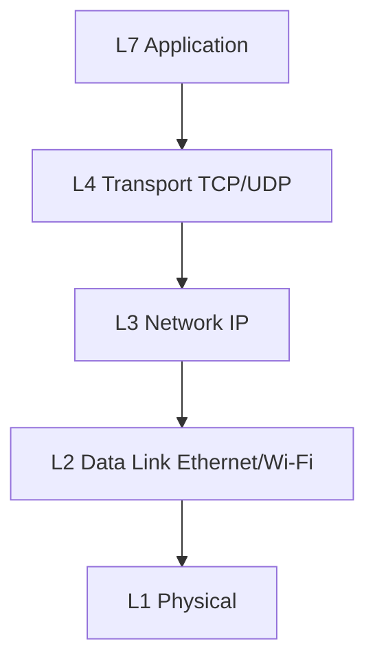

# Knowledge Check

Mixed tasks and quizzes across OSI basics, protocols, security, DLP, and IDPS. Use this after you finish the Learn path — or jump in anytime to self-test.

---

## Warm-Up Diagram



Match each symptom to a layer before you capture:

| Symptom | Likely layer to inspect first |
|---------|-------------------------------|
| No link light / CRC errors | L1 |
| Wrong VLAN, ARP issues | L2 |
| No route to host | L3 |
| Connection refused / resets | L4 |
| HTTP 500 / wrong Host header | L7 |

---

## Practical Tasks

```task
TITLE: End-to-end “why is the site slow?”
LEVEL: intermediate
STEPS:
1. Confirm L1/L2: interface up, correct VLAN (`pktana nic list` / `nic stats`)
2. Confirm L3: route exists (`pktana routes`)
3. Confirm L4: SYN gets SYN+ACK (capture `tcp port 443`)
4. Confirm app: TLS finishes; note RTT and retransmits in the capture
GOAL: Write a short incident note naming the layer where the problem appeared
```

```task
TITLE: Security triage mini-runbook
LEVEL: intermediate
STEPS:
1. From Connections, list unexpected outbound ports
2. From Flows, identify the top byte destination
3. Decide: more like **IDPS** (attack/C2) or **DLP** (bulk sensitive upload)?
4. Capture a short PCAP filtered to that 5-tuple for evidence
GOAL: Choose the right investigation track and preserve evidence
```

```task
TITLE: Protocol flash cards with pktana
LEVEL: beginner
STEPS:
1. Capture 30 packets with no filter
2. Label five packets: ARP, DNS, TCP, TLS, or Other
3. For each, write the filter you would use next time
GOAL: Build speed recognizing common protocols on the wire
```

---

## Quiz — Networking Basics

```quiz
QUESTION: Which OSI layer is primarily responsible for end-to-end reliable delivery and ports?
OPTIONS:
Physical
Data Link
Transport
Application
ANSWER: 2
EXPLAIN: Layer 4 (Transport) provides ports and, for TCP, reliability and ordering.
```

```quiz
QUESTION: A host can ping its gateway but cannot resolve names. What should you check first?
OPTIONS:
DHCP Discover only
DNS (UDP/TCP 53) path and resolver config
STP root bridge priority
Cable category only
ANSWER: 1
EXPLAIN: Name resolution failing while IP connectivity works points at DNS.
```

```quiz
QUESTION: EtherType 0x0806 identifies:
OPTIONS:
IPv6
ARP
VLAN tag
PPPoE
ANSWER: 1
EXPLAIN: 0x0806 is ARP; IPv4 is 0x0800; IPv6 is 0x86DD.
```

---

## Quiz — Protocols

```quiz
QUESTION: In a TCP handshake, the server’s second packet is typically:
OPTIONS:
FIN
SYN only
SYN+ACK
RST only
ANSWER: 2
EXPLAIN: Client SYN → Server SYN+ACK → Client ACK.
```

```quiz
QUESTION: Which protocol assigns IPv4 addresses on a LAN using DORA?
OPTIONS:
BGP
DHCP
OSPF
NTP
ANSWER: 1
EXPLAIN: DHCP uses Discover/Offer/Request/ACK.
```

```quiz
QUESTION: WireGuard commonly uses which default UDP port?
OPTIONS:
22
443
51820
3389
ANSWER: 2
EXPLAIN: WireGuard’s common default is UDP 51820 (configurable).
```

---

## Quiz — Security, DLP & IDPS

```quiz
QUESTION: CIA triad “Integrity” means:
OPTIONS:
Data is always public
Data is not altered without detection
Systems are never patched
Only availability matters
ANSWER: 1
EXPLAIN: Integrity protects against undetected modification.
```

```quiz
QUESTION: DLP is primarily concerned with:
OPTIONS:
Cable length limits
Sensitive data leaving unauthorized paths
Spanning-tree convergence time
NTP stratum selection
ANSWER: 1
EXPLAIN: Data Loss Prevention focuses on exfiltration and mishandling of sensitive data.
```

```quiz
QUESTION: A passive SPAN-port sensor that only alerts is best described as:
OPTIONS:
IPS
IDS
DHCP relay
Load balancer
ANSWER: 1
EXPLAIN: IDS detects/alerts out-of-band; IPS sits inline and can block.
```

```quiz
QUESTION: High outbound bytes to an unknown cloud IP with filenames like `customers_export.csv` in cleartext HTTP is closest to:
OPTIONS:
A DLP investigation
A physical layer CRC problem
An STP topology change only
An NTP offset issue
ANSWER: 0
EXPLAIN: Bulk sensitive-looking data to an unexpected destination is classic DLP territory (also review with IDPS for malware).
```

---

## Score Yourself

- **12–14 correct** — Strong; dig into Modern Networking and real captures next  
- **8–11** — Solid; revisit weak quiz topics and redo one hands-on task  
- **Under 8** — Re-read OSI layers, Protocols Reference, and DLP & IDPS, then retry  

**Back to path:** [What Is a Network?](#what-is-networking) · [Network Security](#network-security) · [DLP & IDPS](#dlp-idps) · [Protocols Reference](#protocols-reference)
