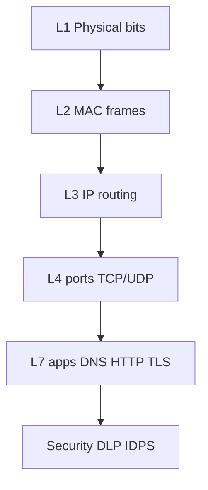

# Knowledge Check

Final mixed practice across every layer, major protocols, security, DLP, and IDPS. Use links to jump back when you miss something — that is the point.

> **Remember:** Wrong answers are a map of what to reopen. Click the term and reread the picture.

---

## Memory Map



Quick returns: [OSI](#osi-model) · [Protocols](#protocols-reference) · [Security](#network-security) · [DLP/IDPS](#dlp-idps)

---

## Tasks

```task
TITLE: Narrate one web click through the layers
LEVEL: beginner
STEPS:
1. Pick opening https://example.com
2. Write one sentence per layer L1→L4→L7 naming the protocol
3. Click each protocol name in your notes to verify in Protocols Reference
GOAL: Build a story you can reuse in interviews/troubleshooting
HINT: DNS then TCP then TLS then HTTP is the usual sequence
```

```task
TITLE: Bottom-up outage drill
LEVEL: intermediate
STEPS:
1. Symptom: “app timeout”
2. Check L1 link → L2 VLAN/MAC → L3 ping/route → L4 port/handshake → L7 DNS/TLS/HTTP
3. Stop at the first failing layer and name the evidence
GOAL: Practice the OSI troubleshooting habit
```

```task
TITLE: Security fork
LEVEL: intermediate
STEPS:
1. Case 1: exploit scan from Internet
2. Case 2: bulk export of HR files to personal email
3. Assign IDPS vs DLP lead + which pktana view helps
GOAL: Separate attack detection from data-leak control
```

---

## Quiz — Layers

```quiz
QUESTION: Which layer moves raw bits as signals?
OPTIONS:
Application
Physical
Transport
Data Link
ANSWER: 1
EXPLAIN: Layer 1 is Physical — energy on a medium.
```

```quiz
QUESTION: MAC addresses are primarily used at:
OPTIONS:
Layer 2 Data Link
Layer 4 Transport
Layer 7 Application
Layer 3 only for BGP
ANSWER: 0
EXPLAIN: Local delivery uses MAC at Layer 2.
```

```quiz
QUESTION: IP routing is the job of:
OPTIONS:
STP
Network Layer (L3)
HTTP cookies
SSID selection only
ANSWER: 1
EXPLAIN: Layer 3 routes packets between networks.
```

```quiz
QUESTION: Ports belong to:
OPTIONS:
Transport Layer
Physical Layer
VLANs only
Fiber colors
ANSWER: 0
EXPLAIN: TCP/UDP ports are Transport.
```

---

## Quiz — Protocols

```quiz
QUESTION: DNS is best described as:
OPTIONS:
IP to MAC on LAN
Names to records/addresses
Loop prevention
Cable testing
ANSWER: 1
EXPLAIN: DNS is the Internet phonebook.
```

```quiz
QUESTION: ARP is best described as:
OPTIONS:
Names to IP
IP to MAC on the local link
Encrypted HTTP
AS path selection
ANSWER: 1
EXPLAIN: ARP resolves IP→MAC locally.
```

```quiz
QUESTION: TCP handshake starts with:
OPTIONS:
FIN
SYN
DHCP Discover
ICMP Redirect only
ANSWER: 1
EXPLAIN: SYN begins a TCP connection.
```

```quiz
QUESTION: HTTPS is:
OPTIONS:
HTTP over TLS
Telnet on 443
ARP over TCP
STP over UDP
ANSWER: 0
EXPLAIN: HTTPS = HTTP protected by TLS.
```

```quiz
QUESTION: DHCP DORA order begins with:
OPTIONS:
ACK
Offer
Discover
Request
ANSWER: 2
EXPLAIN: Discover → Offer → Request → ACK.
```

---

## Quiz — Security / DLP / IDPS

```quiz
QUESTION: CIA “Integrity” means:
OPTIONS:
Data is public
Data is not changed undetected
Wi‑Fi is free
Ports are random
ANSWER: 1
EXPLAIN: Integrity protects against undetected modification.
```

```quiz
QUESTION: DLP focuses on:
OPTIONS:
Sensitive data leaving wrong channels
Only STP root elections
Only copper length
Only BGP communities
ANSWER: 0
EXPLAIN: Data Loss Prevention is about sensitive data control.
```

```quiz
QUESTION: Inline drop of exploit traffic is:
OPTIONS:
IDS-only passive tap with no action
IPS behavior
DHCP reservation
MAC flooding as a feature
ANSWER: 1
EXPLAIN: IPS can prevent inline; IDS mainly detects.
```

```quiz
QUESTION: Best first capture filter for HTTPS troubleshooting handshake:
OPTIONS:
arp only
tcp port 443
stp
udp port 67
ANSWER: 1
EXPLAIN: HTTPS commonly rides TCP/443 (TLS).
```

---

## Score Guide

| Score (of 14 quizzes) | Next step |
|-----------------------|-----------|
| 12–14 | Capture live traffic and narrate flows aloud |
| 8–11 | Revisit missed links in [Protocols Reference](#protocols-reference) |
| ≤7 | Restart from [OSI Model](#osi-model) with the memory sentence |

---

## Back to the Path

[What Is a Network?](#what-is-networking) → [OSI](#osi-model) → [L1](#physical-layer) → [L2](#data-link-layer) → [L3](#network-layer) → [L4](#transport-layer) → [L7](#application-layer) → [Topologies](#topologies) → [Wireless](#wireless-networking) → [Security](#network-security) → [DLP/IDPS](#dlp-idps) → [Protocols](#protocols-reference) → [Modern](#modern-networking)
