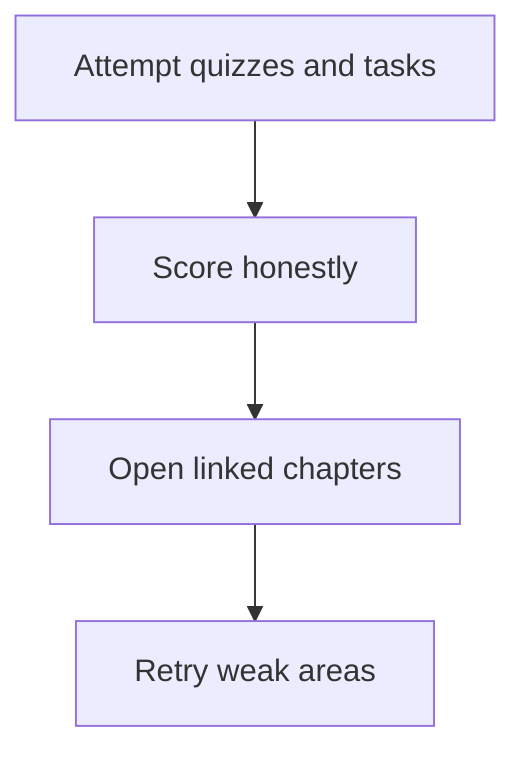
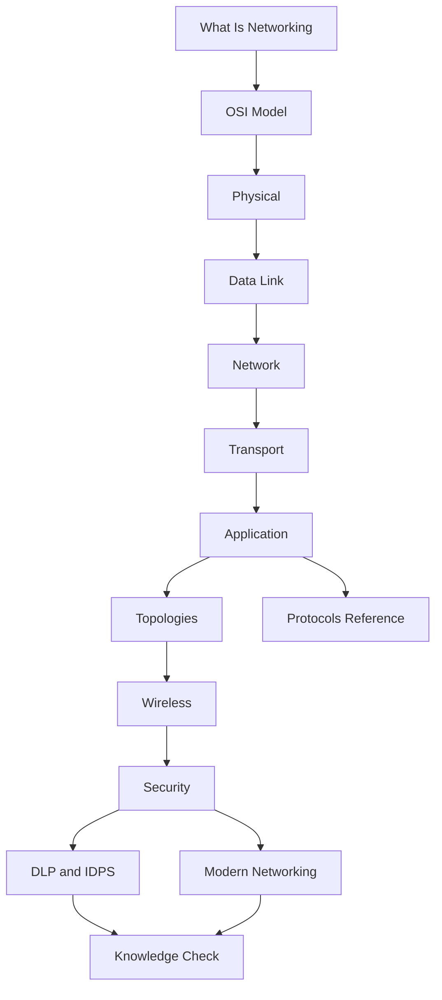
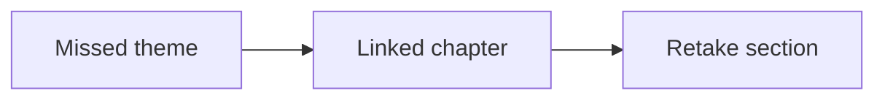

# Knowledge Check

Final mixed practice across every layer, major protocols, topologies, wireless, security, modern fabrics, DLP, and IDPS. Wrong answers are a map — click the term and reread.

> **Remember:** Treat this like a **final exam**. Narrate answers out loud; every miss should open a hub link.

---

## How to Use This Exam {#how-to-use}

1. Attempt quizzes **before** reopening chapters.
2. Score with the guide at the end.
3. Click links for every miss; retry weak sections later.



---

## Memory Map — Whole Hub {#memory-map}



**Every chapter:** [What Is Networking](#what-is-networking) · [OSI](#osi-model) · [Physical](#physical-layer) · [Data Link](#data-link-layer) · [Network](#network-layer) · [Transport](#transport-layer) · [Application](#application-layer) · [Topologies](#topologies) · [Wireless](#wireless-networking) · [Security](#network-security) · [Protocols](#protocols-reference) · [Modern](#modern-networking) · [DLP/IDPS](#dlp-idps)

**Protocol shortcuts:** [Ethernet](#protocols-reference/ethernet) · [VLAN](#protocols-reference/vlan) · [ARP](#protocols-reference/arp) · [IPv4](#protocols-reference/ipv4) · [TCP](#protocols-reference/tcp) · [UDP](#protocols-reference/udp) · [DNS](#protocols-reference/dns) · [DHCP](#protocols-reference/dhcp) · [HTTP](#protocols-reference/http) · [TLS](#protocols-reference/tls) · [HTTPS](#protocols-reference/https) · [IPsec](#protocols-reference/ipsec) · [WireGuard](#protocols-reference/wireguard) · [Firewall](#protocols-reference/firewall) · [VPN](#protocols-reference/vpn)

---

## Multi-Step Tasks {#tasks}

```task
TITLE: Narrate one web click through the layers
LEVEL: beginner
STEPS:
1. Open https://example.com in your mind
2. Write one sentence each: DNS → IP → TCP → TLS → HTTP
3. Add one L2 note (Ethernet or Wi-Fi) and one CIA/TLS security note
4. Verify each protocol name in Protocols Reference
GOAL: Build a reusable interview story
HINT: Application Layer + Protocols Reference
```

```task
TITLE: Bottom-up outage drill
LEVEL: intermediate
STEPS:
1. Symptom: “app timeout”
2. Check L1 link → L2 VLAN/MAC → L3 ping/route → L4 handshake → L7 DNS/TLS/HTTP
3. Stop at the first failing layer; name the evidence
4. Say whether pktana PCAP or Connections helps more
GOAL: Practice OSI troubleshooting habit
```

```task
TITLE: Topology blast-radius review
LEVEL: intermediate
STEPS:
1. Sketch star access + dual distribution + dual core
2. Mark SPOFs if access has only one uplink
3. Explain how VLANs change logical topology on the same sketch
GOAL: Connect Topologies to VLAN/routing reality
HINT: Topologies + Data Link
```

```task
TITLE: Coffee-shop risk brief
LEVEL: beginner
STEPS:
1. List open Wi-Fi risks (sniff / MitM / rogue AP)
2. List mitigations (HTTPS, VPN, avoid Telnet/FTP)
3. Note one RF issue a wired SPAN behind an AP cannot prove
GOAL: Blend Wireless + Security judgment
```

```task
TITLE: Security fork — attack vs data loss
LEVEL: intermediate
STEPS:
1. Case 1: exploit scan from Internet toward DMZ
2. Case 2: HR exports payroll.csv to personal webmail
3. Assign IDPS vs DLP lead + which pktana view helps
4. Name the primary CIA letter hit in each case
GOAL: Separate intrusion detection from data-leak control
```

---

## Quiz — Layers & Fundamentals {#quiz-layers}

```quiz
QUESTION: Which layer moves raw bits as signals on a medium?
OPTIONS:
Application
Physical
Transport
Data Link
ANSWER: 1
EXPLAIN: Layer 1 Physical moves energy/bits on cable or radio.
```

```quiz
QUESTION: MAC addresses are primarily used at:
OPTIONS:
Layer 2 Data Link
Layer 4 Transport
Layer 7 Application
Layer 3 only for BGP
ANSWER: 0
EXPLAIN: Local delivery uses MAC at Layer 2.
```

```quiz
QUESTION: IP routing is the job of:
OPTIONS:
STP
Network Layer (L3)
HTTP cookies
SSID selection only
ANSWER: 1
EXPLAIN: Layer 3 routes packets between networks.
```

```quiz
QUESTION: Ports belong primarily to:
OPTIONS:
Transport Layer
Physical Layer
VLANs only
Fiber colors
ANSWER: 0
EXPLAIN: TCP/UDP ports select applications on a host.
```

```quiz
QUESTION: Encapsulation means:
OPTIONS:
Stripping all headers immediately at the sender
Adding layer headers as data moves toward the wire
Only Wi-Fi roaming
Only firewall logging
ANSWER: 1
EXPLAIN: Each lower layer wraps the payload from above.
```

---

## Quiz — Core Protocols {#quiz-protocols}

```quiz
QUESTION: ARP’s classic LAN job is to:
OPTIONS:
Encrypt HTTP
Map IP address to MAC address on the local link
Assign BGP ASNs
Replace DNS permanently
ANSWER: 1
EXPLAIN: ARP resolves next-hop MAC for an IP on the LAN.
```

```quiz
QUESTION: DNS’s main everyday job is to:
OPTIONS:
Assign MAC addresses
Map names to IP addresses (and related records)
Terminate optical light
Run STP
ANSWER: 1
EXPLAIN: DNS resolves names to addresses and more record types.
```

```quiz
QUESTION: DHCP commonly provides:
OPTIONS:
Only TLS certificates
Host IP configuration (address, mask, gateway, DNS…)
Spanning Tree priorities
WireGuard keys only
ANSWER: 1
EXPLAIN: DHCP autoconfigures host network parameters.
```

```quiz
QUESTION: TCP is preferred over UDP when you need:
OPTIONS:
Guaranteed absolute zero latency always
Reliable ordered byte streams with retransmission
To avoid ports
To replace Ethernet
ANSWER: 1
EXPLAIN: TCP provides reliability and ordering for streams.
```

```quiz
QUESTION: HTTPS is best described as:
OPTIONS:
HTTP only on UDP 53
HTTP over TLS (commonly TCP 443)
Raw Ethernet with no IP
FTP renamed
ANSWER: 1
EXPLAIN: HTTPS wraps HTTP inside TLS, usually on port 443.
```

---

## Quiz — Topologies {#quiz-topologies}

```quiz
QUESTION: In a star topology, the most critical SPOF is usually the:
OPTIONS:
End-user wallpaper
Central switch / hub
DNS TXT record
Client emoji
ANSWER: 1
EXPLAIN: Star edges depend on the center device.
```

```quiz
QUESTION: VLANs mainly change:
OPTIONS:
Cable copper category only
Logical Layer 2 segmentation
Optical wavelength of the sun
TCP handshake order
ANSWER: 1
EXPLAIN: VLANs alter logical topology / broadcast domains.
```

```quiz
QUESTION: A full mesh is chosen when you need:
OPTIONS:
Lowest cabling cost always
Maximum alternate paths / resilience
To avoid IP addresses
Only wireless SSIDs
ANSWER: 1
EXPLAIN: Mesh adds redundant paths at higher cost/complexity.
```

```quiz
QUESTION: Core–distribution–access is:
OPTIONS:
A bus-only home lab requirement
Enterprise hierarchical design
A TLS cipher suite
A DHCP message type
ANSWER: 1
EXPLAIN: Campuses commonly use hierarchical tiers.
```

---

## Quiz — Wireless {#quiz-wireless}

```quiz
QUESTION: Non-overlapping 2.4 GHz channels commonly used are:
OPTIONS:
2, 3, 4
1, 6, 11
All channels equally non-overlapping always
Only channel 14 worldwide
ANSWER: 1
EXPLAIN: 1/6/11 are the classic non-overlapping set in many regions.
```

```quiz
QUESTION: An SSID is:
OPTIONS:
A routing protocol
The wireless network name
A fiber color code
A NetFlow template
ANSWER: 1
EXPLAIN: SSID is the human-readable WLAN name.
```

```quiz
QUESTION: Compared to Ethernet, Wi-Fi typically has:
OPTIONS:
A dedicated private cable per client always
Shared RF with contention and variable SNR
Identical RF physics to fiber
No authentication options
ANSWER: 1
EXPLAIN: Radio is shared and environment-sensitive.
```

```quiz
QUESTION: Open coffee-shop Wi-Fi increases risk of:
OPTIONS:
Mandatory IPsec everywhere
Local sniffing / easier MitM without strong link encryption
Removal of DNS
Automatic mesh failure
ANSWER: 1
EXPLAIN: Weak/no Wi-Fi encryption enlarges local attack surface.
```

---

## Quiz — Security {#quiz-security}

```quiz
QUESTION: Confidentiality means:
OPTIONS:
Systems never reboot
Only authorized parties can read the information
Cables must be red
VLANs are illegal
ANSWER: 1
EXPLAIN: Confidentiality is secrecy for authorized eyes only.
```

```quiz
QUESTION: A volumetric DDoS primarily impacts:
OPTIONS:
Availability
Cable jacket branding
SSID emoji choice
STP root name aesthetics
ANSWER: 0
EXPLAIN: Floods aim to deny service reachability.
```

```quiz
QUESTION: ARP spoofing often enables:
OPTIONS:
Faster DNS
Man-in-the-Middle on a LAN
Mandatory SMTP
Deletion of TCP
ANSWER: 1
EXPLAIN: Spoofed ARP can steal the gateway role.
```

```quiz
QUESTION: TLS primarily provides:
OPTIONS:
Physical rack security
Encrypted authenticated application sessions
Replacement of IP routing
Bus topology enforcement
ANSWER: 1
EXPLAIN: TLS protects app sessions cryptographically.
```

```quiz
QUESTION: Network segmentation mainly helps by:
OPTIONS:
Making every host public
Limiting blast radius and lateral movement
Removing the need for monitoring
Forbidding firewalls
ANSWER: 1
EXPLAIN: Zones constrain attacker movement and exposure.
```

---

## Quiz — Modern Networking {#quiz-modern}

```quiz
QUESTION: SDN data plane primarily:
OPTIONS:
Only writes tickets
Forwards packets per programmed rules
Deletes DNS
Paints diagrams
ANSWER: 1
EXPLAIN: Data plane forwards; control plane decides.
```

```quiz
QUESTION: A cloud NAT Gateway commonly lets:
OPTIONS:
Private subnets initiate outbound Internet without full inbound exposure
All encryption vanish
VLANs disappear
BGP become illegal
ANSWER: 0
EXPLAIN: NAT supports outbound from private address space.
```

```quiz
QUESTION: CNI in Kubernetes is about:
OPTIONS:
Container network attachment and connectivity
Compulsory Telnet
Physical bus coax
Removing underlays always
ANSWER: 0
EXPLAIN: CNI plugins implement cluster networking.
```

```quiz
QUESTION: An overlay network typically:
OPTIONS:
Replaces packets with smoke signals
Encapsulates virtual traffic across an underlay
Removes all IP inside pods forever
Forbids security groups
ANSWER: 1
EXPLAIN: Overlays ride on underlay IP fabrics.
```

---

## Quiz — DLP & IDPS {#quiz-dlp-idps}

```quiz
QUESTION: DLP’s primary mission is to:
OPTIONS:
Accelerate ARP
Stop sensitive data leaving via unauthorized channels
Replace fiber
Assign VLAN IDs
ANSWER: 1
EXPLAIN: DLP focuses on data exfiltration and mishandling.
```

```quiz
QUESTION: An inline blocker of exploit traffic is acting as:
OPTIONS:
IDS only by definition always
IPS
DHCP relay
STP root only
ANSWER: 1
EXPLAIN: IPS prevents inline; IDS typically alerts.
```

```quiz
QUESTION: TLS challenges network DLP because:
OPTIONS:
Ports vanish
Payloads are encrypted without inspection/endpoint/API help
MACs become IPv6
Switches stop learning
ANSWER: 1
EXPLAIN: Ciphertext hides content from pure network DLP.
```

```quiz
QUESTION: Signature IDPS is strongest against:
OPTIONS:
Only unknown zero-days
Known exploit/malware patterns
Cable cuts
DHCP only
ANSWER: 1
EXPLAIN: Signatures match known patterns.
```

```quiz
QUESTION: IDPS vs DLP differ because:
OPTIONS:
They are always identical
IDPS focuses on attacks; DLP on sensitive data paths
Neither uses alerts
Both abolish encryption
ANSWER: 1
EXPLAIN: Different primary questions and controls.
```

---

## Mixed Challenge Round {#quiz-mixed}

```quiz
QUESTION: User on Wi-Fi cannot resolve names but ping to 8.8.8.8 works. First suspect:
OPTIONS:
Physical cable category exclusively
DNS problem (or portal/DNS policy)
STP root ID math only
Absence of Ethernet FCS forever
ANSWER: 1
EXPLAIN: IP works; name resolution path is broken.
```

```quiz
QUESTION: Two PCs share a switch, same IP subnet config, cannot ARP each other. Likely:
OPTIONS:
Different VLANs / L2 isolation
The sunspot cycle alone
Mandatory WireGuard
Disabled physics
ANSWER: 0
EXPLAIN: Logical L2 separation can isolate same-subnet attempts.
```

```quiz
QUESTION: Browser shows certificate warning on bank site on open Wi-Fi. Security concern:
OPTIONS:
Possibly MitM / captive portal / untrusted cert — stop and verify
Ignore always and send passwords
Disable all TLS forever
Replace TCP with STP
ANSWER: 0
EXPLAIN: Certificate failures are a trust warning — especially on hostile networks.
```

```quiz
QUESTION: Sudden 40 GB night flow from HR PC to rare IP. Best dual track:
OPTIONS:
Ignore it
Investigate DLP exfil possibility + IDPS/malware C2 possibility with evidence
Delete CIA definitions
Only repaint the rack
ANSWER: 1
EXPLAIN: Volume anomalies can be leak or malware — gather evidence either way.
```

---

## Score Guide {#score-guide}

Count every quiz in this chapter. **90%+** hub-ready · **75–89%** redo weak sections · **60–74%** rebuild from OSI + one infra chapter/day · **below 60%** restart [What Is Networking](#what-is-networking) → [OSI](#osi-model) → L1–L4.

| Missed theme | Reopen |
|--------------|--------|
| Layers / encapsulation | [OSI](#osi-model), L1–L4 |
| ARP/DNS/DHCP/TCP/TLS | [Protocols Reference](#protocols-reference) |
| Star/mesh/VLAN | [Topologies](#topologies), [Data Link](#data-link-layer) |
| SSID/WPA/RF | [Wireless](#wireless-networking) |
| CIA/MitM/firewall/VPN | [Network Security](#network-security) |
| VPC/CNI/overlay | [Modern Networking](#modern-networking) |
| DLP vs IPS | [DLP & IDPS](#dlp-idps) |



---

## What “Done” Looks Like

Without notes: web fetch (DNS/TCP/TLS/HTTP); MAC vs IP vs port; VLANs vs cables; open Wi‑Fi risk; CIA examples; IDS vs IPS vs DLP; why cloud still needs IP/DNS/TLS debugging.

---

## Hub Path (start → finish)

[What Is a Network?](#what-is-networking) → [OSI](#osi-model) → [Physical](#physical-layer) → [Data Link](#data-link-layer) → [Network](#network-layer) → [Transport](#transport-layer) → [Application](#application-layer) → [Topologies](#topologies) → [Wireless](#wireless-networking) → [Security](#network-security) → [DLP/IDPS](#dlp-idps) → [Protocols](#protocols-reference) → [Modern](#modern-networking) → **You are here.**
